# Java面试复习计划需求文档

## 引言

### 背景与目的

Java 开发岗位的面试不仅考察候选人是否"用过"某项技术，更考察候选人是否真正**理解其原理、能在实际工作中正确使用、并能在出现问题时快速定位和解决**。

很多候选人在工作中长期使用某项技术，却因为从未系统梳理过底层原理，导致：
- 面试时只能描述"怎么用"，无法解释"为什么这样设计"
- 工作中遇到性能问题、并发 Bug、数据不一致等问题时，无从下手
- 对技术选型缺乏判断力，不知道什么场景该用什么工具

本复习计划的目标是：**帮助候选人从"会用"升级到"理解原理 → 能解决问题 → 能做技术决策"**，覆盖 Java 基础、Java 新特性、Spring、Redis、MySQL、Kafka、Elasticsearch、PostgreSQL、软件工程、设计模式十大核心技术栈。

### 整体技术图谱

从整体来看，这十个模块构成了一个典型 Java 后端系统的完整知识体系：

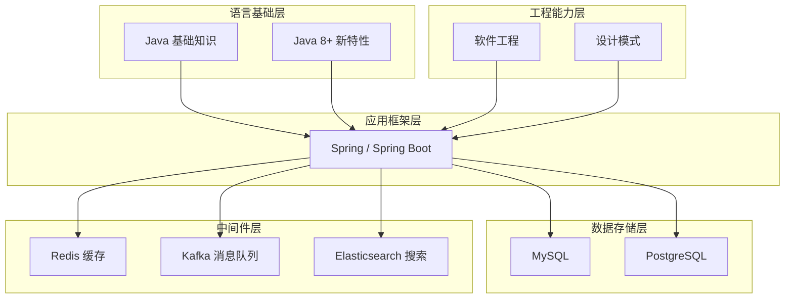

> **理解这张图的意义**：语言基础和工程能力是地基，Spring 是核心框架，数据存储和中间件是支撑高并发、高可用系统的关键组件。面试中的架构级问题（如"为什么用 Redis 而不是直接查 MySQL"）都需要从这张全局图出发来回答。

---

## 需求

---

### 需求 1：Java 基础知识复习

**用户故事：** 作为一名Java面试候选人，我希望系统复习Java基础核心知识，以便在面试中展示扎实的Java语言功底，并能在工作中避免因基础不牢导致的低级 Bug。

#### 为什么要复习 Java 基础？

Java 基础是所有上层框架的根基。Spring 的 IoC 依赖反射机制，HashMap 的线程不安全问题源于底层数组扩容，线上 OOM 问题需要 JVM 知识来排查。**基础不牢，框架用得再熟也只是"黑盒操作"**，遇到问题无法定位根因。

#### JVM 内存结构图

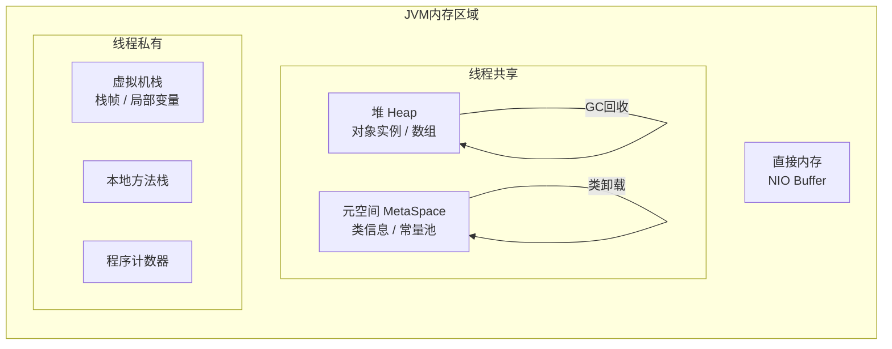

#### 局部视角（各知识点解决的具体问题）

| 知识点 | 解决的问题 | 工作中常见错误 |
|--------|-----------|---------------|
| 面向对象 | 代码复用性差、扩展困难 | 过度继承导致耦合，不会用多态做扩展 |
| 集合框架 | 数据结构选型错误导致性能问题 | 在多线程中使用 HashMap 导致死循环（JDK7）、数据丢失 |
| 并发编程 | 多线程下数据不一致、死锁 | 线程池参数配置错误导致 OOM 或任务堆积 |
| JVM | 内存溢出、GC 停顿、性能瓶颈 | 堆内存设置过小频繁 Full GC，或内存泄漏无法定位 |
| 异常处理 | 异常信息丢失、程序健壮性差 | 捕获异常后不处理（空 catch），或抛出过于宽泛的 Exception |
| AQS/CAS | 自定义同步器、无锁并发 | 误用 synchronized 导致性能瓶颈，不了解 CAS 的 ABA 问题 |

#### 验收标准

1. WHEN 复习Java面向对象时 THEN 候选人 SHALL 掌握封装、继承、多态、抽象的概念及应用，理解接口与抽象类的区别，并能说明各自适用场景
2. WHEN 复习Java集合框架时 THEN 候选人 SHALL 掌握 ArrayList、LinkedList、HashMap、HashSet、TreeMap 的底层实现原理，能够根据场景选择合适的集合类型
3. WHEN 复习Java并发编程时 THEN 候选人 SHALL 掌握线程生命周期、synchronized 与 volatile 的语义差异、ThreadLocal 的内存泄漏风险、线程池核心参数（corePoolSize/maximumPoolSize/拒绝策略）的含义
4. WHEN 复习Java JVM时 THEN 候选人 SHALL 掌握 JVM 内存分区（堆/栈/方法区/直接内存）、GC 算法原理、G1 与 CMS 的区别，并能描述一次 OOM 问题的排查思路
5. WHEN 复习Java异常处理时 THEN 候选人 SHALL 能够区分 Checked/Unchecked Exception，说明异常处理的最佳实践，避免异常被"吞掉"
6. IF 面试涉及Java并发高级特性 THEN 候选人 SHALL 能够解释 AQS 的等待队列原理、ReentrantLock 与 synchronized 的区别、CAS 的 ABA 问题及解决方案（AtomicStampedReference）

---

### 需求 2：Java 8 及高版本新特性复习

**用户故事：** 作为一名Java面试候选人，我希望复习 Java 8 及更高版本的新特性，以便写出更简洁高效的代码，并在面试中展示对现代 Java 编程范式的掌握。

#### 为什么要复习 Java 新特性？

Java 8 是 Java 历史上影响最深远的版本，引入了函数式编程范式。**大量现代 Java 项目（包括 Spring Boot）都大量使用 Lambda 和 Stream**，不掌握这些特性会导致：
- 看不懂同事写的代码
- 写出冗长的匿名内部类，代码可读性差
- 不会用 Optional 导致 NullPointerException 频发

#### Java 版本特性演进图

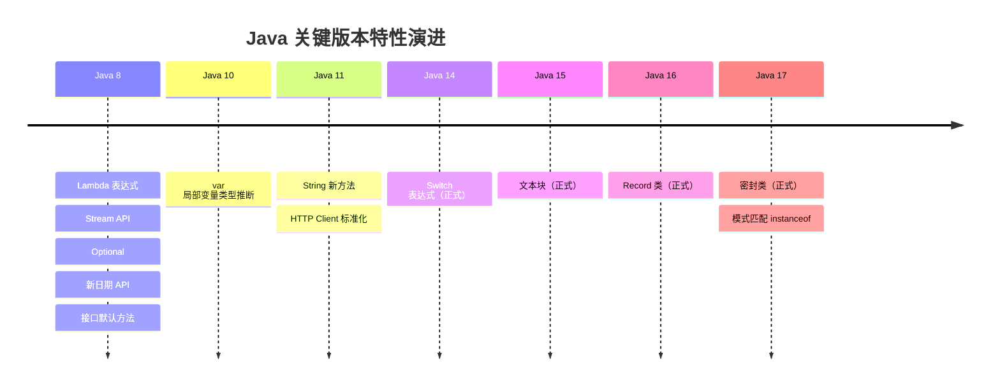

#### 局部视角（各特性解决的具体问题）

| 特性 | 解决的问题 | 学完能做什么 |
|------|-----------|-------------|
| Lambda | 匿名内部类冗长、代码不简洁 | 用一行代码替代5行匿名类，传递行为而非对象 |
| Stream API | 集合操作代码复杂、可读性差 | 链式处理集合数据，替代复杂的 for 循环嵌套 |
| Optional | NullPointerException 难以预防 | 显式表达"可能为空"的语义，强制调用方处理空值 |
| 新日期 API | Date/Calendar 线程不安全、API 设计混乱 | 写出线程安全的日期处理代码，避免时区问题 |
| Record 类 | DTO/POJO 类样板代码过多 | 一行定义不可变数据类，自动生成 equals/hashCode |
| 密封类 | 继承体系难以控制 | 精确控制哪些类可以继承，配合模式匹配更安全 |

#### 验收标准

1. WHEN 复习 Lambda 表达式时 THEN 候选人 SHALL 掌握 Lambda 语法、四大函数式接口（Function/Consumer/Supplier/Predicate）、方法引用的四种形式
2. WHEN 复习 Stream API 时 THEN 候选人 SHALL 掌握 Stream 的惰性求值原理、中间操作与终止操作的区别，能用 Stream 完成分组、去重、排序、聚合等常见操作
3. WHEN 复习 Optional 时 THEN 候选人 SHALL 能够正确使用 Optional 避免 NPE，理解 Optional 不应用于方法参数和字段的原因
4. WHEN 复习新日期 API 时 THEN 候选人 SHALL 掌握 LocalDate/LocalDateTime/ZonedDateTime 的使用，理解不可变性带来的线程安全优势
5. WHEN 复习接口默认方法时 THEN 候选人 SHALL 理解 default 方法解决的接口演化问题，以及多继承冲突时的解决规则
6. WHEN 复习 Java 9-17+ 新特性时 THEN 候选人 SHALL 了解 var 类型推断（Java 10）、文本块（Java 15）、Record 类（Java 16）、密封类与模式匹配（Java 17）的使用场景
7. IF 面试涉及 Java 新特性实战 THEN 候选人 SHALL 能够将 Stream + Lambda + Optional 组合使用，重构一段传统命令式代码为函数式风格

---

### 需求 3：Java Spring 框架复习

**用户故事：** 作为一名Java面试候选人，我希望系统复习 Spring 框架的核心原理，以便在面试中不只是说"会用 Spring"，而是能解释 Spring 的设计思想和底层机制。

#### 为什么要复习 Spring？

Spring 是 Java 后端开发的事实标准框架，几乎所有 Java 岗位都要求掌握。但很多开发者只会"配置使用"，不理解背后原理，导致：
- 遇到 Bean 注入失败、循环依赖报错时不知道原因
- 事务不生效（如同类方法调用、非 public 方法）时无法排查
- Spring Boot 自动配置出问题时不知道如何 debug

#### Spring MVC 请求处理流程图

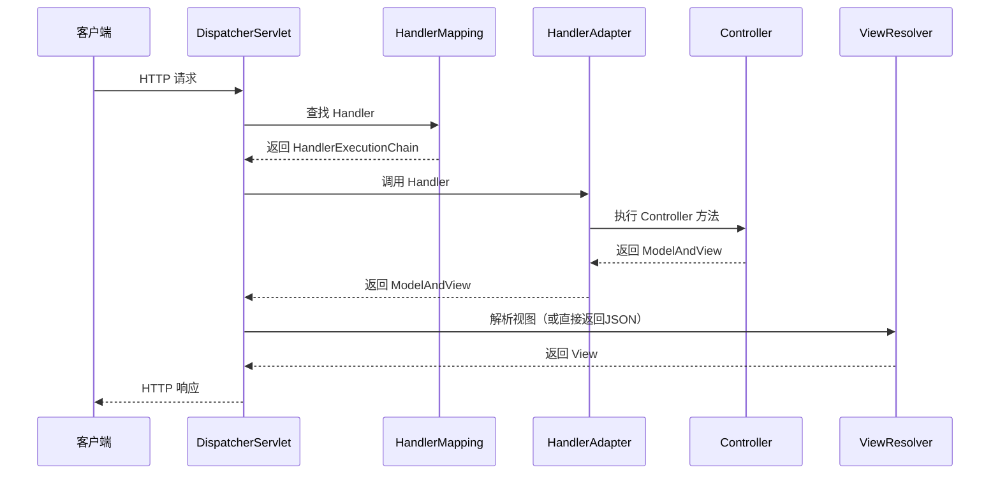

#### Spring Bean 生命周期图

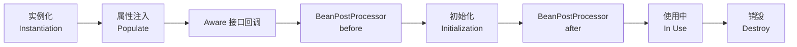

#### 局部视角（各模块解决的具体问题）

| 模块 | 解决的问题 | 工作中常见错误 |
|------|-----------|---------------|
| IoC/DI | 对象创建与依赖管理混乱 | 手动 new 对象导致无法被 Spring 管理，@Autowired 注入失败 |
| AOP | 横切关注点（日志/事务/权限）代码散落各处 | AOP 不生效（同类调用绕过代理）、切点表达式写错 |
| Spring Boot 自动配置 | 繁琐的 XML 配置 | 自定义配置被自动配置覆盖，不知道如何排查 |
| 事务管理 | 数据一致性难以保证 | 事务不生效（方法非 public、同类调用、异常被捕获）|
| 循环依赖 | Bean 互相依赖导致启动失败 | 不理解三级缓存，遇到循环依赖不知道如何解决 |

#### 验收标准

1. WHEN 复习 Spring Core 时 THEN 候选人 SHALL 掌握 IoC 容器的 Bean 生命周期（实例化→属性注入→初始化→销毁）、三种依赖注入方式的优缺点、AOP 的动态代理原理（JDK 动态代理 vs CGLIB）
2. WHEN 复习 Spring MVC 时 THEN 候选人 SHALL 能够描述一次 HTTP 请求从 DispatcherServlet 到 Controller 再到响应的完整流程
3. WHEN 复习 Spring Boot 时 THEN 候选人 SHALL 掌握 @SpringBootApplication 的组合注解含义、自动配置的 SPI 机制（spring.factories）、条件注解（@ConditionalOnClass 等）的作用
4. WHEN 复习 Spring 事务时 THEN 候选人 SHALL 掌握 7 种事务传播行为的含义、事务不生效的常见原因及解决方案
5. IF 面试涉及 Spring 高级特性 THEN 候选人 SHALL 能够解释三级缓存解决循环依赖的原理，说明为什么构造器注入无法解决循环依赖

---

### 需求 4：Redis 缓存复习

**用户故事：** 作为一名Java面试候选人，我希望深入复习 Redis 的核心知识，以便在面试中展示对缓存技术的深刻理解，并能在工作中正确设计缓存方案。

#### 为什么要复习 Redis？

Redis 是现代互联网系统中最常用的缓存中间件。引入 Redis 的核心目的是**减轻数据库压力、提升系统响应速度**。但使用不当会引发严重问题：
- 缓存穿透导致数据库被打垮
- 缓存雪崩导致系统整体崩溃
- 分布式锁实现错误导致数据重复处理

#### 缓存三大问题对比图

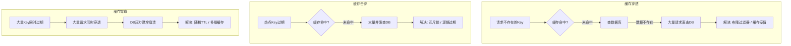

#### 局部视角（各知识点解决的具体问题）

| 知识点 | 解决的问题 | 工作中常见错误 |
|--------|-----------|---------------|
| 数据结构 | 不同场景选型错误导致性能差 | 用 String 存 JSON 而不用 Hash，导致更新时需要全量覆盖 |
| 持久化 | Redis 重启后数据丢失 | 生产环境未开启持久化，或 AOF 重写频率配置不当 |
| 缓存三大问题 | 高并发下数据库被击穿 | 未设置随机过期时间导致缓存雪崩 |
| 分布式锁 | 多实例部署下的并发控制 | 用 SETNX 实现锁但未设置过期时间，导致死锁 |
| 集群模式 | 单点故障、容量瓶颈 | 不了解 Cluster 的 slot 分片，导致 mget 等命令跨 slot 报错 |

#### 验收标准

1. WHEN 复习 Redis 数据结构时 THEN 候选人 SHALL 掌握五种基本类型的底层编码（如 ZSet 的 ziplist/skiplist）及各自适用场景（如排行榜用 ZSet、计数器用 String incr）
2. WHEN 复习 Redis 持久化时 THEN 候选人 SHALL 能够对比 RDB（快照）与 AOF（追加日志）的数据安全性、性能影响及混合持久化方案
3. WHEN 复习 Redis 高可用时 THEN 候选人 SHALL 掌握主从复制的数据同步流程、哨兵的故障转移机制、Cluster 的 slot 分片原理
4. WHEN 复习缓存三大问题时 THEN 候选人 SHALL 能够解释缓存穿透（布隆过滤器/空值缓存）、缓存击穿（互斥锁/逻辑过期）、缓存雪崩（随机 TTL/多级缓存）的解决方案
5. IF 面试涉及 Redis 高级特性 THEN 候选人 SHALL 能够说明 Redisson 分布式锁相比 SETNX 的优势（看门狗续期、可重入、红锁）

---

### 需求 5：MySQL 数据库复习

**用户故事：** 作为一名Java面试候选人，我希望全面复习 MySQL 的核心知识，以便在面试中展示扎实的数据库基础，并能在工作中写出高性能的 SQL。

#### 为什么要复习 MySQL？

数据库是后端系统的核心，几乎所有业务数据最终都存储在关系型数据库中。MySQL 是使用最广泛的开源关系型数据库。**数据库问题往往是系统性能瓶颈的根源**，不理解索引和事务原理会导致：
- SQL 写了索引但不走索引（索引失效）
- 高并发下出现幻读、脏读等数据一致性问题
- 大表查询慢但不知道如何优化

#### MySQL 索引结构图（B+ 树）

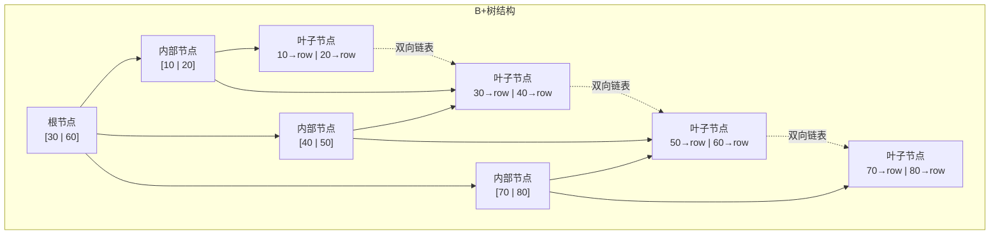

#### 局部视角（各知识点解决的具体问题）

| 知识点 | 解决的问题 | 工作中常见错误 |
|--------|-----------|---------------|
| 索引原理 | 查询慢、全表扫描 | 在 WHERE 条件列上建了索引但因函数操作导致索引失效 |
| 事务与 MVCC | 并发读写数据不一致 | 不了解 MVCC，误以为加了事务就能解决所有并发问题 |
| 锁机制 | 并发更新冲突、死锁 | 不了解间隙锁，在 RR 隔离级别下意外锁住大范围数据 |
| EXPLAIN 分析 | 无法判断 SQL 是否高效 | 不会看 EXPLAIN 的 type/key/rows 字段，优化无从下手 |
| 分库分表 | 单表数据量过大 | 分表后跨分片查询、分布式事务处理不当 |

#### 验收标准

1. WHEN 复习 MySQL 索引时 THEN 候选人 SHALL 掌握 B+ 树的结构特点、聚簇索引与二级索引的区别、联合索引的最左前缀原则、导致索引失效的常见场景（函数/类型转换/like 前缀%）
2. WHEN 复习 MySQL 事务时 THEN 候选人 SHALL 掌握 ACID 特性、四种隔离级别解决的问题（脏读/不可重复读/幻读）、InnoDB 的 MVCC 通过 undo log + Read View 实现的原理
3. WHEN 复习 MySQL 锁机制时 THEN 候选人 SHALL 能够区分表锁/行锁/间隙锁/临键锁的加锁范围，理解死锁的产生条件及 InnoDB 的死锁检测机制
4. WHEN 复习 MySQL 性能优化时 THEN 候选人 SHALL 掌握 EXPLAIN 执行计划中关键字段的含义，能够通过慢查询日志定位问题 SQL 并给出优化方案
5. IF 面试涉及 MySQL 存储引擎 THEN 候选人 SHALL 能够对比 InnoDB（支持事务/行锁/外键）与 MyISAM（不支持事务/表锁/全文索引）的核心差异

---

### 需求 6：Kafka 消息队列复习

**用户故事：** 作为一名Java面试候选人，我希望系统复习 Kafka 的核心概念与原理，以便在面试中展示对消息队列的深入理解，并能在工作中正确使用 Kafka 解决异步解耦问题。

#### 为什么要复习 Kafka？

消息队列是解决系统间**异步通信、流量削峰、服务解耦**的核心中间件。Kafka 凭借极高的吞吐量成为大数据和微服务场景的首选。不理解 Kafka 原理会导致：
- 消息丢失（生产者未确认、消费者未提交 offset）
- 消息重复消费（未实现幂等性）
- 消费者组 Rebalance 频繁导致消费停顿

#### Kafka 架构图

```mermaid
graph LR
    subgraph 生产者
        P1[Producer 1]
        P2[Producer 2]
    end

    subgraph Kafka Cluster
        subgraph Broker 1
            T1P0[Topic-A\nPartition 0\nLeader]
            T1P1[Topic-A\nPartition 1\nFollower]
        end
        subgraph Broker 2
            T1P0R[Topic-A\nPartition 0\nFollower]
            T1P1L[Topic-A\nPartition 1\nLeader]
        end
        ZK[ZooKeeper\n协调元数据]
    end

    subgraph 消费者组
        C1[Consumer 1\n消费 P0]
        C2[Consumer 2\n消费 P1]
    end

    P1 -->|写入| T1P0
    P2 -->|写入| T1P1L
    T1P0 -->|副本同步| T1P0R
    T1P1L -->|副本同步| T1P1
    T1P0 -->|拉取| C1
    T1P1L -->|拉取| C2
    ZK -.->|元数据| Broker 1
    ZK -.->|元数据| Broker 2
```

#### 局部视角（各知识点解决的具体问题）

| 知识点 | 解决的问题 | 工作中常见错误 |
|--------|-----------|---------------|
| Topic/Partition | 消息的组织与并行消费 | Partition 数设置过少，消费者数量超过 Partition 数导致部分消费者空闲 |
| 消息可靠性 | 消息丢失 | acks=1 时 Leader 宕机导致消息丢失，未开启幂等性导致重复消息 |
| 消费者组 | 多消费者协作消费 | Rebalance 期间消费暂停，session.timeout.ms 设置过短频繁触发 |
| 高吞吐原理 | 理解 Kafka 为何快 | 误用同步发送降低吞吐量，不了解批量发送和压缩配置 |

#### 验收标准

1. WHEN 复习 Kafka 基础概念时 THEN 候选人 SHALL 掌握 Topic/Partition/Replica/Consumer Group/Offset 的含义，理解 Partition 是 Kafka 并行度的基本单位
2. WHEN 复习消息可靠性时 THEN 候选人 SHALL 能够从生产者（acks/重试）、Broker（副本同步/ISR）、消费者（手动提交 offset/幂等处理）三个维度说明如何保证消息不丢失
3. WHEN 复习消费者组时 THEN 候选人 SHALL 掌握 Rebalance 的触发条件、分区分配策略（Range/RoundRobin/Sticky），理解 Sticky 策略减少 Rebalance 影响的原理
4. WHEN 复习 Kafka 高吞吐原理时 THEN 候选人 SHALL 能够解释顺序写磁盘、零拷贝（sendfile）、批量发送、消息压缩四个核心机制
5. IF 面试涉及消息队列对比 THEN 候选人 SHALL 能够说明 Kafka（高吞吐/流处理）、RocketMQ（事务消息/延迟消息）、RabbitMQ（灵活路由/低延迟）的适用场景差异

---

### 需求 7：Elasticsearch 复习

**用户故事：** 作为一名Java面试候选人，我希望复习 Elasticsearch 的核心知识，以便在面试中展示全文搜索引擎的使用经验，并能说明 ES 与关系型数据库的互补关系。

#### 为什么要复习 Elasticsearch？

当系统需要**全文检索、复杂聚合分析、近实时搜索**时，关系型数据库的 LIKE 查询性能极差，ES 是这类场景的最佳解决方案。不理解 ES 原理会导致：
- Mapping 设计不合理导致查询性能差或无法搜索
- 不了解分片机制导致集群扩容困难
- 写入量大时不知道如何优化

#### 倒排索引原理图

```mermaid
graph LR
    subgraph 正排索引（传统）
        D1[文档1: Java是最好的语言]
        D2[文档2: Java性能很强]
        D3[文档3: Python也很好]
    end

    subgraph 倒排索引
        T1[Java] --> DL1[文档1, 文档2]
        T2[性能] --> DL2[文档2]
        T3[Python] --> DL3[文档3]
        T4[语言] --> DL4[文档1]
    end

    Q[查询: Java] -->|全表扫描 O-n| D1
    Q -->|倒排索引 O-1| T1
```

#### 局部视角（各知识点解决的具体问题）

| 知识点 | 解决的问题 | 工作中常见错误 |
|--------|-----------|---------------|
| 倒排索引 | 理解 ES 为何擅长全文检索 | 对 keyword 类型字段做全文检索，或对 text 类型做精确匹配 |
| Mapping 设计 | 字段类型错误导致查询失败 | 动态 Mapping 导致字段类型被错误推断，后期无法修改 |
| 查询 DSL | 无法写出复杂查询 | 混淆 filter（不计分/可缓存）和 query（计算相关性得分）的使用场景 |
| 分片机制 | 集群扩容与数据分布 | 主分片数创建后不可修改，初始设置过少导致后期无法水平扩展 |

#### 验收标准

1. WHEN 复习 ES 基础概念时 THEN 候选人 SHALL 掌握 Index/Document/Mapping/Shard/Replica 的含义，理解 ES 与关系型数据库的概念对应关系
2. WHEN 复习 ES 查询时 THEN 候选人 SHALL 掌握 match（全文检索）、term（精确匹配）、range（范围查询）、bool（组合查询）的使用，理解 query context 与 filter context 的区别
3. WHEN 复习倒排索引时 THEN 候选人 SHALL 能够解释倒排索引的构建过程（分词→建立词项→记录文档列表），理解为何倒排索引使全文检索比 LIKE 快几个数量级
4. WHEN 复习 ES 集群时 THEN 候选人 SHALL 掌握主分片与副本分片的作用、集群健康状态的含义，理解主分片数不可修改的原因
5. IF 面试涉及 ES 性能优化 THEN 候选人 SHALL 能够说明写入优化（bulk 批量写入、减少 refresh 频率）、查询优化（使用 filter 缓存、避免深度分页）的具体手段

---

### 需求 8：PostgreSQL 数据库复习

**用户故事：** 作为一名Java面试候选人，我希望复习 PostgreSQL 的核心特性，以便在面试中展示对 PostgreSQL 与 MySQL 差异的理解，并能在工作中根据业务场景做出合理的数据库选型。

#### 为什么要复习 PostgreSQL？

PostgreSQL 是功能最强大的开源关系型数据库，在需要**复杂查询、JSON 存储、地理信息、全文搜索**等场景下优于 MySQL。随着越来越多的企业将 PostgreSQL 作为主数据库，掌握其特性有助于：
- 在技术选型时给出有依据的建议
- 充分利用 PostgreSQL 的高级特性减少应用层代码复杂度
- 理解 VACUUM 机制，避免表膨胀导致的性能问题

#### PostgreSQL vs MySQL 特性对比图

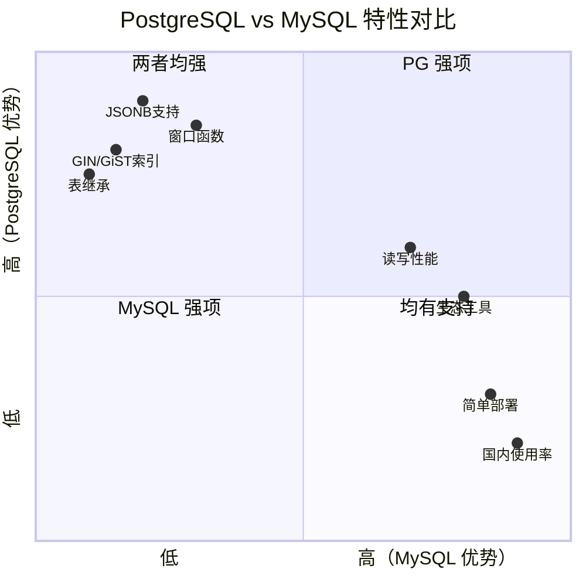

#### 局部视角（各知识点解决的具体问题）

| 知识点 | 解决的问题 | 工作中常见错误 |
|--------|-----------|---------------|
| 与 MySQL 的差异 | 技术选型依据 | 不了解差异，在需要 JSON 操作或窗口函数的场景仍选 MySQL |
| MVCC 实现 | 理解并发控制机制 | 不了解 PG 的 MVCC 依赖 VACUUM 清理旧版本，导致表膨胀 |
| 高级索引类型 | 特殊数据类型的高效查询 | 对 JSONB 字段做查询但未建 GIN 索引，导致全表扫描 |
| VACUUM 机制 | 防止表膨胀、回收空间 | 未配置 autovacuum，大量更新/删除后表空间持续增长 |

#### 验收标准

1. WHEN 复习 PostgreSQL 与 MySQL 差异时 THEN 候选人 SHALL 掌握 PG 的核心优势（原生 JSON/JSONB 支持、丰富的索引类型、窗口函数、表继承、更严格的 SQL 标准遵循）
2. WHEN 复习 PostgreSQL 事务时 THEN 候选人 SHALL 掌握 PG 的 MVCC 通过多版本行存储实现的原理，理解与 MySQL（undo log）实现方式的差异
3. WHEN 复习 PostgreSQL 索引时 THEN 候选人 SHALL 了解 B-tree（通用）、Hash（等值查询）、GIN（全文检索/JSONB/数组）、GiST（地理信息/范围类型）的适用场景
4. WHEN 复习 PostgreSQL 高级特性时 THEN 候选人 SHALL 了解 CTE（WITH 子句）、物化视图、窗口函数（ROW_NUMBER/RANK/LAG）的使用场景
5. IF 面试涉及 PostgreSQL 运维 THEN 候选人 SHALL 能够说明 VACUUM/AUTOVACUUM 的作用、表膨胀的原因及监控手段

---

### 需求 9：软件工程知识复习

**用户故事：** 作为一名Java面试候选人，我希望系统复习软件工程的核心知识，以便在面试中展示工程化思维，并能在工作中参与系统设计、代码评审和技术规范制定。

#### 为什么要复习软件工程？

软件工程是区分"写代码的人"和"做工程的人"的核心能力。很多开发者技术能力强，但缺乏工程化思维，导致：
- 代码可维护性差，改一处坏一片
- 不懂 SOLID 原则，设计出高耦合低内聚的系统
- 不了解微服务架构，无法参与系统拆分讨论
- 不会 DDD，业务逻辑散落在各层，难以维护

#### 软件架构演进图

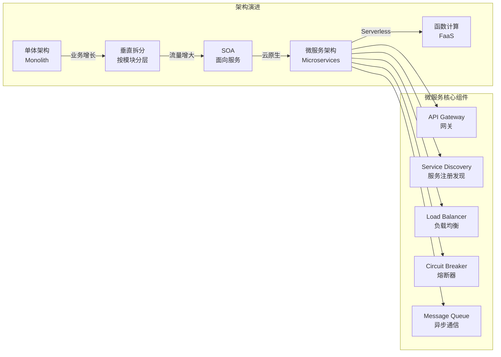

#### SOLID 原则关系图

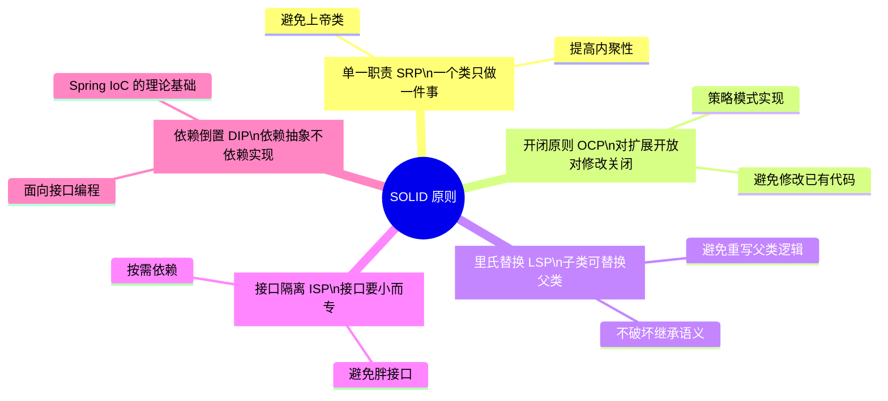

#### 局部视角（各知识点解决的具体问题）

| 知识点 | 解决的问题 | 工作中常见错误 |
|--------|-----------|---------------|
| SOLID 原则 | 代码高耦合、难以扩展 | 一个 Service 类几千行，承担了所有业务逻辑（违反 SRP） |
| 微服务架构 | 单体应用难以扩展、部署 | 服务拆分过细导致分布式事务问题，或拆分过粗失去意义 |
| DDD 领域驱动 | 业务逻辑与技术实现混乱 | 贫血模型：所有逻辑在 Service 层，Entity 只有 getter/setter |
| CAP 理论 | 分布式系统设计取舍 | 不了解 CAP，在强一致性场景选了 AP 系统导致数据不一致 |
| 代码质量 | 代码可读性差、难以维护 | 方法过长、命名不规范、魔法数字、缺少注释 |
| CI/CD | 发布效率低、人工操作出错 | 手动部署流程不规范，缺少自动化测试导致频繁线上 Bug |

#### 验收标准

1. WHEN 复习 SOLID 原则时 THEN 候选人 SHALL 能够用代码示例说明每条原则的含义，并能识别违反该原则的典型代码坏味道
2. WHEN 复习微服务架构时 THEN 候选人 SHALL 掌握服务注册发现、API 网关、熔断降级、分布式链路追踪的作用，能够说明微服务与单体架构的取舍
3. WHEN 复习 DDD 领域驱动设计时 THEN 候选人 SHALL 理解领域模型、聚合根、值对象、领域事件的概念，能够区分贫血模型与充血模型的优缺点
4. WHEN 复习 CAP 理论时 THEN 候选人 SHALL 能够解释 CAP 三者不可兼得的原因，说明 MySQL（CP）、Redis Cluster（AP）、ZooKeeper（CP）的选择依据
5. WHEN 复习代码质量时 THEN 候选人 SHALL 掌握常见代码坏味道（Long Method/God Class/Magic Number）的识别与重构手段
6. IF 面试涉及系统设计 THEN 候选人 SHALL 能够从需求分析→容量估算→架构设计→数据库设计→接口设计的完整流程来回答系统设计题

---

### 需求 10：设计模式复习

**用户故事：** 作为一名Java面试候选人，我希望系统复习 GoF 23 种设计模式，以便在面试中展示对代码设计的深刻理解，并能在工作中识别和应用合适的设计模式解决实际问题。

#### 为什么要复习设计模式？

设计模式是前人总结的**解决特定场景下代码设计问题的最佳实践**。不了解设计模式会导致：
- 重复发明轮子，写出低质量的"自创方案"
- 看不懂框架源码（Spring 大量使用工厂、代理、模板方法、观察者等模式）
- 代码扩展性差，每次新增功能都要大量修改已有代码

#### 设计模式分类图

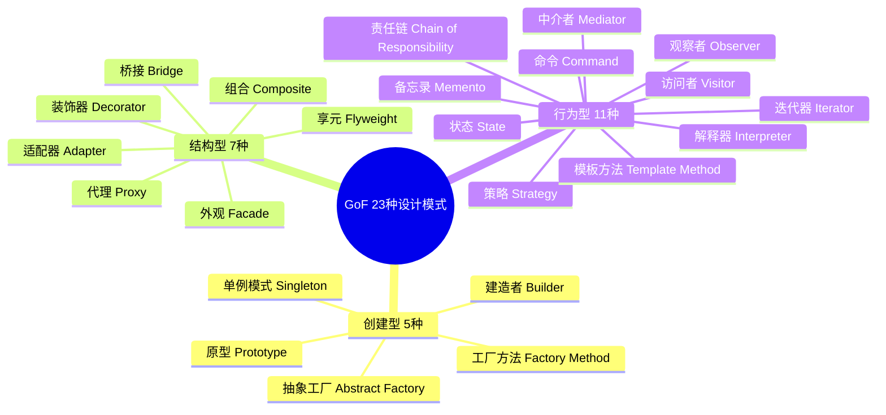

#### 高频设计模式在 Java/Spring 中的应用

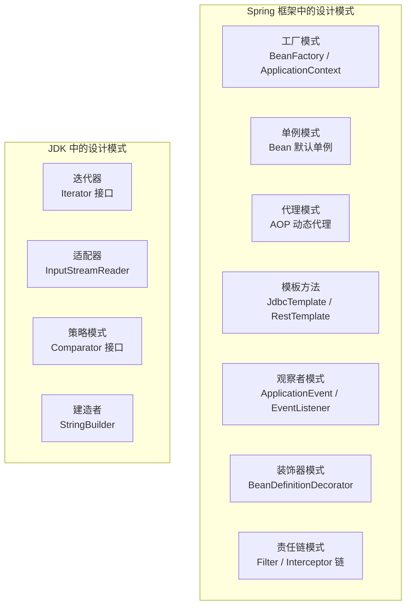

#### 局部视角（高频模式解决的具体问题）

| 设计模式 | 解决的问题 | 工作中的应用场景 | 常见错误 |
|---------|-----------|----------------|---------|
| 单例模式 | 全局唯一实例、资源共享 | 配置管理、连接池、Spring Bean | 双重检查锁未加 volatile，指令重排导致返回未初始化对象 |
| 工厂模式 | 对象创建与使用解耦 | Spring BeanFactory、各种 xxxFactory | 工厂类过于复杂，违反单一职责 |
| 代理模式 | 在不修改原类的前提下增强功能 | AOP、MyBatis Mapper 接口 | 混淆静态代理与动态代理的适用场景 |
| 策略模式 | 消除大量 if-else 分支 | 支付方式选择、不同算法切换 | 策略类过多导致类爆炸，可结合工厂模式管理 |
| 观察者模式 | 事件驱动、解耦发布者与订阅者 | Spring 事件机制、消息队列 | 同步观察者阻塞主流程，应改为异步 |
| 模板方法 | 固定算法骨架，子类实现细节 | JdbcTemplate、各种 AbstractXxx 类 | 过度使用继承，应考虑组合替代 |
| 责任链模式 | 请求依次经过多个处理器 | Filter 链、拦截器链、审批流 | 链过长导致性能问题，缺少短路机制 |
| 建造者模式 | 复杂对象的分步构建 | Lombok @Builder、各种 Builder API | 对简单对象也用 Builder，过度设计 |

#### 验收标准

1. WHEN 复习创建型模式时 THEN 候选人 SHALL 掌握单例模式的5种实现方式（饿汉/懒汉/双重检查/静态内部类/枚举）及各自优缺点，理解工厂方法与抽象工厂的区别
2. WHEN 复习结构型模式时 THEN 候选人 SHALL 能够区分代理模式（控制访问）与装饰器模式（增强功能）的本质差异，说明适配器模式解决接口不兼容的原理
3. WHEN 复习行为型模式时 THEN 候选人 SHALL 掌握策略模式消除 if-else 的重构手法、观察者模式的发布订阅机制、模板方法的钩子方法设计
4. WHEN 复习设计模式在框架中的应用时 THEN 候选人 SHALL 能够指出 Spring 中至少5种设计模式的具体应用位置，并解释为何选用该模式
5. WHEN 复习设计模式选型时 THEN 候选人 SHALL 能够根据给定的业务场景，分析问题特征并选择合适的设计模式，说明选择理由
6. IF 面试涉及代码重构 THEN 候选人 SHALL 能够识别代码中的坏味道（大量 if-else/重复代码/过长方法），并用合适的设计模式进行重构

---

### 需求 11：复习计划时间安排

**用户故事：** 作为一名Java面试候选人，我希望有一个合理的时间分配方案，以便在有限时间内高效完成所有技术栈的复习，做到重点突出、不遗漏核心考点。

#### 优先级说明

面试考察频率从高到低排序：

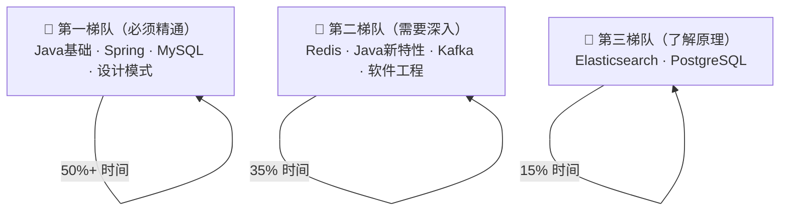

#### 推荐复习路径

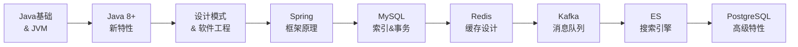

#### 验收标准

1. WHEN 制定复习计划时 THEN 计划 SHALL 按照上述优先级分配时间，第一梯队合计占总复习时间的 50% 以上
2. WHEN 复习每个模块时 THEN 候选人 SHALL 先理解"为什么"（设计动机），再学"是什么"（原理），最后练"怎么做"（代码/案例）
3. WHEN 复习完每个模块时 THEN 候选人 SHALL 能够回答：这个技术解决了什么问题？不用它会怎样？工作中有哪些坑？
4. IF 时间有限（少于 2 周）THEN 候选人 SHALL 优先保证第一梯队的深度复习，第三梯队可只复习高频考点
5. WHEN 复习设计模式时 THEN 候选人 SHALL 结合 Spring 源码和实际工作场景来理解每个模式，而非死记硬背定义
