# Java 基础知识与 JVM 原理

> **学习目标**：从"会用"升级到"理解原理 → 能解决问题 → 能做技术决策"
>
> **检验标准**：学完每个模块后，能口述"这个技术解决了什么问题？不用它会怎样？工作中有哪些坑？"

---

## 整体知识地图

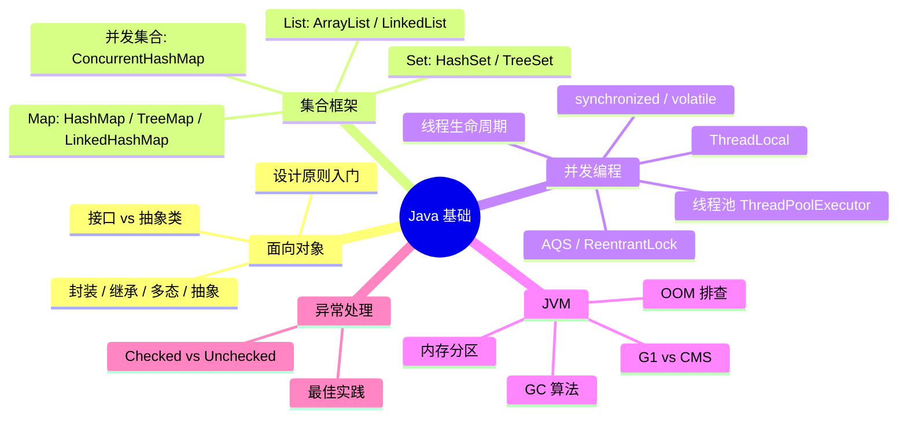

---

## 一、面向对象

### 为什么要学面向对象？

面向过程编程在业务复杂后会导致代码难以复用和扩展。面向对象通过**封装、继承、多态、抽象**四大特性，让代码具备高内聚低耦合的特点。**不理解多态，就无法理解 Spring 的依赖注入为何能替换实现类**。

### 四大特性对比

| 特性 | 核心思想 | 解决的问题 | 工作中的坑 |
|------|---------|-----------|-----------|
| 封装 | 隐藏内部实现，暴露必要接口 | 防止外部随意修改内部状态 | 字段设为 public，破坏封装性 |
| 继承 | 子类复用父类代码 | 减少重复代码 | 过度继承导致强耦合，优先考虑组合 |
| 多态 | 同一接口，不同实现 | 扩展新功能无需修改调用方 | 不会用多态，大量 if-else 判断类型 |
| 抽象 | 提取共性，定义规范 | 面向接口编程，解耦实现 | 抽象层次不当，导致接口过于宽泛 |

### 接口 vs 抽象类

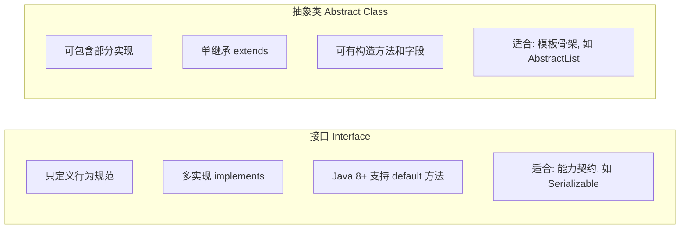

**选择原则**：
- 需要定义**能力契约**（如"可序列化"、"可比较"）→ 用接口
- 需要提供**公共实现骨架**，子类只需实现差异部分 → 用抽象类

---

## 二、集合框架

### 为什么要深入理解集合？

集合是日常开发中使用最频繁的数据结构。**选错集合类型会导致严重的性能问题**，在多线程环境下使用非线程安全集合会导致数据丢失甚至死循环（JDK7 的 HashMap 扩容死循环）。

### 核心集合底层实现对比

| 集合类 | 底层结构 | 时间复杂度（查/增/删） | 线程安全 | 适用场景 |
|--------|---------|---------------------|---------|---------|
| ArrayList | 动态数组 | O(1) / O(n) / O(n) | ❌ | 随机访问多，增删少 |
| LinkedList | 双向链表 | O(n) / O(1) / O(1) | ❌ | 增删多，随机访问少 |
| HashMap | 数组+链表+红黑树 | O(1) 均摊 | ❌ | 通用 KV 存储 |
| TreeMap | 红黑树 | O(log n) | ❌ | 需要有序遍历 |
| ConcurrentHashMap | 分段锁/CAS | O(1) 均摊 | ✅ | 多线程 KV 存储 |

### HashMap 扩容流程

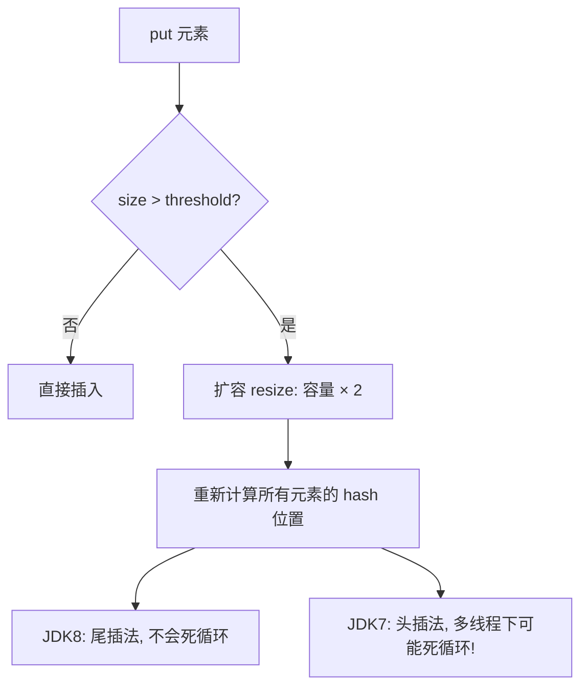

> ⚠️ **工作中的坑**：多线程环境下绝对不能使用 HashMap，应使用 `ConcurrentHashMap`。JDK7 的头插法在并发扩容时会形成环形链表，导致 CPU 100%。

---

## 三、并发编程

### 为什么要学并发？

现代服务器都是多核 CPU，充分利用并发能大幅提升吞吐量。但并发编程是 Bug 的重灾区：**数据竞争、死锁、内存可见性**问题在测试环境难以复现，却在生产环境频繁出现。

### 线程生命周期

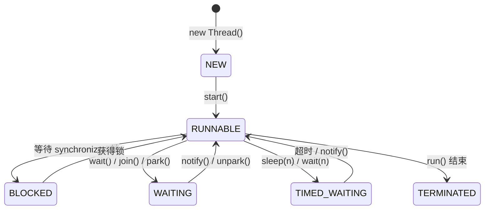

### synchronized vs volatile

| 对比项 | synchronized | volatile |
|--------|-------------|---------|
| 保证原子性 | ✅ | ❌（复合操作不原子） |
| 保证可见性 | ✅ | ✅ |
| 保证有序性 | ✅ | ✅（禁止指令重排） |
| 性能开销 | 较大（加锁/解锁） | 较小 |
| 适用场景 | 复合操作、临界区 | 状态标志位、单次写多次读 |

### 线程池核心参数

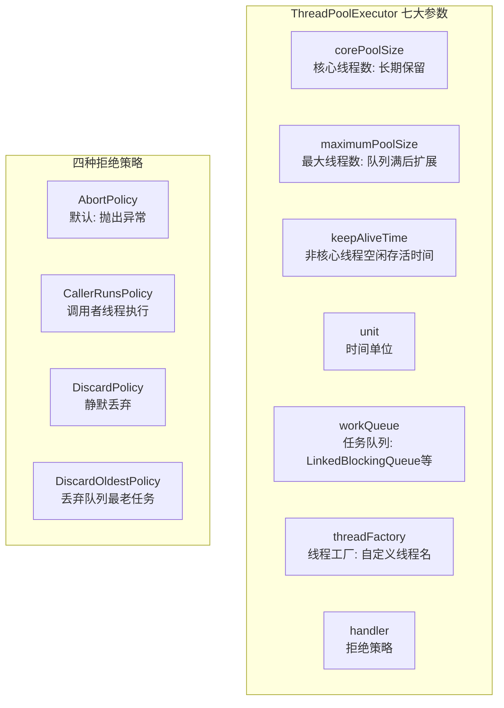

> ⚠️ **工作中的坑**：
> - 不要用 `Executors.newFixedThreadPool()`，其队列长度为 `Integer.MAX_VALUE`，会导致 OOM
> - 线程池线程名要自定义，方便排查问题（如 `order-pool-1`）
> - `corePoolSize` 设置参考：CPU 密集型 = CPU 核数 + 1；IO 密集型 = CPU 核数 × 2

### ThreadLocal 内存泄漏

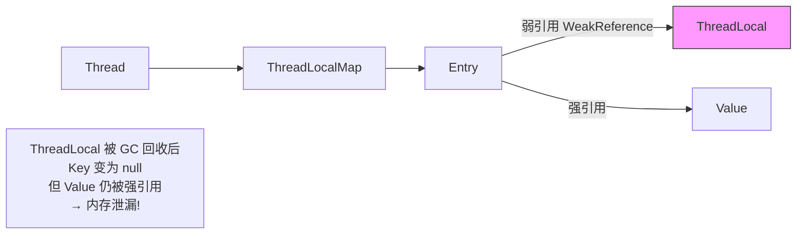

**解决方案**：使用完 ThreadLocal 后，必须调用 `remove()` 方法清理。

---

## 四、JVM 内存结构与 GC

### 为什么要学 JVM？

线上 OOM、频繁 Full GC、应用响应慢等问题，**根因都在 JVM 层面**。不懂 JVM 就无法定位这类问题，只能重启服务"治标不治本"。

### JVM 内存分区

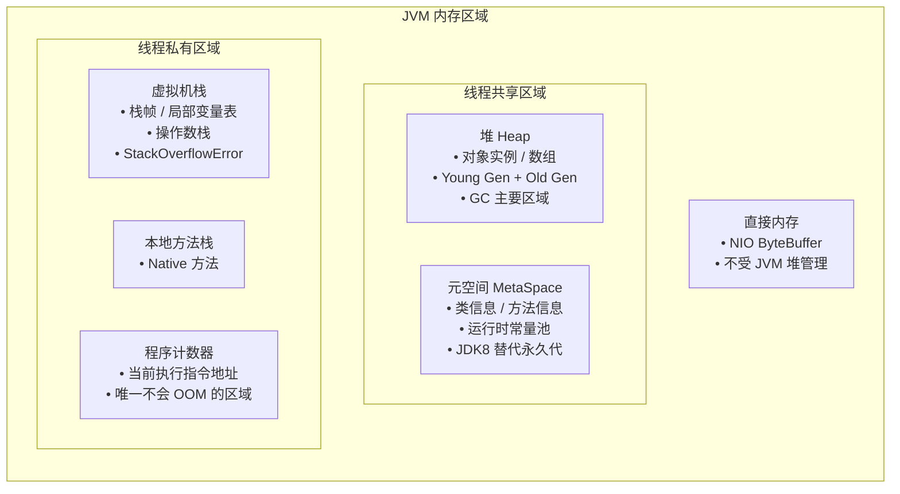

### GC 算法对比

| 算法 | 原理 | 优点 | 缺点 | 适用区域 |
|------|------|------|------|---------|
| 标记-清除 | 标记存活对象，清除未标记 | 简单 | 内存碎片 | 老年代 |
| 标记-整理 | 标记后将存活对象移到一端 | 无碎片 | 移动对象开销大 | 老年代 |
| 复制算法 | 存活对象复制到另一半空间 | 无碎片、速度快 | 空间利用率 50% | 新生代 |
| 分代收集 | 新生代用复制，老年代用标记整理 | 综合最优 | 跨代引用处理复杂 | 全堆 |

### G1 vs CMS 对比

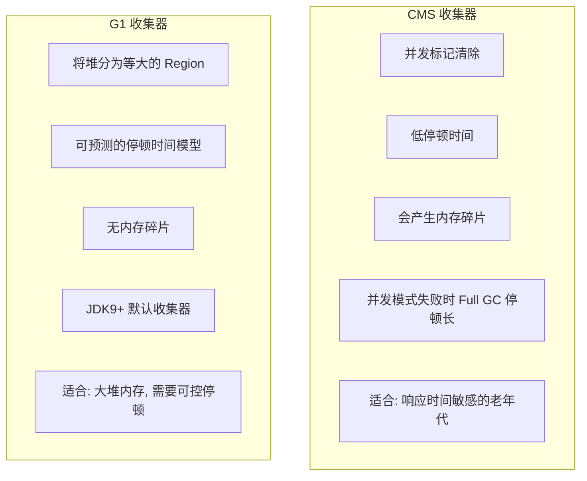

### OOM 问题排查思路

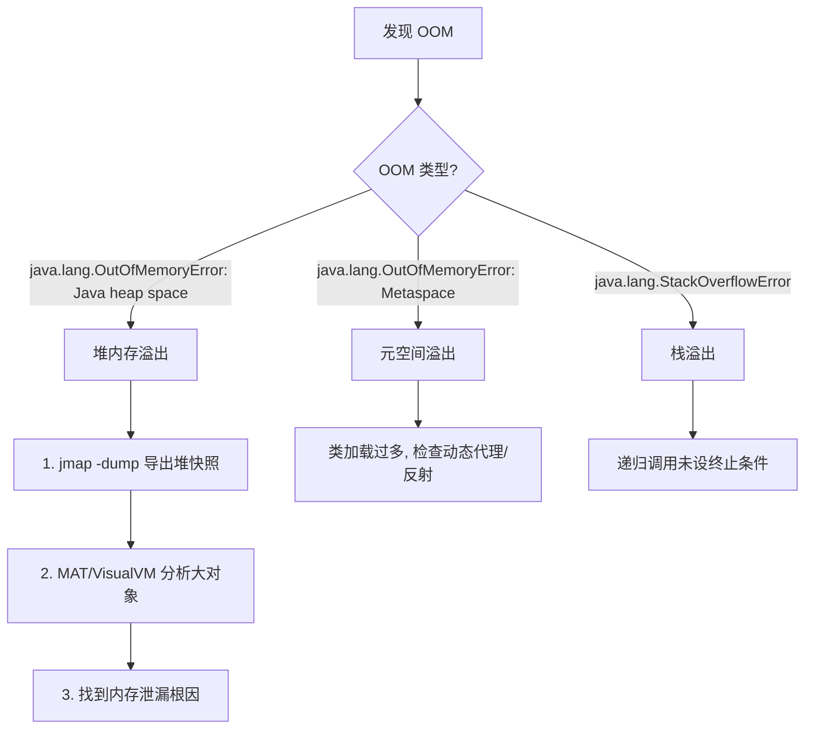

---

## 五、异常处理

### 为什么要规范异常处理？

异常处理不当会导致**问题被掩盖、排查困难**。空 catch 块是最危险的反模式——程序悄悄出错，日志里没有任何记录。

### Checked vs Unchecked Exception

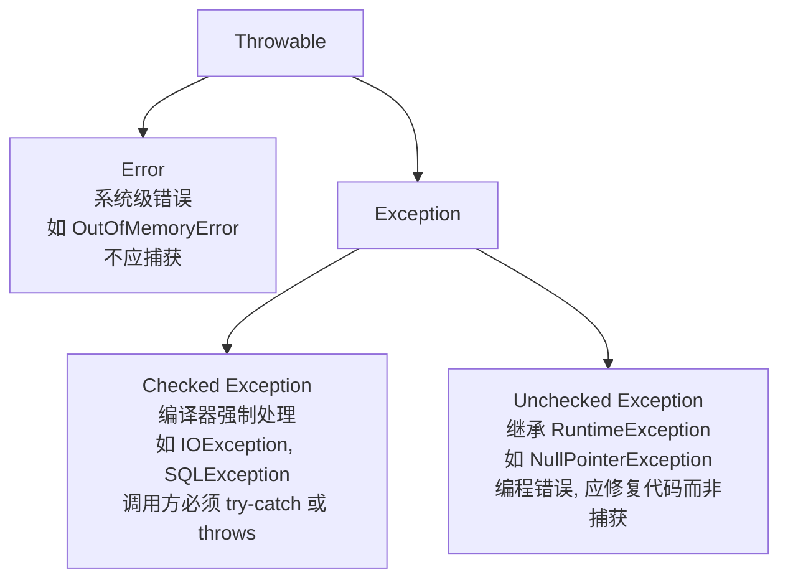

### 异常处理最佳实践

```java
// ❌ 错误示例：吞掉异常
try {
    doSomething();
} catch (Exception e) {
    // 什么都不做，问题被掩盖！
}

// ❌ 错误示例：捕获过宽
try {
    doSomething();
} catch (Exception e) {
    log.error("error", e); // 捕获了所有异常，包括不该捕获的
}

// ✅ 正确示例：精确捕获，记录上下文
try {
    orderService.createOrder(orderId);
} catch (OrderNotFoundException e) {
    log.warn("订单不存在, orderId={}", orderId, e);
    throw new BusinessException("订单不存在");
} catch (StockInsufficientException e) {
    log.warn("库存不足, orderId={}", orderId, e);
    throw new BusinessException("库存不足，请稍后重试");
}
```

---

## 六、AQS 与 CAS

### 为什么要学 AQS/CAS？

`synchronized` 是 JVM 层面的重量级锁，在竞争激烈时性能差。`AQS`（AbstractQueuedSynchronizer）是 Java 并发包的核心框架，`ReentrantLock`、`CountDownLatch`、`Semaphore` 都基于它实现。

### AQS 等待队列原理

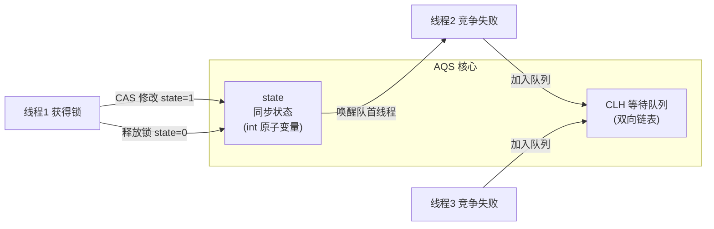

### ReentrantLock vs synchronized

| 对比项 | synchronized | ReentrantLock |
|--------|-------------|---------------|
| 实现层面 | JVM 内置 | Java 代码（AQS） |
| 可中断等待 | ❌ | ✅ `lockInterruptibly()` |
| 超时获取锁 | ❌ | ✅ `tryLock(timeout)` |
| 公平锁 | ❌ | ✅ `new ReentrantLock(true)` |
| 条件变量 | 一个（wait/notify） | 多个（Condition） |
| 自动释放 | ✅ | ❌ 必须在 finally 中 unlock |

### CAS 的 ABA 问题

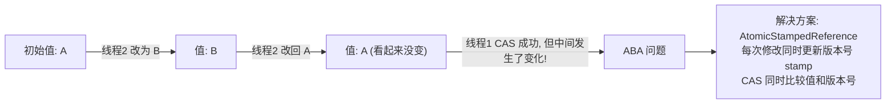

---

## 七、常见面试题速查

### JVM 相关

**Q: 什么情况下会发生 Full GC？**
- 老年代空间不足
- 元空间不足
- 调用 `System.gc()`（不保证立即执行）
- Minor GC 后对象无法放入老年代（空间担保失败）

**Q: 如何排查内存泄漏？**
1. 监控堆内存增长趋势（Prometheus + Grafana）
2. `jmap -histo:live <pid>` 查看存活对象分布
3. `jmap -dump:format=b,file=heap.hprof <pid>` 导出堆快照
4. 用 MAT（Memory Analyzer Tool）分析 Dominator Tree，找到持有大量内存的对象

### 并发相关

**Q: 为什么双重检查锁的单例需要 volatile？**

```java
public class Singleton {
    // 必须加 volatile！
    private static volatile Singleton instance;

    public static Singleton getInstance() {
        if (instance == null) {                    // 第一次检查
            synchronized (Singleton.class) {
                if (instance == null) {            // 第二次检查
                    instance = new Singleton();    // 非原子操作！
                    // 1. 分配内存
                    // 2. 初始化对象
                    // 3. 将引用指向内存
                    // 不加 volatile，步骤2和3可能被重排序
                    // 导致另一个线程拿到未初始化的对象
                }
            }
        }
        return instance;
    }
}
```

---

## 八、学习路径建议

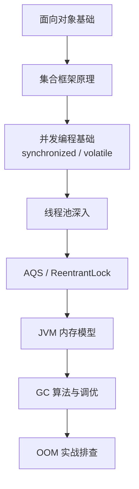

> **推荐实践**：
> 1. 手写一个线程安全的单例（双重检查锁 + volatile）
> 2. 用 `jvisualvm` 模拟一次内存泄漏并排查
> 3. 配置一个自定义线程池，测试各种拒绝策略的行为
