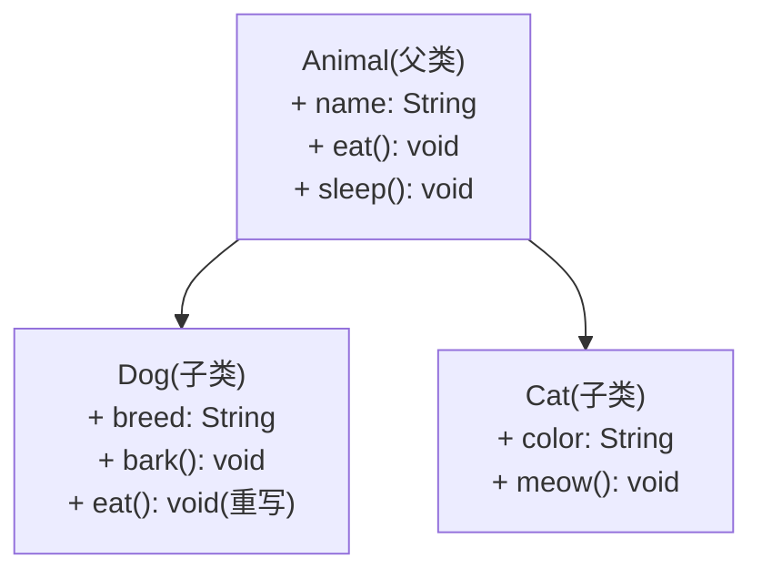
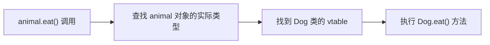
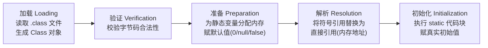
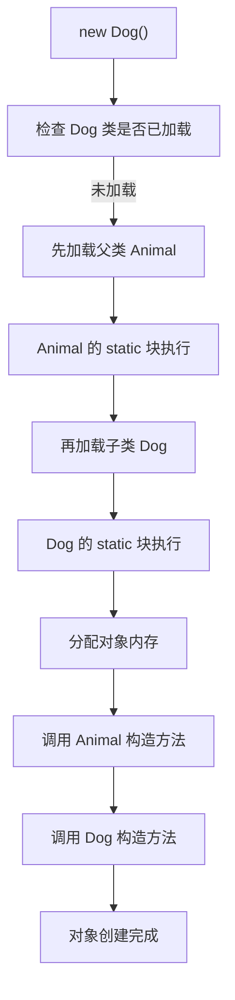
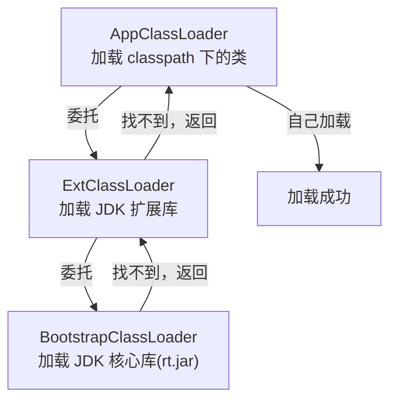
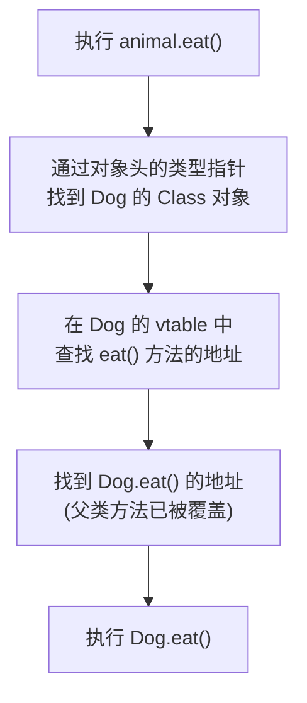
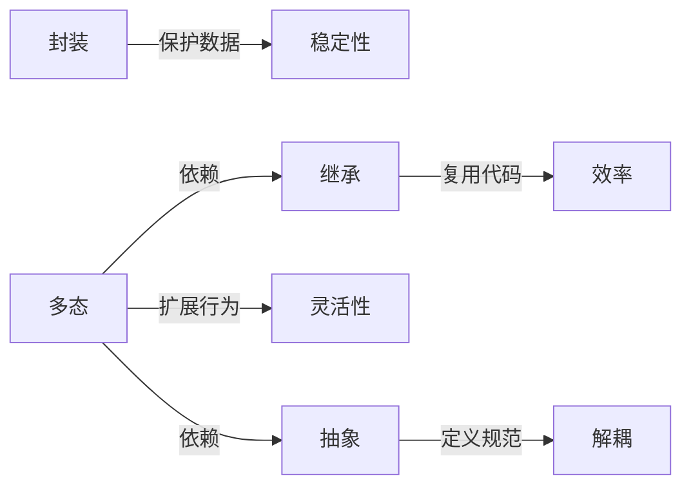

<!-- nav-start -->
---

[⬅️ 上一篇：Java 基础与 JVM 概览](00-Java基础与JVM概览.md) | [🏠 返回目录](../README.md) | [下一篇：集合框架 ➡️](02-集合框架.md)

<!-- nav-end -->

# 面向对象（OOP）

---

## 1. 引入：它解决了什么问题？

**问题背景**：早期的面向过程编程（如 C 语言）将数据和操作数据的函数分开存放。随着业务复杂度增长，代码变成一堆全局变量和函数，任何地方都能修改数据，牵一发而动全身，维护成本极高。

**面向对象解决的核心问题**：
- **代码复用性差** → 继承机制让子类复用父类逻辑
- **扩展困难** → 多态让新增功能无需修改调用方
- **数据被随意篡改** → 封装隐藏内部状态，只暴露安全接口
- **逻辑散乱** → 抽象提取共性，定义统一规范

**典型应用场景**：Spring 的 IoC 容器能替换任意 Bean 实现，正是依赖多态；MyBatis 的 Mapper 接口能自动生成实现，依赖的是接口抽象。

---

## 2. 类比：用生活模型建立直觉

把面向对象类比为**汽车制造体系**：

| OOP 概念 | 生活类比 | 映射关系 |
|---------|---------|---------|
| **类（Class）** | 汽车设计图纸 | 定义结构和行为，本身不是实体 |
| **对象（Object）** | 按图纸造出的具体汽车 | 图纸的实例化，占用实际资源 |
| **封装** | 汽车的发动机盖 | 内部复杂机构被隐藏，只暴露方向盘/油门等接口 |
| **继承** | 轿车继承汽车的基本结构 | 子类复用父类已有能力，再扩展自己的特性 |
| **多态** | 同一个"踩油门"动作，轿车加速、卡车也加速 | 同一接口，不同对象有不同的执行行为 |
| **抽象** | "交通工具"这个概念 | 提取共性，不关心具体实现细节 |

> **关键直觉**：封装是"不让你乱动"，继承是"我能用你的"，多态是"叫同一个名字但做不同的事"，抽象是"只关心能做什么，不关心怎么做"。

---

## 3. 原理：逐步拆解核心机制

### 3.1 封装（Encapsulation）

**机制**：通过访问修饰符（`private`/`protected`/`public`）控制字段和方法的可见范围，配合 getter/setter 提供受控访问。

```java
public class BankAccount {
    private double balance;  // 外部不能直接修改

    public void deposit(double amount) {
        if (amount <= 0) throw new IllegalArgumentException("金额必须大于0");
        this.balance += amount;  // 内部逻辑保证数据合法性
    }

    public double getBalance() {
        return balance;  // 只读访问
    }
}
```

**因果关系**：字段设为 `private` → 外部无法绕过校验直接赋值 → 数据始终处于合法状态。

### 3.2 继承（Inheritance）

**机制**：子类通过 `extends` 关键字继承父类的非 `private` 字段和方法，并可通过 `@Override` 重写父类方法。



**执行流程**：
1. 子类对象创建时，先调用父类构造方法（`super()`）
2. 子类继承父类所有非私有成员
3. 子类可以重写（Override）父类方法，改变行为

### 3.3 多态（Polymorphism）

**机制**：父类引用指向子类对象，运行时根据对象的实际类型决定调用哪个方法（**动态分派**）。

```java
// 编译时类型是 Animal，运行时类型是 Dog
Animal animal = new Dog();
animal.eat();  // 实际调用 Dog.eat()，而不是 Animal.eat()
```

**JVM 实现原理**：每个类有一张**虚方法表（vtable）**，存储方法的实际地址。调用虚方法时，JVM 查找对象实际类型的 vtable，找到对应方法地址执行。



### 3.4 抽象（Abstraction）

**机制**：通过 `abstract class` 或 `interface` 定义规范，不提供具体实现，强制子类/实现类完成细节。

```java
// 接口：只定义"能做什么"
interface Payable {
    void pay(double amount);  // 不关心怎么付款
}

// 不同实现：各自决定"怎么做"
class AliPay implements Payable {
    public void pay(double amount) { /* 支付宝逻辑 */ }
}
class WeChatPay implements Payable {
    public void pay(double amount) { /* 微信支付逻辑 */ }
}
```

---

## 3.5 四大特性在 JVM 中的实现

### 封装的 JVM 实现

封装在 JVM 层面通过**访问控制检查**实现，发生在两个阶段：

1. **编译期**：`javac` 在编译时检查访问修饰符，违规直接报编译错误
2. **运行期**：JVM 在字节码执行时再次校验（防止绕过编译器直接操作字节码）

字节码层面，`private` 方法使用 `invokespecial` 指令调用，不参与虚方法表，无法被子类覆盖或外部调用。

### 继承的 JVM 实现：类加载机制

**类加载的触发时机**：当 JVM 第一次使用某个类时（`new`、调用静态方法、访问静态字段等），触发类加载。

**类加载的五个阶段**：



**继承时的类加载顺序**：子类加载前，父类必须先完成加载。



**双亲委派模型**：类加载器在加载类时，先委托父加载器尝试加载，父加载器无法加载时才自己加载。



**双亲委派的意义**：防止核心类被篡改。即使你自定义了一个 `java.lang.String` 类，BootstrapClassLoader 会优先加载 JDK 的 String，你的类永远不会被加载。

### 继承时的内存存储结构

对象在堆内存中的布局（以 `Dog extends Animal` 为例）：

```
┌──────────────────────────────────────────────┐
│           对象头（Object Header）              │
│  ├─ Mark Word（8字节）                         │
│  │    存储：hashCode、GC年龄、锁状态             │
│  └─ 类型指针（4/8字节）                         │
│       指向方法区中 Dog 的 Class 对象             │
├──────────────────────────────────────────────┤
│           实例数据（Instance Data）             │
│  ├─ Animal 的字段（父类字段在前）                 │
│  │    name: String（引用，4字节）                │
│  └─ Dog 的字段（子类字段在后）                    │
│       breed: String（引用，4字节）               │
├──────────────────────────────────────────────┤
│           对齐填充（Padding）                   │
│  补齐到 8 字节的整数倍                           │
└──────────────────────────────────────────────┘
```

**方法区（元空间）中的 Class 对象**存储：
- 类的元信息（类名、父类、接口列表）
- **虚方法表（vtable）**：存储所有可重写方法的实际地址
- 静态变量
- 常量池

```
方法区 - Dog 的 Class 对象
┌────────────────────────────────────────────────────┐
│  vtable（虚方法表）                                  │
│  ┌──────────────────────────────────────────────┐  │
│  │ [0] Object.toString()  → 地址A               │  │
│  │ [1] Object.hashCode()  → 地址B               │  │
│  │ [2] Animal.eat()       → Dog.eat 地址（已重写）│  │
│  │ [3] Animal.sleep()     → Animal.sleep 地址   │  │
│  │ [4] Dog.bark()         → 地址E               │  │
│  └──────────────────────────────────────────────┘  │
└────────────────────────────────────────────────────┘
```

> **关键**：vtable 中，被子类重写的方法，地址已经替换为子类的实现地址。这就是多态的底层基础。

### 多态的 JVM 实现：虚方法表与动态分派

多态通过 `invokevirtual` 字节码指令实现，执行流程：



**四种方法调用指令对比**：

| 指令 | 用途 | 是否支持多态 |
|------|------|------------|
| `invokevirtual` | 调用实例方法（虚方法） | ✅ 运行时动态分派 |
| `invokeinterface` | 调用接口方法 | ✅ 运行时动态分派 |
| `invokespecial` | 调用构造方法、private方法、super方法 | ❌ 编译期静态绑定 |
| `invokestatic` | 调用静态方法 | ❌ 编译期静态绑定 |

### 抽象的 JVM 实现

- **抽象类**：在字节码中标记 `ACC_ABSTRACT` 标志，JVM 禁止直接实例化（`new` 抽象类会抛 `InstantiationError`）
- **接口**：标记 `ACC_INTERFACE`，接口方法调用使用 `invokeinterface` 指令，JVM 在运行时查找实现类的方法
- **接口方法表（itable）**：类实现接口时，JVM 为每个接口维护一张 itable，存储接口方法到实现方法的映射

---

## 4. 特性：关键对比

### 接口 vs 抽象类

| 对比维度 | 接口（Interface） | 抽象类（Abstract Class） |
|---------|-----------------|------------------------|
| **继承限制** | 可多实现（`implements`） | 只能单继承（`extends`） |
| **字段** | 只能是 `public static final` 常量 | 可以有任意字段 |
| **构造方法** | ❌ 没有 | ✅ 有 |
| **方法实现** | Java 8+ 支持 `default` 方法 | 可以有具体方法 |
| **设计语义** | **能力契约**（"我能做什么"） | **模板骨架**（"我们有共同的基础"） |
| **典型例子** | `Serializable`、`Comparable` | `AbstractList`、`HttpServlet` |

**选择原则**：
- 定义**跨类族的能力**（如"可序列化"）→ 用接口（因为不同类族都可以实现）
- 提供**公共实现骨架**，子类只需实现差异部分 → 用抽象类

### 四大特性的关系



---

## 5. 边界：异常情况与常见误区

### ❌ 误区1：过度继承

```java
// 错误：为了复用代码而继承，但语义不对
class Stack extends ArrayList {  // Stack "是" ArrayList？语义错误！
    // 导致 Stack 暴露了 add(index, element) 等不该有的方法
}

// 正确：组合优于继承
class Stack {
    private ArrayList<Object> list = new ArrayList<>();  // 持有，而非继承
    public void push(Object item) { list.add(item); }
    public Object pop() { return list.remove(list.size() - 1); }
}
```

**原则**：继承表达的是 **"is-a"** 关系，组合表达的是 **"has-a"** 关系。不确定时优先用组合。

### ❌ 误区2：多态失效场景（深度解析）

多态在以下四种情况下**不生效**：

#### ① 字段访问（最常见误区）

```java
class Animal {
    String name = "Animal";
    String getName() { return name; }
}
class Dog extends Animal {
    String name = "Dog";  // 子类定义了同名字段（字段隐藏，不是重写）
    @Override
    String getName() { return name; }
}

Animal animal = new Dog();
System.out.println(animal.name);       // 输出：Animal（访问父类字段！）
System.out.println(animal.getName());  // 输出：Dog（方法多态生效）
```

**为什么字段不支持多态？根本原因在于 JVM 的存储结构：**

字段访问在字节码层面使用 `getfield` 指令，该指令在**编译期**就已经确定了字段的偏移量（offset）。

```
对象内存布局（Dog 对象）：
┌──────────────────────────────────────────────────────────┐
│  对象头                                                    │
├──────────────────────────────────────────────────────────┤
│  offset+0: Animal.name = "Animal"  ← animal.name 编译期绑定│
├──────────────────────────────────────────────────────────┤
│  offset+4: Dog.name = "Dog"        ← Dog 的 name 存在更后面│
└──────────────────────────────────────────────────────────┘
```

**编译器在编译 `animal.name` 时，看到 `animal` 的编译期类型是 `Animal`，直接将字段偏移量硬编码为 `Animal.name` 的偏移量。** 运行时不会再查 vtable，直接按偏移量读取内存，所以永远读到的是父类字段。

这与方法调用的本质区别：
- **方法调用**（`invokevirtual`）：编译期只记录方法名和描述符，运行时查 vtable 找实际地址 → **动态绑定**
- **字段访问**（`getfield`）：编译期直接记录字段偏移量 → **静态绑定**

**JVM 为什么这样设计字段？**
- **性能优先**：字段访问是最频繁的操作，静态绑定（直接偏移量）比动态查表快得多
- **语义清晰**：字段是数据，方法是行为。数据属于声明它的类，行为才需要多态
- **避免歧义**：如果字段也多态，父子类同名字段会产生复杂的语义问题

#### ② 静态方法（类方法）

```java
class Animal {
    static void staticMethod() { System.out.println("Animal static"); }
}
class Dog extends Animal {
    static void staticMethod() { System.out.println("Dog static"); }  // 方法隐藏，不是重写
}

Animal animal = new Dog();
animal.staticMethod();  // 输出：Animal static（多态不生效！）
```

**原因**：静态方法使用 `invokestatic` 指令，编译期直接绑定到声明类型（`Animal`），不走 vtable，与对象实例无关。

#### ③ private 方法

```java
class Animal {
    private void secret() { System.out.println("Animal secret"); }
    void callSecret() { secret(); }  // 调用自己的 private 方法
}
class Dog extends Animal {
    private void secret() { System.out.println("Dog secret"); }  // 这是新方法，不是重写！
}

Animal animal = new Dog();
animal.callSecret();  // 输出：Animal secret（调用的是 Animal.secret）
```

**原因**：`private` 方法使用 `invokespecial` 指令，不进入 vtable，子类的同名 `private` 方法是全新的方法，不构成重写关系。

#### ④ 构造方法

构造方法使用 `invokespecial` 调用，不参与多态，每个类的构造方法只能初始化自己的部分。

**多态失效场景总结**：

| 场景 | 字节码指令 | 绑定时机 | 多态 |
|------|----------|---------|------|
| 普通实例方法 | `invokevirtual` | 运行时（查 vtable） | ✅ |
| 接口方法 | `invokeinterface` | 运行时（查 itable） | ✅ |
| 字段访问 | `getfield` / `putfield` | 编译期（偏移量） | ❌ |
| 静态方法 | `invokestatic` | 编译期 | ❌ |
| private 方法 | `invokespecial` | 编译期 | ❌ |
| 构造方法 | `invokespecial` | 编译期 | ❌ |

### ❌ 误区3：接口滥用 default 方法

Java 8 引入 `default` 方法是为了**接口演化**（在不破坏已有实现的前提下给接口加新方法），不应将其当作抽象类来用。

### 边界情况：多继承冲突

```java
interface A { default void hello() { System.out.println("A"); } }
interface B { default void hello() { System.out.println("B"); } }

class C implements A, B {
    // 编译报错！必须显式重写解决冲突
    @Override
    public void hello() {
        A.super.hello();  // 明确指定调用哪个
    }
}
```

---

## 6. 设计原因：为什么这样设计？

### 为什么 Java 不支持类的多继承？

**根本原因**：多继承会引发**菱形继承问题（Diamond Problem）**。

```
    A
   / \
  B   C
   \ /
    D
```

若 B 和 C 都重写了 A 的方法，D 继承时不知道该用哪个版本，产生歧义。Java 通过**单继承 + 接口多实现**规避了这个问题，接口的 `default` 方法冲突时强制开发者显式解决。

### 为什么多态要在运行时决定？

**原因**：编译时无法确定对象的实际类型（可能来自配置文件、工厂方法、网络反序列化等），只有运行时才知道。这正是 Spring IoC 的核心价值——**编译时依赖接口，运行时注入具体实现**。

### 为什么封装要用 getter/setter 而不是直接 public？

**原因**：`public` 字段一旦暴露，调用方可以绕过任何校验直接赋值。而 setter 方法可以在赋值前加入校验逻辑，且未来修改内部存储方式（如从 `double` 改为 `BigDecimal`）时，只需修改 getter/setter，调用方代码无需变动。

---

## 7. 总结：面试标准化表达

> **面试问：Java 面向对象的四大特性是什么？**

**标准答法**：

面向对象有四大特性：**封装、继承、多态、抽象**。

- **封装**：通过访问修饰符隐藏内部实现，只暴露必要接口，防止外部随意修改内部状态，保证数据合法性。
- **继承**：子类通过 `extends` 复用父类代码，减少重复。但要注意继承表达 "is-a" 关系，不确定时优先用组合。
- **多态**：父类引用指向子类对象，运行时通过虚方法表动态分派，实现"同一接口，不同行为"。这是 Spring IoC、策略模式等设计的基础。
- **抽象**：通过接口或抽象类定义规范，隐藏实现细节，让调用方面向接口编程，降低耦合。

> **面试问：接口和抽象类的区别？**

**标准答法**：

接口和抽象类都是抽象的体现，但设计语义不同：
- **接口**表达的是**能力契约**，强调"能做什么"，支持多实现，适合跨类族的能力定义，如 `Serializable`、`Comparable`。
- **抽象类**表达的是**模板骨架**，强调"有共同的基础"，只能单继承，适合提供公共实现，让子类只实现差异部分，如 `AbstractList`。

选择原则：如果是跨类族的能力，用接口；如果有公共实现要复用，用抽象类。

<!-- nav-start -->
---

[⬅️ 上一篇：Java 基础与 JVM 概览](00-Java基础与JVM概览.md) | [🏠 返回目录](../README.md) | [下一篇：集合框架 ➡️](02-集合框架.md)

<!-- nav-end -->
