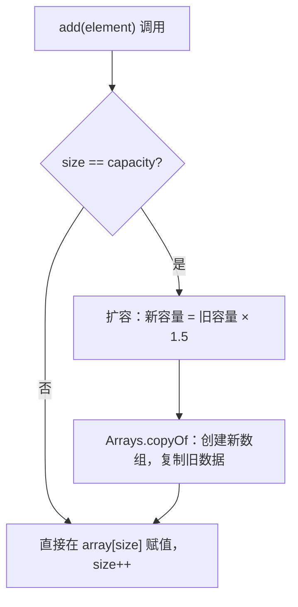
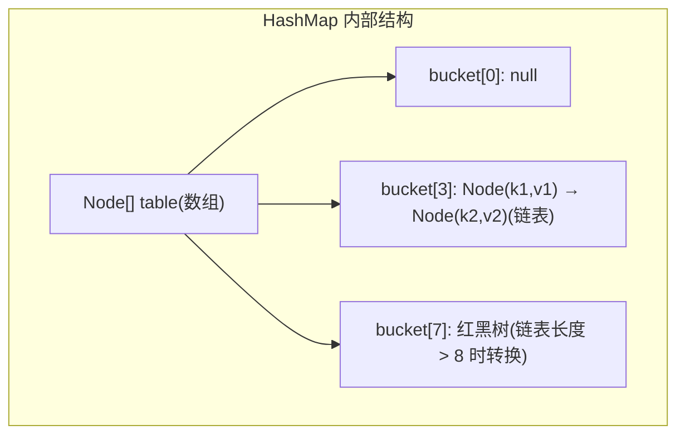
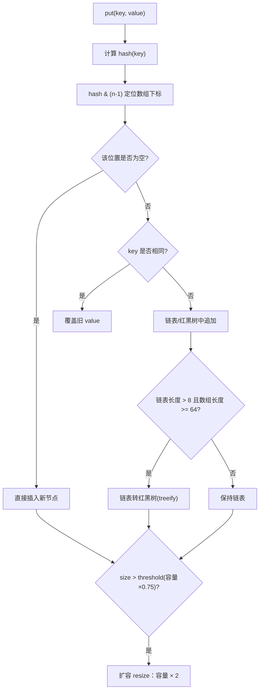
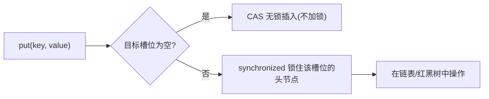

<!-- nav-start -->

---

[⬅️ 上一篇：面向对象（OOP）](01-面向对象.md) | [🏠 返回目录](../README.md) | [下一篇：并发编程（Concurrent Programming） ➡️](03-并发编程.md)

<!-- nav-end -->

# 集合框架（Collections Framework）

---

## 1. 引入：它解决了什么问题？

**问题背景**：数组是 Java 最基础的数据容器，但有两个致命缺陷：
1. **长度固定**：创建时必须指定大小，无法动态扩容
2. **功能单一**：没有查找、排序、去重等高级操作

**集合框架解决的核心问题**：
- **动态存储** → 自动扩容，无需手动管理内存
- **数据结构选型** → 提供数组、链表、红黑树、哈希表等多种底层实现
- **线程安全** → 提供并发集合，解决多线程数据竞争
- **统一接口** → `List`/`Set`/`Map` 接口让代码面向接口编程，方便切换实现

**典型应用场景**：
- 存储用户列表 → `ArrayList`（随机访问快）
- 实现消息队列 → `LinkedList`（头尾操作快）
- 统计词频 → `HashMap`（O(1) 查找）
- 排行榜 → `TreeMap`（自动有序）
- 多线程缓存 → `ConcurrentHashMap`（线程安全）

---

## 2. 类比：用生活模型建立直觉

| 集合类 | 生活类比 | 核心特征 |
|--------|---------|---------|
| **ArrayList** | 停车场（编号连续的车位） | 按编号直接找到车位（随机访问 O(1)），但插入中间需要移动所有车（O(n)） |
| **LinkedList** | 火车车厢（每节车厢记录下一节的位置） | 加减车厢只需改指针（O(1)），但找第 n 节要从头数（O(n)） |
| **HashMap** | 图书馆的书架索引卡 | 通过书名（key）的哈希值直接定位书架位置，O(1) 查找 |
| **TreeMap** | 字典（按字母排序） | 所有 key 自动有序，查找是 O(log n) |
| **HashSet** | 签到表（只记录"来过没有"） | 自动去重，底层就是 HashMap（value 是固定占位对象） |

> **关键直觉**：选集合类型时，先问自己：**"我最常做的操作是什么？"** 随机访问多 → ArrayList；增删多 → LinkedList；需要 KV 映射 → HashMap；需要有序 → TreeMap。

---

## 3. 原理：逐步拆解核心机制

### 3.1 ArrayList 动态扩容

**底层**：`Object[]` 数组 + 扩容机制



**关键数字**：
- 默认初始容量：**10**
- 每次扩容：**1.5 倍**（`oldCapacity + (oldCapacity >> 1)`）
- 扩容代价：O(n) 的数组复制，所以批量插入时建议提前 `new ArrayList<>(expectedSize)`

**为什么扩容是 1.5 倍而不是 2 倍？**

核心在于**内存复用**。新数组的容量 ≤ 之前所有废弃数组容量之和，才能复用旧内存。

假设初始容量为 1，扩容 n 次后容量为 `r^n`，之前所有废弃数组容量之和为等比数列：

```
1 + r + r² + ... + r^(n-1) = (r^n - 1) / (r - 1)
```

要满足内存复用条件：`r^n ≤ (r^n - 1) / (r - 1)`，化简后得 **r < 2**。

| 倍数 | 问题 |
|------|------|
| **= 2** | 新容量恰好等于历史内存总和，无法复用旧内存 |
| **> 2**（如 3 倍） | 新数组比所有旧内存之和还大，完全无法复用，内存碎片严重 |
| **< 1.5**（如 1.25 倍） | 扩容太频繁，每次 `Arrays.copyOf` 的 O(n) 复制开销累积过大 |
| **= 1.5** | 小于 2 可复用旧内存，又不会太频繁扩容，是工程上的最优平衡点 |

源码中 `oldCapacity >> 1` 即右移一位等于 `oldCapacity / 2`，新容量 = `oldCapacity + oldCapacity/2` = **1.5 倍**。

> 对比：Python list 扩容约 **1.125 倍**，更省内存但扩容更频繁；Go slice 小容量时扩容 **2 倍**，大容量时逐渐降低到 **1.25 倍**。

### 3.2 HashMap 底层结构（JDK 8）

**底层**：`数组 + 链表 + 红黑树`



**三种结构各自的职责**：

**① 数组（Node[] table）—— 定位桶**

数组是 HashMap 的"骨架"，每个槽位称为一个**桶（bucket）**。put 时通过 `hash & (n-1)` 将 key 映射到某个桶的下标，这一步是 O(1) 的。数组的作用就是**快速定位**：给定一个 key，立刻知道它在哪个桶里。

```
key → hash(key) → hash & (n-1) → 数组下标
"name" → 0x4e616d65 → 0x4e616d65 & 15 → 5 → table[5]
```

**② 链表 —— 解决哈希冲突**

不同的 key 可能映射到同一个桶（哈希冲突），这时用链表把冲突的节点串起来。链表的作用是**存储冲突元素**，查找时遍历链表逐一比较 key（用 `equals`）。

```
table[3] → Node("apple", 1) → Node("grape", 2) → Node("mango", 3) → null
           ↑ 三个 key 的 hash 都落在 bucket[3]，用链表串联
```

正常情况下哈希分布均匀，每个桶的链表长度很短（1~3），查询接近 O(1)。

**③ 红黑树 —— 防止链表退化**

当某个桶的链表长度超过 8（且数组长度 ≥ 64），链表转为红黑树。红黑树的作用是**兜底保障**：

- 正常情况：链表短，不需要红黑树
- 极端情况（大量 key 哈希冲突，如哈希攻击）：链表查询退化为 O(n)，红黑树将最坏情况压到 O(log n)

```
链表查询：O(n)  →  红黑树查询：O(log n)
链表长度 1000   →  红黑树高度约 20
```

> 反过来，当红黑树节点数量减少到 6 以下时，会退化回链表（维护红黑树有额外开销，节点少时链表更轻量）。

**三者协作总结**：

```
数组：O(1) 定位到桶
  └── 链表：O(k) 在桶内查找（k 为链表长度，正常很短）
        └── 红黑树：O(log k) 兜底（k 很大时才启用）
```

**put 操作流程**：



**为什么链表长度超过 8 才转红黑树？**

因为在正常的哈希分布下，链表长度超过 8 的概率极低（泊松分布约 0.00000006），转换有额外开销，所以设置阈值 8 作为平衡点。

**为什么 JDK 8 要引入红黑树？**

JDK 7 中，如果大量 key 的哈希值相同（哈希攻击），所有元素都落在同一个桶，链表查询退化为 O(n)。JDK 8 在链表长度超过 8 时转为红黑树，将最坏情况从 O(n) 降为 O(log n)，防止哈希碰撞攻击导致的性能问题。

### 3.3 ConcurrentHashMap 线程安全机制（JDK 8）

**JDK 7**：分段锁（Segment），将数组分成 16 段，每段一把锁
**JDK 8**：**CAS + synchronized**，锁粒度细化到单个数组槽位



**优势**：只有发生哈希冲突时才加锁，且锁的粒度是单个槽位，并发度远高于 JDK 7 的分段锁。

---

## 4. 特性：关键对比

### 核心集合性能对比

| 集合类 | 底层结构 | 查询 | 头部插入 | 尾部插入 | 中间插入 | 线程安全 |
|--------|---------|------|---------|---------|---------|---------|
| ArrayList | 动态数组 | O(1) | O(n) | O(1)均摊 | O(n) | ❌ |
| LinkedList | 双向链表 | O(n) | O(1) | O(1) | O(1)* | ❌ |
| HashMap | 数组+链表+红黑树 | O(1)均摊 | - | - | - | ❌ |
| TreeMap | 红黑树 | O(log n) | - | - | - | ❌ |
| ConcurrentHashMap | 数组+链表+红黑树 | O(1)均摊 | - | - | - | ✅ |

> *LinkedList 中间插入需要先遍历找到位置，实际是 O(n)

### HashMap vs TreeMap vs LinkedHashMap

> **为什么 HashMap 的负载因子默认是 0.75？**
> 这是时间与空间的权衡：负载因子越小碰撞少但空间浪费多，越大空间利用率高但链表变长查询退化。**0.75** 是经过统计分析的最优平衡点，在泊松分布下能保证大多数桶的链表长度不超过 3。

| 特性 | HashMap | TreeMap | LinkedHashMap |
|------|---------|---------|---------------|
| **顺序** | 无序 | 按 key 排序 | 插入顺序 |
| **底层** | 哈希表 | 红黑树 | 哈希表+双向链表 |
| **查询** | O(1) | O(log n) | O(1) |
| **null key** | 允许1个 | ❌ | 允许1个 |
| **适用场景** | 通用KV | 需要有序遍历 | LRU缓存 |

---

## 5. 边界：异常情况与常见误区

### ❌ 误区1：多线程使用 HashMap

```java
// 危险！多线程并发 put 可能导致：
// JDK7：扩容时头插法形成环形链表 → CPU 100%
// JDK8：数据丢失（两个线程同时写同一槽位）
Map<String, Integer> map = new HashMap<>();

// ✅ 正确：使用 ConcurrentHashMap
Map<String, Integer> map = new ConcurrentHashMap<>();
```

### ❌ 误区2：用 Hashtable 替代 ConcurrentHashMap

`Hashtable` 的所有方法都加了 `synchronized`，锁的是整个对象，并发性能极差。**现代代码应使用 `ConcurrentHashMap`**。

### ❌ 误区3：遍历时修改集合

```java
List<String> list = new ArrayList<>(Arrays.asList("a", "b", "c"));

// ❌ 抛出 ConcurrentModificationException
for (String s : list) {
    if (s.equals("b")) list.remove(s);
}

// ✅ 使用 Iterator 的 remove 方法
Iterator<String> it = list.iterator();
while (it.hasNext()) {
    if (it.next().equals("b")) it.remove();
}

// ✅ 或使用 removeIf（Java 8+）
list.removeIf(s -> s.equals("b"));
```

### ❌ 误区4：HashMap 的 key 必须正确实现 hashCode 和 equals

```java
// 如果只重写 equals 不重写 hashCode：
// 两个"相等"的对象可能落在不同的桶里，导致 get 找不到 put 进去的值！
Map<Point, String> map = new HashMap<>();
map.put(new Point(1, 2), "origin");
map.get(new Point(1, 2));  // 返回 null！（如果 Point 没重写 hashCode）
```

**规则**：`equals` 相等的对象，`hashCode` 必须相等。

### 边界：HashMap 的容量必须是 2 的幂次

HashMap 内部用 `hash & (n-1)` 代替取模运算（`hash % n`），这要求 n 必须是 2 的幂次，才能保证 `n-1` 的二进制全为 1，使散列更均匀。

---

## 6. 总结：面试标准化表达

> **面试问：HashMap 的底层原理是什么？**

**标准答法**：

HashMap 底层是**数组 + 链表 + 红黑树**（JDK 8）。

put 时，先对 key 计算 hash 值，再通过 `hash & (n-1)` 定位数组下标。如果该位置为空直接插入；如果有冲突，JDK 8 用尾插法追加到链表；当链表长度超过 8 且数组长度大于等于 64 时，链表转为红黑树，防止哈希攻击导致性能退化。

当元素数量超过 `容量 × 0.75`（负载因子）时触发扩容，容量翻倍，所有元素重新散列。

多线程下不能用 HashMap，应使用 ConcurrentHashMap。JDK 8 的 ConcurrentHashMap 用 CAS + synchronized 实现，锁粒度是单个数组槽位，并发性能远好于 JDK 7 的分段锁。

> **面试问：ArrayList 和 LinkedList 怎么选？**

**标准答法**：

- **ArrayList** 底层是动态数组，随机访问 O(1)，但中间插入/删除需要移动元素，是 O(n)。适合**读多写少、需要随机访问**的场景。
- **LinkedList** 底层是双向链表，头尾插入/删除 O(1)，但随机访问需要遍历，是 O(n)。适合**频繁在头尾操作**的场景，如实现队列或栈。

实际上，由于 CPU 缓存局部性，ArrayList 的连续内存访问比 LinkedList 的指针跳转快得多，**大多数场景 ArrayList 性能更好**，LinkedList 只在明确需要频繁头部操作时才考虑。

<!-- nav-start -->

---

[⬅️ 上一篇：面向对象（OOP）](01-面向对象.md) | [🏠 返回目录](../README.md) | [下一篇：并发编程（Concurrent Programming） ➡️](03-并发编程.md)

<!-- nav-end -->
