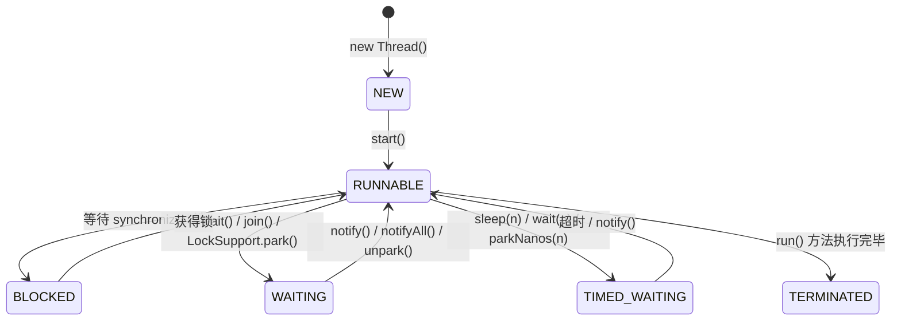
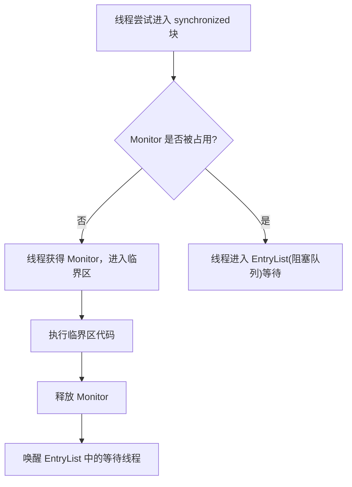
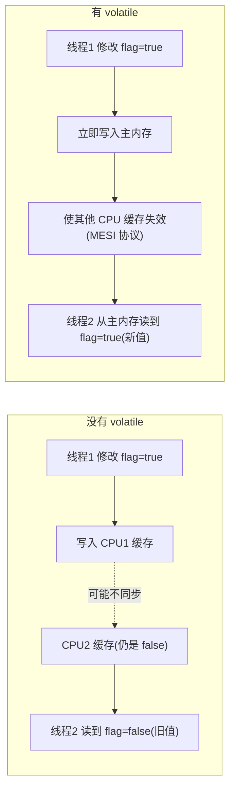
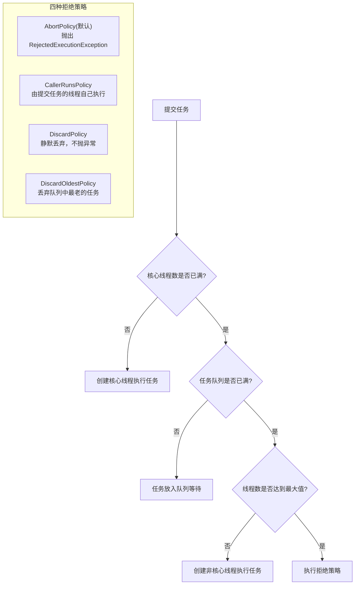
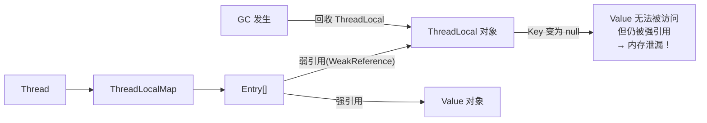

# 并发编程（Concurrent Programming）

---

## 1. 引入：它解决了什么问题？

**问题背景**：现代服务器是多核 CPU，如果程序只用单线程，大量 CPU 核心处于空闲状态，资源严重浪费。同时，很多任务天然可以并行（如同时处理多个 HTTP 请求）。

**并发编程解决的核心问题**：
- **吞吐量低** → 多线程并行处理，充分利用多核 CPU
- **响应慢** → 异步处理耗时操作（如 IO），主线程不阻塞
- **资源浪费** → 线程池复用线程，避免频繁创建销毁

**但并发引入了新问题**：
- **数据竞争**：多线程同时读写同一变量，结果不可预期
- **死锁**：多个线程互相等待对方释放锁
- **内存可见性**：一个线程修改了变量，另一个线程看不到最新值

**典型应用场景**：Web 服务器（Tomcat 每个请求一个线程）、线程池处理异步任务、并发计数器、生产者-消费者模型。

---

## 2. 类比：用生活模型建立直觉

### 线程 = 工人

把程序比作**工厂**：
- **进程** = 整个工厂（独立的内存空间）
- **线程** = 工厂里的工人（共享工厂资源，各自有自己的工作台）
- **共享变量** = 工厂的公共仓库（所有工人都能访问）
- **锁（synchronized）** = 仓库门上的锁（同一时刻只有一个工人能进入）

### synchronized = 厕所门锁

厕所只有一个坑位（临界资源），门上有锁：
- 进入时锁门（获取锁）
- 出来时开锁（释放锁）
- 其他人在门外等待（阻塞）

### volatile = 公告栏

工人修改了公共信息后，立刻贴到公告栏（主内存），其他工人看公告栏而不是自己的小本本（CPU 缓存），保证信息同步。

### 线程池 = 外包公司

每次来任务都临时招人（`new Thread()`）太慢太贵。外包公司（线程池）维护一批固定员工（核心线程），任务来了直接分配，没任务时待命，高峰期可以临时扩招（最大线程数），任务太多时放到等候区（任务队列）。

---

## 3. 原理：逐步拆解核心机制

### 3.1 线程生命周期



**关键区别**：
- `BLOCKED`：等待 `synchronized` 锁，被动等待，无法被中断
- `WAITING`：主动调用 `wait()`/`join()` 等待，可以被 `notify()` 唤醒
- `TIMED_WAITING`：有超时的等待，时间到了自动醒来

### 3.2 synchronized 的工作原理

**Monitor 是什么？**

Monitor（监视器）是 JVM 层面的同步机制，本质上是一个由 C++ 实现的 `ObjectMonitor` 对象（在 HotSpot 源码中）。每个 Java 对象在 JVM 内部都关联着一个 Monitor，其核心结构如下：

```
ObjectMonitor {
    _owner       → 当前持有锁的线程
    _count       → 重入次数（支持可重入锁）
    _EntryList   → 等待获取锁的线程队列（BLOCKED 状态）
    _WaitSet     → 调用 wait() 后等待唤醒的线程集合（WAITING 状态）
}
```

- 线程尝试加锁 → 检查 `_owner` 是否为空 → 为空则占有，否则进入 `_EntryList` 阻塞
- 同一线程重复加锁 → `_count` 递增（可重入）
- 调用 `wait()` → 线程释放锁，进入 `_WaitSet` 等待
- 调用 `notify()` → 从 `_WaitSet` 移一个线程到 `_EntryList`
- 解锁 → `_count` 递减，为 0 时释放 `_owner`，唤醒 `_EntryList` 中的线程竞争

> Monitor 是操作系统互斥量（Mutex）的封装，重量级锁阶段会通过系统调用挂起/唤醒线程，涉及用户态→内核态切换，开销较大，这也是 JDK 6 引入锁升级优化的原因。

**底层**：每个对象有一个**监视器锁（Monitor）**，synchronized 通过 `monitorenter` / `monitorexit` 字节码指令获取/释放锁。



**锁升级过程**（JDK 6 优化）：

```
无锁 → 偏向锁 → 轻量级锁（CAS自旋）→ 重量级锁（OS互斥量）
```

- **偏向锁**：只有一个线程访问时，直接在对象头记录线程 ID，无需 CAS
- **轻量级锁**：有竞争时，用 CAS 自旋尝试获取，避免线程切换
- **重量级锁**：自旋失败，升级为 OS 级别的互斥量，线程挂起

### 3.3 volatile 的两个语义

**语义1：可见性**



**语义2：禁止指令重排**

通过**内存屏障（Memory Barrier）**阻止 JIT 编译器和 CPU 对指令进行重排序，保证有序性。这是双重检查锁单例中 `volatile` 的关键作用。

### 3.4 线程池工作流程



### 3.5 ThreadLocal 内存泄漏原理



**泄漏条件**：线程池中的线程长期存活 + ThreadLocal 对象被 GC 回收 + 没有调用 `remove()`

**解决方案**：
```java
ThreadLocal<UserContext> userContext = new ThreadLocal<>();
try {
    userContext.set(new UserContext(userId));
    // 业务逻辑
} finally {
    userContext.remove();  // 必须在 finally 中清理！
}
```

---

## 4. 特性：关键对比

### synchronized vs volatile

| 对比项 | synchronized | volatile |
|--------|-------------|---------|
| **保证原子性** | ✅ 整个临界区原子 | ❌ 复合操作不原子（如 i++） |
| **保证可见性** | ✅ | ✅ |
| **保证有序性** | ✅ | ✅（禁止指令重排） |
| **性能开销** | 较大（可能涉及线程切换） | 较小（只是内存屏障） |
| **适用场景** | 复合操作、需要互斥的临界区 | 状态标志位、单次写多次读 |
| **能否解决竞态条件** | ✅ | ❌ |

**一句话区别**：`volatile` 解决可见性，`synchronized` 解决可见性 + 原子性。

### 线程池参数速查

| 参数 | 含义 | 推荐配置 |
|------|------|---------|
| `corePoolSize` | 核心线程数，长期保留 | CPU密集：CPU核数+1；IO密集：CPU核数×2 |
| `maximumPoolSize` | 最大线程数，队列满后扩展 | 根据业务峰值评估 |
| `keepAliveTime` | 非核心线程空闲存活时间 | 60秒 |
| `workQueue` | 任务队列 | `ArrayBlockingQueue`（有界，防OOM） |
| `threadFactory` | 线程工厂 | 自定义线程名，方便排查 |
| `handler` | 拒绝策略 | `CallerRunsPolicy`（不丢任务） |

---

## 5. 边界：异常情况与常见误区

### ❌ 误区1：用 Executors 创建线程池

```java
// ❌ 危险！队列长度 Integer.MAX_VALUE，可能 OOM
ExecutorService pool = Executors.newFixedThreadPool(10);

// ❌ 危险！线程数 Integer.MAX_VALUE，可能创建大量线程
ExecutorService pool = Executors.newCachedThreadPool();

// ✅ 正确：手动指定所有参数
ExecutorService pool = new ThreadPoolExecutor(
    10,                          // corePoolSize
    20,                          // maximumPoolSize
    60, TimeUnit.SECONDS,        // keepAliveTime
    new ArrayBlockingQueue<>(1000),  // 有界队列
    new ThreadFactoryBuilder().setNameFormat("order-pool-%d").build(),
    new ThreadPoolExecutor.CallerRunsPolicy()  // 拒绝策略
);
```

### ❌ 误区2：volatile 不能保证原子性

```java
volatile int count = 0;

// ❌ 多线程下 count++ 仍然不安全！
// count++ 实际是：读取 → 加1 → 写回，三步操作，不是原子的
void increment() { count++; }

// ✅ 使用 AtomicInteger
AtomicInteger count = new AtomicInteger(0);
void increment() { count.incrementAndGet(); }
```

### ❌ 误区3：死锁

```java
// 死锁的关键：两个线程加锁顺序相反！

// 线程1：先锁 lockA，再锁 lockB
synchronized (lockA) {
    synchronized (lockB) { /* ... */ }
}

// 线程2：先锁 lockB，再锁 lockA  ← 顺序相反！
// 线程1 持有 lockA 等待 lockB，线程2 持有 lockB 等待 lockA → 死锁！
synchronized (lockB) {
    synchronized (lockA) { /* ... */ }
}

// ✅ 解决：统一加锁顺序（两个线程都先锁 A 再锁 B），或使用 tryLock 超时
```

**死锁四个必要条件**：互斥、占有并等待、不可剥夺、循环等待。破坏任意一个即可解除死锁。

### 边界：sleep 和 wait 的区别

| 对比 | `Thread.sleep(n)` | `Object.wait()` |
|------|------------------|----------------|
| **释放锁** | ❌ 不释放 | ✅ 释放 |
| **唤醒方式** | 超时自动醒 | 需要 `notify()` 唤醒 |
| **使用位置** | 任意位置 | 必须在 `synchronized` 块内 |

---

## 6. 设计原因：为什么这样设计？

### 为什么 Java 内存模型（JMM）要允许 CPU 缓存？

**原因**：CPU 速度比内存快 100 倍以上，如果每次读写都直接访问主内存，CPU 大部分时间在等待内存，性能极差。CPU 缓存（L1/L2/L3）是必要的性能优化，但带来了多核间的缓存不一致问题，JMM 通过 `volatile`、`synchronized` 等机制让开发者显式控制可见性。

### 为什么线程池要先填满队列再扩展到最大线程数？

**原因**：线程是昂贵资源（每个线程默认占用 512KB 栈内存），应该尽量复用核心线程。队列是缓冲区，先缓冲任务，只有队列满了才说明系统真的过载，此时才扩展线程。这个设计保证了在正常负载下线程数稳定，只在突发流量时临时扩展。

### 为什么 ThreadLocal 的 key 用弱引用？

**原因**：如果 key 用强引用，当外部代码将 ThreadLocal 变量置为 null 后，ThreadLocalMap 仍然持有对 ThreadLocal 对象的强引用，导致 ThreadLocal 对象永远无法被 GC 回收。用弱引用让 ThreadLocal 对象在外部引用消失后能被 GC 回收（key 变为 null），这是一种"尽力而为"的内存保护，但 value 仍需手动 `remove()`。

---

## 7. 总结：面试标准化表达

> **面试问：synchronized 和 volatile 的区别？**

**标准答法**：

`volatile` 和 `synchronized` 都能保证可见性和有序性，但 `synchronized` 还能保证原子性，而 `volatile` 不能。

`volatile` 通过内存屏障实现：写操作后立即刷新到主内存，读操作前从主内存读取，同时禁止指令重排。适合**状态标志位**这类单次写、多次读的场景。

`synchronized` 通过 Monitor 锁实现互斥，同一时刻只有一个线程能进入临界区，适合**复合操作**（如 check-then-act）。JDK 6 后引入了锁升级机制（偏向锁→轻量级锁→重量级锁），性能大幅提升。

> **面试问：线程池的核心参数有哪些？任务提交后的执行流程是什么？**

**标准答法**：

线程池有七个核心参数：核心线程数、最大线程数、非核心线程存活时间、时间单位、任务队列、线程工厂、拒绝策略。

任务提交流程：先判断核心线程是否已满，未满则创建核心线程执行；核心线程满了则放入任务队列；队列满了则创建非核心线程；非核心线程也满了则执行拒绝策略。

要注意不能用 `Executors` 工厂方法，因为 `newFixedThreadPool` 的队列是无界的，`newCachedThreadPool` 的线程数无上限，都可能导致 OOM。应该手动创建 `ThreadPoolExecutor` 并指定有界队列。
