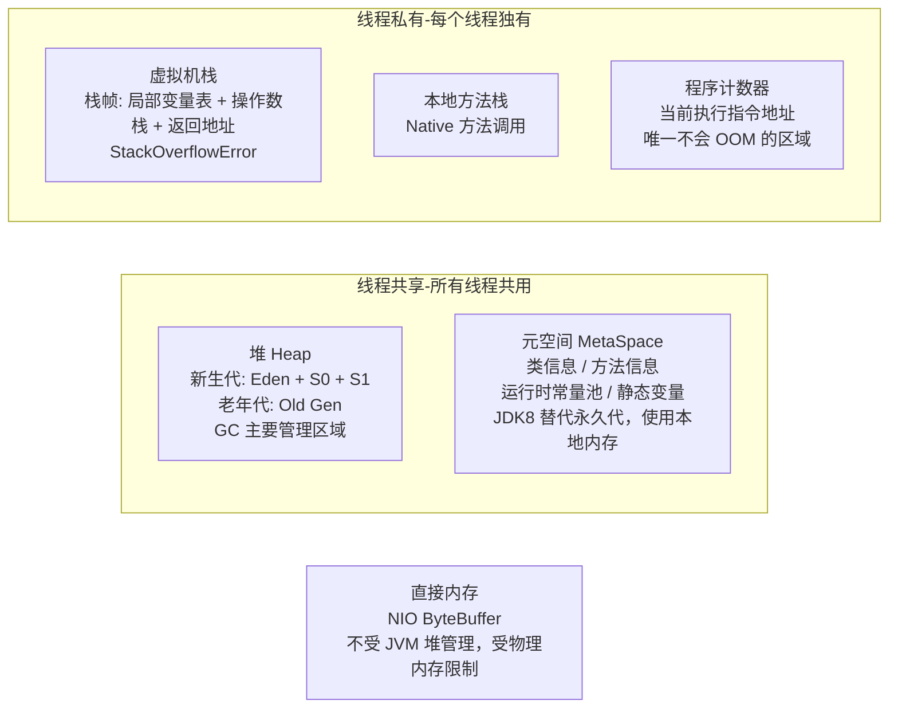
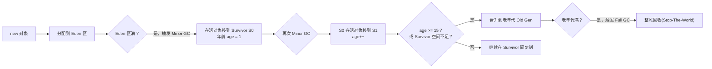
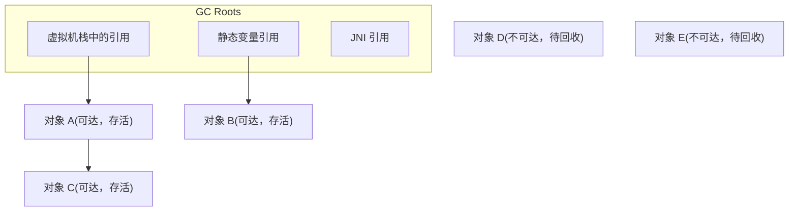
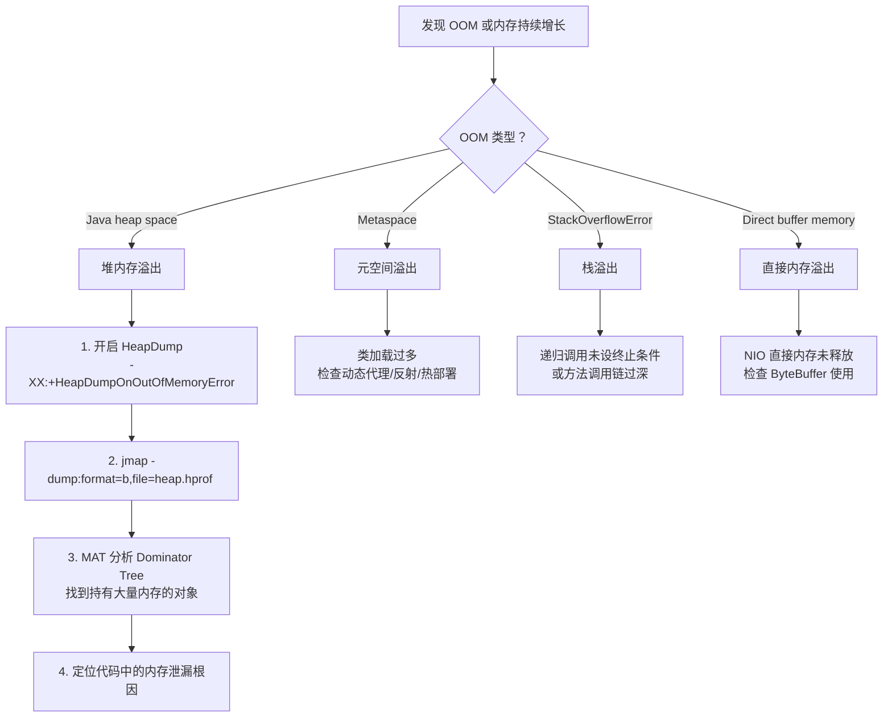

<!-- nav-start -->

---

[⬅️ 上一篇：并发编程（Concurrent Programming）](03-并发编程.md) | [🏠 返回目录](../README.md) | [下一篇：异常处理（Exception Handling） ➡️](05-异常处理.md)

<!-- nav-end -->

# JVM 内存结构与 GC

---

## 1. 引入：它解决了什么问题？

**问题背景**：Java 程序运行在 JVM（Java Virtual Machine）之上，JVM 负责管理程序的内存分配和回收。如果不理解 JVM，遇到以下问题将无从下手：

- **OOM（OutOfMemoryError）**：程序崩溃，不知道是哪里内存泄漏
- **频繁 Full GC**：系统每隔几分钟停顿几秒，用户体验极差
- **CPU 100%**：GC 线程占满 CPU，业务线程无法执行
- **响应时间抖动**：偶发性的长时间停顿（GC Stop-The-World）

**JVM 知识解决的核心问题**：
- 理解内存分区 → 知道对象存在哪里，为什么会 OOM
- 理解 GC 算法 → 知道内存如何被回收，为什么会停顿
- 理解 GC 收集器 → 能根据业务场景选择合适的 GC 策略
- 掌握排查工具 → 能定位和解决线上内存问题

---

## 2. 类比：用生活模型建立直觉

### JVM 内存 = 办公室空间

把 JVM 比作一个**办公室**：

| JVM 区域 | 办公室类比 | 特征 |
|---------|----------|------|
| **堆（Heap）** | 公共办公区（所有人共用） | 存放所有对象，GC 主要管理这里 |
| **虚拟机栈（Stack）** | 每个员工的私人工作台 | 每个线程独有，存放局部变量和方法调用 |
| **元空间（MetaSpace）** | 公司的规章制度手册 | 存放类的定义信息，不在堆里 |
| **程序计数器（PC）** | 员工的工作进度便签 | 记录当前执行到哪行代码 |
| **直接内存** | 公司租用的外部仓库 | 不受 JVM 管理，NIO 使用 |

### GC = 保洁员

- **Minor GC**：每天打扫新生代（年轻区），频率高，速度快
- **Full GC**：大扫除，整个办公室都清理，耗时长，期间所有人停工（Stop-The-World）

### 分代收集 = 物品分区管理

- **新生代**：新买的物品，大部分很快就不用了（大多数对象朝生夕死）→ 用复制算法，快速清理
- **老年代**：用了很久的物品，不常清理 → 用标记整理，减少碎片

---

## 3. 原理：逐步拆解核心机制

### 3.1 JVM 内存分区详解

### 3.2 对象的生命周期（分代收集）

**关键数字**：
- 默认晋升年龄阈值：**15**（可通过 `-XX:MaxTenuringThreshold` 调整）
- Eden : S0 : S1 = **8 : 1 : 1**（默认比例）
- 大对象（超过 `-XX:PretenureSizeThreshold`）直接进入老年代

### 3.3 GC 算法原理

**标记阶段**：从 GC Roots（栈中引用、静态变量、JNI 引用）出发，标记所有可达对象。

**三种回收算法对比**：

| 算法 | 步骤 | 优点 | 缺点 | 适用区域 |
|------|------|------|------|---------|
| **标记-清除** | 标记存活对象 → 清除未标记 | 简单 | 产生内存碎片 | 老年代 |
| **标记-整理** | 标记 → 将存活对象移到一端 → 清理边界外 | 无碎片 | 移动对象开销大 | 老年代 |
| **复制算法** | 将存活对象复制到另一半空间 | 无碎片、速度快 | 空间利用率 50% | 新生代 |

### 3.4 G1 vs CMS 收集器

**CMS（Concurrent Mark Sweep）**

**G1（Garbage First）**

| 对比项 | CMS | G1 |
|--------|-----|-----|
| **设计目标** | 最短停顿时间 | 可预测的停顿时间 |
| **内存碎片** | 有（标记-清除） | 无（标记-整理） |
| **适用堆大小** | 中小堆（< 6GB） | 大堆（> 6GB） |
| **JDK 版本** | JDK 9 废弃 | JDK 9+ 默认 |
| **缺点** | 并发模式失败时 Full GC 停顿极长 | 内存占用较高 |

### 3.5 OOM 排查流程

---

## 4. 特性：关键对比

### 各内存区域 OOM 类型

| 内存区域 | 异常类型 | 常见原因 |
|---------|---------|---------|
| 堆 | `OutOfMemoryError: Java heap space` | 内存泄漏、对象过多 |
| 元空间 | `OutOfMemoryError: Metaspace` | 动态生成类过多（如 CGLib） |
| 虚拟机栈 | `StackOverflowError` | 递归过深、方法调用链过长 |
| 直接内存 | `OutOfMemoryError: Direct buffer memory` | NIO 直接内存未释放 |
| 程序计数器 | **不会 OOM** | 唯一不会 OOM 的区域 |

### 常用 JVM 参数速查

| 参数 | 含义 | 示例 |
|------|------|------|
| `-Xms` | 初始堆大小 | `-Xms2g` |
| `-Xmx` | 最大堆大小 | `-Xmx4g` |
| `-Xss` | 每个线程栈大小 | `-Xss512k` |
| `-XX:MetaspaceSize` | 元空间初始大小 | `-XX:MetaspaceSize=256m` |
| `-XX:+UseG1GC` | 使用 G1 收集器 | |
| `-XX:MaxGCPauseMillis` | G1 最大停顿时间目标 | `-XX:MaxGCPauseMillis=200` |
| `-XX:+HeapDumpOnOutOfMemoryError` | OOM 时自动导出堆快照 | |

---

## 5. 边界：异常情况与常见误区

### ❌ 误区1：堆内存设置越大越好

堆内存越大，单次 Full GC 的停顿时间越长。对于延迟敏感的服务，应该：
- 使用 G1 并设置 `-XX:MaxGCPauseMillis` 控制停顿时间
- 或使用 ZGC/Shenandoah（JDK 11+）实现毫秒级停顿

### ❌ 误区2：`System.gc()` 能立即触发 GC

`System.gc()` 只是**建议** JVM 进行 GC，JVM 可以忽略。生产环境应禁用：`-XX:+DisableExplicitGC`。

### ❌ 误区3：对象一定在堆上分配

JDK 6+ 引入了**逃逸分析**：如果对象不会逃逸出方法（不被外部引用），JIT 编译器可能将其分配在**栈上**，方法结束时自动回收，无需 GC。

### 边界：永久代 vs 元空间

JDK 7 及之前：方法区实现为**永久代（PermGen）**，在堆内，大小固定，容易 OOM。
JDK 8+：改为**元空间（MetaSpace）**，使用本地内存，大小默认不限制（受物理内存限制），但仍需设置上限防止无限增长。

---

## 6. 设计原因：为什么这样设计？

### 为什么要分代收集？

**基于"弱分代假说"**：大多数对象朝生夕死（如方法内的临时对象），只有少数对象长期存活。

如果不分代，每次 GC 都要扫描全堆，代价极高。分代后：
- 新生代 GC（Minor GC）只扫描新生代（约占堆的 1/3），速度快，频率高
- 老年代 GC（Major GC）只在老年代满时触发，频率低

这样大多数短命对象在 Minor GC 中就被回收，极大减少了 Full GC 的频率。

### 为什么 G1 要将堆划分为 Region？

传统收集器（CMS）的老年代是一块连续内存，回收时必须处理整个老年代，停顿时间不可控。G1 将堆划分为多个等大的 Region，每次只选择**垃圾最多的 Region** 进行回收（Garbage First），可以在有限时间内回收最多的垃圾，实现**可预测的停顿时间**。

### 为什么 JDK 8 要用元空间替换永久代？

永久代大小固定（`-XX:MaxPermSize`），在大量使用动态代理、热部署的场景下容易 OOM。元空间使用本地内存，理论上只受物理内存限制，更灵活。同时，Oracle 收购 Sun 后需要将 HotSpot 与 JRockit 合并，JRockit 没有永久代，这也是推动改变的原因之一。

---

## 7. 总结：面试标准化表达

> **面试问：JVM 内存分区有哪些？**

**标准答法**：

JVM 内存分为**线程共享**和**线程私有**两大类：

线程共享的有：**堆**（存放对象实例，分新生代和老年代，是 GC 的主要区域）和**元空间**（JDK 8 替代永久代，存放类信息、方法信息，使用本地内存）。

线程私有的有：**虚拟机栈**（每次方法调用创建一个栈帧，存放局部变量和操作数栈）、**本地方法栈**（Native 方法）、**程序计数器**（记录当前执行指令，唯一不会 OOM 的区域）。

此外还有**直接内存**，NIO 的 ByteBuffer 使用，不受 JVM 堆管理。

> **面试问：G1 和 CMS 的区别？**

**标准答法**：

CMS 是以**最短停顿时间**为目标的收集器，采用标记-清除算法，会产生内存碎片，适合中小堆。并发标记阶段与业务线程并发执行，但如果并发模式失败（老年代满了还没回收完），会退化为 Full GC，停顿时间极长。JDK 9 已废弃。

G1 是 JDK 9+ 的默认收集器，将堆划分为多个等大的 Region，优先回收垃圾最多的 Region，可以通过 `-XX:MaxGCPauseMillis` 设置停顿时间目标，实现**可预测的停顿时间**。采用标记-整理算法，无内存碎片，适合大堆（> 6GB）。

> **面试问：如何排查 OOM 问题？**

**标准答法**：

首先看 OOM 的类型：`Java heap space` 是堆溢出，`Metaspace` 是元空间溢出，`StackOverflowError` 是栈溢出。

对于堆溢出，排查步骤是：
1. 开启 `-XX:+HeapDumpOnOutOfMemoryError` 让 JVM 在 OOM 时自动导出堆快照
2. 用 `jmap -dump` 手动导出，或用 `jmap -histo:live` 快速查看存活对象分布
3. 用 MAT（Memory Analyzer Tool）分析堆快照，查看 Dominator Tree，找到持有大量内存的对象
4. 结合代码定位内存泄漏根因（常见：缓存未设上限、静态集合持有对象引用、ThreadLocal 未 remove）

<!-- nav-start -->

---

[⬅️ 上一篇：并发编程（Concurrent Programming）](03-并发编程.md) | [🏠 返回目录](../README.md) | [下一篇：异常处理（Exception Handling） ➡️](05-异常处理.md)

<!-- nav-end -->
