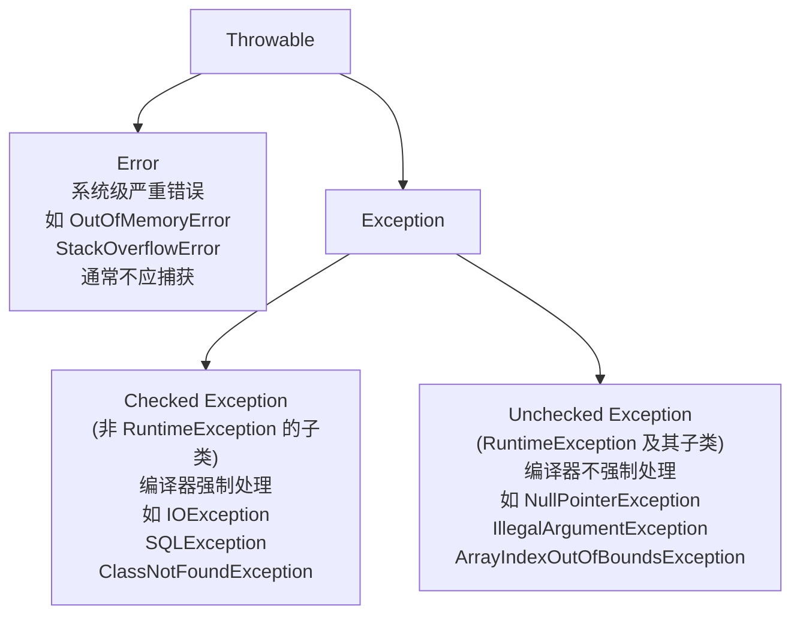
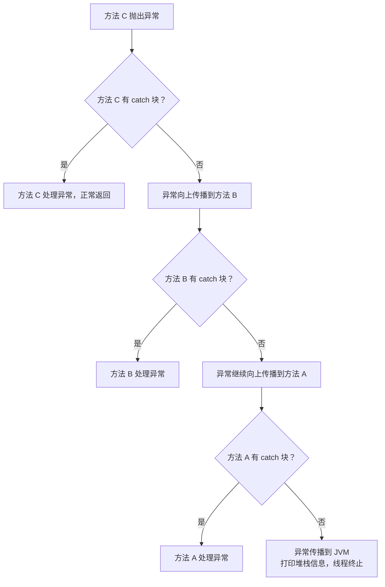

# 异常处理（Exception Handling）

---

## 1. 引入：它解决了什么问题？

**问题背景**：程序运行时不可避免地会遇到各种意外情况：文件不存在、网络超时、数据格式错误、空指针……如果没有统一的错误处理机制，程序要么直接崩溃，要么到处充斥着 `if (result == null)` 这样的防御性代码，逻辑和错误处理混在一起，极难维护。

**异常处理解决的核心问题**：
- **程序健壮性** → 遇到错误不崩溃，优雅降级或给出明确提示
- **错误信息传递** → 通过异常对象携带完整的错误上下文（堆栈信息）
- **关注点分离** → 正常逻辑和错误处理逻辑分开，代码更清晰
- **编译期检查** → Checked Exception 强制调用方处理，防止遗漏

**典型应用场景**：
- 数据库连接失败 → 抛出 `SQLException`，上层决定重试还是降级
- 用户输入非法 → 抛出 `IllegalArgumentException`，返回友好错误信息
- 业务规则违反 → 抛出自定义 `BusinessException`，统一处理

---

## 2. 类比：用生活模型建立直觉

### 异常 = 快递异常处理流程

把程序调用比作**快递配送**：

- **正常流程**：下单 → 打包 → 运输 → 签收
- **异常情况**：地址不存在（`AddressNotFoundException`）、货物损坏（`DamageException`）

**处理方式**：
- **捕获并处理（try-catch）**：快递员发现地址不存在，主动联系客户重新确认地址（就地解决）
- **向上抛出（throws）**：快递员无法处理，上报给快递站（让上层处理）
- **finally**：无论配送成功还是失败，快递员都要打卡下班（必须执行的清理工作）

### Checked vs Unchecked = 可预见 vs 不可预见

- **Checked Exception（可检查异常）**：就像出门前必须检查的事项（带钥匙、带钱包）。编译器强制你处理，因为这些情况是**可预见的**（如文件可能不存在）。
- **Unchecked Exception（运行时异常）**：就像突然下雨（`NullPointerException`）。这类问题通常是**编程错误**，应该修复代码而不是捕获异常。

---

## 3. 原理：逐步拆解核心机制

### 3.1 异常类层次结构



### 3.2 异常传播机制



### 3.3 try-catch-finally 执行顺序

```java
public int test() {
    try {
        System.out.println("try");
        return 1;
    } catch (Exception e) {
        System.out.println("catch");
        return 2;
    } finally {
        System.out.println("finally");  // 一定会执行！
        // return 3;  // ⚠️ 危险：会覆盖 try/catch 中的 return 值
    }
}
// 输出：try → finally，返回值：1
```

**关键规则**：
1. `finally` 块**一定会执行**（除非 JVM 退出或线程被强制终止）
2. `finally` 中有 `return` 会**覆盖** `try`/`catch` 中的 `return`
3. `finally` 中抛出异常会**覆盖** `try`/`catch` 中的异常

### 3.4 异常链（Exception Chaining）

```java
// 底层异常不应该被"吞掉"，应该包装后向上传递
try {
    connection = dataSource.getConnection();
} catch (SQLException e) {
    // ✅ 将原始异常作为 cause 传递，保留完整堆栈
    throw new DataAccessException("获取数据库连接失败", e);
}
```

**为什么要保留原始异常**：排查问题时需要完整的异常链，如果只抛出新异常而丢弃原始异常，根因信息就丢失了。

---

## 4. 特性：关键对比

### Checked vs Unchecked Exception

| 对比项 | Checked Exception | Unchecked Exception |
|--------|-----------------|-------------------|
| **继承关系** | `Exception` 的非 `RuntimeException` 子类 | `RuntimeException` 及其子类 |
| **编译器检查** | ✅ 必须 try-catch 或 throws 声明 | ❌ 不强制处理 |
| **设计语义** | 可预见的、可恢复的异常 | 编程错误，应修复代码 |
| **典型例子** | `IOException`、`SQLException` | `NPE`、`IllegalArgumentException` |
| **Spring 事务** | 默认**不回滚** | 默认**回滚** |

> ⚠️ **Spring 事务的坑**：`@Transactional` 默认只对 `RuntimeException` 回滚。如果方法抛出 `IOException`（Checked），事务**不会回滚**！需要显式配置：`@Transactional(rollbackFor = Exception.class)`

### 常见异常类型速查

| 异常类 | 类型 | 常见原因 |
|--------|------|---------|
| `NullPointerException` | Unchecked | 对 null 对象调用方法 |
| `ArrayIndexOutOfBoundsException` | Unchecked | 数组越界 |
| `ClassCastException` | Unchecked | 强制类型转换失败 |
| `IllegalArgumentException` | Unchecked | 方法参数非法 |
| `IllegalStateException` | Unchecked | 对象状态不合法 |
| `IOException` | Checked | IO 操作失败 |
| `SQLException` | Checked | 数据库操作失败 |
| `InterruptedException` | Checked | 线程被中断 |

---

## 5. 边界：异常情况与常见误区

### ❌ 误区1：空 catch 块（最危险的反模式）

```java
// ❌ 异常被"吞掉"，问题被掩盖，日志里没有任何记录
try {
    processOrder(orderId);
} catch (Exception e) {
    // 什么都不做
}

// ✅ 至少要记录日志
try {
    processOrder(orderId);
} catch (Exception e) {
    log.error("处理订单失败, orderId={}", orderId, e);
    throw e;  // 或者包装后重新抛出
}
```

### ❌ 误区2：捕获过宽的异常

```java
// ❌ 捕获 Exception 会把不该捕获的异常也捕获了
// 比如 RuntimeException 通常意味着编程错误，应该让它暴露
try {
    doSomething();
} catch (Exception e) {
    log.error("error", e);
}

// ✅ 精确捕获，分别处理
try {
    orderService.createOrder(orderId);
} catch (OrderNotFoundException e) {
    log.warn("订单不存在, orderId={}", orderId);
    return Result.fail("订单不存在");
} catch (StockInsufficientException e) {
    log.warn("库存不足, orderId={}", orderId);
    return Result.fail("库存不足");
}
```

### ❌ 误区3：用异常控制正常流程

```java
// ❌ 用异常做流程控制，性能差（创建异常对象需要填充堆栈信息）
try {
    int value = Integer.parseInt(str);
} catch (NumberFormatException e) {
    value = 0;  // 用异常来处理"不是数字"的情况
}

// ✅ 先校验，再操作
if (StringUtils.isNumeric(str)) {
    int value = Integer.parseInt(str);
} else {
    int value = 0;
}
```

### ❌ 误区4：在 finally 中抛出异常

```java
// ❌ finally 中的异常会覆盖 try 中的原始异常，导致原始异常丢失
try {
    doSomething();  // 抛出 BusinessException
} finally {
    cleanup();  // 如果这里也抛出异常，BusinessException 就丢失了！
}

// ✅ finally 中的操作要做好异常处理
try {
    doSomething();
} finally {
    try {
        cleanup();
    } catch (Exception e) {
        log.error("清理资源失败", e);  // 记录但不重新抛出
    }
}
```

### 边界：try-with-resources（Java 7+）

```java
// ✅ 自动关闭资源，比手动 finally 更安全
try (Connection conn = dataSource.getConnection();
     PreparedStatement ps = conn.prepareStatement(sql)) {
    // 使用资源
} catch (SQLException e) {
    log.error("数据库操作失败", e);
}
// 无论是否异常，conn 和 ps 都会自动调用 close()
```

---

## 6. 设计原因：为什么这样设计？

### 为什么要区分 Checked 和 Unchecked Exception？

**设计意图**：
- **Checked Exception** 表示"调用方应该知道并处理的情况"。比如读文件，文件可能不存在，这是调用方必须考虑的情况，编译器强制处理防止遗漏。
- **Unchecked Exception** 表示"编程错误"。比如 `NullPointerException`，正确的做法是修复代码（做 null 检查），而不是捕获异常。如果强制捕获，反而会掩盖 Bug。

**争议**：很多现代语言（Kotlin、Scala）和框架（Spring）倾向于只用 Unchecked Exception，认为 Checked Exception 导致代码冗余（大量 try-catch 或 throws 声明），且实践中很多 Checked Exception 最终也只是被包装后重新抛出。

### 为什么 finally 一定会执行？

**设计意图**：确保资源释放（关闭文件、数据库连接、释放锁）等清理操作一定能执行，防止资源泄漏。这是 Java 在没有 RAII（C++ 的资源获取即初始化）机制下的补偿方案。Java 7 的 try-with-resources 进一步简化了这个模式。

### 为什么异常对象要携带堆栈信息？

**设计意图**：堆栈信息（Stack Trace）记录了异常发生时的完整调用链，是排查问题的关键依据。代价是创建异常对象时需要填充堆栈信息，性能开销较大，这也是为什么不应该用异常控制正常流程。

---

## 7. 总结：面试标准化表达

> **面试问：Checked Exception 和 Unchecked Exception 的区别？**

**标准答法**：

Java 异常分为两类：
- **Checked Exception**（受检异常）：继承自 `Exception` 但不是 `RuntimeException` 的子类，编译器强制要求调用方 try-catch 或 throws 声明。表示可预见的、可恢复的异常，如 `IOException`、`SQLException`。
- **Unchecked Exception**（非受检异常）：继承自 `RuntimeException`，编译器不强制处理。通常表示编程错误，应该修复代码而不是捕获，如 `NullPointerException`、`IllegalArgumentException`。

有一个重要的工作坑：Spring 的 `@Transactional` 默认只对 `RuntimeException` 回滚，如果方法抛出 Checked Exception，事务不会回滚，需要显式配置 `rollbackFor = Exception.class`。

> **面试问：异常处理有哪些最佳实践？**

**标准答法**：

1. **不要吞掉异常**：catch 块里至少要记录日志，不能空着
2. **精确捕获**：捕获具体的异常类型，而不是直接 catch Exception
3. **保留异常链**：包装异常时要把原始异常作为 cause 传入，保留完整堆栈
4. **不用异常控制流程**：异常创建有性能开销，不应用于正常的条件判断
5. **用 try-with-resources**：Java 7+ 自动关闭资源，比手动 finally 更安全
6. **finally 中不要抛出异常**：会覆盖原始异常，导致根因丢失
