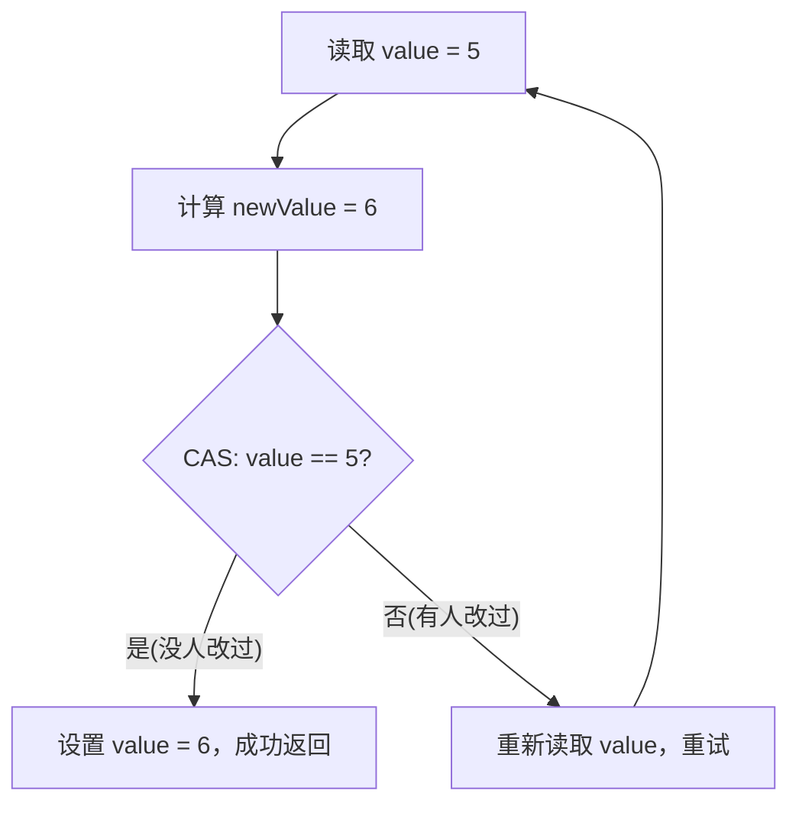
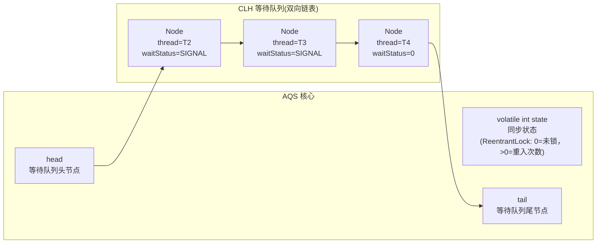
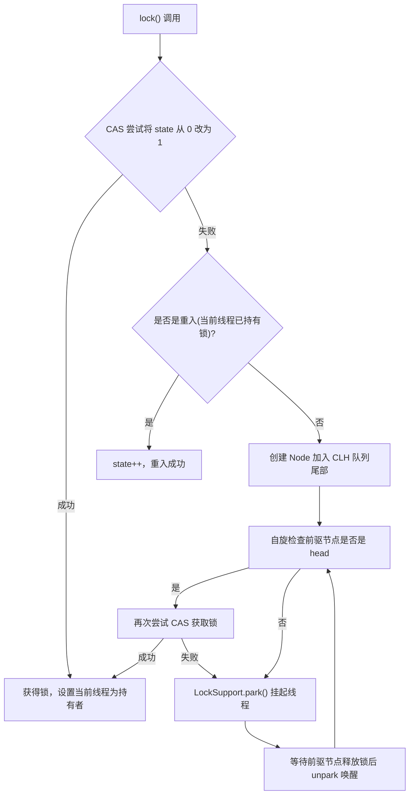
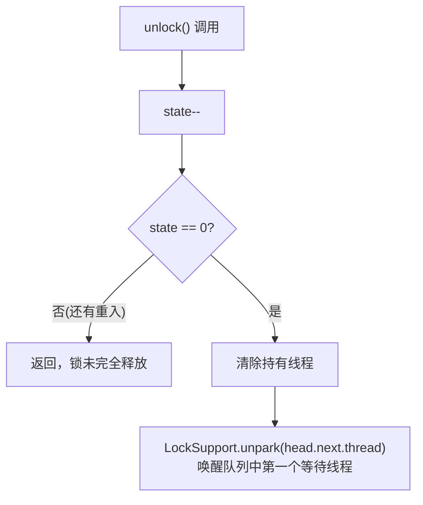
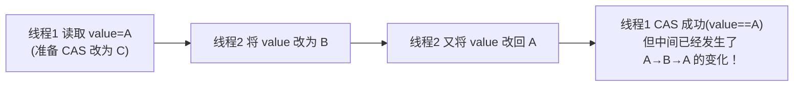

<!-- nav-start -->

---

[⬅️ 上一篇：异常处理（Exception Handling）](05-异常处理.md) | [🏠 返回目录](../README.md) | [下一篇：Lambda 表达式 ➡️](07-[Java8]Lambda表达式.md)

<!-- nav-end -->

# AQS 与 CAS

---

## 1. 引入：它解决了什么问题？

**问题背景**：`synchronized` 是 JVM 层面的重量级锁，在竞争激烈时需要将线程挂起（涉及用户态→内核态切换），性能开销大。Java 并发包（`java.util.concurrent`）需要一套**更灵活、更高性能**的同步机制。

**AQS 和 CAS 解决的核心问题**：

| 问题 | 解决方案 |
|------|---------|
| `synchronized` 不支持超时获取锁 | `ReentrantLock.tryLock(timeout)` |
| `synchronized` 不支持可中断等待 | `ReentrantLock.lockInterruptibly()` |
| `synchronized` 不支持公平锁 | `new ReentrantLock(true)` |
| `synchronized` 只有一个等待队列 | `Condition` 多个等待队列 |
| 简单计数器用锁太重 | `AtomicInteger` 基于 CAS 无锁操作 |

**典型应用场景**：
- `ReentrantLock`：需要超时、可中断、公平锁的场景
- `CountDownLatch`：等待多个线程完成（如并行查询后汇总结果）
- `Semaphore`：限流（如数据库连接池限制并发数）
- `AtomicInteger`：高并发计数器
- `ConcurrentHashMap`：JDK 8 的 put 操作用 CAS 实现无锁插入

---

## 2. 类比：用生活模型建立直觉

### AQS = 银行叫号系统

银行只有一个窗口（临界资源），客户来了先取号（加入等待队列），窗口空闲时叫号（唤醒队首线程）：

- **state（同步状态）** = 窗口是否有人在办理（0=空闲，1=占用）
- **CLH 等待队列** = 等候区的叫号队列
- **获取锁** = 取到号，走到窗口办理
- **释放锁** = 办理完毕，叫下一个号

**公平锁 vs 非公平锁**：
- **公平锁** = 严格按叫号顺序（先来先得）
- **非公平锁** = 新来的客户可以直接插队尝试（如果窗口刚好空闲就直接办理，不用排队）

### CAS = 乐观锁的"比较并交换"

就像两个人同时修改同一份 Google 文档：
- 你读取文档版本号为 v1，做了修改
- 提交时，先检查当前版本号是否还是 v1
- 如果是 v1（没人改过），提交成功，版本号变为 v2
- 如果不是 v1（别人改过了），提交失败，重新读取最新版本再修改

这就是 CAS：**Compare And Swap（比较并交换）**，不加锁，通过重试保证最终成功。

---

## 3. 原理：逐步拆解核心机制

### 3.1 CAS 原理

**CAS 是一条 CPU 原子指令**（`cmpxchg`），包含三个操作数：
- **内存地址 V**：要修改的变量
- **期望值 A**：认为变量当前应该是这个值
- **新值 B**：要设置的新值

**操作语义**：如果 V 的当前值等于 A，则将 V 设置为 B，返回 true；否则不修改，返回 false。

```java
// AtomicInteger 的 incrementAndGet 底层实现
public final int incrementAndGet() {
    for (;;) {  // 自旋重试
        int current = get();          // 读取当前值
        int next = current + 1;       // 计算新值
        if (compareAndSet(current, next))  // CAS：如果当前值还是 current，就设为 next
            return next;
        // CAS 失败说明有其他线程修改了，重新读取再试
    }
}
```



### 3.2 AQS 核心结构



**获取锁的流程**：



**释放锁的流程**：



### 3.3 CAS 的 ABA 问题



**ABA 问题的危害**：在某些场景下（如链表操作），ABA 变化可能导致数据结构损坏。

**解决方案**：`AtomicStampedReference` — 每次修改同时更新版本号（stamp），CAS 同时比较值和版本号：

```java
AtomicStampedReference<Integer> ref = new AtomicStampedReference<>(1, 0);

// 读取当前值和版本号
int[] stampHolder = new int[1];
Integer value = ref.get(stampHolder);
int stamp = stampHolder[0];

// CAS：同时比较值和版本号
ref.compareAndSet(value, newValue, stamp, stamp + 1);
// 即使值相同，版本号不同也会失败，解决 ABA 问题
```

---

## 4. 特性：关键对比

### ReentrantLock vs synchronized

| 对比项 | synchronized | ReentrantLock |
|--------|-------------|---------------|
| **实现层面** | JVM 内置关键字 | Java 代码（基于 AQS） |
| **可中断等待** | ❌ | ✅ `lockInterruptibly()` |
| **超时获取锁** | ❌ | ✅ `tryLock(timeout, unit)` |
| **公平锁** | ❌（非公平） | ✅ `new ReentrantLock(true)` |
| **多个等待队列** | ❌（一个 wait set） | ✅ 多个 `Condition` |
| **自动释放** | ✅（代码块结束自动释放） | ❌ 必须在 finally 中 `unlock()` |
| **性能** | JDK 6 后差距不大 | 高竞争场景略好 |

**选择原则**：大多数场景用 `synchronized` 即可（更简单，不会忘记释放锁）；只有需要超时、可中断、公平锁、多条件队列时才用 `ReentrantLock`。

### 常用并发工具类

| 工具类 | 基于 | 用途 | 典型场景 |
|--------|------|------|---------|
| `ReentrantLock` | AQS | 可重入互斥锁 | 替代 synchronized |
| `ReentrantReadWriteLock` | AQS | 读写锁 | 读多写少场景 |
| `CountDownLatch` | AQS | 等待 N 个事件完成 | 并行任务汇总 |
| `CyclicBarrier` | ReentrantLock | N 个线程互相等待 | 分阶段并行计算 |
| `Semaphore` | AQS | 限制并发数 | 连接池、限流 |
| `AtomicInteger` | CAS | 原子整数 | 高并发计数器 |
| `AtomicStampedReference` | CAS | 带版本号的原子引用 | 解决 ABA 问题 |

---

## 5. 边界：异常情况与常见误区

### ❌ 误区1：忘记在 finally 中释放 ReentrantLock

```java
// ❌ 如果 doSomething() 抛出异常，锁永远不会释放 → 死锁！
lock.lock();
doSomething();
lock.unlock();

// ✅ 必须在 finally 中释放
lock.lock();
try {
    doSomething();
} finally {
    lock.unlock();  // 无论是否异常，都会释放
}
```

### ❌ 误区2：CAS 自旋在高竞争下性能差

CAS 失败后会自旋重试，如果竞争非常激烈，大量线程不断自旋，会**白白消耗 CPU**。

**解决方案**：
- 高竞争场景用 `synchronized`（失败后线程挂起，不消耗 CPU）
- 或使用 `LongAdder` 替代 `AtomicLong`（分段累加，减少竞争）

### ❌ 误区3：CountDownLatch 不能重用

`CountDownLatch` 的计数器减到 0 后不能重置，如果需要重复使用，应该用 `CyclicBarrier`（可以重置）。

### 边界：AQS 的公平锁 vs 非公平锁性能

- **非公平锁**：新来的线程可以直接 CAS 抢锁，不用排队。如果恰好锁刚释放，可以直接获得，减少了线程切换，**吞吐量更高**。
- **公平锁**：严格按队列顺序，每次都要检查队列，**延迟更稳定**但吞吐量略低。

`ReentrantLock` 默认是**非公平锁**，这是性能优先的设计选择。

---

## 6. 设计原因：为什么这样设计？

### 为什么 AQS 用 CLH 队列而不是普通链表？

CLH（Craig, Landin, and Hagersten）队列是一种**自旋锁队列**，每个节点自旋等待前驱节点释放锁，而不是全局自旋。这样：
1. 每个线程只关注自己的前驱节点，减少了缓存一致性流量
2. 通过 `LockSupport.park()` 将自旋改为挂起，避免 CPU 空转
3. 双向链表支持取消等待（将节点从队列中移除）

### 为什么 CAS 是原子操作？

CAS 对应 CPU 的 `cmpxchg` 指令，在单核 CPU 上天然原子；在多核 CPU 上，通过**总线锁**或**缓存锁**（MESI 协议）保证原子性。这是硬件层面的保证，比软件锁（synchronized）的开销小得多。

### 为什么 AtomicLong 在高并发下要用 LongAdder 替代？

`AtomicLong` 所有线程竞争同一个变量，CAS 失败率高，大量自旋浪费 CPU。`LongAdder` 将值分散到多个 Cell（类似 ConcurrentHashMap 的分段思想），每个线程优先更新自己对应的 Cell，最终求和时汇总所有 Cell，大幅减少竞争。代价是读取时需要汇总，适合**写多读少**的计数场景。

---

## 7. 总结：面试标准化表达

> **面试问：AQS 的原理是什么？**

**标准答法**：

AQS（AbstractQueuedSynchronizer）是 Java 并发包的核心框架，`ReentrantLock`、`CountDownLatch`、`Semaphore` 都基于它实现。

AQS 的核心是一个 `volatile int state`（同步状态）和一个 CLH 双向等待队列。

获取锁时，线程通过 CAS 尝试修改 state（如从 0 改为 1）；失败则创建 Node 加入等待队列，并通过 `LockSupport.park()` 挂起。释放锁时，将 state 改回 0，然后 `unpark` 唤醒队列中的第一个等待线程。

`ReentrantLock` 支持重入，是通过 state 记录重入次数实现的（同一线程每次 lock state++，每次 unlock state--，减到 0 才真正释放）。

> **面试问：CAS 的 ABA 问题是什么？如何解决？**

**标准答法**：

ABA 问题是指：线程1 读取变量值为 A，此时线程2 将值改为 B，再改回 A。线程1 执行 CAS 时，发现值还是 A，认为没有变化，CAS 成功。但实际上中间已经发生了 A→B→A 的变化，在某些场景下（如链表操作）可能导致数据错误。

解决方案是使用 `AtomicStampedReference`，在每次修改时同时更新一个版本号（stamp）。CAS 时同时比较值和版本号，即使值相同，版本号不同也会失败，从而检测到 ABA 变化。

<!-- nav-start -->

---

[⬅️ 上一篇：异常处理（Exception Handling）](05-异常处理.md) | [🏠 返回目录](../README.md) | [下一篇：Lambda 表达式 ➡️](07-[Java8]Lambda表达式.md)

<!-- nav-end -->
