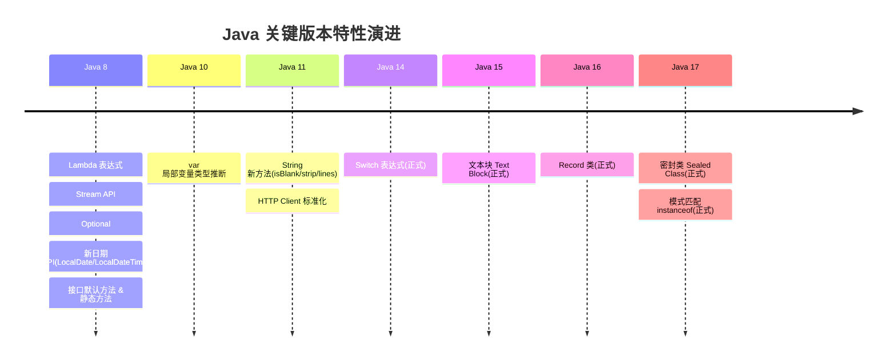

<!-- nav-start -->

---

[⬅️ 上一篇：接口默认方法与静态方法](11-[Java8]接口默认方法与静态方法.md) | [🏠 返回目录](../README.md) | [下一篇：Spring / Spring Boot 核心原理 ➡️](../02-spring/00-spring-core.md)

<!-- nav-end -->

# Java 9-17 关键新特性

---

## 1. var 类型推断（Java 10）

```java
// 编译器自动推断类型，减少冗余
var list = new ArrayList<String>();  // 推断为 ArrayList<String>
var map = new HashMap<String, Integer>(); // 推断为 HashMap<String, Integer>

// ⚠️ 注意：var 只能用于局部变量，不能用于字段、方法参数、返回值
// 原因：字段和方法签名是 API 的一部分，类型必须明确，不能依赖推断
// ❌ 错误用法
// private var name; // 编译错误
// public var getName() { return name; } // 编译错误
```

---

## 2. 文本块 Text Block（Java 15）

```java
// 传统写法：JSON 字符串拼接，转义符满天飞
String json = "{\n" +
              "  \"name\": \"Alice\",\n" +
              "  \"age\": 30\n" +
              "}";

// 文本块：所见即所得，无需转义
String json = """
        {
          "name": "Alice",
          "age": 30
        }
        """;
```

---

## 3. Record 类（Java 16）

**问题**：DTO/POJO 类需要大量样板代码（构造器、getter、equals、hashCode、toString）。

```java
// 传统 POJO（约30行）
public class Point {
    private final int x;
    private final int y;
    public Point(int x, int y) { this.x = x; this.y = y; }
    public int getX() { return x; }
    public int getY() { return y; }
    @Override public boolean equals(Object o) { ... }
    @Override public int hashCode() { ... }
    @Override public String toString() { ... }
}

// Record（1行，自动生成上述所有代码）
public record Point(int x, int y) {}

// 使用
Point p = new Point(3, 4);
System.out.println(p.x());   // 3（注意：getter 无 get 前缀）
System.out.println(p);       // Point[x=3, y=4]
```

> **Record 的本质**：不可变数据载体。所有字段 final，无 setter，天然线程安全。适合用作 DTO、值对象。
> **为什么 getter 没有 get 前缀**：Record 强调"数据"而非"行为"，`p.x()` 比 `p.getX()` 更简洁，也更接近函数式编程风格。

### Record vs 普通类对比

| 特性 | Record | 普通类 |
|------|--------|--------|
| 字段 | 自动 final | 可变 |
| 构造器 | 自动生成 | 手动编写 |
| getter | 自动生成（无 get 前缀） | 手动编写 |
| equals/hashCode | 自动生成（基于所有字段） | 手动编写 |
| 继承 | 不能继承其他类（隐式继承 Record） | 可以继承 |
| 适用场景 | 不可变数据载体（DTO/值对象） | 通用 |

---

## 4. 密封类 Sealed Class（Java 17）

```java
// 密封类：精确控制哪些类可以继承
// 为什么这样设计：配合模式匹配，编译器能穷举所有子类，无需 default 分支
public sealed class Shape permits Circle, Rectangle, Triangle {}

public final class Circle extends Shape { private final double radius; }
public final class Rectangle extends Shape { private final double width, height; }

// 配合模式匹配 instanceof 使用
double area = switch (shape) {
    case Circle c    -> Math.PI * c.radius() * c.radius();
    case Rectangle r -> r.width() * r.height();
    case Triangle t  -> 0.5 * t.base() * t.height();
    // 编译器知道 Shape 只有这三种子类，无需 default！
};
```

---

## 5. Switch 表达式（Java 14）

```java
// 传统 switch 语句（容易忘记 break，fall-through 问题）
int day = 3;
String dayName;
switch (day) {
    case 1: dayName = "Monday"; break;
    case 2: dayName = "Tuesday"; break;
    default: dayName = "Other"; break;
}

// Switch 表达式（Java 14+，箭头语法，无 fall-through）
String dayName = switch (day) {
    case 1 -> "Monday";
    case 2 -> "Tuesday";
    default -> "Other";
};
```

---

## 6. 模式匹配 instanceof（Java 17）

```java
// 传统写法：先 instanceof 判断，再强制转型
if (obj instanceof String) {
    String s = (String) obj; // 重复类型信息
    System.out.println(s.length());
}

// 模式匹配（Java 16+）：判断和转型合并
if (obj instanceof String s) {
    System.out.println(s.length()); // s 已经是 String 类型
}
```

---

## 7. Java 版本特性演进图



---

## 8. 面试高频问题

**Q：Record 和普通类有什么区别？**
> Record 是不可变数据载体，自动生成构造器、getter（无 get 前缀）、equals/hashCode/toString，所有字段 final，不能继承其他类。适合 DTO、值对象等不需要可变状态的场景。

**Q：密封类有什么用？**
> 密封类精确控制哪些类可以继承它，配合模式匹配 switch 使用时，编译器能穷举所有子类，无需 default 分支，提高代码安全性和可维护性。

**Q：var 关键字有什么限制？**
> `var` 只能用于局部变量，不能用于字段、方法参数、返回值。原因是字段和方法签名是 API 的一部分，类型必须明确，不能依赖编译器推断。

---

## 9. 工作中常见坑

### ❌ 坑1：var 降低代码可读性

```java
// ❌ 可读性差：看不出 result 是什么类型
var result = service.process(data);
var list = getItems();

// ✅ 类型明显时用 var，类型不明显时写出来
var list = new ArrayList<String>();  // 右边已经很清楚了，OK
var entry = map.entrySet().iterator().next(); // 类型很长，var 合适

// ❌ 不要在 Lambda 参数中用 var（Java 11 支持，但通常没必要）
list.stream().filter((var s) -> s.length() > 3); // 多此一举
list.stream().filter(s -> s.length() > 3);       // 更简洁
```

### ❌ 坑2：Record 与 JPA/MyBatis 的兼容问题

```java
// ❌ 问题：JPA 要求实体类有无参构造器，Record 没有无参构造器
@Entity
public record User(Long id, String name) {} // JPA 无法实例化！

// ✅ 方案1：JPA 实体类用普通类，DTO 用 Record
@Entity
public class UserEntity { ... } // 实体类用普通类

public record UserDTO(Long id, String name) {} // DTO 用 Record

// ✅ 方案2：MyBatis 可以配合 Record 使用（需要 MyBatis 3.5.5+）
// MyBatis 会通过全参构造器创建 Record 实例
@Mapper
public interface UserMapper {
    @Select("SELECT id, name FROM user WHERE id = #{id}")
    UserDTO findById(Long id); // MyBatis 自动映射到 Record
}
```

### ❌ 坑3：Switch 表达式的 yield 关键字

```java
// ❌ 错误：Switch 表达式中需要返回值时，不能用 return，要用 yield
String result = switch (status) {
    case 1 -> "活跃";
    case 2 -> {
        String msg = "已禁用";
        return msg; // 编译错误！Switch 表达式中不能用 return
    }
    default -> "未知";
};

// ✅ 正确：用 yield 返回值
String result = switch (status) {
    case 1 -> "活跃";
    case 2 -> {
        String msg = "已禁用";
        yield msg; // 用 yield 返回值
    }
    default -> "未知";
};
```

### ❌ 坑4：密封类与反射/序列化

```java
// ⚠️ 注意：密封类的子类必须在同一个编译单元（同一个文件或同一个包）
// 不能在运行时动态添加子类（反射创建子类会失败）
public sealed class Shape permits Circle, Rectangle {}

// ❌ 运行时无法通过反射创建新的子类
// 这正是密封类的设计目的：穷举所有可能的子类型

// ⚠️ 序列化注意：密封类的子类如果需要序列化，每个子类都要实现 Serializable
public final class Circle extends Shape implements Serializable {
    private final double radius;
    // ...
}
```

### ❌ 坑5：文本块的缩进处理

```java
// ⚠️ 文本块的缩进：结束的 """ 位置决定了缩进的基准
String json1 = """
        {
          "name": "Alice"
        }
        """; // 结束 """ 与内容对齐，内容没有额外缩进

String json2 = """
        {
          "name": "Alice"
        }
"""; // 结束 """ 在最左边，内容保留所有缩进（8个空格）

// ⚠️ 文本块末尾的换行：结束 """ 单独一行时，字符串末尾有换行符
// 如果不想要末尾换行，把 """ 放在最后一行内容的末尾
String noTrailingNewline = """
        Hello"""; // 没有末尾换行
```

<!-- nav-start -->

---

[⬅️ 上一篇：接口默认方法与静态方法](11-[Java8]接口默认方法与静态方法.md) | [🏠 返回目录](../README.md) | [下一篇：Spring / Spring Boot 核心原理 ➡️](../02-spring/00-spring-core.md)

<!-- nav-end -->
