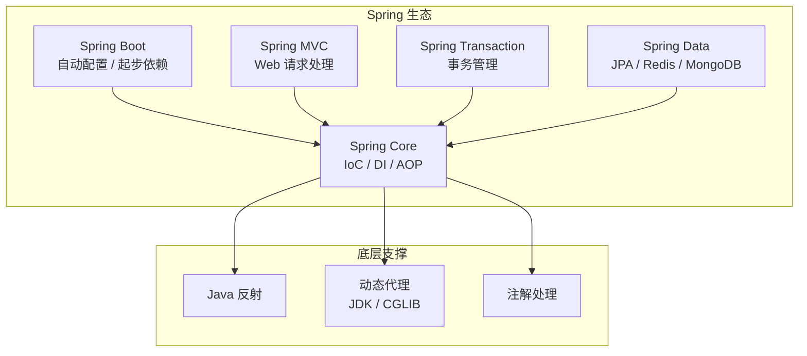

<!-- nav-start -->
---

[⬅️ 上一篇：Spring 核心概览](00-spring-core.md) | [🏠 返回目录](../README.md) | [下一篇：Bean 生命周期 ➡️](02-Bean生命周期.md)

<!-- nav-end -->

# IoC 与 DI —— 控制反转与依赖注入

---

## 1. 引入：它解决了什么问题？

**问题背景**：没有 Spring 时，Java 企业开发面临三大痛点：

| 痛点 | 具体表现 | Spring 的解决方案 |
|------|---------|----------------|
| **对象强耦合** | `new UserRepositoryImpl()` 写死实现，换实现要改所有调用方 | IoC 容器统一管理对象，面向接口编程 |
| **横切逻辑重复** | 日志、事务、权限代码散落在每个方法里 | AOP 集中管理横切关注点 |
| **配置繁琐** | XML 配置几百行，依赖版本冲突频繁 | Spring Boot 自动配置，约定优于配置 |

**不理解 Spring 原理会导致的线上问题**：
- `@Transactional` 加了但事务不回滚（同类调用绕过代理）
- AOP 切面不生效（`this.method()` 绕过代理对象）
- 循环依赖报错，不知道为什么构造器注入会失败
- 自动配置不生效，不知道如何 debug

---

## 2. 类比：用生活模型建立直觉

把 Spring 容器类比为**物业公司**：

| Spring 概念 | 生活类比 | 映射关系 |
|------------|---------|---------|
| **IoC 容器** | 物业公司 | 统一管理所有住户（Bean）的入住、维护、退出 |
| **Bean** | 住户 | 被容器管理的对象 |
| **依赖注入** | 物业帮你接通水电 | 容器负责把依赖"送到"对象手里，而非对象自己去找 |
| **AOP** | 门禁系统 | 所有人进出都经过门禁（代理），不需要每个住户自己装锁 |
| **BeanPostProcessor** | 装修验收员 | 住户入住前后，物业统一检查和增强 |

> **关键直觉**：IoC 是"我不自己找依赖，等容器送来"；AOP 是"我不在方法里写日志，让代理帮我加"。

---

## 3. 整体架构图



> **整体理解**：Spring Core 是一切的基础，IoC 容器依赖反射创建对象，AOP 依赖动态代理增强功能，Spring Boot 在 Spring 之上通过自动配置简化开发。

---

## 4. 为什么需要 IoC？

**没有 IoC 时的问题**：

```java
// 传统方式：对象自己创建依赖，高耦合
public class OrderService {
    // 直接 new，OrderService 与 UserRepositoryImpl 强耦合
    // 想换成 MockUserRepository 做测试？要改这里
    private UserRepository userRepo = new UserRepositoryImpl();
}
```

**使用 IoC 后**：

```java
// IoC 方式：依赖由容器注入，低耦合
@Service
public class OrderService {
    @Autowired
    private UserRepository userRepo; // 容器负责注入，面向接口编程
    // 测试时容器注入 MockUserRepository，业务代码不用改
}
```

> **核心思想**：对象的创建和依赖关系的管理，从"对象自己控制"转变为"由容器控制"，这就是**控制反转（IoC）**。DI（依赖注入）是 IoC 的具体实现方式。

---

## 5. 三种依赖注入方式对比

| 注入方式 | 示例 | 优点 | 缺点 | 为什么这样设计 |
|---------|------|------|------|-------------|
| **字段注入** `@Autowired` | `@Autowired private Svc svc;` | 简洁 | 无法注入 final 字段，不利于测试，隐藏依赖关系 | 方便快速开发，但牺牲了可测试性 |
| **构造器注入** | `public A(B b) { this.b = b; }` | 依赖不可变，便于测试，**Spring 官方推荐** | 循环依赖时会报错（但这反而是好事，强迫解耦） | 强制依赖在对象创建时就满足，符合"不变性"原则 |
| **Setter 注入** | `@Autowired public void setB(B b)` | 可选依赖，可重新注入 | 依赖可能为 null，不够安全 | 适合可选依赖，允许后期修改 |

> **为什么 Spring 官方推荐构造器注入**：构造器注入的依赖是 `final` 的，对象一旦创建依赖就不可变，天然线程安全；同时循环依赖会在启动时报错而非运行时 NPE，更早暴露问题。

---

## 6. BeanFactory vs ApplicationContext

| 对比项 | BeanFactory | ApplicationContext |
|--------|------------|-------------------|
| Bean 加载时机 | 懒加载（第一次 `getBean` 时才创建） | 启动时预加载所有单例 Bean |
| 功能 | 基础容器，只有 Bean 管理 | 扩展了国际化、事件发布、AOP、资源加载 |
| 适用场景 | 资源受限环境（如移动端） | 实际开发中几乎都用这个 |
| 为什么有两个 | BeanFactory 是接口，ApplicationContext 是其扩展实现 | 遵循接口隔离原则，按需使用 |

---

## 7. 面试高频问题

**Q1：Spring IoC 和 DI 的区别？**
> IoC（控制反转）是一种**设计思想**，将对象创建的控制权交给容器；DI（依赖注入）是 IoC 的**具体实现方式**，容器通过注入的方式将依赖传递给对象。二者是目标与手段的关系。

**Q2：BeanFactory 和 ApplicationContext 的区别？**
> `BeanFactory` 是最基础的容器，懒加载 Bean；`ApplicationContext` 继承了 `BeanFactory`，并扩展了国际化、事件发布、AOP 等功能，**启动时预加载所有单例 Bean**，是实际开发中使用的容器。

**Q3：Spring 中的 Bean 默认是单例的，线程安全吗？**
> **不一定安全**。单例 Bean 被所有线程共享，如果 Bean 中有**可变的成员变量**（状态），则存在线程安全问题。解决方案：① 不在 Bean 中保存状态；② 使用 `ThreadLocal`；③ 将 Bean 改为 `@Scope("prototype")`（原型模式，每次注入新实例）。

**Q4：@Resource 和 @Autowired 的区别？**
> `@Autowired` 是 Spring 注解，**按类型**注入，找到多个时再按名称；`@Resource` 是 JDK 注解，**先按名称**注入，找不到再按类型。推荐使用 `@Autowired` + `@Qualifier` 组合。

**一句话口诀**：IoC 是"容器管对象"，DI 是"容器送依赖"，BeanFactory 是基础，ApplicationContext 是增强版。

<!-- nav-start -->
---

[⬅️ 上一篇：Spring 核心概览](00-spring-core.md) | [🏠 返回目录](../README.md) | [下一篇：Bean 生命周期 ➡️](02-Bean生命周期.md)

<!-- nav-end -->
