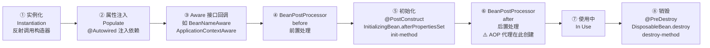

<!-- nav-start -->

---

[⬅️ 上一篇：IoC 与 DI —— 控制反转与依赖注入](01-IoC与DI.md) | [🏠 返回目录](../README.md) | [下一篇：AOP —— 面向切面编程 ➡️](03-AOP面向切面编程.md)

<!-- nav-end -->

# Bean 生命周期

---

## 1. 类比：Bean 的一生就像员工入职到离职

```
招聘（实例化）→ 培训（属性注入）→ 报到（Aware 回调）→ 入职审查（BeanPostProcessor before）
→ 上岗（初始化）→ 转正（BeanPostProcessor after，AOP 代理在此创建）→ 工作（使用中）→ 离职（销毁）
```

---

## 2. 完整生命周期流程



> **为什么 AOP 代理在第⑥步创建**：此时 Bean 已完成初始化，是一个"完整的对象"，代理包装完整对象才能正确拦截方法调用。如果在第①步就创建代理，属性还没注入，代理包装的是空壳。

---

## 3. 关键扩展点说明

| 扩展点 | 作用 | 典型应用 | 执行时机 |
|--------|------|---------|---------|
| `BeanPostProcessor` | 在初始化前后对 Bean 进行增强 | AOP 代理就是在 `postProcessAfterInitialization` 中创建的 | 每个 Bean 初始化前后 |
| `BeanFactoryPostProcessor` | 在 Bean 实例化**之前**修改 BeanDefinition | `PropertyPlaceholderConfigurer` 替换 `${...}` 占位符 | 容器启动，Bean 实例化前 |
| `@PostConstruct` | Bean 初始化完成后执行 | 初始化缓存、建立连接 | 属性注入完成后 |
| `@PreDestroy` | Bean 销毁前执行 | 释放资源、关闭连接 | 容器关闭时 |

---

## 4. 常见误区（深度分析）

### 误区1：在构造器中使用 @Autowired 注入的字段

```java
// ❌ 误区：在构造器中使用 @Autowired 注入的字段（此时还未注入）
@Component
public class MyService {
    @Autowired
    private OtherService other;

    public MyService() {
        other.doSomething(); // NullPointerException！
        // 原因：生命周期第①步（实例化）在第②步（属性注入）之前
        // 构造器执行时，@Autowired 字段还是 null
    }
}

// ✅ 正确：使用 @PostConstruct（在第⑤步执行，此时属性已注入）
@Component
public class MyService {
    @Autowired
    private OtherService other;

    @PostConstruct
    public void init() {
        other.doSomething(); // 此时依赖已注入完毕
    }
}
```

### 误区2：以为 @Scope("prototype") 的 Bean 也会执行 @PreDestroy

```java
// ❌ 误区：以为 @Scope("prototype") 的 Bean 也会执行 @PreDestroy
// 原因：Spring 不管理 prototype Bean 的销毁，容器不会调用其 @PreDestroy
// 设计原因：prototype 每次都创建新对象，Spring 无法追踪所有实例，
//           如果追踪会导致内存泄漏（持有所有 prototype 实例的引用）
@Component
@Scope("prototype")
public class PrototypeBean {
    @PreDestroy
    public void destroy() {
        // ❌ 这个方法不会被 Spring 调用！
    }
}
```

---

## 5. 工作中常见问题

| 问题现象 | 根本原因 | 解决方案 |
|---------|---------|---------|
| `@Autowired` 注入为 null | 对象不是 Spring 管理的（手动 new） | 改用 `@Component` + 注入方式获取 |
| `@PostConstruct` 中 NPE | 在构造器中使用了 `@Autowired` 字段 | 将初始化逻辑移到 `@PostConstruct` 方法中 |
| Bean 重复定义 | 多个配置类定义了同名 Bean | 使用 `@Primary` 或 `@Qualifier` 指定 |

---

## 6. 面试高频问题

**Q：Spring Bean 的生命周期是什么？**
> ① 实例化（反射调用构造器）→ ② 属性注入（@Autowired）→ ③ Aware 回调 → ④ BeanPostProcessor before → ⑤ 初始化（@PostConstruct / afterPropertiesSet / init-method）→ ⑥ BeanPostProcessor after（**AOP 代理在此创建**）→ ⑦ 使用中 → ⑧ 销毁（@PreDestroy / destroy-method）

**Q：@PostConstruct 和 init-method 的区别？**
> 两者都在属性注入完成后执行，执行顺序：`@PostConstruct` 先于 `init-method`。`@PostConstruct` 是 JSR-250 标准注解，`init-method` 是 Spring XML 配置方式，推荐使用 `@PostConstruct`。

**一句话口诀**：实例化 → 注入 → Aware → BPP前 → 初始化 → BPP后（AOP代理）→ 使用 → 销毁。

<!-- nav-start -->

---

[⬅️ 上一篇：IoC 与 DI —— 控制反转与依赖注入](01-IoC与DI.md) | [🏠 返回目录](../README.md) | [下一篇：AOP —— 面向切面编程 ➡️](03-AOP面向切面编程.md)

<!-- nav-end -->
