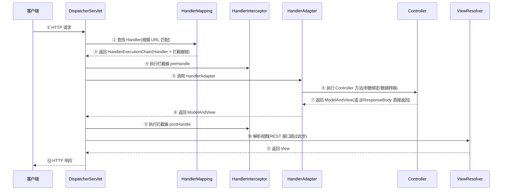

# Spring MVC 请求处理流程

---

## 1. 类比：DispatcherServlet 就像前台接待

所有来访者（HTTP 请求）都先到前台（DispatcherServlet），前台查询花名册（HandlerMapping）找到对应的接待人（Controller），安排助理（HandlerAdapter）陪同，最后整理结果（ViewResolver）反馈给来访者。

---

## 2. 完整请求处理时序



---

## 3. 关键组件职责

| 组件 | 职责 | 为什么需要它 |
|------|------|------------|
| `DispatcherServlet` | 前端控制器，所有请求的入口，负责调度 | 集中处理，避免每个 Servlet 重复实现路由逻辑 |
| `HandlerMapping` | 根据请求 URL 找到对应的 Handler | 解耦 URL 路由和业务逻辑，支持多种映射策略 |
| `HandlerAdapter` | 适配不同类型的 Handler，统一调用方式 | 适配器模式，支持 `@Controller`、`HttpRequestHandler` 等多种 Handler 类型 |
| `HandlerInterceptor` | 拦截器，在 Handler 执行前后插入逻辑 | 实现登录校验、日志记录等横切逻辑 |
| `ViewResolver` | 将逻辑视图名解析为具体 View 对象 | REST 接口不需要，前后端分离项目可忽略 |

---

## 4. 拦截器 vs 过滤器

| 对比项 | HandlerInterceptor（拦截器） | Filter（过滤器） |
|--------|---------------------------|----------------|
| 规范 | Spring MVC 特有 | Servlet 规范，与框架无关 |
| 作用范围 | 只拦截 DispatcherServlet 处理的请求 | 拦截所有请求（包括静态资源） |
| 能否访问 Spring Bean | ✅ 可以（本身就是 Spring Bean） | ❌ 不能直接访问（需要手动获取） |
| 执行时机 | Handler 执行前后（更细粒度） | 请求进入 Servlet 前后 |
| 适用场景 | 登录校验、权限控制、日志 | 字符编码、跨域处理、请求日志 |

> **为什么有了过滤器还需要拦截器**：过滤器是 Servlet 规范，无法访问 Spring 的 Bean 和 MVC 上下文；拦截器是 Spring MVC 的扩展点，可以访问 Handler 信息、ModelAndView，更适合业务层面的拦截逻辑。

---

## 5. @Controller vs @RestController

```java
// @Controller：返回视图名（传统 MVC）
@Controller
public class PageController {
    @GetMapping("/home")
    public String home(Model model) {
        model.addAttribute("user", "Tom");
        return "home"; // 返回视图名，由 ViewResolver 解析
    }
}

// @RestController = @Controller + @ResponseBody
// 返回值直接序列化为 JSON，不经过 ViewResolver
@RestController
public class ApiController {
    @GetMapping("/api/user")
    public User getUser() {
        return new User("Tom", 18); // 自动序列化为 JSON
    }
}
```

---

## 6. 面试高频问题

**Q1：Spring MVC 的请求处理流程？**
> ① 请求到达 DispatcherServlet → ② HandlerMapping 找到 Handler → ③ 执行拦截器 preHandle → ④ HandlerAdapter 调用 Controller → ⑤ 返回 ModelAndView → ⑥ 执行拦截器 postHandle → ⑦ ViewResolver 解析视图（REST 接口跳过）→ ⑧ 渲染响应。

**Q2：拦截器和过滤器的区别？**
> 过滤器是 Servlet 规范，拦截所有请求，无法访问 Spring Bean；拦截器是 Spring MVC 扩展点，只拦截 DispatcherServlet 处理的请求，可以访问 Spring Bean 和 Handler 信息，更适合业务拦截逻辑。

**一句话口诀**：DispatcherServlet 是总调度，HandlerMapping 找处理器，HandlerAdapter 适配调用，ViewResolver 解析视图，拦截器在 Handler 前后插入逻辑。
