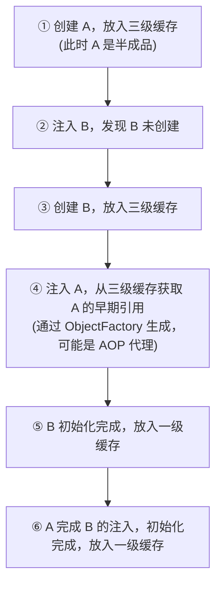

<!-- nav-start -->
---

[⬅️ 上一篇：Spring 事务管理](06-Spring事务管理.md) | [🏠 返回目录](../README.md) | [下一篇：Spring 实战应用题 ➡️](08-Spring实战应用题.md)

<!-- nav-end -->

# 循环依赖与三级缓存

---

## 1. 类比：循环依赖就像"先有鸡还是先有蛋"

A 需要 B 才能创建，B 需要 A 才能创建，互相等待，死锁。Spring 的解决方案是：**先给 A 一个"半成品"的引用**，让 B 先用着，等 A 完成初始化后，B 持有的引用自动指向完整的 A。

---

## 2. 什么是循环依赖？

```java
@Component
public class A {
    @Autowired
    private B b; // A 依赖 B
}

@Component
public class B {
    @Autowired
    private A a; // B 依赖 A → 循环！
}
```

---

## 3. 三级缓存解决原理

```
三级缓存结构：
┌──────────────────────────────────┬──────────────────────────────┐
│ 一级缓存 singletonObjects         │ 完整的 Bean（已初始化）        │
│ 二级缓存 earlySingletonObjects    │ 早期 Bean（已实例化，未初始化）│
│ 三级缓存 singletonFactories       │ Bean 工厂（可生成早期引用）    │
└──────────────────────────────────┴──────────────────────────────┘
```



> **为什么需要三级缓存而不是两级**：如果 A 有 AOP 代理，B 需要持有的是 A 的**代理对象**而非原始对象。三级缓存存的是 `ObjectFactory`（工厂），可以在需要时生成代理对象；如果只有二级缓存，存的是原始对象，B 持有的就是未被代理的 A，AOP 失效。

---

## 4. 为什么构造器注入无法解决循环依赖？

```java
// 构造器注入时，创建 A 必须先有 B，创建 B 必须先有 A
// 此时 A 还没有放入任何缓存，无法提前暴露引用 → 死锁
@Component
public class A {
    private final B b;
    public A(B b) { this.b = b; } // 构造时就需要 B，但 A 还没放入缓存
}
```

> **根本原因**：三级缓存的核心是"提前暴露未完成的 Bean 引用"，而构造器注入在实例化阶段就需要依赖，此时 Bean 还未放入任何缓存，无法提前暴露，所以无法解决。字段注入可以先创建空对象（放入缓存），再注入依赖，所以能解决。

---

## 5. 三级缓存详细说明

| 缓存 | 名称 | 存储内容 | 作用 |
|------|------|---------|------|
| 一级缓存 | `singletonObjects` | 完整的单例 Bean | 正常使用的 Bean 都从这里获取 |
| 二级缓存 | `earlySingletonObjects` | 早期暴露的 Bean（可能是代理） | 缓存从三级缓存生成的早期引用，避免重复生成 |
| 三级缓存 | `singletonFactories` | `ObjectFactory`（Bean 工厂） | 延迟生成早期引用，支持 AOP 代理 |

**查找顺序**：一级缓存 → 二级缓存 → 三级缓存（通过工厂生成后放入二级缓存）

---

## 6. 循环依赖的解决方案

| 方案 | 适用场景 | 说明 |
|------|---------|------|
| 字段注入（默认支持） | 大多数循环依赖 | Spring 三级缓存自动解决 |
| `@Lazy` 延迟注入 | 构造器注入的循环依赖 | 注入代理对象，首次使用时才真正初始化 |
| 重构解耦 | 根本解决方案 | 循环依赖往往意味着设计问题，应该重构 |

```java
// @Lazy 解决构造器注入的循环依赖
@Component
public class A {
    private final B b;
    public A(@Lazy B b) { this.b = b; } // 注入 B 的代理，首次调用时才真正初始化 B
}
```

---

## 7. 面试高频问题

**Q1：Spring 如何解决循环依赖？**
> Spring 通过三级缓存解决字段注入的循环依赖：① 创建 A 时先将 A 的 `ObjectFactory` 放入三级缓存；② 注入 B 时发现 B 未创建，开始创建 B；③ B 需要注入 A，从三级缓存获取 A 的早期引用（可能是代理）；④ B 初始化完成；⑤ A 完成 B 的注入，初始化完成。

**Q2：为什么需要三级缓存，二级缓存不够吗？**
> 如果 A 有 AOP 代理，B 需要持有 A 的代理对象。三级缓存存的是 `ObjectFactory`，可以在需要时生成代理；如果只有二级缓存，存的是原始对象，B 持有的是未被代理的 A，导致 AOP 失效。

**Q3：构造器注入为什么不能解决循环依赖？**
> 构造器注入在实例化阶段就需要依赖，此时 Bean 还未放入任何缓存，无法提前暴露引用，形成死锁。字段注入可以先创建空对象放入缓存，再注入依赖，所以能解决。

**一句话口诀**：三级缓存提前暴露半成品，一级存完整 Bean，二级存早期引用，三级存工厂（支持 AOP 代理），构造器注入无法提前暴露所以不能解决循环依赖。

<!-- nav-start -->
---

[⬅️ 上一篇：Spring 事务管理](06-Spring事务管理.md) | [🏠 返回目录](../README.md) | [下一篇：Spring 实战应用题 ➡️](08-Spring实战应用题.md)

<!-- nav-end -->
