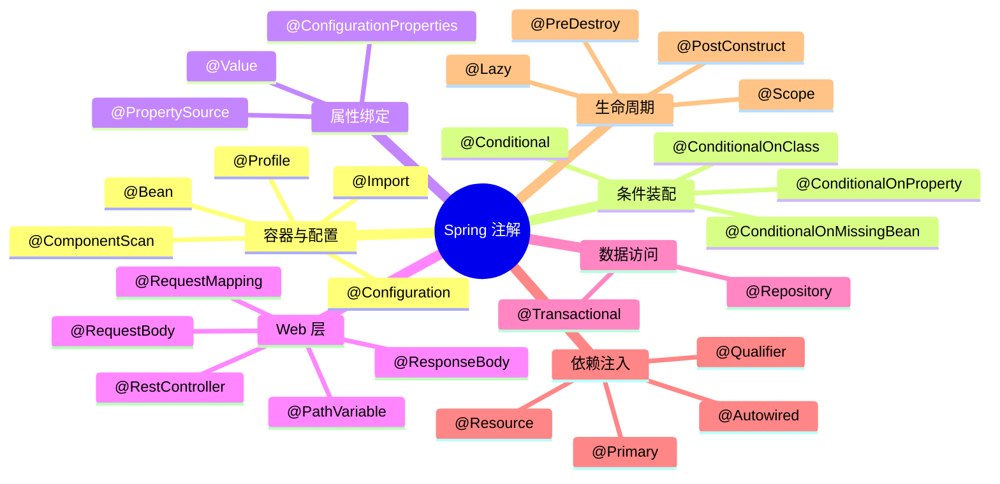

# Spring 常用注解全解

---

## 1. 注解分类总览



---

## 2. 条件装配注解

### @Conditional —— 按条件注册 Bean

```java
// 自定义条件：只有 Linux 系统才注册此 Bean
public class LinuxCondition implements Condition {
    @Override
    public boolean matches(ConditionContext context, AnnotatedTypeMetadata metadata) {
        String osName = context.getEnvironment().getProperty("os.name");
        return osName != null && osName.toLowerCase().contains("linux");
    }
}

@Bean
@Conditional(LinuxCondition.class)
public FileService linuxFileService() {
    return new LinuxFileService();
}
```

### Spring Boot 派生条件注解（面试高频）

| 注解 | 条件 | 典型场景 |
|------|------|---------|
| `@ConditionalOnClass` | 类路径存在指定类 | 有 Redis 依赖才自动配置 Redis |
| `@ConditionalOnMissingClass` | 类路径不存在指定类 | 缺少某依赖时提供默认实现 |
| `@ConditionalOnBean` | 容器中存在指定 Bean | 依赖其他 Bean 才生效 |
| `@ConditionalOnMissingBean` | 容器中不存在指定 Bean | 用户未自定义时才注册默认 Bean |
| `@ConditionalOnProperty` | 配置属性满足条件 | 开关控制功能是否启用 |
| `@ConditionalOnWebApplication` | 是 Web 应用 | Web 相关自动配置 |
| `@ConditionalOnExpression` | SpEL 表达式为 true | 复杂条件判断 |

```java
// 典型用法：用户未配置时才注册默认实现
@Bean
@ConditionalOnMissingBean(CacheManager.class)  // 用户没有自定义 CacheManager 时
@ConditionalOnProperty(name = "cache.enabled", havingValue = "true", matchIfMissing = true)
public CacheManager defaultCacheManager() {
    return new ConcurrentMapCacheManager();
}
```

---

## 3. @ConfigurationProperties —— 类型安全的属性绑定

比 `@Value` 更强大，支持批量绑定、类型转换、校验：

```yaml
# application.yml
app:
  datasource:
    url: jdbc:mysql://localhost:3306/mydb
    username: root
    password: 123456
    max-pool-size: 20
    connection-timeout: 30000
```

```java
@Data
@Component
@ConfigurationProperties(prefix = "app.datasource")
@Validated  // 开启校验
public class DataSourceProperties {
    @NotBlank
    private String url;

    @NotBlank
    private String username;

    private String password;

    @Min(1) @Max(100)
    private int maxPoolSize = 10;  // 有默认值

    private Duration connectionTimeout = Duration.ofSeconds(30);  // 支持 Duration 类型
}
```

**`@Value` vs `@ConfigurationProperties` 对比**：

| 特性 | `@Value` | `@ConfigurationProperties` |
|------|---------|---------------------------|
| 绑定方式 | 单个属性 | 批量绑定到对象 |
| 类型转换 | 基本类型 | 支持复杂类型（List、Map、Duration） |
| 松散绑定 | 不支持 | 支持（`max-pool-size` = `maxPoolSize`） |
| JSR-303 校验 | 不支持 | 支持（配合 `@Validated`） |
| SpEL 表达式 | 支持 | 不支持 |
| 适用场景 | 少量属性 | 一组相关属性 |

---

## 4. @Profile —— 多环境配置

```java
// 只在 dev 环境下注册
@Bean
@Profile("dev")
public DataSource devDataSource() {
    return new EmbeddedDatabaseBuilder()
        .setType(EmbeddedDatabaseType.H2)
        .build();
}

// 只在 prod 环境下注册
@Bean
@Profile("prod")
public DataSource prodDataSource() {
    DruidDataSource ds = new DruidDataSource();
    ds.setUrl("jdbc:mysql://prod-server:3306/mydb");
    return ds;
}
```

```yaml
# application.yml 激活 profile
spring:
  profiles:
    active: dev  # 或通过启动参数 --spring.profiles.active=prod
```

**多 Profile 文件**：
```
application.yml          # 公共配置
application-dev.yml      # 开发环境
application-test.yml     # 测试环境
application-prod.yml     # 生产环境
```

---

## 5. @Import —— 导入配置类

```java
// 方式1：直接导入配置类
@Configuration
@Import(SecurityConfig.class)
public class AppConfig { }

// 方式2：导入 ImportSelector（批量导入）
public class MyImportSelector implements ImportSelector {
    @Override
    public String[] selectImports(AnnotationMetadata metadata) {
        // 根据条件动态返回要导入的类名
        return new String[]{
            "com.example.ServiceA",
            "com.example.ServiceB"
        };
    }
}

@Configuration
@Import(MyImportSelector.class)
public class AppConfig { }

// 方式3：导入 ImportBeanDefinitionRegistrar（动态注册）
// 见 10-Spring扩展点详解.md
```

**`@Import` 是 Spring Boot 自动配置的核心**：`@EnableAutoConfiguration` → `@Import(AutoConfigurationImportSelector.class)` → 读取 `META-INF/spring/org.springframework.boot.autoconfigure.AutoConfiguration.imports` → 批量导入自动配置类。

---

## 6. @Scope —— Bean 作用域

| 作用域 | 说明 | 适用场景 |
|--------|------|---------|
| `singleton`（默认） | 整个容器只有一个实例 | 无状态的 Service、DAO |
| `prototype` | 每次获取都创建新实例 | 有状态的对象 |
| `request` | 每个 HTTP 请求一个实例 | Web 请求相关的 Bean |
| `session` | 每个 HTTP Session 一个实例 | 用户会话相关的 Bean |

```java
@Bean
@Scope("prototype")
public ShoppingCart shoppingCart() {
    return new ShoppingCart();
}

// 在单例 Bean 中注入 prototype Bean 的正确方式
@Service
public class OrderService {
    @Autowired
    private ApplicationContext context;

    public void createOrder() {
        // 每次调用都获取新的 ShoppingCart 实例
        ShoppingCart cart = context.getBean(ShoppingCart.class);
    }
}
```

> ⚠️ 注意：单例 Bean 中直接 `@Autowired` 注入 prototype Bean，只会注入一次，后续都是同一个实例，达不到 prototype 的效果。需要通过 `ApplicationContext.getBean()` 或 `@Lookup` 注解每次获取新实例。

---

## 7. @Lazy —— 延迟初始化

```java
// 类级别：整个类延迟初始化
@Component
@Lazy
public class HeavyService {
    public HeavyService() {
        System.out.println("HeavyService 初始化（第一次使用时才执行）");
    }
}

// 注入点级别：解决循环依赖
@Service
public class ServiceA {
    @Autowired
    @Lazy  // 注入代理对象，第一次调用时才真正初始化 ServiceB
    private ServiceB serviceB;
}
```

**`@Lazy` 的两个用途**：
1. **延迟初始化**：启动时不创建，第一次使用时才创建，加快启动速度
2. **解决循环依赖**：构造器注入的循环依赖，加 `@Lazy` 注入代理对象打破循环

---

## 8. @Primary 和 @Qualifier —— 解决注入歧义

```java
// 场景：有多个 DataSource Bean，注入时不知道用哪个

@Bean
@Primary  // 默认首选
public DataSource masterDataSource() { ... }

@Bean
public DataSource slaveDataSource() { ... }

// 注入时：
@Autowired  // 自动注入 masterDataSource（@Primary 标注的）
private DataSource dataSource;

@Autowired
@Qualifier("slaveDataSource")  // 明确指定注入 slaveDataSource
private DataSource readDataSource;
```

---

## 9. 面试高频问题

**Q1：@Autowired 和 @Resource 的区别？**
> `@Autowired` 是 Spring 注解，**按类型**注入，有多个同类型 Bean 时配合 `@Qualifier` 指定名称；`@Resource` 是 JDK 注解（JSR-250），**先按名称**注入，找不到再按类型，不依赖 Spring 框架。推荐用 `@Autowired` + `@Qualifier`，语义更清晰。

**Q2：@Component、@Service、@Repository、@Controller 的区别？**
> 功能上完全相同，都是将类注册为 Spring Bean。区别在于语义：`@Service` 标注业务层，`@Repository` 标注数据访问层（还会将数据库异常转换为 Spring 统一异常），`@Controller` 标注 Web 控制层（配合 `@RequestMapping` 处理请求），`@Component` 是通用注解。

**Q3：@Configuration 和 @Component 的区别？**
> `@Configuration` 类中的 `@Bean` 方法会被 CGLIB 代理，方法间互相调用会走 Spring 容器（保证单例）；`@Component` 类中的 `@Bean` 方法不被代理，方法间调用是普通 Java 调用，可能创建多个实例。

**Q4：@ConditionalOnMissingBean 的作用？**
> 当容器中不存在指定类型的 Bean 时才注册当前 Bean。这是 Spring Boot 自动配置"用户优先"原则的核心：自动配置类用 `@ConditionalOnMissingBean` 注册默认 Bean，如果用户自己定义了同类型的 Bean，自动配置就不会生效，用户的配置优先。

**Q5：如何让 Spring Boot 的自动配置不生效？**
> ① 自定义同类型的 Bean（利用 `@ConditionalOnMissingBean`）；② 在 `@SpringBootApplication` 上排除：`@SpringBootApplication(exclude = {DataSourceAutoConfiguration.class})`；③ 配置文件中设置 `spring.autoconfigure.exclude=...`。