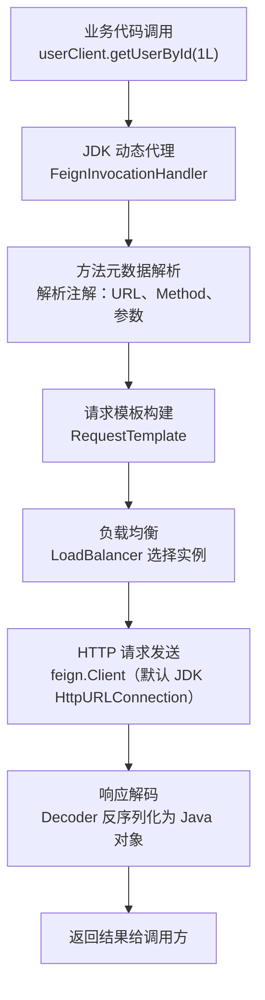

# Feign 声明式 HTTP 客户端

---

## 1. Feign 是什么？从哪来的？

**Feign** 最早由 Netflix 开源（2012 年），是一个声明式的 HTTP 客户端框架。后来 Netflix 停止维护，Spring Cloud 社区接手并推出了 **OpenFeign**，将其深度整合进 Spring Cloud 生态。

> 你在 Spring Cloud 项目里用的 `@FeignClient`，就是 **OpenFeign**，依赖坐标是 `spring-cloud-starter-openfeign`。

**它解决了什么问题？**

在微服务架构中，服务 A 需要调用服务 B 的接口。最原始的方式是用 `RestTemplate` 手写 HTTP 请求：

```java
// 原始方式：RestTemplate，繁琐且容易出错
String url = "http://user-service/users/" + userId;
UserVO user = restTemplate.getForObject(url, UserVO.class);
```

这种方式有几个问题：
- URL 硬编码，容易写错
- 参数拼接麻烦，尤其是 POST + RequestBody
- 没有类型安全，返回值需要手动转换
- 与注册中心、负载均衡的集成需要额外配置

**Feign 的解决思路**：用接口 + 注解来描述 HTTP 调用，框架自动生成实现，调用方式和调用本地方法一模一样：

```java
// Feign 方式：声明式，像调本地方法
UserVO user = userClient.getUserById(userId);
```

---

## 2. Feign 的底层原理

Feign 本质上是一个**动态代理 + HTTP 客户端**的组合。



### 关键步骤拆解

| 步骤 | 组件 | 说明 |
|------|------|------|
| **代理生成** | `FeignClientFactoryBean` | Spring 启动时扫描 `@FeignClient`，为每个接口创建动态代理 Bean |
| **方法解析** | `Contract` | 解析接口方法上的注解（`@GetMapping`、`@PathVariable` 等），生成 `MethodMetadata` |
| **请求构建** | `RequestTemplate` | 将方法参数填入 URL、Header、Body |
| **负载均衡** | `LoadBalancerClient` | 将服务名（`user-service`）解析为具体的 IP:Port |
| **HTTP 发送** | `feign.Client` | 默认用 JDK 的 `HttpURLConnection`，可替换为 OkHttp / Apache HttpClient |
| **响应解码** | `Decoder` | 默认用 Jackson 将 JSON 反序列化为 Java 对象 |

---

## 3. 快速上手

### 第一步：引入依赖

```xml
<dependency>
    <groupId>org.springframework.cloud</groupId>
    <artifactId>spring-cloud-starter-openfeign</artifactId>
</dependency>
```

### 第二步：启动类开启 Feign

```java
@SpringBootApplication
@EnableFeignClients  // 开启 Feign 客户端扫描
public class QaServiceApplication {
    public static void main(String[] args) {
        SpringApplication.run(QaServiceApplication.class, args);
    }
}
```

### 第三步：定义 Feign 接口

```java
@FeignClient(
    name = "user-service",                      // 服务名，对应注册中心的服务名
    path = "/users",                             // 公共路径前缀（可选）
    fallback = UserClientFallback.class          // 降级实现（可选）
)
public interface UserClient {

    // GET 请求，路径参数
    @GetMapping("/{id}")
    UserVO getUserById(@PathVariable("id") Long id);

    // POST 请求，请求体
    @PostMapping("/batch")
    List<UserVO> getUsersByIds(@RequestBody List<Long> ids);

    // GET 请求，查询参数
    @GetMapping("/search")
    Page<UserVO> searchUsers(@RequestParam("keyword") String keyword,
                              @RequestParam("page") int page,
                              @RequestParam("size") int size);
}
```

### 第四步：注入使用

```java
@Service
@RequiredArgsConstructor
public class QuestionService {

    private final UserClient userClient;  // 直接注入，像本地 Bean 一样使用

    public QuestionDetailVO getDetail(Long questionId) {
        Question question = questionMapper.selectById(questionId);

        // 调用用户服务，获取作者信息
        UserVO author = userClient.getUserById(question.getAuthorId());

        return QuestionDetailVO.builder()
            .question(question)
            .author(author)
            .build();
    }
}
```

---

## 4. 常用配置

```yaml
feign:
  # 替换底层 HTTP 客户端为 OkHttp（推荐，支持连接池，性能更好）
  okhttp:
    enabled: true

  # 开启请求/响应日志（调试用）
  client:
    config:
      default:                    # 全局默认配置
        connect-timeout: 1000     # 连接超时（毫秒）
        read-timeout: 5000        # 读取超时（毫秒）
        logger-level: BASIC       # 日志级别：NONE / BASIC / HEADERS / FULL

      user-service:               # 针对特定服务的配置（会覆盖 default）
        read-timeout: 3000
        logger-level: FULL        # 开发调试时用 FULL，生产用 NONE 或 BASIC

  # 开启熔断（配合 Sentinel 或 Resilience4j）
  circuitbreaker:
    enabled: true
```

### 日志级别说明

| 级别 | 输出内容 |
|------|---------|
| `NONE` | 不输出（默认，生产环境推荐） |
| `BASIC` | 请求方法、URL、响应状态码、耗时 |
| `HEADERS` | BASIC + 请求/响应头 |
| `FULL` | HEADERS + 请求/响应体（调试用） |

> **注意**：Feign 的日志基于 `DEBUG` 级别输出，还需要在 `application.yml` 中配置对应包的日志级别：
> ```yaml
> logging:
>   level:
>     com.example.client: DEBUG  # Feign 接口所在包
> ```

---

## 5. 降级处理（Fallback）

当 Feign 调用失败（超时、服务不可用、抛异常）时，执行降级逻辑，避免异常向上传播。

### 方式一：Fallback 类（只能拿到默认值，拿不到异常信息）

```java
@FeignClient(name = "user-service", fallback = UserClientFallback.class)
public interface UserClient {
    @GetMapping("/users/{id}")
    UserVO getUserById(@PathVariable Long id);
}

@Component  // 必须注册为 Spring Bean
public class UserClientFallback implements UserClient {

    @Override
    public UserVO getUserById(Long id) {
        // 返回空对象，避免 NPE
        return UserVO.builder().id(id).nickname("未知用户").build();
    }
}
```

### 方式二：FallbackFactory（推荐，可以拿到异常信息打日志）

```java
@FeignClient(name = "user-service", fallbackFactory = UserClientFallbackFactory.class)
public interface UserClient {
    @GetMapping("/users/{id}")
    UserVO getUserById(@PathVariable Long id);
}

@Component
public class UserClientFallbackFactory implements FallbackFactory<UserClient> {

    @Override
    public UserClient create(Throwable cause) {
        // cause 就是触发降级的异常
        return new UserClient() {
            @Override
            public UserVO getUserById(Long id) {
                log.error("调用用户服务失败，id={}，原因：{}", id, cause.getMessage());
                return UserVO.builder().id(id).nickname("未知用户").build();
            }
        };
    }
}
```

---

## 6. 请求拦截器（传递 Token）

微服务间调用时，经常需要把当前用户的 Token 或用户 ID 透传给下游服务。通过 `RequestInterceptor` 实现：

```java
@Component
public class FeignAuthInterceptor implements RequestInterceptor {

    @Override
    public void apply(RequestTemplate template) {
        // 从当前请求上下文中获取 Token
        ServletRequestAttributes attributes =
            (ServletRequestAttributes) RequestContextHolder.getRequestAttributes();

        if (attributes != null) {
            HttpServletRequest request = attributes.getRequest();
            String token = request.getHeader("Authorization");
            if (StringUtils.hasText(token)) {
                // 将 Token 透传给下游服务
                template.header("Authorization", token);
            }
            // 也可以透传用户 ID（由 Gateway 注入的）
            String userId = request.getHeader("X-User-Id");
            if (StringUtils.hasText(userId)) {
                template.header("X-User-Id", userId);
            }
        }
    }
}
```

> **注意**：在异步线程中调用 Feign 时，`RequestContextHolder` 拿不到上下文，需要手动传递或使用 `TransmittableThreadLocal`。

---

## 7. 替换底层 HTTP 客户端

Feign 默认使用 JDK 的 `HttpURLConnection`，**不支持连接池**，高并发下性能较差。生产环境建议替换为 **OkHttp** 或 **Apache HttpClient**。

### 使用 OkHttp

```xml
<dependency>
    <groupId>io.github.openfeign</groupId>
    <artifactId>feign-okhttp</artifactId>
</dependency>
```

```yaml
feign:
  okhttp:
    enabled: true
```

```java
// 自定义 OkHttpClient，配置连接池
@Configuration
public class FeignOkHttpConfig {

    @Bean
    public okhttp3.OkHttpClient okHttpClient() {
        return new okhttp3.OkHttpClient.Builder()
            .connectTimeout(1, TimeUnit.SECONDS)
            .readTimeout(5, TimeUnit.SECONDS)
            .connectionPool(new ConnectionPool(
                200,    // 最大空闲连接数
                5,      // 空闲连接存活时间
                TimeUnit.MINUTES
            ))
            .build();
    }
}
```

---

## 8. Feign vs RestTemplate vs WebClient

| 对比项 | Feign | RestTemplate | WebClient |
|--------|-------|-------------|-----------|
| **编程模型** | 声明式（接口 + 注解） | 命令式（手写 URL） | 响应式（Reactor） |
| **代码量** | 少，简洁 | 多，繁琐 | 中等 |
| **类型安全** | ✅ 强类型 | ❌ 需手动转换 | ✅ 强类型 |
| **负载均衡** | ✅ 自动集成 | 需手动配置 | ✅ 支持 |
| **熔断集成** | ✅ 原生支持 | 需手动包装 | 需手动包装 |
| **异步/非阻塞** | ❌ 同步阻塞 | ❌ 同步阻塞 | ✅ 非阻塞 |
| **适用场景** | 微服务间同步调用（主流） | 简单 HTTP 调用 | 高并发、响应式场景 |

> **结论**：Spring Cloud 微服务项目中，**Feign 是服务间调用的首选**。`RestTemplate` 已被官方标记为不推荐（deprecated）。`WebClient` 适合响应式编程场景。

---

## 9. 面试高频问题

**Q1：Feign 的底层原理是什么？**
> Feign 基于 **JDK 动态代理**实现。Spring 启动时扫描 `@FeignClient` 注解，为每个接口生成代理对象注入 Spring 容器。调用接口方法时，代理拦截调用，解析方法上的注解（`@GetMapping` 等）构建 HTTP 请求，通过 `LoadBalancerClient` 做负载均衡选择实例，最终用底层 HTTP 客户端发送请求，响应通过 `Decoder` 反序列化后返回。

**Q2：Feign 和 RestTemplate 的区别？**
> Feign 是声明式客户端，用接口 + 注解描述调用，代码简洁、类型安全，与 Spring Cloud 注册中心、熔断器深度集成；RestTemplate 是命令式，需要手写 URL 和参数拼接，已被官方标记为不推荐。

**Q3：Feign 调用超时怎么处理？**
> ① 配置合理的超时时间（`connect-timeout: 1000`，`read-timeout: 5000`）；② 配置 `fallback` 或 `fallbackFactory`，超时时返回降级结果；③ 开启熔断（`feign.circuitbreaker.enabled: true`），错误率过高时快速失败，防止线程堆积。

**Q4：Feign 如何传递请求头（Token）？**
> 实现 `RequestInterceptor` 接口，在 `apply` 方法中从 `RequestContextHolder` 获取当前请求的 Header，通过 `RequestTemplate.header()` 添加到 Feign 请求中。注意异步线程中 `RequestContextHolder` 会失效，需要手动传递。

**Q5：Feign 默认的 HTTP 客户端有什么问题？如何优化？**
> 默认使用 JDK 的 `HttpURLConnection`，**不支持连接池**，每次请求都新建连接，高并发下性能差。生产环境应替换为 **OkHttp**（引入 `feign-okhttp` 依赖，配置 `feign.okhttp.enabled: true`），并自定义连接池参数（最大连接数、空闲超时等）。

**Q6：Fallback 和 FallbackFactory 的区别？**
> `Fallback` 只能返回默认值，无法获取触发降级的异常信息；`FallbackFactory` 的 `create(Throwable cause)` 方法可以拿到异常，方便打日志排查问题。**生产环境推荐用 `FallbackFactory`**。