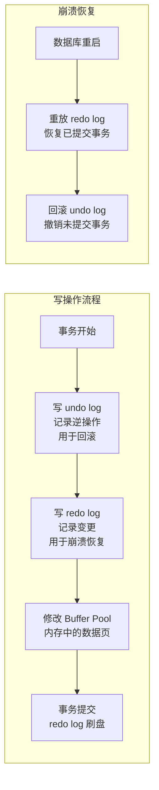

<!-- nav-start -->

---

[⬅️ 上一篇：联合索引与索引失效](03-联合索引与索引失效.md) | [🏠 返回目录](../README.md) | [下一篇：MVCC 与隔离级别 ➡️](05-MVCC与隔离级别.md)

<!-- nav-end -->

# 事务与 ACID

> **核心问题**：事务的四大特性是什么？InnoDB 是如何保证每一个特性的？

---

## 它解决了什么问题？

没有事务，银行转账"扣款成功、入账失败"的情况就无法避免。事务保证了一组操作**要么全部成功，要么全部回滚**，是数据一致性的基石。

**生活类比**：转账必须"扣款"和"入账"同时成功或同时失败，不能只扣款不入账。这就是事务的原子性。

---

## ACID 四大特性

| 特性 | 含义 | InnoDB 实现方式 | 为什么这样实现 |
|------|------|----------------|-------------|
| **原子性** Atomicity | 事务要么全成功，要么全回滚 | **undo log** 回滚 | undo log 记录了每个操作的逆操作，回滚时按逆序执行 |
| **一致性** Consistency | 事务前后数据满足约束 | 由其他三个特性共同保证 | 一致性是目标，原子性/隔离性/持久性是手段 |
| **隔离性** Isolation | 并发事务互不干扰 | **MVCC + 锁** | MVCC 解决读写冲突，锁解决写写冲突 |
| **持久性** Durability | 提交后数据永久保存 | **redo log** 持久化 | redo log 先于数据页写入磁盘（WAL 机制），崩溃后可重放 |

---

## undo log 与 redo log



| 日志类型 | 作用 | 保证的特性 |
|---------|------|---------|
| **undo log** | 记录操作的逆操作，支持回滚 | 原子性 |
| **redo log** | 记录数据页的物理变更，支持崩溃恢复 | 持久性 |

> **WAL（Write-Ahead Logging）机制**：先写日志，再写数据页。redo log 是顺序写（速度快），数据页是随机写（速度慢）。先写 redo log 保证了即使数据页还没落盘，崩溃后也能通过重放 redo log 恢复数据。

---

## 事务的基本使用

```java
// Spring 声明式事务（推荐）
@Transactional(rollbackFor = Exception.class)
public void transfer(Long fromId, Long toId, BigDecimal amount) {
    accountMapper.deduct(fromId, amount);   // 扣款
    accountMapper.add(toId, amount);         // 入账
    // 任何异常都会触发回滚
}

// 编程式事务（需要精细控制时使用）
transactionTemplate.execute(status -> {
    try {
        accountMapper.deduct(fromId, amount);
        accountMapper.add(toId, amount);
        return null;
    } catch (Exception e) {
        status.setRollbackOnly();  // 标记回滚
        throw e;
    }
});
```

---

## 工作中的坑

### 坑1：事务中大批量操作导致锁等待超时

```java
// ❌ 在一个事务中处理大批量数据，长时间持有行锁
@Transactional
public void batchUpdate(List<Long> ids) {
    for (Long id : ids) {  // ids 可能有几万条
        userMapper.updateStatus(id, 1);  // 每行都加行锁，持有时间极长
    }
}

// ✅ 分批处理，减少锁持有时间
public void batchUpdate(List<Long> ids) {
    Lists.partition(ids, 500).forEach(batch -> {
        transactionTemplate.execute(status -> {
            batch.forEach(id -> userMapper.updateStatus(id, 1));
            return null;
        });
    });
}
```

### 坑2：@Transactional 不生效

```java
// ❌ 同类内部调用，绕过了 Spring AOP 代理，事务不生效
@Service
public class OrderService {
    public void createOrder() {
        this.saveOrder();  // this 调用，不走代理
    }

    @Transactional
    public void saveOrder() { ... }
}

// ✅ 注入自身代理，或将方法拆到另一个 Bean
```

---

## 面试高频问题

**Q：ACID 四大特性分别是什么？InnoDB 如何实现？**

> - 原子性：undo log 支持回滚
> - 一致性：由其他三个特性共同保证
> - 隔离性：MVCC + 锁
> - 持久性：redo log + WAL 机制

**Q：undo log 和 redo log 的区别？**

> undo log 记录操作的逆操作，用于事务回滚，保证原子性；redo log 记录数据页的物理变更，用于崩溃恢复，保证持久性。两者配合实现了 ACID 中的 A 和 D。

<!-- nav-start -->

---

[⬅️ 上一篇：联合索引与索引失效](03-联合索引与索引失效.md) | [🏠 返回目录](../README.md) | [下一篇：MVCC 与隔离级别 ➡️](05-MVCC与隔离级别.md)

<!-- nav-end -->
