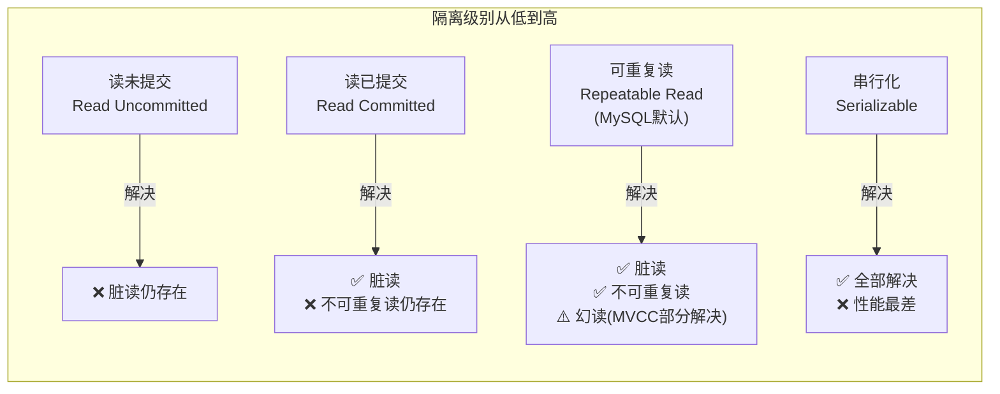
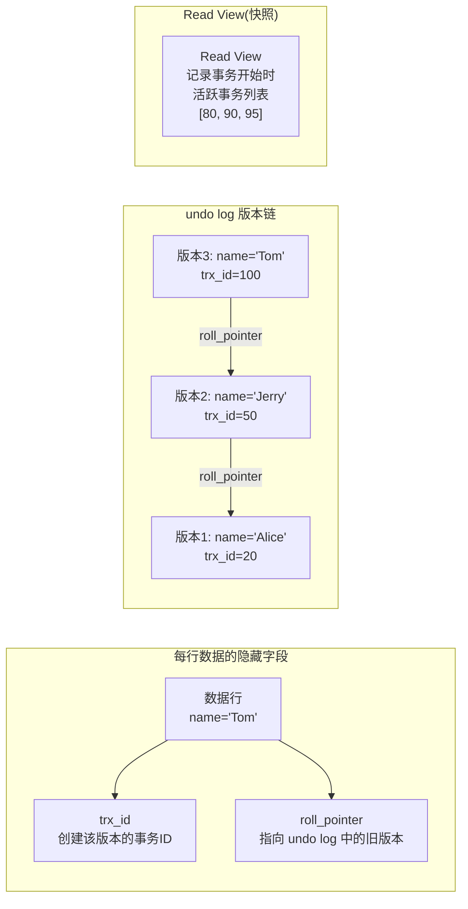

<!-- nav-start -->
---

[⬅️ 上一篇：事务与 ACID](04-事务与ACID.md) | [🏠 返回目录](../README.md) | [下一篇：锁机制与死锁 ➡️](06-锁机制与死锁.md)

<!-- nav-end -->

# MVCC 与隔离级别

> **核心问题**：MVCC 是如何在不加锁的情况下实现并发读的？四种隔离级别有什么区别？

---

## 它解决了什么问题？

并发场景下，读写操作如果都加锁，性能会极差。MVCC（多版本并发控制）让**读操作不加锁**，通过读取历史版本数据来避免读写互斥，大幅提升并发性能。

**生活类比**：MVCC 就像银行给每笔交易拍了快照，你查余额时看到的是你开始查询时的状态，不受其他人同时操作的影响。

---

## 四种隔离级别



| 隔离级别 | 脏读 | 不可重复读 | 幻读 | 性能 |
|---------|------|-----------|------|------|
| 读未提交 | ✅ 会 | ✅ 会 | ✅ 会 | 最高 |
| 读已提交 | ❌ 不会 | ✅ 会 | ✅ 会 | 高 |
| **可重复读（默认）** | ❌ 不会 | ❌ 不会 | ⚠️ 部分解决 | 中 |
| 串行化 | ❌ 不会 | ❌ 不会 | ❌ 不会 | 最低 |

> **为什么 MySQL 默认是可重复读而不是读已提交**：MySQL 早期 binlog 是 statement 格式，读已提交下主从复制可能出现数据不一致。可重复读 + 间隙锁可以避免这个问题。现在 binlog 默认是 row 格式，历史原因已不重要，但默认值保留了下来。

---

## MVCC 原理

### 核心组成



每行数据有两个隐藏字段：
- `trx_id`：最后修改该行的事务 ID
- `roll_pointer`：指向 undo log 中的上一个版本

### Read View 判断规则

| 条件 | 结论 |
|------|------|
| `trx_id < min_trx_id`（快照前已提交） | **可见** |
| `trx_id > max_trx_id`（快照后创建） | **不可见** |
| 在活跃列表中（未提交） | **不可见** |
| 不在活跃列表中（已提交） | **可见** |

---

## RC 与 RR 的本质区别

| 隔离级别 | Read View 生成时机 | 效果 |
|---------|-----------------|------|
| **RC（读已提交）** | 每次 SELECT 都生成新的 Read View | 能读到其他事务已提交的最新数据 |
| **RR（可重复读）** | 事务开始时生成一次，整个事务复用 | 保证同一事务内多次读取结果一致 |

> **为什么 RR 能保证可重复读**：整个事务使用同一个 Read View（快照），即使其他事务提交了新数据，当前事务的快照里看不到，所以每次读到的结果相同。

---

## MVCC 不能完全解决幻读

```sql
-- 事务A（RR 隔离级别）
BEGIN;
SELECT COUNT(*) FROM t WHERE age = 18;  -- 返回 0（快照读，MVCC）

-- 事务B 插入一条 age=18 的数据并提交

-- 事务A 继续
INSERT INTO t (age) VALUES (18);  -- 成功！
SELECT COUNT(*) FROM t WHERE age = 18;  -- 返回 2（当前读，看到了自己插入的+事务B的）
-- 这就是幻读！
```

**原因**：`SELECT` 是快照读（MVCC），`INSERT` 后的 `SELECT` 是当前读（看到最新数据）。

**解决方案**：使用 `SELECT ... FOR UPDATE`（当前读 + 间隙锁）。

---

## 快照读 vs 当前读

| 读类型 | 触发方式 | 是否加锁 | 看到的数据 |
|--------|---------|---------|---------|
| **快照读** | 普通 SELECT | 不加锁 | 事务开始时的快照（MVCC） |
| **当前读** | `SELECT ... FOR UPDATE`、`SELECT ... LOCK IN SHARE MODE`、INSERT/UPDATE/DELETE | 加锁 | 最新已提交数据 |

---

## 面试高频问题

**Q：MySQL 默认隔离级别是什么？MVCC 是如何实现可重复读的？**

> 默认可重复读（RR）。MVCC 通过 undo log 版本链 + Read View 实现：RR 级别在事务开始时生成一次 Read View，整个事务复用，所以每次读到的都是事务开始时的快照，保证可重复读。

**Q：RC 和 RR 的区别是什么？**

> 本质区别在于 Read View 的生成时机：RC 每次 SELECT 都生成新的 Read View，能读到已提交的最新数据；RR 整个事务只生成一次，保证可重复读。

**Q：MVCC 能完全解决幻读吗？**

> 不能完全解决。MVCC 的快照读可以避免大部分幻读，但当事务中混用快照读和当前读时，仍可能出现幻读。完全解决幻读需要使用 `SELECT ... FOR UPDATE`（当前读 + 间隙锁）。

<!-- nav-start -->
---

[⬅️ 上一篇：事务与 ACID](04-事务与ACID.md) | [🏠 返回目录](../README.md) | [下一篇：锁机制与死锁 ➡️](06-锁机制与死锁.md)

<!-- nav-end -->
