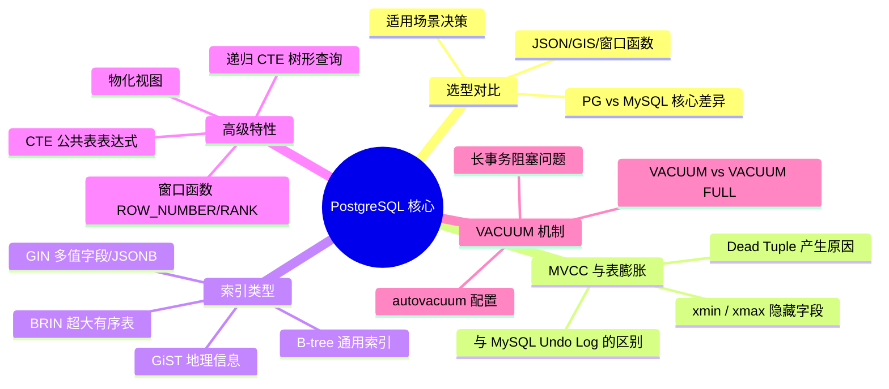
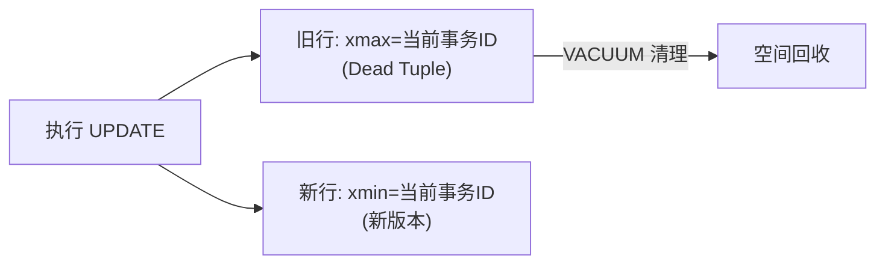

# PostgreSQL 核心特性与选型

> **学习目标**：从"会写 SQL"升级到"理解 PG 核心原理 → 能做技术选型 → 能排查表膨胀等运维问题"
>
> **检验标准**：学完每个模块后，能口述"这个技术解决了什么问题？不用它会怎样？工作中有哪些坑？"

---

## 整体知识地图



---

## 一、PostgreSQL vs MySQL

### 为什么要了解选型差异？

不了解两者差异，就无法在技术选型时给出有依据的建议，也无法解释"为什么这个场景要用 PG 而不是 MySQL"。

### 核心差异速览

| 维度 | PostgreSQL | MySQL | 选择依据 |
|------|-----------|-------|---------|
| **JSON 支持** | 原生 JSONB，可建 GIN 索引 | JSON 支持较弱，索引能力有限 | 需要存储和查询 JSON 选 PG |
| **窗口函数** | 完整支持 | MySQL 8.0+ 才支持 | 需要复杂分析查询选 PG |
| **MVCC 实现** | 旧版本存堆表，需要 VACUUM | Undo Log，自动回收 | PG 有表膨胀风险 |
| **SQL 标准** | 严格遵循 | 部分宽松 | 需要严格标准选 PG |
| **国内生态** | 增长迅速 | 成熟完善 | 团队熟悉度优先 |

> 详细对比 → [01-PG与MySQL对比.md](./01-PG与MySQL对比.md)

---

## 二、MVCC 原理与表膨胀

### 为什么要理解 MVCC？

不理解 PG 的 MVCC 实现，就无法解释为什么 PG 会有表膨胀问题，也无法正确配置 VACUUM 策略。

### 核心机制

每行数据有两个隐藏字段：`xmin`（插入该行的事务 ID）和 `xmax`（删除/更新该行的事务 ID）。UPDATE 时不修改原行，而是**插入新行并标记旧行的 xmax**，旧行成为 Dead Tuple。



| 对比点 | PostgreSQL | MySQL (InnoDB) |
|--------|-----------|----------------|
| 旧版本存储 | 堆表中（与新版本共存） | Undo Log 回滚段 |
| 旧版本清理 | VACUUM 主动清理 | 事务提交后自动回收 |
| 表膨胀风险 | **有** | 无 |

> 详细原理 → [02-MVCC原理与表膨胀.md](./02-MVCC原理与表膨胀.md)

---

## 三、索引类型

### 为什么要了解多种索引类型？

MySQL 主要只有 B-tree，而 PG 提供了多种索引类型。选错索引类型，JSONB 查询可能退化为全表扫描。

### 索引类型速览

| 索引类型 | 适用场景 | 核心优势 |
|---------|---------|---------|
| **B-tree** | 通用，等值/范围/排序 | 最通用，大多数场景首选 |
| **GIN** | JSONB、全文检索、数组 | 多值字段，每个值单独建索引项 |
| **GiST** | 地理位置、几何图形 | 支持空间查询，B-tree 无法处理 |
| **BRIN** | 超大表、时间序列 | 索引极小，适合物理有序大表 |

> ⚠️ **工作中的坑**：JSONB 字段未建 GIN 索引，查询退化为全表扫描。

> 详细说明 → [03-索引类型详解.md](./03-索引类型详解.md)

---

## 四、高级特性

### 4.1 窗口函数

在不改变结果行数的情况下，对每行数据进行跨行计算（排名、累计、前后行对比）。

| 函数 | 示例结果（并列时） | 适用场景 |
|------|-----------------|---------|
| `ROW_NUMBER()` | 1, 2, 3, 4 | 分页、唯一行号 |
| `RANK()` | 1, 2, 2, 4 | 竞赛排名（并列后跳过） |
| `DENSE_RANK()` | 1, 2, 2, 3 | 等级划分（并列后不跳过） |
| `LAG() / LEAD()` | - | 环比计算、前后行对比 |

> 详细说明 → [04-窗口函数.md](./04-窗口函数.md)

### 4.2 CTE 与递归查询

CTE 将复杂查询拆分为可读的命名子查询；递归 CTE 支持查询树形结构（组织架构、分类层级）。

```sql
-- 递归 CTE 查询组织架构树
WITH RECURSIVE org_tree AS (
    SELECT id, name, manager_id, 1 AS level FROM employees WHERE id = 1
    UNION ALL
    SELECT e.id, e.name, e.manager_id, ot.level + 1
    FROM employees e JOIN org_tree ot ON e.manager_id = ot.id
)
SELECT * FROM org_tree ORDER BY level;
```

> 详细说明 → [05-CTE与递归查询.md](./05-CTE与递归查询.md)

### 4.3 物化视图

将复杂查询结果持久化存储，查询时直接读取预计算结果，适合报表统计等实时性要求不高的场景。

| 对比项 | 普通视图 | 物化视图 |
|--------|---------|---------|
| 数据存储 | 不存储，实时计算 | 存储在磁盘，查询极快 |
| 数据新鲜度 | 实时 | 需要手动/定时刷新 |
| 可建索引 | ❌ | ✅ |

> 详细说明 → [06-物化视图.md](./06-物化视图.md)

---

## 五、VACUUM 机制

### 为什么要理解 VACUUM？

不了解 VACUUM，就无法处理 PG 的表膨胀问题，也无法解释为什么长事务会导致表空间持续增长。

### VACUUM 命令对比

| 命令 | 是否锁表 | 空间归还 OS | 适用场景 |
|------|---------|-----------|---------|
| `VACUUM` | ❌ 不锁表 | ❌ 标记可复用 | 日常维护 |
| `VACUUM FULL` | ✅ **锁表** | ✅ 归还 OS | 表膨胀严重，业务低峰期 |
| `pg_repack` | ❌ 不锁表 | ✅ 归还 OS | **推荐替代 VACUUM FULL** |

> ⚠️ **工作中的坑**：长事务会阻止 VACUUM 清理旧版本，是表膨胀的主要原因。需监控 `pg_stat_activity` 及时终止长事务。

> 详细说明 → [07-VACUUM机制.md](./07-VACUUM机制.md)

---

## 高频面试速查

| 问题 | 关键答案 |
|------|---------|
| PG 和 MySQL 最核心的区别？ | JSONB+GIN 索引、完整窗口函数、MVCC 实现不同（PG 有表膨胀）、SQL 标准更严格 |
| 什么是表膨胀？如何避免？ | Dead Tuple 堆积导致表文件增大；确保 autovacuum 开启，避免长事务，监控 n_dead_tup |
| GIN 和 B-tree 的区别？ | B-tree 适合单值字段；GIN 适合多值字段（JSONB/数组/全文检索），每个值单独建索引项 |
| ROW_NUMBER/RANK/DENSE_RANK 区别？ | 并列时：ROW_NUMBER 连续(1,2,3,4)；RANK 跳跃(1,2,2,4)；DENSE_RANK 密集(1,2,2,3) |
| 物化视图和普通视图的区别？ | 物化视图存储查询结果，查询极快，需手动刷新；普通视图不存储，实时计算 |
| VACUUM 和 VACUUM FULL 的区别？ | VACUUM 不锁表，空间标记可复用；VACUUM FULL 锁表，彻底回收空间归还 OS |
| 为什么长事务导致表膨胀？ | VACUUM 不能清理比最老活跃事务更新的 Dead Tuple，长事务期间 Dead Tuple 无法清理 |

---

## 常见问题速查

| 问题现象 | 根本原因 | 解决方案 |
|---------|---------|---------|
| JSONB 查询慢 | 未建 GIN 索引 | `CREATE INDEX USING GIN (jsonb_col)` |
| 表空间持续增长 | autovacuum 未生效或长事务阻塞 | 检查 autovacuum 配置，监控并终止长事务 |
| `VACUUM FULL` 导致业务中断 | 锁表时间过长 | 改用 `pg_repack` 工具在线重建表 |
| 窗口函数排名不符合预期 | 混淆 RANK 和 DENSE_RANK | 明确业务需要跳跃排名还是密集排名 |
| 递归 CTE 死循环 | 数据中存在循环引用 | 添加深度限制 `WHERE level < 10` |
| 长事务阻塞 VACUUM | 事务未及时提交 | 监控 `pg_stat_activity`，及时终止长事务 |
