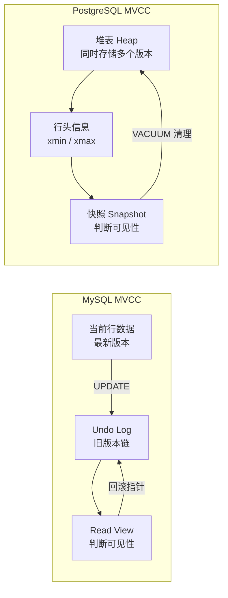
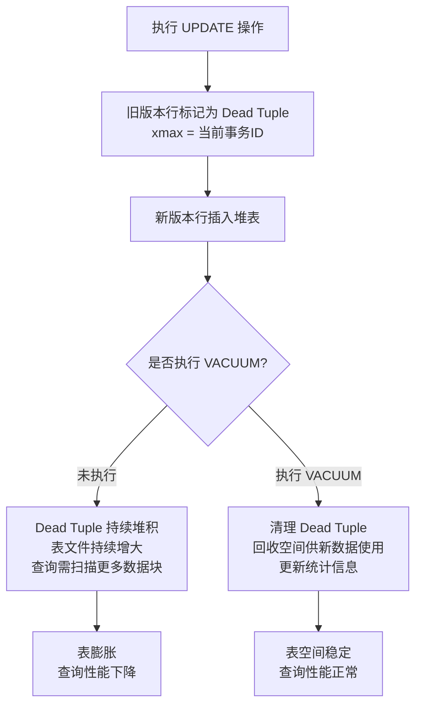

# MVCC 原理与表膨胀

> **核心问题**：PostgreSQL 的 MVCC 是如何实现的？为什么会产生表膨胀？如何避免？

---

## 它解决了什么问题？

MVCC（多版本并发控制）让**读操作不加锁**，通过保存数据的多个历史版本，让读写操作互不阻塞，大幅提升并发性能。

---

## MySQL vs PostgreSQL 的 MVCC 对比



---

## PostgreSQL MVCC 核心机制

每一行数据都有两个隐藏字段：

| 字段 | 含义 | 作用 |
|------|------|------|
| `xmin` | 插入该行的事务 ID | 该行从哪个事务开始可见 |
| `xmax` | 删除/更新该行的事务 ID | 该行从哪个事务开始不可见 |

**更新时**：不修改原行，而是**插入新行**（新 xmin）并将旧行的 xmax 设为当前事务 ID。

**读取时**：通过当前事务的快照（Snapshot）与行的 xmin/xmax 比较，判断该版本是否对当前事务可见。

---

## 与 MySQL 的关键差异

| 对比点 | PostgreSQL | MySQL (InnoDB) | 影响 |
|--------|-----------|----------------|------|
| 旧版本存储位置 | 堆表中（与新版本共存） | Undo Log 回滚段（独立存储） | PG 需要 VACUUM 清理，MySQL 自动回收 |
| 旧版本清理方式 | VACUUM 主动清理 | 事务提交后自动回收 | PG 有表膨胀风险，MySQL 没有 |
| 表膨胀风险 | **有**（需要 VACUUM） | 无（Undo Log 自动回收） | PG 需要监控和维护 |
| 读性能 | 无需回溯 Undo Log | 需要回溯 Undo Log 链 | 长事务下 PG 读性能更稳定 |

> **为什么 PG 选择把旧版本存在堆表中**：读操作不需要去 Undo Log 中回溯旧版本，读性能更稳定。代价是需要 VACUUM 定期清理 Dead Tuple，否则表空间持续增长。

---

## 什么是表膨胀？



**生活类比**：图书馆（数据库）里的书（数据行）被借走（删除/更新）后，书架上留下空位（Dead Tuple）。如果不定期整理（VACUUM），空位越来越多，找书（查询）时需要跳过大量空位，效率越来越低。

---

## 监控表膨胀

```sql
-- 查看表的 Dead Tuple 数量（监控表膨胀）
SELECT 
    schemaname,
    tablename,
    n_live_tup AS 活跃行数,
    n_dead_tup AS 死亡行数,
    ROUND(n_dead_tup::numeric / NULLIF(n_live_tup + n_dead_tup, 0) * 100, 2) AS 死亡比例
FROM pg_stat_user_tables
ORDER BY n_dead_tup DESC;
```

---

## 避免表膨胀的实践

| 实践 | 说明 |
|------|------|
| **确保 autovacuum 开启** | 默认开启，不要关闭 |
| **降低大表的触发阈值** | 高频更新的大表降低 `autovacuum_vacuum_scale_factor` |
| **避免长事务** | 长事务会阻止 VACUUM 清理旧版本，是表膨胀的主要原因 |
| **定期监控** | 监控 `pg_stat_user_tables` 中的 `n_dead_tup` |
| **严重膨胀时用 pg_repack** | 替代 `VACUUM FULL`，在线重建表不锁表 |

---

## 面试高频问题

**Q：什么是表膨胀？如何避免？**

> PG 的 MVCC 机制在 UPDATE/DELETE 时不删除旧版本行，而是标记为 Dead Tuple。如果不及时清理，Dead Tuple 持续堆积，表文件持续增大，这就是表膨胀。避免方法：确保 autovacuum 开启；对高频更新的表降低 `autovacuum_vacuum_scale_factor`；避免长事务（长事务会阻止 VACUUM 清理旧版本）；定期监控 `pg_stat_user_tables` 中的 `n_dead_tup`。

**Q：PG 的 MVCC 和 MySQL 的 MVCC 有什么区别？**

> PG 将旧版本行存储在堆表中，读操作无需回溯 Undo Log，读性能更稳定，但需要 VACUUM 定期清理，有表膨胀风险；MySQL 使用 Undo Log 存储旧版本，事务提交后自动回收，无表膨胀问题，但长事务下需要回溯较长的 Undo Log 链。
