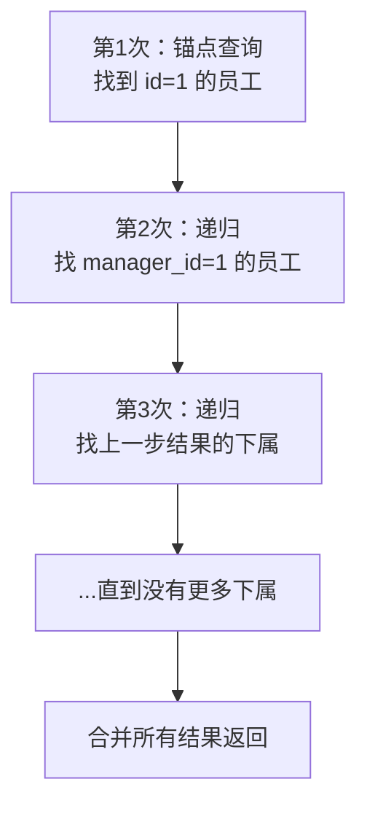

<!-- nav-start -->
---

[⬅️ 上一篇：窗口函数](04-窗口函数.md) | [🏠 返回目录](../README.md) | [下一篇：物化视图 ➡️](06-物化视图.md)

<!-- nav-end -->

# CTE 与递归查询

> **核心问题**：CTE 解决了什么问题？如何用递归 CTE 查询树形结构？

---

## 它解决了什么问题？

**CTE（公共表表达式）** 将复杂查询拆分为可读的命名子查询，解决两个问题：
1. **可读性**：将多层嵌套子查询改写为线性结构，易于理解和维护
2. **递归查询**：支持查询树形结构（组织架构、分类层级、评论回复等），这是普通 SQL 无法做到的

---

## 普通 CTE：提高可读性

```sql
-- ❌ 嵌套子查询：难以阅读
SELECT department, cnt FROM (
    SELECT department, COUNT(*) AS cnt FROM (
        SELECT * FROM employees WHERE salary > 10000
    ) high_salary GROUP BY department
) dept_stats WHERE cnt > 5;

-- ✅ CTE：线性结构，清晰易读
WITH 
high_salary AS (
    SELECT * FROM employees WHERE salary > 10000
),
dept_stats AS (
    SELECT department, COUNT(*) AS cnt 
    FROM high_salary 
    GROUP BY department
)
SELECT * FROM dept_stats WHERE cnt > 5;
```

**优点**：
- 命名子查询，语义清晰
- 可以被多次引用（避免重复写相同子查询）
- 便于调试（可以单独查询某个 CTE）

---

## 递归 CTE：查询树形结构

**语法结构**：

```sql
WITH RECURSIVE cte_name AS (
    -- 基础查询（锚点）：递归的起点
    SELECT ...
    
    UNION ALL
    
    -- 递归查询：引用 cte_name 自身
    SELECT ... FROM table JOIN cte_name ON ...
)
SELECT * FROM cte_name;
```

---

## 实战：查询组织架构树

```sql
-- 表结构
CREATE TABLE employees (
    id INT PRIMARY KEY,
    name VARCHAR(50),
    manager_id INT  -- NULL 表示顶级管理者
);

-- 递归 CTE：查询 id=1 的员工及其所有下属
WITH RECURSIVE org_tree AS (
    -- 基础查询：从指定员工开始（锚点）
    SELECT id, name, manager_id, 1 AS level
    FROM employees 
    WHERE id = 1
    
    UNION ALL
    
    -- 递归查询：找所有直接下属
    SELECT e.id, e.name, e.manager_id, ot.level + 1
    FROM employees e
    JOIN org_tree ot ON e.manager_id = ot.id
)
SELECT 
    REPEAT('  ', level - 1) || name AS org_chart,  -- 缩进显示层级
    level
FROM org_tree 
ORDER BY level, id;
```

**执行过程**：



---

## 实战：查询分类层级

```sql
-- 查询某个分类及其所有子分类（电商商品分类树）
WITH RECURSIVE category_tree AS (
    SELECT id, name, parent_id, 0 AS depth
    FROM categories
    WHERE id = 100  -- 从"电子产品"分类开始
    
    UNION ALL
    
    SELECT c.id, c.name, c.parent_id, ct.depth + 1
    FROM categories c
    JOIN category_tree ct ON c.parent_id = ct.id
)
SELECT * FROM category_tree ORDER BY depth, id;
```

---

## 工作中的坑

### 坑1：递归 CTE 死循环

```sql
-- ❌ 如果数据中存在循环引用（A 的上级是 B，B 的上级是 A），会无限递归
-- ✅ 添加深度限制防止无限递归
WITH RECURSIVE org_tree AS (
    SELECT id, name, manager_id, 1 AS level
    FROM employees WHERE id = 1
    
    UNION ALL
    
    SELECT e.id, e.name, e.manager_id, ot.level + 1
    FROM employees e
    JOIN org_tree ot ON e.manager_id = ot.id
    WHERE ot.level < 10  -- ✅ 限制最大深度，防止死循环
)
SELECT * FROM org_tree;
```

### 坑2：CTE 在 PostgreSQL 中默认是优化屏障

```sql
-- PostgreSQL 12 之前，CTE 是优化屏障（Optimization Fence）
-- 即使外层有 WHERE 条件，CTE 也会全量执行，不会下推过滤条件
-- PostgreSQL 12+ 默认允许优化器内联 CTE

-- 如果需要强制 CTE 作为优化屏障（如需要 CTE 只执行一次）
WITH MATERIALIZED cte AS (...)  -- 强制物化
WITH NOT MATERIALIZED cte AS (...) -- 允许内联优化
```

---

## 面试高频问题

**Q：CTE 和子查询有什么区别？什么时候用 CTE？**

> CTE 是命名的子查询，可以被多次引用，代码更清晰；子查询是匿名的，嵌套多层后难以阅读。当查询逻辑复杂、需要多次引用同一子查询、或需要递归查询时，用 CTE。

**Q：如何用 SQL 查询树形结构（如组织架构）？**

> 使用递归 CTE（`WITH RECURSIVE`）：先写锚点查询（起始节点），再写递归查询（找子节点），用 `UNION ALL` 连接，直到没有更多子节点为止。注意添加深度限制防止循环引用导致死循环。

<!-- nav-start -->
---

[⬅️ 上一篇：窗口函数](04-窗口函数.md) | [🏠 返回目录](../README.md) | [下一篇：物化视图 ➡️](06-物化视图.md)

<!-- nav-end -->
