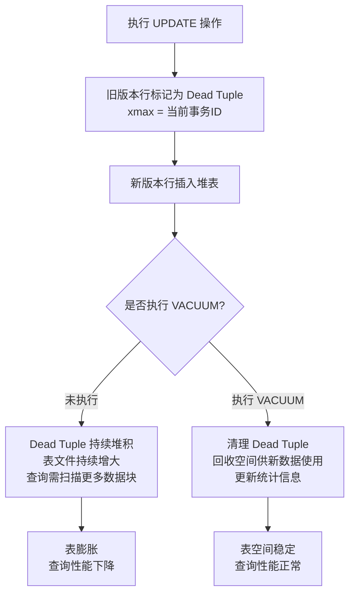

<!-- nav-start -->
---

[⬅️ 上一篇：物化视图](06-物化视图.md) | [🏠 返回目录](../README.md) | [下一篇：Redis 概览 ➡️](../05-redis/00-redis-overview.md)

<!-- nav-end -->

# VACUUM 机制

> **核心问题**：为什么 PostgreSQL 需要 VACUUM？VACUUM 和 VACUUM FULL 有什么区别？

---

## 它解决了什么问题？

PostgreSQL 的 MVCC 机制在 UPDATE/DELETE 时不立即删除旧版本行，而是标记为 Dead Tuple。VACUUM 负责清理这些 Dead Tuple，防止表空间无限膨胀，保持查询性能。

**生活类比**：图书馆（数据库）里的书（数据行）被借走（删除/更新）后，书架上留下空位（Dead Tuple）。VACUUM 就是图书馆的定期整理工作，把空位清理掉，让书架保持整洁。

---

## VACUUM 的两种形式

| 命令 | 作用 | 特点 | 适用场景 |
|------|------|------|---------|
| `VACUUM table_name` | 清理 Dead Tuple，标记空间可复用 | **不锁表**，空间不归还 OS | 日常维护 |
| `VACUUM FULL table_name` | 重写整张表，彻底回收空间 | **锁表**，空间归还 OS | 表膨胀严重时，业务低峰期 |
| `ANALYZE table_name` | 更新统计信息，优化查询计划 | 不清理数据，只更新统计 | 大量数据变化后 |
| `VACUUM ANALYZE` | 同时执行清理和统计更新 | 推荐日常使用 | 定期维护 |

> **为什么 VACUUM FULL 要慎用**：VACUUM FULL 会锁表，期间所有读写操作都被阻塞。对大表执行可能持续数小时，导致业务中断。替代方案：使用 `pg_repack` 工具在线重建表（不锁表）。

---

## VACUUM 执行流程



---

## AUTOVACUUM 自动清理

PostgreSQL 默认开启 `autovacuum`，自动在后台执行 VACUUM：

```sql
-- 查看 autovacuum 配置
SHOW autovacuum;
SHOW autovacuum_vacuum_threshold;    -- 触发阈值（默认50行）
SHOW autovacuum_vacuum_scale_factor; -- 触发比例（默认0.2，即20%行变化）

-- 触发条件：Dead Tuple 数 > threshold + scale_factor × 总行数
-- 默认：Dead Tuple > 50 + 0.2 × 总行数 时触发
-- 对于大表（100万行），需要 200050 个 Dead Tuple 才触发，可能太晚！
```

> **为什么大表需要降低 scale_factor**：默认 20% 对小表合理，但对百万行大表意味着需要 20 万个 Dead Tuple 才触发，可能导致表膨胀过大。高频更新的大表应适当降低阈值。

```sql
-- 针对特定表调整 autovacuum 参数
ALTER TABLE hot_table SET (
    autovacuum_vacuum_scale_factor = 0.01,  -- 1% 就触发（而不是默认20%）
    autovacuum_vacuum_threshold = 100
);
```

---

## 监控与排查

```sql
-- 查看表的 Dead Tuple 数量（监控表膨胀）
SELECT 
    schemaname,
    tablename,
    n_live_tup AS 活跃行数,
    n_dead_tup AS 死亡行数,
    ROUND(n_dead_tup::numeric / NULLIF(n_live_tup + n_dead_tup, 0) * 100, 2) AS 死亡比例,
    last_vacuum,
    last_autovacuum
FROM pg_stat_user_tables
ORDER BY n_dead_tup DESC;

-- 查看是否有长事务阻塞 VACUUM
SELECT pid, now() - pg_stat_activity.query_start AS duration, query
FROM pg_stat_activity
WHERE state = 'active' 
  AND now() - pg_stat_activity.query_start > interval '5 minutes'
ORDER BY duration DESC;
```

---

## 长事务阻塞 VACUUM

> **重要**：长事务是表膨胀的主要原因之一。VACUUM 不能清理比最老活跃事务更新的 Dead Tuple，因为这些旧版本可能还需要被长事务读取。


**解决方案**：
1. 监控 `pg_stat_activity`，及时发现并终止长事务
2. 业务层设置合理的事务超时：`SET statement_timeout = '30s'`
3. 避免在事务中做耗时操作（如调用外部接口）

---

## 工作中的坑

| 错误 | 原因 | 解决方案 |
|------|------|---------|
| 表空间持续增长 | autovacuum 未生效或阈值过高 | 检查 autovacuum 配置，监控 Dead Tuple |
| `VACUUM FULL` 导致业务中断 | 锁表时间过长 | 改用 `pg_repack` 工具在线重建表 |
| autovacuum 频繁触发影响性能 | 阈值设置过低 | 适当提高阈值，或在业务低峰期手动执行 |
| 长事务阻塞 VACUUM | 事务未及时提交 | 监控 `pg_stat_activity`，及时终止长事务 |

---

## 面试高频问题

**Q：什么是 VACUUM？VACUUM 和 VACUUM FULL 有什么区别？**

> VACUUM 清理 Dead Tuple，将空间标记为可复用，不锁表，是日常维护命令；VACUUM FULL 重写整张表，彻底回收空间并归还 OS，但会锁表，期间业务不可用。生产环境表膨胀严重时，推荐用 `pg_repack` 替代 VACUUM FULL，实现在线重建不锁表。

**Q：为什么长事务会导致表膨胀？**

> VACUUM 不能清理比最老活跃事务更新的 Dead Tuple，因为长事务可能需要读取这些旧版本数据（MVCC 保证）。长事务运行期间，所有新产生的 Dead Tuple 都无法被清理，导致表膨胀。

<!-- nav-start -->
---

[⬅️ 上一篇：物化视图](06-物化视图.md) | [🏠 返回目录](../README.md) | [下一篇：Redis 概览 ➡️](../05-redis/00-redis-overview.md)

<!-- nav-end -->
