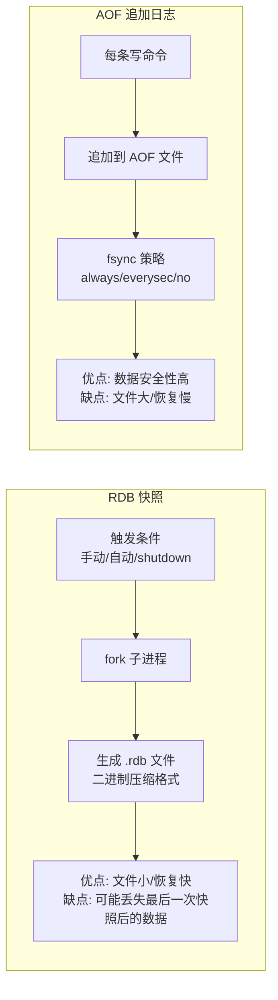
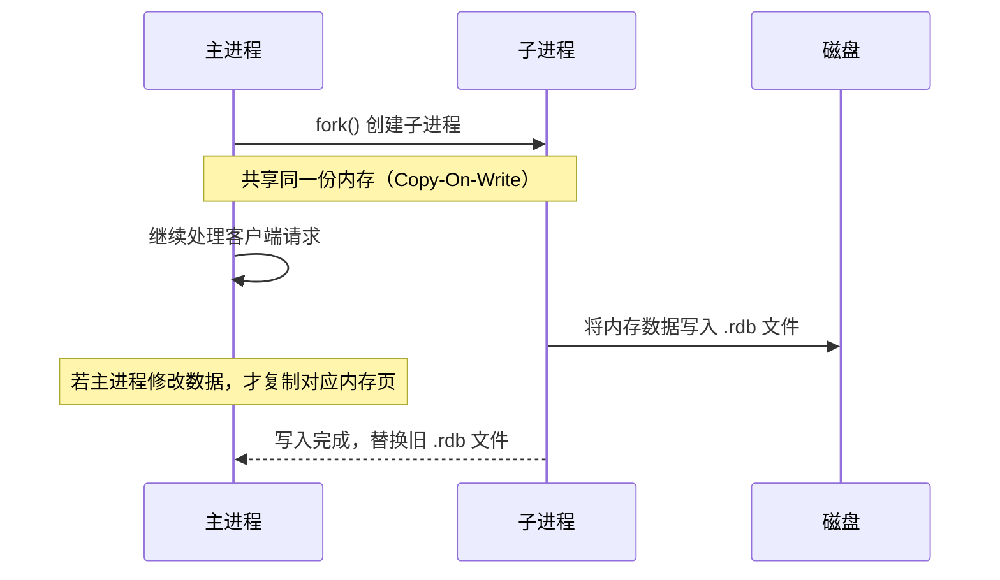
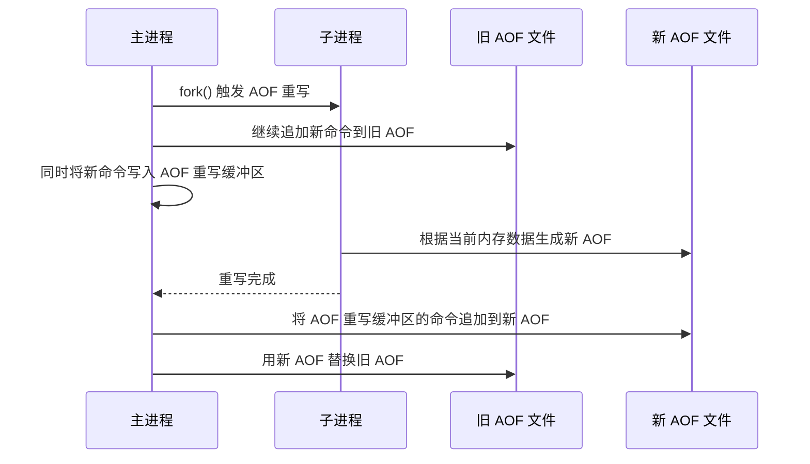
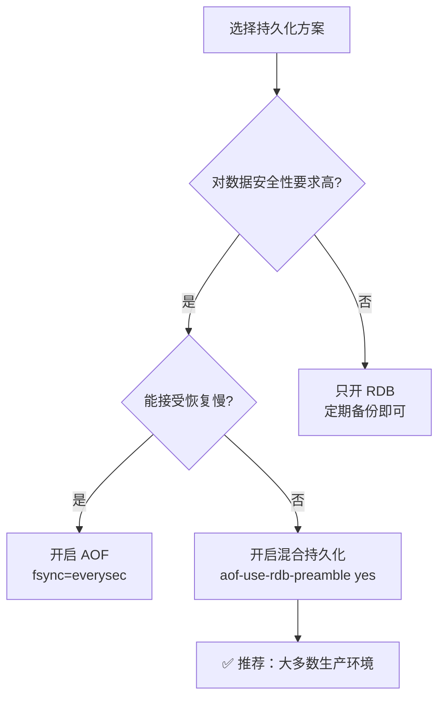

<!-- nav-start -->

---

[⬅️ 上一篇：Redis 数据结构与底层编码](01-数据结构与底层编码.md) | [🏠 返回目录](../README.md) | [下一篇：Redis 缓存三大问题：穿透、击穿、雪崩 ➡️](03-缓存三大问题.md)

<!-- nav-end -->

# Redis 持久化机制：RDB 与 AOF

---

## 1. 引入：为什么需要持久化？

Redis 是内存数据库，进程重启后数据会丢失。持久化机制将内存数据保存到磁盘，重启后可以恢复。

**不了解持久化会导致的线上问题**：
- 生产环境只开 RDB，Redis 宕机后丢失最近几分钟的数据
- AOF 文件无限增长，磁盘被打满
- 重启后恢复时间过长，影响业务

---

## 2. 两种持久化方式概览



---

## 3. RDB（Redis Database Snapshot）

### 3.1 工作原理

RDB 是在某个时间点对 Redis 内存数据做**全量快照**，生成一个二进制压缩文件（`.rdb`）。

```
触发方式：
  手动触发：SAVE（阻塞主线程）/ BGSAVE（fork 子进程，推荐）
  自动触发：配置 save 规则，如 save 900 1（900秒内有1次写操作则触发）
  关闭时触发：shutdown 命令默认触发 BGSAVE
```

### 3.2 fork + Copy-On-Write 机制



**Copy-On-Write（写时复制）**：fork 后父子进程共享内存页，只有当某页被修改时才复制该页。这样 fork 的开销很小，子进程看到的是 fork 时刻的内存快照。

> ⚠️ **注意**：如果 Redis 内存很大（如 10GB），fork 时需要复制页表，可能造成几毫秒到几秒的停顿（`latency`）。这是 RDB 的主要性能隐患。

### 3.3 RDB 配置

```bash
# redis.conf 配置示例
save 900 1       # 900秒内至少1次写操作，触发 BGSAVE
save 300 10      # 300秒内至少10次写操作，触发 BGSAVE
save 60 10000    # 60秒内至少10000次写操作，触发 BGSAVE

dbfilename dump.rdb          # RDB 文件名
dir /var/lib/redis           # RDB 文件存储目录
rdbcompression yes           # 是否压缩（LZF算法）
```

### 3.4 RDB 优缺点

| 优点 | 缺点 |
|------|------|
| 文件紧凑，体积小，适合备份和传输 | 可能丢失最后一次快照后的数据（分钟级） |
| 恢复速度快（直接加载二进制数据） | fork 时可能造成短暂停顿 |
| 对 Redis 性能影响小（子进程处理） | 不适合对数据安全性要求高的场景 |

---

## 4. AOF（Append Only File）

### 4.1 工作原理

AOF 将每条**写命令**以文本格式追加到 AOF 文件中，重启时重放所有命令来恢复数据。

```
写命令执行流程：
  1. 客户端发送写命令（如 SET key value）
  2. Redis 执行命令，修改内存数据
  3. 将命令追加到 AOF 缓冲区（aof_buf）
  4. 根据 fsync 策略，将缓冲区数据刷到磁盘
```

### 4.2 三种 fsync 策略

| 策略 | 触发时机 | 数据安全性 | 性能影响 | 适用场景 |
|------|---------|-----------|---------|---------|
| `always` | 每条命令都 fsync | 最高（最多丢失1条命令） | 最差（每次都写磁盘） | 金融等极高安全要求 |
| `everysec`（推荐） | 每秒 fsync 一次 | 高（最多丢失1秒数据） | 较小（后台线程处理） | 大多数业务场景 |
| `no` | 由操作系统决定 | 低（可能丢失较多数据） | 最好 | 不推荐生产使用 |

### 4.3 AOF 重写（Rewrite）

**问题**：AOF 文件会不断增长（记录所有历史命令），如 `INCR counter` 执行了 1000 次，AOF 中有 1000 条记录，但实际只需要 `SET counter 1000` 一条。

**解决方案**：AOF 重写，将内存中的当前数据状态转换为最少的命令集合，生成新的 AOF 文件。



**AOF 重写配置**：
```bash
auto-aof-rewrite-percentage 100   # AOF 文件比上次重写后增长 100% 时触发
auto-aof-rewrite-min-size 64mb    # AOF 文件至少 64MB 才触发（防止小文件频繁重写）
```

### 4.4 AOF 优缺点

| 优点 | 缺点 |
|------|------|
| 数据安全性高（最多丢失1秒数据） | 文件体积大（文本格式，未压缩） |
| 文件可读，便于排查问题 | 恢复速度慢（需要重放所有命令） |
| 支持 AOF 重写压缩文件 | 对性能有持续影响（写磁盘） |

---

## 5. 混合持久化（Redis 4.0+）

### 5.1 为什么需要混合持久化？

| 方案 | 问题 |
|------|------|
| 纯 RDB | 数据安全性低，可能丢失几分钟数据 |
| 纯 AOF | 恢复速度慢，大数据量时重放命令耗时很长 |
| **混合持久化** | ✅ 兼顾恢复速度和数据安全性 |

### 5.2 混合持久化原理

```
AOF 文件结构：
┌─────────────────────────────────────────────────────┐
│  RDB 格式的全量数据（文件头）                         │
│  （AOF 重写时，将当前内存数据以 RDB 格式写入）          │
├─────────────────────────────────────────────────────┤
│  AOF 格式的增量命令（文件尾）                         │
│  （重写完成后，新产生的写命令以 AOF 格式追加）          │
└─────────────────────────────────────────────────────┘
```

**恢复流程**：
1. 加载文件头的 RDB 数据（快速恢复全量数据）
2. 重放文件尾的 AOF 增量命令（补全最新数据）

### 5.3 开启混合持久化

```bash
# redis.conf
aof-use-rdb-preamble yes   # 开启混合持久化（Redis 4.0+ 默认开启）
appendonly yes              # 同时需要开启 AOF
```

---

## 6. 持久化方案选择指南



| 场景 | 推荐方案 |
|------|---------|
| 纯缓存，数据丢失可接受 | 只开 RDB，或不开持久化 |
| 需要数据安全，但恢复速度不敏感 | 只开 AOF（everysec） |
| 需要数据安全，且恢复速度要快 | **混合持久化**（推荐） |
| 数据量极大，重启恢复时间敏感 | 混合持久化 + 主从复制 |

---

## 7. 工作中常见错误

```
❌ 错误：生产环境只开启 RDB，Redis 宕机后丢失大量数据
✅ 正确：开启混合持久化（aof-use-rdb-preamble yes），同时配置合理的 AOF fsync 策略

❌ 错误：AOF 文件无限增长，未配置 AOF 重写，磁盘被打满
✅ 正确：配置 auto-aof-rewrite-percentage 和 auto-aof-rewrite-min-size 触发自动重写

❌ 错误：Redis 内存很大时，BGSAVE 导致长时间停顿
✅ 正确：监控 fork 耗时（INFO stats 中的 latest_fork_usec），控制 Redis 单实例内存不超过 10GB

❌ 错误：在从节点上开启 RDB，主节点不开持久化
✅ 正确：主节点也应开启持久化，否则主节点重启后数据为空，会将空数据同步给从节点
```

---

## 8. 面试高频问题

**Q：RDB 和 AOF 哪个更好？**
> 没有绝对的好坏，取决于业务需求。对数据安全性要求高用 AOF，对恢复速度要求高用 RDB，生产环境推荐**混合持久化**，兼顾两者优点。

**Q：AOF 重写期间，新的写命令怎么处理？**
> 主进程 fork 子进程做重写，同时将新命令写入**旧 AOF 文件**和**AOF 重写缓冲区**。重写完成后，将缓冲区的命令追加到新 AOF 文件，再替换旧文件。这样保证了重写期间数据不丢失。

**Q：Redis 重启后，RDB 和 AOF 哪个优先？**
> AOF 优先。因为 AOF 数据更完整（更新更及时）。只有在 AOF 关闭时，才使用 RDB 恢复。

<!-- nav-start -->

---

[⬅️ 上一篇：Redis 数据结构与底层编码](01-数据结构与底层编码.md) | [🏠 返回目录](../README.md) | [下一篇：Redis 缓存三大问题：穿透、击穿、雪崩 ➡️](03-缓存三大问题.md)

<!-- nav-end -->
