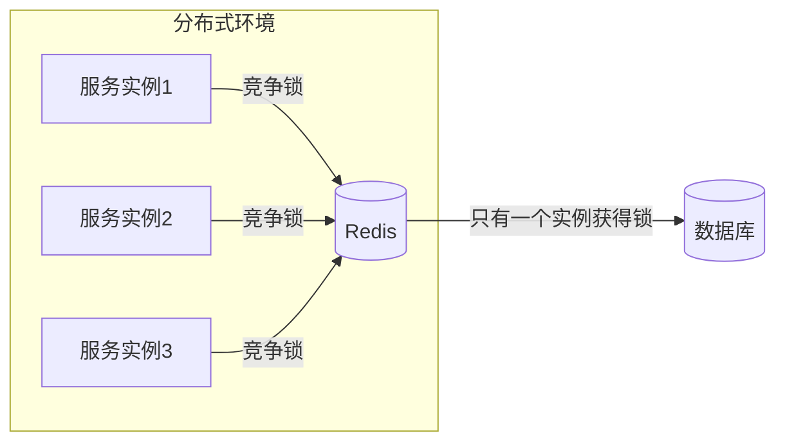
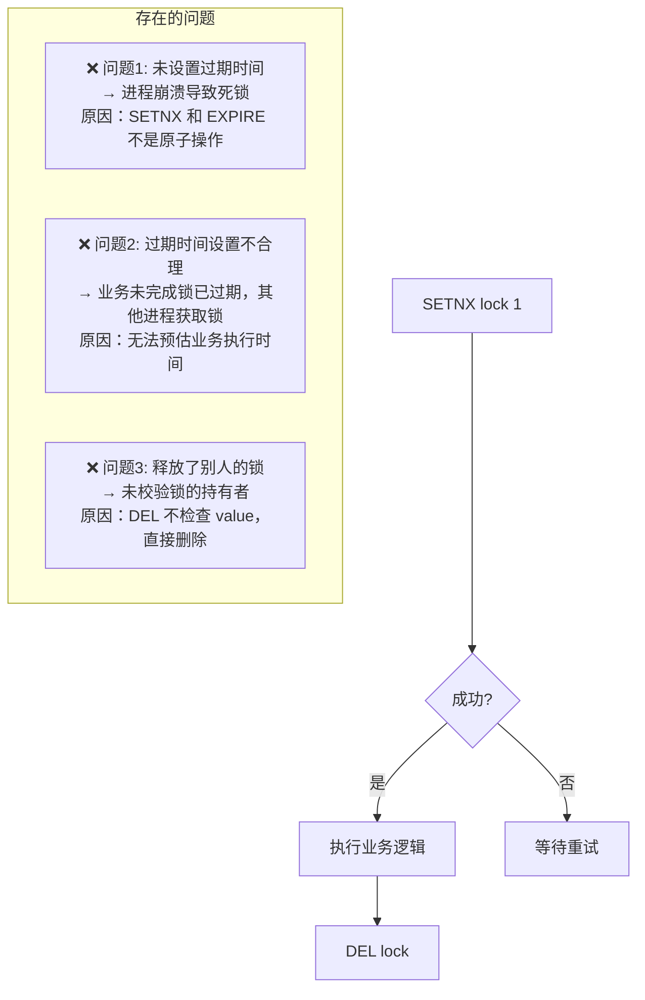
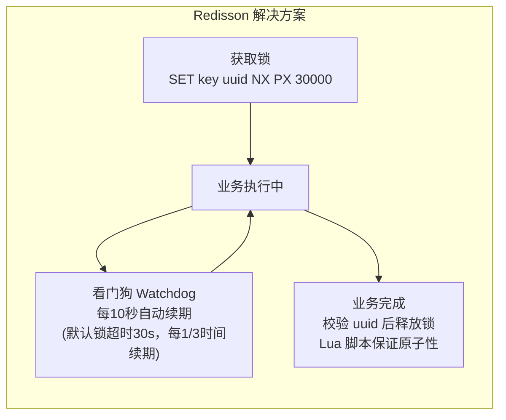
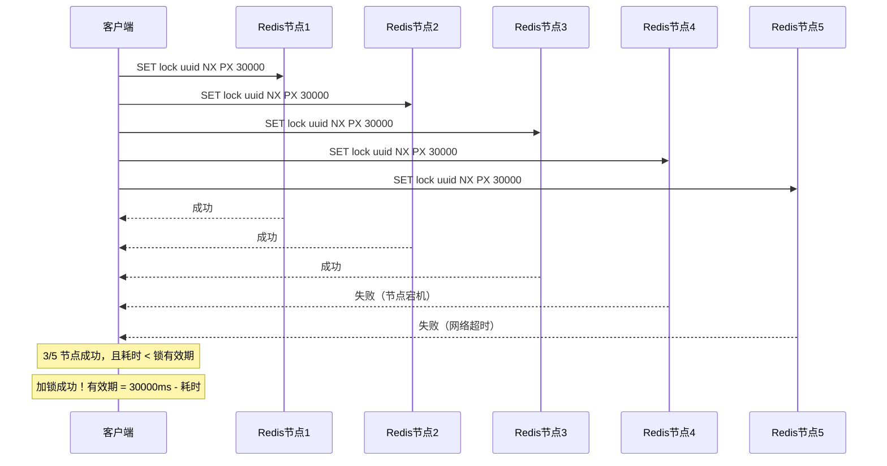

# Redis 分布式锁

---

## 1. 引入：为什么需要分布式锁？

单机环境下，可以用 `synchronized` 或 `ReentrantLock` 保证线程安全。但在分布式环境下，多个服务实例运行在不同 JVM 进程中，JVM 级别的锁无法跨进程生效。

**典型场景**：
- **秒杀扣库存**：多个服务实例同时读到库存为 1，都认为可以下单，导致超卖
- **定时任务防重**：多个实例同时触发定时任务，导致重复执行
- **幂等控制**：防止同一请求被多个实例重复处理



---

## 2. SETNX 手动实现分布式锁

### 2.1 最简单的实现（有问题）

```java
// ❌ 错误实现：SETNX 和 EXPIRE 不是原子操作
boolean locked = redis.setnx("lock:order", "1");
if (locked) {
    redis.expire("lock:order", 30); // 如果这里崩溃，锁永远不会释放！
    try {
        // 业务逻辑
    } finally {
        redis.del("lock:order");
    }
}
```

**问题**：`SETNX` 和 `EXPIRE` 是两条命令，不是原子操作。如果 `SETNX` 成功后进程崩溃，`EXPIRE` 没有执行，锁永远不会释放（死锁）。

### 2.2 原子加锁（解决死锁问题）

```java
// ✅ 使用 SET NX PX 原子命令
boolean locked = redis.set("lock:order", "1", "NX", "PX", 30000);
// NX = 不存在才设置
// PX 30000 = 过期时间30秒（毫秒）
// 这是一条原子命令，不会出现死锁
```

### 2.3 SETNX 实现的三大问题



**问题详解**：

**问题2：锁过期但业务未完成**
```
时间线：
T=0  : 进程A获取锁，设置30秒过期
T=30 : 锁过期，进程B获取锁
T=35 : 进程A业务完成，执行 DEL lock
       → 删除的是进程B的锁！（问题3）
T=40 : 进程C获取锁
       → 进程B和进程C同时持有锁！
```

**问题3：误删他人锁**
```java
// ❌ 错误：直接删除，不检查是否是自己的锁
redis.del("lock:order");

// ✅ 正确：先检查 value 是否是自己的 UUID，再删除
String lockValue = UUID.randomUUID().toString();
redis.set("lock:order", lockValue, "NX", "PX", 30000);

// 释放锁时，用 Lua 脚本保证"检查+删除"的原子性
String luaScript = """
    if redis.call('get', KEYS[1]) == ARGV[1] then
        return redis.call('del', KEYS[1])
    else
        return 0
    end
    """;
redis.eval(luaScript, Collections.singletonList("lock:order"),
           Collections.singletonList(lockValue));
```

---

## 3. Redisson 分布式锁

### 3.1 Redisson 解决了哪些问题



| 特性 | SETNX 手动实现 | Redisson | 为什么 Redisson 更好 |
|------|--------------|---------|-------------------|
| 自动续期 | ❌ 需手动处理 | ✅ 看门狗自动续期 | 业务执行时间不可预估，自动续期更安全 |
| 可重入 | ❌ 不支持 | ✅ 支持（Hash 结构记录重入次数） | 同一线程多次获取同一锁不会死锁 |
| 释放安全 | ❌ 可能释放他人锁 | ✅ Lua 脚本原子校验 | Lua 脚本保证"检查+删除"的原子性 |
| 红锁（多节点） | ❌ 不支持 | ✅ RedLock 算法 | 单节点 Redis 宕机时锁失效，红锁保证多节点安全 |

### 3.2 Redisson 基本使用

```java
// 引入依赖
// <dependency>
//     <groupId>org.redisson</groupId>
//     <artifactId>redisson-spring-boot-starter</artifactId>
//     <version>3.23.0</version>
// </dependency>

@Autowired
private RedissonClient redissonClient;

public void deductStock(Long productId) {
    RLock lock = redissonClient.getLock("lock:stock:" + productId);

    // 方式1：阻塞等待（一直等到获取锁）
    lock.lock();

    // 方式2：超时等待（等待最多3秒，获取锁后持有最多30秒）
    boolean locked = lock.tryLock(3, 30, TimeUnit.SECONDS);

    try {
        if (locked) {
            // 业务逻辑：查库存、扣库存
            int stock = getStock(productId);
            if (stock > 0) {
                updateStock(productId, stock - 1);
            }
        }
    } finally {
        if (locked && lock.isHeldByCurrentThread()) {
            lock.unlock(); // 只有持有锁的线程才能释放
        }
    }
}
```

### 3.3 看门狗（Watchdog）机制

**问题**：业务执行时间不可预估，如果锁过期了业务还没完成，其他进程会获取锁，导致并发问题。

**解决方案**：看门狗在后台定期给锁续期。

```
默认配置：
  锁超时时间：30秒（lockWatchdogTimeout）
  续期间隔：10秒（每 1/3 超时时间续期一次）

续期逻辑：
  T=0  : 获取锁，设置30秒过期
  T=10 : 看门狗检测到锁还在使用，重置为30秒
  T=20 : 看门狗再次续期，重置为30秒
  T=25 : 业务完成，主动释放锁
  T=30 : 如果业务未完成（进程崩溃），锁自然过期，不会死锁
```

> **为什么看门狗默认 30 秒，每 10 秒续期**：30 秒是经验值，足够大多数业务操作完成；每 1/3 时间（10 秒）续期，保证在锁过期前有足够时间续期，即使一次续期失败还有两次机会。

> ⚠️ **注意**：如果调用 `lock.tryLock(waitTime, leaseTime, unit)` 并指定了 `leaseTime`，看门狗**不会**自动续期。只有不指定 `leaseTime`（或使用 `lock.lock()`）时，看门狗才生效。

### 3.4 可重入锁原理

**可重入**：同一线程可以多次获取同一把锁，不会死锁。

```
Redis 中存储结构（Hash）：
key: lock:order
field: uuid:threadId  → value: 重入次数

加锁：HINCRBY lock:order uuid:threadId 1
释放：HINCRBY lock:order uuid:threadId -1，减到0时删除key
```

**Lua 脚本实现（加锁）**：
```lua
-- KEYS[1] = 锁的 key
-- ARGV[1] = 锁的过期时间（毫秒）
-- ARGV[2] = uuid:threadId

if (redis.call('exists', KEYS[1]) == 0) then
    -- 锁不存在，直接获取
    redis.call('hset', KEYS[1], ARGV[2], 1)
    redis.call('pexpire', KEYS[1], ARGV[1])
    return nil
end

if (redis.call('hexists', KEYS[1], ARGV[2]) == 1) then
    -- 锁存在且是当前线程持有，重入次数+1
    redis.call('hincrby', KEYS[1], ARGV[2], 1)
    redis.call('pexpire', KEYS[1], ARGV[1])
    return nil
end

-- 锁被其他线程持有，返回剩余过期时间
return redis.call('pttl', KEYS[1])
```

---

## 4. RedLock（红锁）

### 4.1 为什么需要红锁？

单节点 Redis 的分布式锁存在以下问题：
- Redis 主节点宕机，锁数据丢失（从节点还未同步）
- 主从切换期间，可能出现两个客户端同时持有锁

**RedLock 算法**：在 **N 个独立的 Redis 节点**（通常 5 个）上同时加锁，超过半数（3 个）成功才认为加锁成功。

### 4.2 RedLock 流程



### 4.3 Redisson 使用红锁

```java
RLock lock1 = redissonClient1.getLock("lock:order");
RLock lock2 = redissonClient2.getLock("lock:order");
RLock lock3 = redissonClient3.getLock("lock:order");

RedissonRedLock redLock = new RedissonRedLock(lock1, lock2, lock3);
boolean locked = redLock.tryLock(3, 30, TimeUnit.SECONDS);
try {
    if (locked) {
        // 业务逻辑
    }
} finally {
    redLock.unlock();
}
```

> ⚠️ **注意**：RedLock 存在争议（Martin Kleppmann 等人认为在时钟漂移等极端情况下仍不安全）。大多数业务场景下，单节点 Redis 锁 + 哨兵/集群高可用已经足够，不必使用 RedLock。

---

## 5. 分布式锁最佳实践

### 5.1 选型建议

| 场景 | 推荐方案 |
|------|---------|
| 一般业务（秒杀、防重等） | Redisson 可重入锁 |
| 对锁安全性要求极高 | Redisson RedLock（或 ZooKeeper 分布式锁） |
| 简单场景，不想引入 Redisson | SET NX PX + Lua 脚本释放 |

### 5.2 常见错误

```
❌ 错误：SETNX 后未设置过期时间
✅ 正确：使用 SET key value NX PX milliseconds 原子命令

❌ 错误：直接 DEL 释放锁，未校验持有者
✅ 正确：用 Lua 脚本先校验 value（UUID），再删除

❌ 错误：锁过期时间设置过短，业务未完成锁已释放
✅ 正确：使用 Redisson 看门狗自动续期，或根据业务预估合理的超时时间

❌ 错误：获取锁失败后直接报错，未做重试
✅ 正确：使用 tryLock(waitTime, ...) 等待一段时间，或配合消息队列做异步重试

❌ 错误：在 finally 中无条件释放锁
✅ 正确：释放前检查 lock.isHeldByCurrentThread()，避免释放他人的锁
```

---

## 6. 面试高频问题

**Q：Redis 分布式锁和 ZooKeeper 分布式锁的区别？**
> Redis 锁基于内存，性能更好（微秒级），但存在锁过期、主从切换等安全隐患；ZooKeeper 锁基于临时节点，客户端断开连接锁自动释放，安全性更高，但性能较差（毫秒级）。大多数业务场景用 Redis 锁即可，对安全性要求极高时考虑 ZooKeeper。

**Q：Redisson 看门狗是如何实现的？**
> Redisson 获取锁成功后，会启动一个定时任务（基于 Netty 的 HashedWheelTimer），每隔 `lockWatchdogTimeout/3`（默认10秒）检查锁是否还被当前线程持有，如果是则重置过期时间为 `lockWatchdogTimeout`（默认30秒）。当锁被释放或线程结束时，定时任务停止。

**Q：为什么释放锁要用 Lua 脚本？**
> 释放锁需要两步：① 检查 value 是否是自己的 UUID；② 删除 key。这两步不是原子操作，如果检查后、删除前锁刚好过期，其他进程获取了锁，此时再执行删除就会误删他人的锁。Lua 脚本在 Redis 中是原子执行的，保证了"检查+删除"的原子性。
