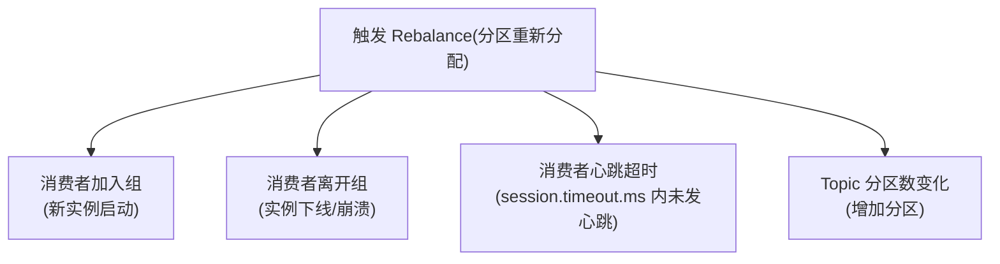
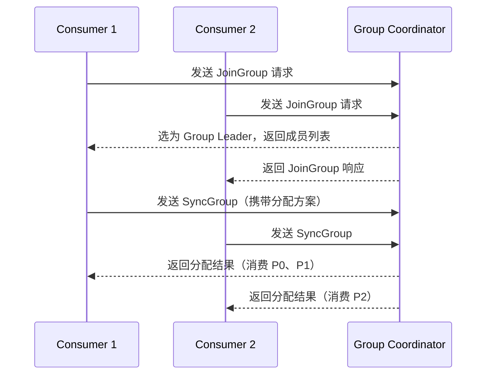

# Kafka 消费者组与 Rebalance

---

## 1. Rebalance 触发条件



> **Rebalance 的代价**：Rebalance 期间，**整个消费者组停止消费**，直到重新分配完成。频繁 Rebalance 会导致消费停顿，是 Kafka 性能问题的常见原因。

---

## 2. 三种分区分配策略

| 策略 | 分配方式 | 优点 | 缺点 | 为什么选它 |
|------|---------|------|------|----------|
| **Range** | 按分区范围分配给消费者 | 简单 | 分配不均匀（前几个消费者分到更多） | 简单场景 |
| **RoundRobin** | 轮询分配所有分区 | 均匀 | Rebalance 后变动大 | 需要均匀分配时 |
| **Sticky** | 尽量保持上次的分配结果 | 减少迁移，Rebalance 影响小 | 实现复杂 | **生产环境推荐** |

---

## 3. 避免频繁 Rebalance 的配置

```properties
# 消费者心跳间隔（建议为 session.timeout.ms 的 1/3）
# 为什么是 1/3：保证在超时前至少发送 3 次心跳，容忍 2 次失败
heartbeat.interval.ms=3000

# 会话超时时间（消费者超过此时间未发心跳则被踢出）
session.timeout.ms=10000

# 消费者两次 poll 的最大间隔（处理时间过长会触发 Rebalance）
# 如果业务处理时间可能超过 5 分钟，需要调大此值
max.poll.interval.ms=300000

# 每次 poll 的最大消息数（减少单次处理时间，避免超过 max.poll.interval.ms）
max.poll.records=500
```

---

## 4. Rebalance 流程



> **注意**：Rebalance 期间所有消费者停止消费，等待分配完成后才继续。

---

## 5. 最佳实践

| 场景 | 建议 |
|------|------|
| 消费者处理时间长 | 调大 `max.poll.interval.ms`，减小 `max.poll.records` |
| 消费者频繁重启 | 检查应用稳定性，避免频繁触发 Rebalance |
| 需要减少 Rebalance 影响 | 使用 **Sticky** 分配策略 |
| 分区数规划 | 分区数 ≥ 消费者数，避免消费者空闲 |