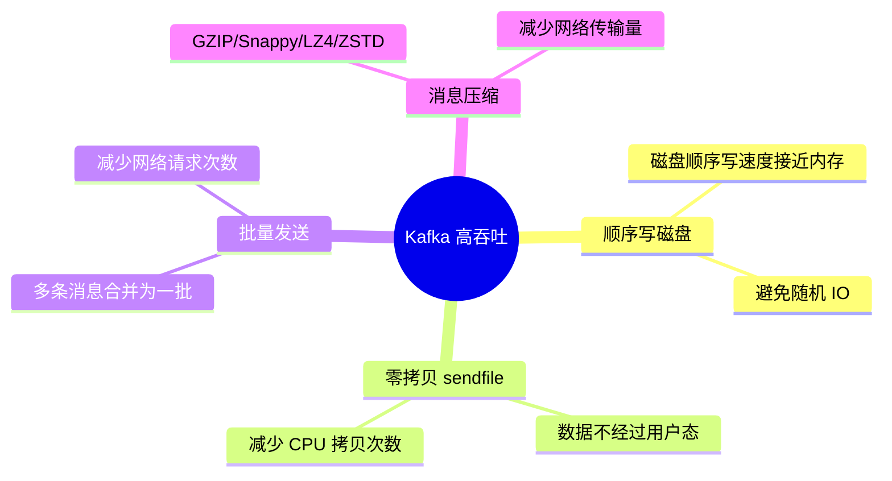

<!-- nav-start -->
---

[⬅️ 上一篇：消费者组与 Rebalance](04-消费者组与Rebalance.md) | [🏠 返回目录](../README.md) | [下一篇：消息队列选型 ➡️](06-消息队列选型.md)

<!-- nav-end -->

# Kafka 高吞吐原理

---

Kafka 能达到百万级 TPS，依赖四个核心机制：



---

## 1. 顺序写磁盘

```
随机写：磁头需要寻道 → 速度约 100 MB/s
顺序写：磁头不需要移动 → 速度约 600 MB/s（接近内存速度）

Kafka 每个 Partition 对应一个日志文件，消息只追加写入（Append Only）
为什么这样设计：消息队列天然是追加写入的，不需要修改已有数据，
顺序写完美契合这个场景，比随机写快 6 倍
```

---

## 2. 零拷贝（Zero Copy）

```
传统文件传输（4次拷贝，2次 CPU 介入）：
磁盘 → 内核缓冲区 → 用户缓冲区 → Socket 缓冲区 → 网卡

零拷贝 sendfile（2次拷贝，0次 CPU 介入）：
磁盘 → 内核缓冲区 → 网卡（跳过用户态，减少 CPU 介入）

为什么这样设计：Kafka 消费者只是读取数据转发，不需要在用户态处理数据，
跳过用户态拷贝可以减少 CPU 使用和内存带宽消耗
```

---

## 3. 批量发送与压缩

```java
// 生产者批量发送配置
props.put("batch.size", 16384);          // 批次大小（字节），默认 16KB
// 为什么是 16KB：经验值，太小则批次频繁发送，太大则延迟增加
props.put("linger.ms", 5);               // 等待时间（ms），凑满批次或超时则发送
// 为什么是 5ms：在延迟和吞吐量之间取平衡，5ms 对大多数业务可接受
props.put("compression.type", "snappy"); // 压缩算法（snappy 压缩率高且速度快）
```

---

## 4. 四大机制对比

| 机制 | 原理 | 提升效果 |
|------|------|---------|
| **顺序写磁盘** | Append Only，避免磁头寻道 | 写速度提升 6 倍（100→600 MB/s） |
| **零拷贝** | sendfile 跳过用户态 | 减少 2 次数据拷贝，降低 CPU 消耗 |
| **批量发送** | 多消息合并一次网络请求 | 减少网络 RTT，提升吞吐 |
| **消息压缩** | GZIP/Snappy/LZ4/ZSTD | 减少网络传输量，降低带宽消耗 |

---

## 5. 压缩算法选择

| 算法 | 压缩率 | 速度 | 适用场景 |
|------|--------|------|---------|
| **GZIP** | 高 | 慢 | 对压缩率要求高，CPU 资源充足 |
| **Snappy** | 中 | 快 | **推荐**，压缩率和速度均衡 |
| **LZ4** | 中 | 最快 | 对延迟敏感的场景 |
| **ZSTD** | 高 | 快 | Kafka 2.1+ 支持，综合性能最佳 |

<!-- nav-start -->
---

[⬅️ 上一篇：消费者组与 Rebalance](04-消费者组与Rebalance.md) | [🏠 返回目录](../README.md) | [下一篇：消息队列选型 ➡️](06-消息队列选型.md)

<!-- nav-end -->
