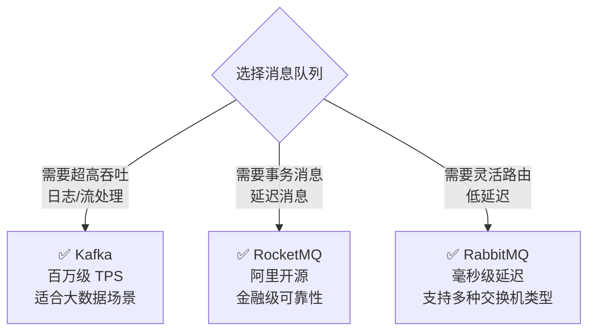

# 消息队列选型对比

---

## 选型决策树

---

## 详细对比

| 维度 | Kafka | RocketMQ | RabbitMQ |
|------|-------|----------|----------|
| 吞吐量 | 百万级/s | 十万级/s | 万级/s |
| 延迟 | ms 级 | ms 级 | μs 级 |
| 事务消息 | 支持（有限） | 原生支持 | 不支持 |
| 延迟消息 | 不支持 | 原生支持 | 插件支持 |
| 消息回溯 | 支持（按 offset） | 支持 | 不支持 |
| 适用场景 | 日志收集、流处理、大数据 | 电商、金融、订单 | 任务队列、RPC |

---

## 各自核心优势

### Kafka
- **超高吞吐**：百万级 TPS，顺序写磁盘 + 零拷贝
- **消息回溯**：支持按 offset 重新消费历史消息
- **流处理生态**：与 Flink、Spark Streaming 深度集成
- **适合场景**：日志收集、埋点数据、实时流处理、大数据管道

### RocketMQ
- **事务消息**：原生支持分布式事务，保证最终一致性
- **延迟消息**：原生支持定时/延迟投递
- **金融级可靠**：阿里双十一验证，消息不丢失
- **适合场景**：电商订单、支付、金融交易

### RabbitMQ
- **灵活路由**：支持 Direct/Topic/Fanout/Headers 四种交换机
- **低延迟**：μs 级延迟，适合实时性要求高的场景
- **协议支持**：支持 AMQP、STOMP、MQTT 等多种协议
- **适合场景**：任务队列、微服务 RPC、IoT 消息

---

## 选型建议

| 业务场景 | 推荐 | 理由 |
|---------|------|------|
| 日志收集、埋点 | **Kafka** | 高吞吐，允许少量丢失 |
| 电商订单、支付 | **RocketMQ** | 事务消息，金融级可靠 |
| 任务调度、通知 | **RabbitMQ** | 灵活路由，低延迟 |
| 实时流处理 | **Kafka** | 与大数据生态集成好 |
| 延迟/定时消息 | **RocketMQ** | 原生支持，无需额外开发 |