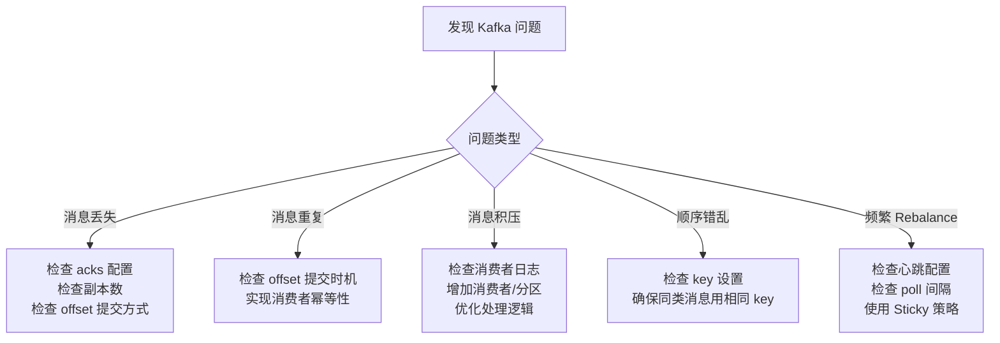

<!-- nav-start -->

---

[⬅️ 上一篇：消息队列选型对比](06-消息队列选型.md) | [🏠 返回目录](../README.md) | [下一篇：Kafka 面试高频问题（实战详解） ➡️](08-面试高频问题.md)

<!-- nav-end -->

# Kafka 工作中常见问题与解决

---

## 1. 消息积压

**现象**：消费者消费速度跟不上生产速度，Lag 持续增大。

**排查与解决**：
```
1. 检查消费者是否有异常（日志报错、处理逻辑阻塞）
2. 增加消费者实例数（不超过分区数）
3. 增加分区数（需要重新分配）
4. 优化消费者处理逻辑（批量处理、异步化）
5. 临时扩容：新建 Topic，将积压消息转移到新 Topic 并增加消费者
```

---

## 2. 消息重复消费

**原因**：消费者处理成功但提交 offset 前崩溃，重启后重新消费。

**解决**：**幂等消费**——消费者处理消息时，先检查是否已处理过。

```java
// 方案1：数据库唯一键（消息ID作为唯一键，重复插入直接忽略）
// 原理：数据库唯一约束保证同一消息ID只能插入一次
INSERT IGNORE INTO order_record (message_id, order_id) VALUES (?, ?)

// 方案2：Redis 记录已处理的消息ID
// 原理：setIfAbsent 是原子操作，只有第一次设置成功
String key = "processed:msg:" + messageId;
Boolean isNew = redisTemplate.opsForValue().setIfAbsent(key, "1", 24, TimeUnit.HOURS);
if (!isNew) {
    return; // 已处理，跳过
}
```

---

## 3. 消息顺序性

**Kafka 保证**：**同一 Partition 内消息有序**，跨 Partition 不保证顺序。

```java
// 需要顺序消费的消息，发送时指定相同的 key（同一 key 路由到同一 Partition）
// 原理：Kafka 按 hash(key) % partitionCount 路由，相同 key 必然在同一分区
producer.send(new ProducerRecord<>("order-topic", orderId, message));
//                                                  ↑ key = orderId，同一订单的消息在同一分区
```

---

## 4. 常见配置错误

| 错误配置 | 后果 | 正确做法 | 根本原因 |
|---------|------|---------|---------| 
| `acks=1` 用于核心业务 | Leader 宕机丢消息 | 核心业务用 `acks=all` | acks=1 只等 Leader 确认，副本未同步时 Leader 宕机消息丢失 |
| `enable.auto.commit=true` | 消息处理失败后仍提交 offset | 手动提交 offset | 自动提交是定时提交，不管处理是否成功 |
| 分区数 < 消费者数 | 部分消费者空闲 | 分区数 ≥ 消费者数 | 一个分区只能被一个消费者消费，多余消费者无法分配分区 |
| `session.timeout.ms` 过短 | 频繁 Rebalance | 根据业务处理时间合理配置 | 处理时间超过超时时间，消费者被误判为宕机 |
| 未开启幂等 | 重试导致重复消息 | `enable.idempotence=true` | 网络超时重试时，Broker 可能已收到消息 |

---

## 5. 问题排查思路



<!-- nav-start -->

---

[⬅️ 上一篇：消息队列选型对比](06-消息队列选型.md) | [🏠 返回目录](../README.md) | [下一篇：Kafka 面试高频问题（实战详解） ➡️](08-面试高频问题.md)

<!-- nav-end -->
