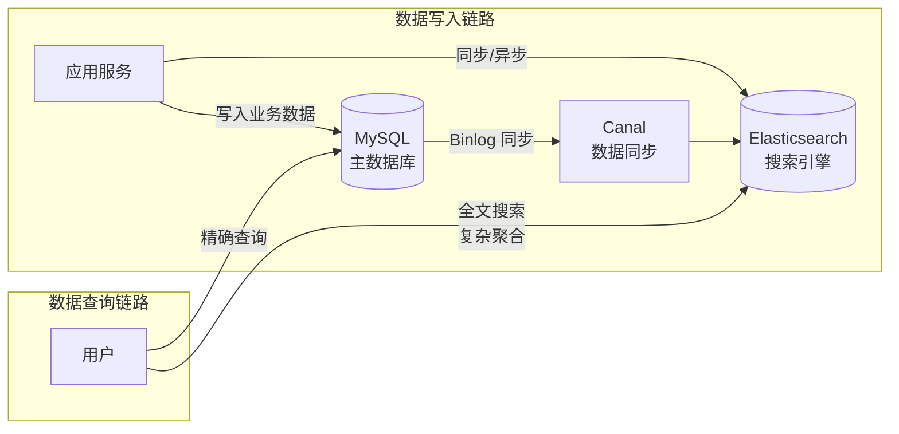

# ES 引入：它解决了什么问题？

---

## 问题背景

MySQL 在全文搜索场景下力不从心：

| 场景 | MySQL 的问题 | ES 的解决方案 |
|------|------------|-------------|
| 全文搜索"Java 工程师" | `LIKE '%Java%'` 全表扫描，百万数据下响应超 10 秒 | 倒排索引，毫秒级响应 |
| 商品多条件筛选+排序 | 多字段联合索引复杂，性能差 | 天然支持多字段组合查询 |
| 日志聚合分析 | 亿级数据聚合极慢 | 分布式并行聚合，近实时 |
| 搜索结果相关性排序 | 无法计算相关性得分 | TF-IDF / BM25 算法 |

---

## 不了解 ES 会导致的线上问题

- 对 `text` 字段用 `term` 精确匹配，查不到数据（字段已被分词）
- 动态 Mapping 字段类型被错误推断，且无法修改（只能 reindex）
- 主分片数设置过少，后期无法水平扩展
- 深度分页超时或 OOM（每个分片返回大量数据到协调节点合并）

---

## ES 在系统架构中的位置

---

## 类比：用生活模型建立直觉

### ES 的倒排索引 → 图书馆的关键词索引

| ES 概念 | 生活类比 | 映射关系 |
|--------|---------|---------| 
| **正排索引（MySQL）** | 逐本翻书找关键词 | 全表扫描，O(n) |
| **倒排索引（ES）** | 书后面的"关键词索引"，直接找到页码 | 词项→文档列表，O(1) |
| **分词器** | 把"Java工程师招聘"拆成["Java","工程师","招聘"] | 将文本拆分为词项 |
| **Mapping** | 图书馆的分类规则（按作者/按主题/按年份） | 定义字段类型和索引方式 |
| **Shard（分片）** | 图书馆的多个分馆 | 数据分片，支持水平扩展 |
