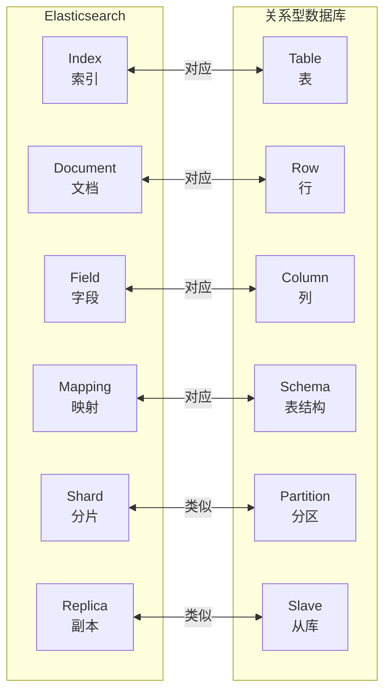
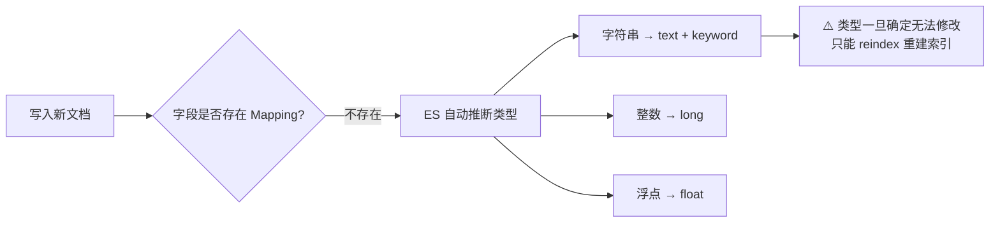
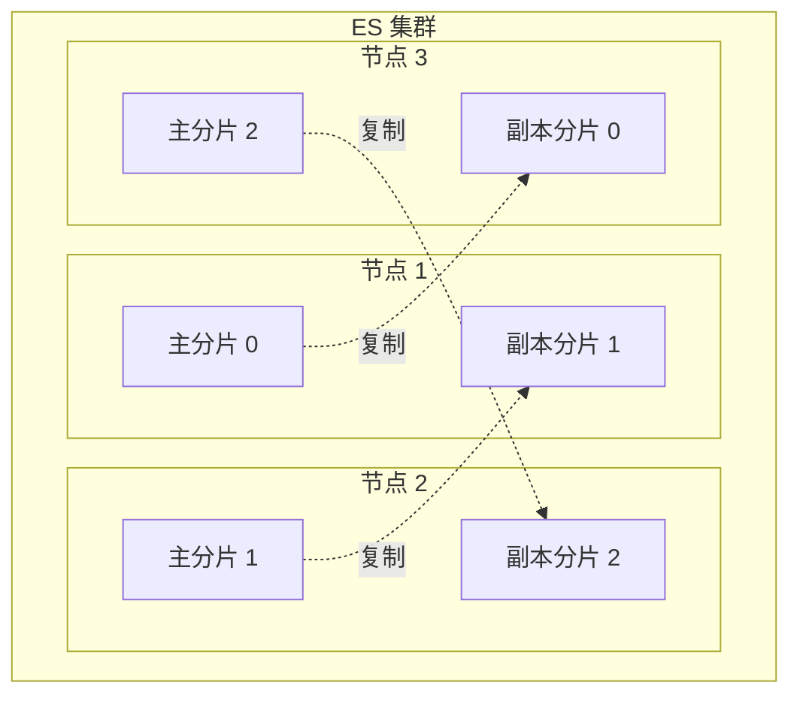

# ES 核心概念：与关系型数据库的对应关系

---

## 一、概念对应关系



| ES 概念 | 数据库概念 | 说明 |
|--------|----------|------|
| Index | Table | 存储同类文档的集合 |
| Document | Row | 一条数据，JSON 格式 |
| Field | Field | 文档中的一个字段 |
| Mapping | Schema | 定义字段类型和索引方式 |
| Shard | Partition | 数据分片，支持水平扩展 |
| Replica | 备库 | 副本分片，提供高可用 |

---

## 二、核心概念深度解析

### 2.1 Index（索引）

**类比**：相当于数据库中的一张表，但更像是一个"数据集合"。

- 一个 Index 存储**同类型**的文档（如所有商品、所有订单）
- Index 名称必须**全小写**
- 创建时需要指定**主分片数**（创建后不可修改！）和**副本分片数**（可动态调整）

```json
// 创建索引
PUT /products
{
  "settings": {
    "number_of_shards": 3,    // 主分片数，创建后不可改
    "number_of_replicas": 1   // 副本数，可动态调整
  },
  "mappings": {
    "properties": {
      "name": { "type": "text", "analyzer": "ik_max_word" },
      "price": { "type": "double" },
      "category": { "type": "keyword" }
    }
  }
}
```

> ⚠️ **面试陷阱**：主分片数为什么创建后不可修改？
> 因为文档路由公式是 `shard = hash(routing) % number_of_shards`，修改分片数会导致已有文档找不到。

---

### 2.2 Document（文档）

**类比**：相当于数据库中的一行记录，但以 **JSON 格式**存储，天然支持嵌套结构。

```json
// 一个商品文档
{
  "_index": "products",
  "_id": "1001",
  "_source": {
    "name": "iPhone 15 Pro",
    "price": 8999.0,
    "category": "手机",
    "tags": ["苹果", "5G", "旗舰"],
    "specs": {
      "color": "深空黑",
      "storage": "256GB"
    }
  }
}
```

**文档元数据**：

| 字段 | 说明 |
|------|------|
| `_index` | 所属索引 |
| `_id` | 文档唯一 ID（不指定则自动生成） |
| `_source` | 原始 JSON 数据 |
| `_score` | 相关性得分（查询时计算） |
| `_version` | 版本号（乐观锁） |

---

### 2.3 Mapping（映射）

**类比**：相当于数据库的 Schema（表结构），定义每个字段的**类型**和**索引方式**。

**核心字段类型对比**：

| 类型 | 说明 | 典型场景 |
|------|------|---------|
| `text` | 全文检索，会被分词 | 商品名称、文章内容 |
| `keyword` | 精确匹配，不分词 | 订单状态、用户 ID、标签 |
| `integer` / `long` | 整数 | 数量、年龄 |
| `double` / `float` | 浮点数 | 价格、评分 |
| `date` | 日期 | 创建时间、更新时间 |
| `boolean` | 布尔值 | 是否上架、是否删除 |
| `nested` | 嵌套对象（独立索引） | 订单中的商品列表 |
| `geo_point` | 地理坐标 | 附近的人、门店定位 |

> ⚠️ **高频踩坑**：`text` vs `keyword`
> - `text` 字段会被分词，**不能**用 `term` 精确匹配，**不能**用于聚合排序
> - `keyword` 字段不分词，**只能**精确匹配，**可以**用于聚合排序
> - 同一字段需要既全文检索又精确匹配时，用 `fields` 多字段映射：

```json
"title": {
  "type": "text",
  "analyzer": "ik_max_word",
  "fields": {
    "keyword": { "type": "keyword" }  // title.keyword 用于精确匹配
  }
}
```

**动态 Mapping 的坑**：



---

### 2.4 Shard（分片）

**类比**：相当于数据库的分区，将数据水平切分到多个节点。



**分片核心规则**：

| 规则 | 说明 |
|------|------|
| 主分片数创建后不可修改 | 路由公式依赖分片数 |
| 副本分片不能与主分片在同一节点 | 保证高可用 |
| 副本分片可以承担读请求 | 提升读吞吐量 |
| 单个分片建议 10~50GB | 过大影响恢复速度，过小增加管理开销 |

---

## 三、面试高频问题

**Q1：ES 的 text 和 keyword 有什么区别？**

> `text` 会被分词器拆分，用于全文检索，不能精确匹配和聚合；`keyword` 不分词，用于精确匹配、过滤和聚合排序。同一字段需要两种能力时，用 `fields` 多字段映射。

**Q2：为什么主分片数创建后不可修改？**

> 文档路由公式 `shard = hash(routing) % number_of_shards`，修改分片数后，已有文档的路由结果改变，会找不到原来的数据。需要修改分片数只能通过 `reindex` 重建索引。

**Q3：动态 Mapping 有什么风险？**

> ES 会自动推断字段类型，但推断可能不准确（如把数字字符串推断为 `text`），且**字段类型一旦确定无法修改**，只能删除索引重建或 `reindex`。生产环境建议关闭动态 Mapping，显式定义所有字段。

**Q4：副本分片的作用是什么？**

> 两个作用：① **高可用**：主分片所在节点宕机时，副本分片自动提升为主分片；② **提升读性能**：读请求可以路由到副本分片，分担主分片压力。

---

> **复习检验标准**：能否解释 text 和 keyword 的区别？能否说出主分片数不可修改的原因？能否描述动态 Mapping 的风险？
