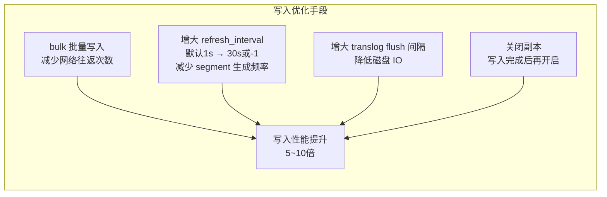
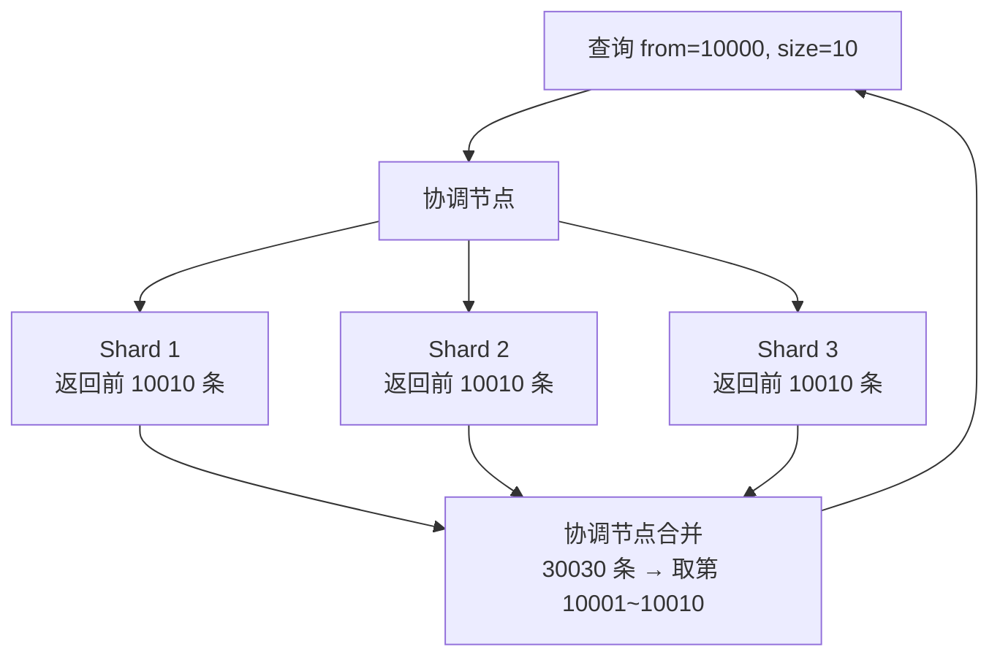

# ES 性能优化

---

## 写入优化

> **为什么 refresh_interval 默认是 1 秒**：ES 是"近实时"搜索，1 秒的延迟对大多数搜索场景可接受，同时避免频繁生成 segment（每次 refresh 都会生成新 segment，segment 过多会影响查询性能）。批量写入时可以临时设为 -1（不自动 refresh），写完后手动 refresh。

---

## 查询优化

| 优化手段 | 原理 | 适用场景 |
|---------|------|---------| 
| 使用 filter 替代 query | filter 结果可缓存，不计算得分 | 纯过滤场景（状态、标签筛选） |
| 避免深度分页 | `from=10000` 需要每个分片返回 10000 条再合并 | 使用 `search_after` 替代 from/size |
| 减少返回字段 | 使用 `_source includes` 只返回需要的字段 | 文档字段多但只需部分字段 |
| 合理设置分片数 | 分片过多增加协调开销 | 单分片建议 10~50GB |

---

## 深度分页问题（深度分析）

> **为什么深度分页性能差**：每个分片都要返回前 N 条数据到协调节点，协调节点合并后再取目标页。分片越多、页码越深，内存和网络开销越大。`from=10000, size=10` 时，3 个分片需要传输 30030 条数据，只用了 10 条。
>
> **解决方案**：使用 `search_after`（游标分页），基于上一页最后一条记录的排序值继续查询，每次只传输 `size` 条数据，性能稳定。

---

## 常见性能问题汇总

| 错误场景 | 原因 | 解决方案 |
|---------|------|---------| 
| 主分片数设置过少，后期无法扩展 | 主分片数创建后不可修改（路由公式依赖分片数） | 初始规划时按未来 3 年数据量估算 |
| 深度分页超时或 OOM | 每个分片返回大量数据到协调节点合并 | 使用 search_after 替代 from/size |
| 写入慢，refresh_interval 设置过短 | 每秒生成新 segment，频繁 merge | 批量写入时临时设置 refresh_interval=-1 |
| 集群 Yellow 状态，误以为故障 | 单节点副本无法分配（主副不能在同一节点） | 开发环境设置副本数为 0 |

---

## 面试题：ES 写入数据后为什么不能立即查到？

> ES 写入流程：数据先写入内存 buffer → 每隔 `refresh_interval`（默认1秒）刷新到 segment（此时可查）→ 再通过 flush 持久化到磁盘。所以 ES 是**近实时**（Near Real-Time）搜索，默认有约 1 秒延迟。
