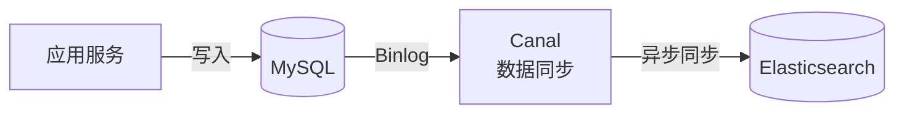
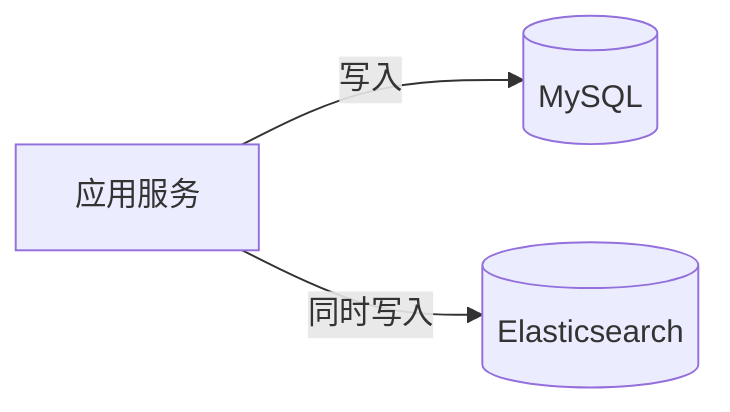
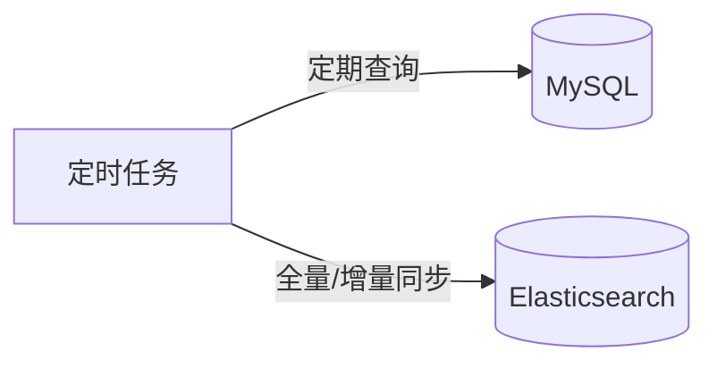

<!-- nav-start -->
---

[⬅️ 上一篇：性能优化](07-性能优化.md) | [🏠 返回目录](../README.md) | [下一篇：设计模式总览 ➡️](../08-design-pattern/00-设计模式总览.md)

<!-- nav-end -->

# ES 数据一致性：MySQL 与 ES 同步方案

---

## 面试题：如何保证 MySQL 和 ES 的数据一致性？

常见方案：

### 方案一：Canal 监听 MySQL Binlog（推荐）

**优点**：异步解耦，对业务代码无侵入  
**缺点**：有一定延迟，需要维护 Canal 组件

### 方案二：双写

**优点**：实时性好  
**缺点**：存在一致性风险（MySQL 成功 ES 失败），代码耦合

### 方案三：定时任务

**优点**：实现简单  
**缺点**：实时性差，存在数据延迟窗口

---

## 方案对比

| 方案 | 实时性 | 一致性 | 复杂度 | 推荐场景 |
|------|--------|--------|--------|---------|
| Canal Binlog | 秒级 | 高 | 中 | 生产环境推荐 |
| 双写 | 实时 | 中（有风险） | 低 | 简单场景 |
| 定时任务 | 分钟级 | 中 | 低 | 对实时性要求低 |

<!-- nav-start -->
---

[⬅️ 上一篇：性能优化](07-性能优化.md) | [🏠 返回目录](../README.md) | [下一篇：设计模式总览 ➡️](../08-design-pattern/00-设计模式总览.md)

<!-- nav-end -->
