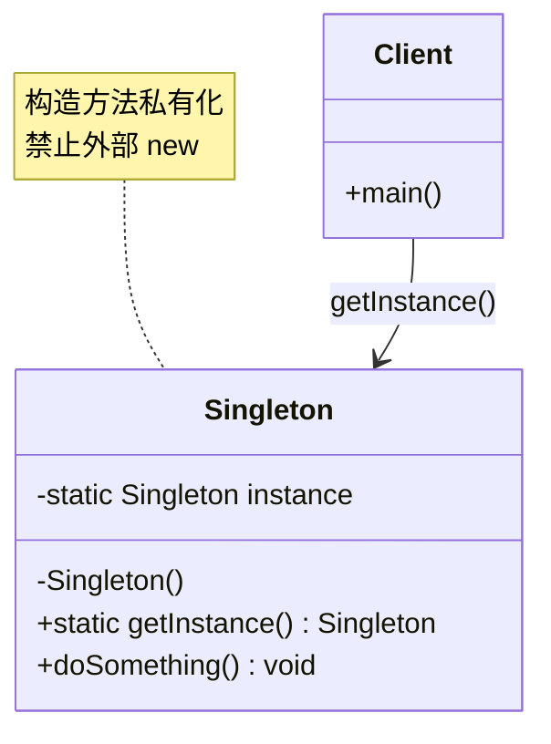
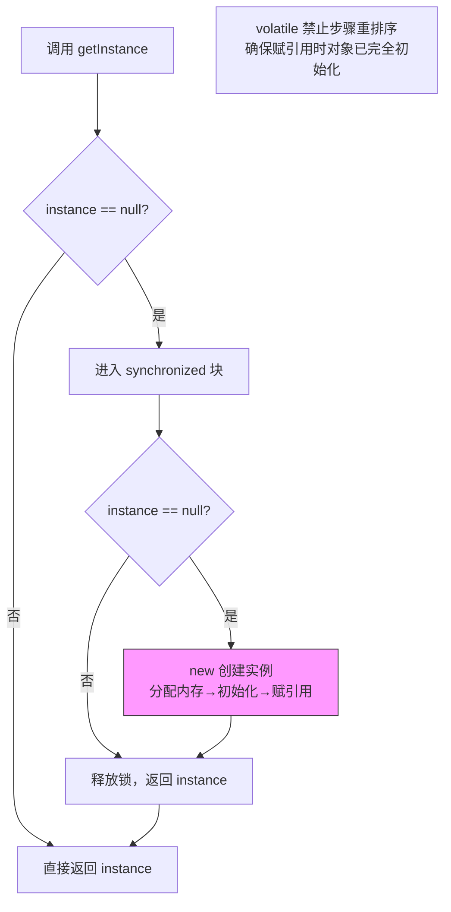

# 单例模式（Singleton Pattern）

> **一句话记忆口诀**：全局唯一实例，懒汉饿汉各有取舍，双重检查锁 + volatile 是生产标准答案。

---

## 1. 引入：它解决了什么问题？

### 没有单例时的问题

在某些场景下，一个类的实例应该全局唯一（如配置管理器、连接池、日志器）。如果不加控制，每次 `new` 都会创建新实例：

```java
// ❌ 反例：每次调用都创建新的配置对象，浪费内存，且配置不一致
public class ConfigManager {
    private Map<String, String> config = new HashMap<>();

    public ConfigManager() {
        // 每次都重新加载配置文件，性能浪费
        loadFromFile("application.properties");
    }
}

// 调用方 A
ConfigManager config1 = new ConfigManager(); // 实例1
// 调用方 B
ConfigManager config2 = new ConfigManager(); // 实例2，与实例1不共享状态！
config1.set("timeout", "3000");
System.out.println(config2.get("timeout")); // null！数据不一致
```

**问题根因**：多个实例各自维护状态，导致数据不一致；重量级对象（如数据库连接池）重复创建浪费资源。

### 工作中的典型应用场景

| 场景 | Spring/JDK 中的例子 |
|------|-------------------|
| Spring Bean 默认作用域 | `@Scope("singleton")`，容器内唯一实例 |
| 运行时环境 | `Runtime.getRuntime()` |
| 日志框架 | `LoggerFactory.getLogger()` 返回同一 Logger |
| 数据库连接池 | `HikariDataSource` 全局唯一 |

---

## 2. 类比：用生活模型建立直觉

### 生活类比：公司的印章

一家公司只有**一枚公章**（全局唯一实例）。

- **接口/抽象角色**：公章的"使用规范"（盖章的行为契约）
- **具体实现角色**：那枚实物公章（Singleton 类本身）
- **调用方**：各部门需要盖章的员工（客户端代码）

员工不能自己刻一枚公章（不能 `new`），必须去找行政部门借用那唯一的一枚（通过 `getInstance()` 获取）。行政部门负责保管，确保全公司只有一枚。

### 抽象定义

> 单例模式确保一个类只有一个实例，并提供一个全局访问点。

---

## 3. 原理：逐步拆解核心机制

### UML 类图



### 五种实现方式逐一对比

#### 方式一：饿汉式（类加载时初始化）

```java
/**
 * 饿汉式单例
 * 设计原因：利用类加载机制保证线程安全，JVM 保证类只加载一次
 * 代价：类加载时就创建实例，即使从未使用也占用内存（对重量级对象不友好）
 */
public class HungrySingleton {
    // JVM 类加载时初始化，天然线程安全
    private static final HungrySingleton INSTANCE = new HungrySingleton();

    // 私有构造方法，禁止外部 new
    private HungrySingleton() {}

    public static HungrySingleton getInstance() {
        return INSTANCE;
    }
}
```

> ✅ **适用场景**：实例创建开销小，且程序运行期间必然会用到。

#### 方式二：懒汉式（延迟初始化，线程不安全）

```java
/**
 * 懒汉式（线程不安全版）
 * 设计原因：延迟初始化，节省资源
 * 代价：多线程下两个线程同时判断 instance == null，会创建两个实例！
 */
public class LazySingleton {
    private static LazySingleton instance;

    private LazySingleton() {}

    // ❌ 线程不安全！不要在生产环境使用
    public static LazySingleton getInstance() {
        if (instance == null) {          // 线程A和线程B同时到达这里
            instance = new LazySingleton(); // 两个线程都会执行！
        }
        return instance;
    }
}
```

#### 方式三：同步方法懒汉式（线程安全，性能差）

```java
/**
 * 同步方法懒汉式
 * 设计原因：加 synchronized 解决线程安全问题
 * 代价：每次调用 getInstance() 都要获取锁，即使实例已创建，性能损耗严重
 *       在高并发场景下，锁竞争会成为瓶颈
 */
public class SyncLazySingleton {
    private static SyncLazySingleton instance;

    private SyncLazySingleton() {}

    // synchronized 加在方法上，锁粒度太大
    public static synchronized SyncLazySingleton getInstance() {
        if (instance == null) {
            instance = new SyncLazySingleton();
        }
        return instance;
    }
}
```

#### 方式四：双重检查锁（DCL，生产推荐）

```java
/**
 * 双重检查锁（Double-Checked Locking）
 * 设计原因：只在第一次创建时加锁，之后直接返回，兼顾线程安全和性能
 * volatile 的作用：禁止指令重排序
 *   instance = new Singleton() 在字节码层面分3步：
 *   1. 分配内存空间
 *   2. 初始化对象
 *   3. 将引用指向内存地址
 *   不加 volatile，JIT 可能将步骤2和3重排序，导致另一个线程拿到
 *   未初始化完成的对象（引用非null但对象字段未赋值）
 */
public class DCLSingleton {
    // volatile 禁止指令重排，这是 DCL 正确性的关键！
    private static volatile DCLSingleton instance;

    private DCLSingleton() {}

    public static DCLSingleton getInstance() {
        if (instance == null) {              // 第一次检查：避免不必要的加锁
            synchronized (DCLSingleton.class) {
                if (instance == null) {      // 第二次检查：防止重复创建
                    instance = new DCLSingleton();
                }
            }
        }
        return instance;
    }
}
```

> ⚠️ **为什么需要两次 null 检查？**
> - 第一次检查：实例已存在时直接返回，避免每次都进入同步块（性能优化）
> - 第二次检查：线程A和线程B同时通过第一次检查后，线程A先获得锁创建了实例，线程B获得锁后再次检查，发现已创建则不再重复创建

#### 方式五：静态内部类（推荐，优雅）

```java
/**
 * 静态内部类方式
 * 设计原因：利用 JVM 类加载机制实现延迟初始化 + 线程安全
 *   - Holder 类只有在 getInstance() 被调用时才会被加载
 *   - JVM 保证类加载过程的线程安全（类初始化锁）
 * 代价：几乎没有，这是最优雅的实现方式
 */
public class HolderSingleton {
    private HolderSingleton() {}

    // 静态内部类：只有被引用时才加载，实现延迟初始化
    private static class Holder {
        // JVM 类加载保证线程安全，无需 synchronized
        private static final HolderSingleton INSTANCE = new HolderSingleton();
    }

    public static HolderSingleton getInstance() {
        return Holder.INSTANCE; // 触发 Holder 类加载
    }
}
```

#### 方式六：枚举单例（防反射攻击）

```java
/**
 * 枚举单例
 * 设计原因：
 *   1. JVM 保证枚举实例唯一，天然线程安全
 *   2. 防止反射攻击（反射无法创建枚举实例，会抛 IllegalArgumentException）
 *   3. 防止反序列化破坏单例（枚举反序列化不会创建新实例）
 * 代价：不支持延迟初始化；部分框架对枚举支持不友好
 * Effective Java 作者 Joshua Bloch 推荐此方式
 */
public enum EnumSingleton {
    INSTANCE;

    public void doSomething() {
        System.out.println("枚举单例执行业务逻辑");
    }
}

// 使用方式
EnumSingleton.INSTANCE.doSomething();
```

### 五种方式对比总结

| 实现方式 | 线程安全 | 延迟加载 | 防反射 | 防序列化 | 推荐度 |
|---------|---------|---------|-------|---------|-------|
| 饿汉式 | ✅ | ❌ | ❌ | ❌ | ⭐⭐⭐ |
| 懒汉式（不加锁） | ❌ | ✅ | ❌ | ❌ | ❌ 不用 |
| 同步方法懒汉式 | ✅ | ✅ | ❌ | ❌ | ⭐ |
| 双重检查锁（DCL） | ✅ | ✅ | ❌ | ❌ | ⭐⭐⭐⭐⭐ |
| 静态内部类 | ✅ | ✅ | ❌ | ❌ | ⭐⭐⭐⭐⭐ |
| 枚举 | ✅ | ❌ | ✅ | ✅ | ⭐⭐⭐⭐ |

### 核心流程图（DCL 方式）



---

## 4. 特性：关键对比

### 单例 vs 静态类（常见混淆）

| 对比维度 | 单例模式 | 静态工具类 |
|---------|---------|----------|
| 目的 | 控制实例数量，维护状态 | 提供无状态的工具方法 |
| 继承/多态 | ✅ 可以实现接口，支持多态 | ❌ 静态方法无法多态 |
| 延迟初始化 | ✅ 支持 | ❌ 类加载即初始化 |
| 测试友好性 | ✅ 可以 Mock | ❌ 难以 Mock |
| 典型例子 | Spring Bean、连接池 | `Math`、`Collections` |

### 在 Spring / JDK 中的应用

| 框架/类 | 单例应用方式 |
|--------|------------|
| Spring IoC 容器 | Bean 默认 singleton 作用域，容器管理唯一实例 |
| `Runtime` | `Runtime.getRuntime()` 饿汉式单例 |
| `System` | 系统级单例，通过静态方法访问 |
| `ApplicationContext` | Spring 应用上下文，全局唯一 |

---

## 5. 边界：异常情况与常见误区

### 误区一：DCL 不加 volatile（运行期问题，JVM 指令重排）

```java
// ❌ 错误：缺少 volatile
private static DCLSingleton instance; // 没有 volatile！

// 为什么会出错（JVM 层面）：
// instance = new DCLSingleton() 编译后字节码分3步：
//   1. NEW 指令：分配堆内存
//   2. INVOKESPECIAL：调用构造方法初始化对象
//   3. PUTSTATIC：将引用写入 instance 字段
// JIT 编译器可能将步骤2和3重排序（在单线程语义不变的前提下允许）
// 结果：线程B看到 instance != null，但对象字段尚未初始化，拿到"半初始化"对象
// 这是运行期问题，且极难复现（依赖 CPU 架构和 JIT 优化时机）
```

```java
// ✅ 正确：加 volatile 禁止重排序
private static volatile DCLSingleton instance;
```

### 误区二：反射破坏单例（运行期问题）

```java
// ❌ 问题：通过反射绕过私有构造方法
Constructor<DCLSingleton> constructor = DCLSingleton.class.getDeclaredConstructor();
constructor.setAccessible(true);
DCLSingleton instance2 = constructor.newInstance(); // 创建了第二个实例！

// ✅ 正确：在构造方法中加防御
private DCLSingleton() {
    if (instance != null) {
        throw new RuntimeException("禁止通过反射创建单例实例！");
    }
}
// 或者使用枚举单例（JVM 层面禁止反射创建枚举实例）
```

### 误区三：序列化破坏单例（运行期问题）

```java
// ❌ 问题：实现 Serializable 后，反序列化会创建新实例
// ObjectInputStream.readObject() 会绕过构造方法直接创建对象

// ✅ 正确：实现 readResolve 方法，反序列化时返回已有实例
public class SerializableSingleton implements Serializable {
    private static final SerializableSingleton INSTANCE = new SerializableSingleton();
    private SerializableSingleton() {}
    public static SerializableSingleton getInstance() { return INSTANCE; }

    // 反序列化时调用此方法，返回已有实例而非新建
    protected Object readResolve() {
        return INSTANCE;
    }
}
```

### 误区四：Spring 中误用多例 Bean 当单例

```java
// ❌ 错误：以为 Spring Bean 都是单例，在单例 Bean 中注入 prototype Bean
@Component // 默认 singleton
public class OrderService {
    @Autowired
    private PrototypeBean prototypeBean; // 只注入一次！每次调用都是同一个实例
}

// ✅ 正确：通过 ApplicationContext 每次获取新实例
@Component
public class OrderService implements ApplicationContextAware {
    private ApplicationContext context;

    public void process() {
        PrototypeBean bean = context.getBean(PrototypeBean.class); // 每次新实例
    }
}
```

---

## 6. 总结：面试标准化表达

### 高频面试题

**Q1：单例模式有哪几种实现方式？各有什么优缺点？**

> 主要有5种：①饿汉式，类加载时初始化，线程安全但不支持延迟加载；②懒汉式，延迟加载但线程不安全；③同步方法懒汉式，线程安全但每次调用都加锁性能差；④双重检查锁（DCL），结合延迟加载和线程安全，需要配合 volatile 禁止指令重排，是生产环境推荐方案；⑤静态内部类，利用 JVM 类加载机制实现延迟加载和线程安全，代码最优雅；⑥枚举，能防止反射和序列化破坏单例，是最安全的方式。

**Q2：DCL 为什么必须加 volatile？**

> `instance = new Singleton()` 在 JVM 字节码层面分三步：分配内存、初始化对象、将引用赋值给 instance。JIT 编译器可能将后两步重排序，导致另一个线程看到 instance 非 null 但对象尚未初始化，拿到"半初始化"对象后调用方法会出现 NPE 或数据异常。volatile 通过内存屏障禁止这种重排序，确保引用赋值时对象已完全初始化。这是运行期问题，依赖 CPU 架构，极难复现。

**Q3：Spring 的 Bean 是单例吗？和单例模式有什么区别？**

> Spring Bean 默认是单例，但与设计模式中的单例有本质区别：设计模式的单例是 JVM 级别的唯一（一个 ClassLoader 内唯一），而 Spring 的单例是容器级别的唯一（同一个 ApplicationContext 内唯一）。如果有多个 Spring 容器，同一个 Bean 类会有多个实例。Spring 通过 IoC 容器管理 Bean 的生命周期，不依赖私有构造方法。

---

> **一句话记忆口诀**：全局唯一实例，懒汉饿汉各有取舍，**双重检查锁 + volatile** 是生产标准答案，枚举最安全防反射。
