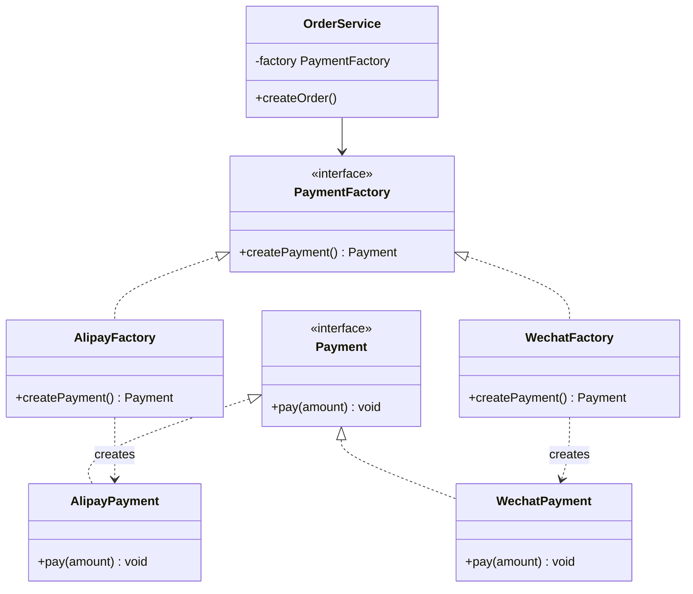
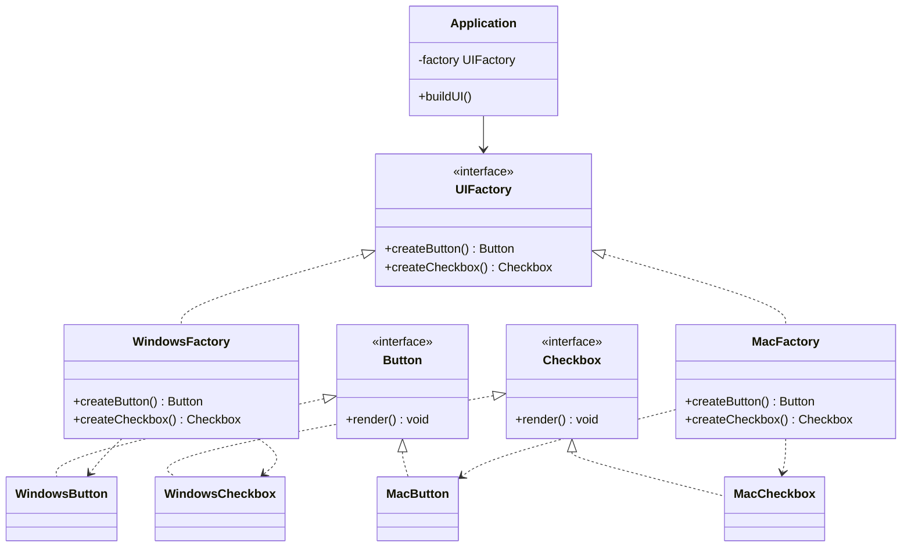
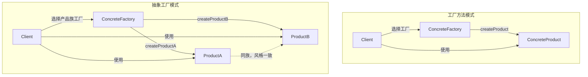

<!-- nav-start -->
---

[⬅️ 上一篇：单例模式](01-单例模式.md) | [🏠 返回目录](../README.md) | [下一篇：建造者模式 ➡️](03-建造者模式.md)

<!-- nav-end -->

# 工厂方法模式 & 抽象工厂模式

> **一句话记忆口诀**：工厂方法"一个产品族，子类决定实例化"；抽象工厂"多个产品族，切换整套产品线"。

---

## 1. 引入：它解决了什么问题？

### 没有工厂模式时的问题

当创建对象的逻辑复杂，或者需要根据条件创建不同类型的对象时，直接 `new` 会导致调用方与具体实现强耦合：

```java
// ❌ 反例：调用方直接 new，与具体实现强耦合
public class OrderService {
    public void createOrder(String payType) {
        if ("alipay".equals(payType)) {
            AlipayPayment payment = new AlipayPayment(); // 直接依赖具体类
            payment.pay(100);
        } else if ("wechat".equals(payType)) {
            WechatPayment payment = new WechatPayment(); // 直接依赖具体类
            payment.pay(100);
        }
        // 新增支付方式？必须修改 OrderService！违反开闭原则
    }
}
```

**问题根因**：
1. 调用方（`OrderService`）与具体实现（`AlipayPayment`）强耦合
2. 新增支付方式必须修改调用方代码，违反**开闭原则**
3. 对象创建逻辑散落在各处，难以统一管理

### 工作中的典型应用场景

| 场景 | Spring/JDK 中的例子 |
|------|-------------------|
| 日志框架 | `LoggerFactory.getLogger()` — 工厂方法 |
| JDBC 驱动 | `DriverManager.getConnection()` — 工厂方法 |
| Spring BeanFactory | `getBean()` — 工厂方法 |
| 跨数据库支持 | `SqlSessionFactory`（MyBatis）— 抽象工厂 |
| GUI 组件 | 不同 OS 创建不同风格的按钮/文本框 — 抽象工厂 |

---

## 2. 类比：用生活模型建立直觉

### 工厂方法：奶茶店加盟

一家奶茶总部（抽象工厂接口）规定了"制作奶茶"的流程，但具体用什么原料、什么口味由各地加盟店（具体工厂子类）决定。

- **接口/抽象角色**：奶茶总部的"制作规范"（`TeaFactory` 接口）
- **具体实现角色**：上海加盟店、北京加盟店（`ShanghaiTeaFactory`、`BeijingTeaFactory`）
- **调用方**：顾客（`Client`），只需说"给我一杯奶茶"，不关心哪家店做的

### 抽象工厂：宜家家居套装

宜家有"北欧风"和"现代风"两套家居风格（产品族）。每套风格都包含沙发、桌子、椅子（产品等级）。你选定一个风格，就能得到整套配套产品。

- **接口/抽象角色**：家居风格工厂（`FurnitureFactory`），定义创建沙发、桌子的方法
- **具体实现角色**：北欧风工厂、现代风工厂（`NordicFactory`、`ModernFactory`）
- **调用方**：装修公司（`Client`），只需选定风格，不关心具体产品型号

### 抽象定义

> **工厂方法模式**：定义一个创建对象的接口，让子类决定实例化哪个类。工厂方法把实例化推迟到子类。
>
> **抽象工厂模式**：提供一个创建一系列相关或相互依赖对象的接口，而无需指定它们的具体类。

---

## 3. 原理：逐步拆解核心机制

### 工厂方法模式 UML 类图



### 工厂方法模式 Java 代码

```java
// ===== 产品接口 =====
public interface Payment {
    void pay(double amount);
}

// ===== 具体产品 =====
public class AlipayPayment implements Payment {
    @Override
    public void pay(double amount) {
        System.out.println("支付宝支付：" + amount + " 元");
    }
}

public class WechatPayment implements Payment {
    @Override
    public void pay(double amount) {
        System.out.println("微信支付：" + amount + " 元");
    }
}

// ===== 工厂接口（核心：定义创建产品的方法）=====
public interface PaymentFactory {
    Payment createPayment(); // 工厂方法：子类决定创建哪种产品
}

// ===== 具体工厂（子类决定实例化哪个产品）=====
public class AlipayFactory implements PaymentFactory {
    @Override
    public Payment createPayment() {
        // 可以在这里加入复杂的初始化逻辑（如读取配置、建立连接）
        return new AlipayPayment();
    }
}

public class WechatFactory implements PaymentFactory {
    @Override
    public Payment createPayment() {
        return new WechatPayment();
    }
}

// ===== 调用方（只依赖接口，不依赖具体实现）=====
public class OrderService {
    private final PaymentFactory factory;

    // 通过构造方法注入工厂（依赖注入，Spring 的核心思想）
    public OrderService(PaymentFactory factory) {
        this.factory = factory;
    }

    public void createOrder(double amount) {
        Payment payment = factory.createPayment(); // 不知道也不关心具体类型
        payment.pay(amount);
    }
}

// ===== 使用示例 =====
public class Main {
    public static void main(String[] args) {
        // 新增支付方式只需新增工厂类，不修改 OrderService！
        OrderService alipayOrder = new OrderService(new AlipayFactory());
        alipayOrder.createOrder(100.0);

        OrderService wechatOrder = new OrderService(new WechatFactory());
        wechatOrder.createOrder(200.0);
    }
}
```

### 抽象工厂模式 UML 类图



### 抽象工厂模式 Java 代码

```java
// ===== 产品接口族 =====
public interface Button {
    void render();
}

public interface Checkbox {
    void render();
}

// ===== Windows 产品族 =====
public class WindowsButton implements Button {
    @Override
    public void render() { System.out.println("渲染 Windows 风格按钮"); }
}

public class WindowsCheckbox implements Checkbox {
    @Override
    public void render() { System.out.println("渲染 Windows 风格复选框"); }
}

// ===== Mac 产品族 =====
public class MacButton implements Button {
    @Override
    public void render() { System.out.println("渲染 Mac 风格按钮"); }
}

public class MacCheckbox implements Checkbox {
    @Override
    public void render() { System.out.println("渲染 Mac 风格复选框"); }
}

// ===== 抽象工厂（核心：创建一族相关产品）=====
public interface UIFactory {
    Button createButton();     // 创建同族按钮
    Checkbox createCheckbox(); // 创建同族复选框
    // 同一工厂创建的产品保证风格一致！
}

// ===== 具体工厂（每个工厂负责一个产品族）=====
public class WindowsFactory implements UIFactory {
    @Override
    public Button createButton() { return new WindowsButton(); }
    @Override
    public Checkbox createCheckbox() { return new WindowsCheckbox(); }
}

public class MacFactory implements UIFactory {
    @Override
    public Button createButton() { return new MacButton(); }
    @Override
    public Checkbox createCheckbox() { return new MacCheckbox(); }
}

// ===== 调用方（切换整套 UI 风格只需换一个工厂）=====
public class Application {
    private final UIFactory factory;

    public Application(UIFactory factory) {
        this.factory = factory;
    }

    public void buildUI() {
        Button button = factory.createButton();
        Checkbox checkbox = factory.createCheckbox();
        button.render();
        checkbox.render();
        // 保证 button 和 checkbox 风格一致！
    }
}
```

### 核心流程图



---

## 4. 特性：关键对比

### 工厂方法 vs 抽象工厂

| 对比维度 | 工厂方法模式 | 抽象工厂模式 |
|---------|------------|------------|
| **目的** | 创建**一种**产品，子类决定具体类型 | 创建**一族**相关产品，保证产品间兼容 |
| **产品数量** | 一个工厂方法，一种产品 | 多个工厂方法，多种产品（产品族） |
| **扩展方式** | 新增产品：新增工厂子类 | 新增产品族：新增工厂类；新增产品种类：修改所有工厂（违反开闭） |
| **使用时机** | 不知道要创建哪种具体产品时 | 需要保证一组产品的兼容性/一致性时 |
| **典型例子** | `LoggerFactory`、Spring `BeanFactory` | MyBatis `SqlSessionFactory`、跨平台 UI |

### 简单工厂 vs 工厂方法 vs 抽象工厂

| 模式 | 特点 | 缺点 |
|------|------|------|
| 简单工厂（非 GoF） | 一个工厂类，switch/if 判断 | 新增产品必须修改工厂类，违反开闭原则 |
| 工厂方法 | 每种产品对应一个工厂子类 | 工厂类数量多 |
| 抽象工厂 | 一个工厂创建一族产品 | 新增产品种类需修改所有工厂 |

### 在 Spring / JDK 中的应用

| 框架/类 | 模式类型 | 说明 |
|--------|---------|------|
| `BeanFactory.getBean()` | 工厂方法 | 根据 Bean 名称/类型创建实例 |
| `LoggerFactory.getLogger()` | 工厂方法 | 返回对应日志实现 |
| `Calendar.getInstance()` | 工厂方法 | 根据 Locale 返回不同 Calendar |
| `DriverManager.getConnection()` | 工厂方法 | 根据 URL 返回对应数据库连接 |
| MyBatis `SqlSessionFactory` | 抽象工厂 | 创建 SqlSession、Executor 等一族对象 |

---

## 5. 边界：异常情况与常见误区

### 误区一：简单工厂当工厂方法用（编译期无问题，运行期违反开闭原则）

```java
// ❌ 错误：用 if-else 实现"工厂"，每次新增类型都要修改这里
public class PaymentFactory {
    public static Payment create(String type) {
        if ("alipay".equals(type)) return new AlipayPayment();
        else if ("wechat".equals(type)) return new WechatPayment();
        // 新增支付宝花呗？必须在这里加 else if！
        throw new IllegalArgumentException("未知支付类型: " + type);
    }
}

// ✅ 正确：用工厂方法模式，新增类型只需新增工厂子类
// 参考上方代码示例
```

### 误区二：抽象工厂新增产品种类时忘记修改所有工厂（编译期报错）

```java
// ❌ 问题：抽象工厂新增 createScrollbar() 方法后，
// 所有具体工厂都必须实现，否则编译报错
public interface UIFactory {
    Button createButton();
    Checkbox createCheckbox();
    Scrollbar createScrollbar(); // 新增！所有实现类都要改！
}

// 这是抽象工厂的固有缺陷：对"产品族扩展"友好，对"产品种类扩展"不友好
// ✅ 解决方案：提供默认实现（Java 8 default 方法），减少修改范围
public interface UIFactory {
    Button createButton();
    Checkbox createCheckbox();
    default Scrollbar createScrollbar() {
        return new DefaultScrollbar(); // 默认实现，子类可选择性覆盖
    }
}
```

### 误区三：工厂方法和 Spring @Bean 混淆

```java
// ❌ 误解：认为 Spring @Bean 就是工厂方法模式
// 实际上 Spring @Bean 更接近"工厂方法"的思想，但 Spring 的核心是 IoC 容器

// ✅ 正确理解：Spring 的 FactoryBean 接口才是工厂方法模式的标准实现
public class MyServiceFactoryBean implements FactoryBean<MyService> {
    @Override
    public MyService getObject() throws Exception {
        // 复杂的创建逻辑
        return new MyServiceImpl();
    }

    @Override
    public Class<?> getObjectType() {
        return MyService.class;
    }
}
```

---

## 6. 总结：面试标准化表达

### 高频面试题

**Q1：工厂方法模式和抽象工厂模式有什么区别？**

> 工厂方法模式关注**单一产品**的创建，定义一个创建产品的接口，由子类决定具体实例化哪个类，适合产品种类单一但需要灵活扩展的场景。抽象工厂模式关注**一族相关产品**的创建，一个工厂接口包含多个工厂方法，保证同一工厂创建的产品相互兼容，适合需要切换整套产品线的场景（如跨平台 UI、多数据库支持）。简单说：工厂方法是"一个产品，多种实现"；抽象工厂是"多个产品，成套切换"。

**Q2：Spring 中哪里用到了工厂模式？**

> Spring 大量使用工厂模式：`BeanFactory` 是工厂方法模式的核心体现，`getBean()` 根据名称/类型返回对应实例；`FactoryBean` 接口允许自定义 Bean 的创建逻辑；`LoggerFactory` 是工厂方法模式；`SqlSessionFactory`（MyBatis）是抽象工厂模式，负责创建 SqlSession、Executor 等一族对象。工厂模式让 Spring 实现了"面向接口编程"，调用方不依赖具体实现类。

**Q3：什么时候用工厂模式，什么时候直接 new？**

> 以下情况考虑工厂模式：①创建逻辑复杂（需要初始化、配置、依赖注入）；②需要根据条件创建不同类型的对象；③需要对创建过程进行统一管理（如缓存、池化）；④需要解耦调用方和具体实现类。如果对象创建简单（一行 new 搞定），且不需要扩展，直接 new 更清晰，不要过度设计。

---

> **一句话记忆口诀**：工厂方法"一个产品，子类决定实例化"；抽象工厂"多个产品，切换整套产品线"；Spring 的 `BeanFactory` 和 `FactoryBean` 是最好的实战案例。

<!-- nav-start -->
---

[⬅️ 上一篇：单例模式](01-单例模式.md) | [🏠 返回目录](../README.md) | [下一篇：建造者模式 ➡️](03-建造者模式.md)

<!-- nav-end -->
