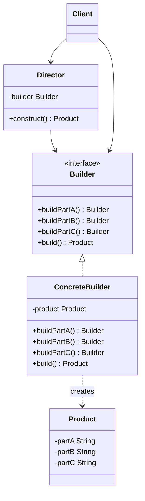
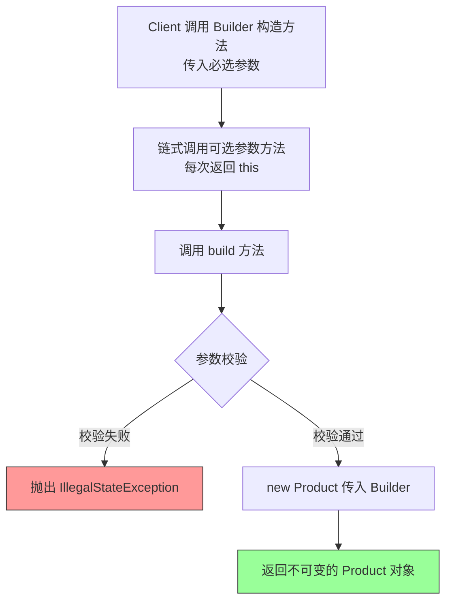

# 建造者模式（Builder Pattern）

> **一句话记忆口诀**：复杂对象分步构建，链式调用优雅组装，`StringBuilder` 和 Lombok `@Builder` 是最熟悉的例子。

---

## 1. 引入：它解决了什么问题？

### 没有建造者模式时的问题

当一个对象有很多可选参数时，构造方法会变得极其难用：

```java
// ❌ 反例一：重叠构造方法（Telescoping Constructor）
// 参数越来越多，调用方根本不知道每个参数是什么含义
public class Pizza {
    public Pizza(String size) { ... }
    public Pizza(String size, boolean cheese) { ... }
    public Pizza(String size, boolean cheese, boolean pepperoni) { ... }
    public Pizza(String size, boolean cheese, boolean pepperoni, boolean mushrooms) { ... }
    // 调用方：new Pizza("large", true, false, true) — 第3个参数是什么？！
}

// ❌ 反例二：JavaBean 模式（setter 注入）
// 对象在多次 setter 调用之间处于"不一致状态"，且无法创建不可变对象
Pizza pizza = new Pizza();
pizza.setSize("large");
// 此时 pizza 处于半初始化状态，如果在这里被其他线程访问，会有问题！
pizza.setCheese(true);
pizza.setPepperoni(false);
// 无法设为 final，无法保证线程安全
```

**问题根因**：
1. 重叠构造方法：参数多时可读性极差，调用方容易传错参数顺序
2. JavaBean 模式：对象在构建过程中状态不一致，无法创建不可变对象

### 工作中的典型应用场景

| 场景 | Spring/JDK 中的例子 |
|------|-------------------|
| 字符串拼接 | `StringBuilder.append().append().toString()` |
| HTTP 请求构建 | `HttpRequest.newBuilder().uri().header().build()` |
| SQL 构建 | MyBatis `QueryWrapper` 链式调用 |
| 测试数据构建 | Lombok `@Builder` 注解 |
| Spring Security | `HttpSecurity.authorizeRequests().and().csrf()` |

---

## 2. 类比：用生活模型建立直觉

### 生活类比：汉堡套餐定制

麦当劳点餐时，你可以自定义汉堡：选面包、选肉饼、选蔬菜、选酱料。收银员（Director）按照你的要求，指挥后厨（Builder）一步步组装汉堡（Product）。

- **接口/抽象角色**：后厨操作规范（`BurgerBuilder` 接口），定义"加面包"、"加肉饼"等步骤
- **具体实现角色**：巨无霸后厨、麦辣鸡腿堡后厨（`BigMacBuilder`、`SpicyChickenBuilder`）
- **调用方**：收银员（`Director`），负责按顺序调用构建步骤；顾客（`Client`），最终拿到汉堡

关键点：顾客不需要知道汉堡是怎么一步步做出来的，只需要告诉收银员"我要一个巨无霸"。

### 抽象定义

> 建造者模式将一个复杂对象的**构建过程**与其**表示**分离，使得同样的构建过程可以创建不同的表示。

---

## 3. 原理：逐步拆解核心机制

### UML 类图



### 两种实现方式

#### 方式一：经典建造者（含 Director）

```java
// ===== 产品类（复杂对象）=====
public class Computer {
    private final String cpu;       // 必选
    private final String memory;    // 必选
    private final String storage;   // 可选
    private final String gpu;       // 可选
    private final String monitor;   // 可选

    // 私有构造方法，只能通过 Builder 创建
    // 设计原因：防止外部直接 new，强制使用 Builder，保证对象完整性
    private Computer(Builder builder) {
        this.cpu = builder.cpu;
        this.memory = builder.memory;
        this.storage = builder.storage;
        this.gpu = builder.gpu;
        this.monitor = builder.monitor;
    }

    // ===== 静态内部 Builder 类 =====
    public static class Builder {
        // 必选参数（在 Builder 构造方法中强制传入）
        private final String cpu;
        private final String memory;
        // 可选参数（有默认值）
        private String storage = "256GB SSD";
        private String gpu = "集成显卡";
        private String monitor = "无";

        // 必选参数通过构造方法传入，确保不可缺少
        public Builder(String cpu, String memory) {
            this.cpu = cpu;
            this.memory = memory;
        }

        // 可选参数通过链式方法设置，返回 this 支持链式调用
        public Builder storage(String storage) {
            this.storage = storage;
            return this; // 返回 this，支持链式调用
        }

        public Builder gpu(String gpu) {
            this.gpu = gpu;
            return this;
        }

        public Builder monitor(String monitor) {
            this.monitor = monitor;
            return this;
        }

        // build() 方法：执行参数校验，创建最终对象
        public Computer build() {
            // 在这里做参数校验，确保对象状态合法
            if (cpu == null || cpu.isEmpty()) {
                throw new IllegalStateException("CPU 不能为空");
            }
            return new Computer(this);
        }
    }

    @Override
    public String toString() {
        return String.format("Computer{cpu='%s', memory='%s', storage='%s', gpu='%s', monitor='%s'}",
                cpu, memory, storage, gpu, monitor);
    }
}

// ===== 使用示例 =====
public class Main {
    public static void main(String[] args) {
        // 链式调用，可读性极强，每个参数含义一目了然
        Computer gamingPC = new Computer.Builder("Intel i9", "32GB")
                .storage("2TB NVMe SSD")
                .gpu("RTX 4090")
                .monitor("4K 144Hz")
                .build();

        // 只设置必选参数，可选参数使用默认值
        Computer officePC = new Computer.Builder("Intel i5", "16GB")
                .build();

        System.out.println(gamingPC);
        System.out.println(officePC);
    }
}
```

#### 方式二：Lombok @Builder（工作中最常用）

```java
// 设计原因：Lombok 在编译期自动生成 Builder 代码，消除样板代码
// 代价：需要引入 Lombok 依赖；生成代码不可见，调试时需要查看 target 目录
@Builder
@ToString
public class UserDTO {
    private String username;
    private String email;
    private Integer age;
    @Builder.Default  // 设置默认值，不加此注解默认值会被忽略！
    private String role = "USER";
}

// 使用方式
UserDTO user = UserDTO.builder()
        .username("张三")
        .email("zhangsan@example.com")
        .age(25)
        .build();
```

### 核心流程图



---

## 4. 特性：关键对比

### 建造者模式 vs 工厂模式

| 对比维度 | 建造者模式 | 工厂模式 |
|---------|----------|---------|
| **目的** | 分步构建复杂对象，关注**构建过程** | 创建对象，关注**创建结果** |
| **适用场景** | 对象有多个可选参数，构建步骤复杂 | 根据条件创建不同类型的对象 |
| **对象复杂度** | 同一类型对象，参数组合多样 | 不同类型的对象 |
| **典型例子** | `StringBuilder`、`HttpRequest.Builder` | `BeanFactory`、`LoggerFactory` |

### 建造者模式 vs 构造方法

| 对比维度 | 建造者模式 | 构造方法 |
|---------|----------|---------|
| 可读性 | ✅ 参数名称清晰 | ❌ 多参数时难以辨认 |
| 可选参数 | ✅ 灵活设置，有默认值 | ❌ 需要重叠构造方法 |
| 不可变对象 | ✅ 支持（final 字段） | ✅ 支持 |
| 参数校验 | ✅ 在 build() 中集中校验 | ✅ 在构造方法中校验 |

### 在 Spring / JDK 中的应用

| 框架/类 | 说明 |
|--------|------|
| `StringBuilder` | 最经典的建造者，`append()` 链式调用 |
| `HttpRequest.newBuilder()` | Java 11 HTTP Client |
| `UriComponentsBuilder` | Spring MVC URL 构建 |
| `MockMvcRequestBuilders` | Spring Test 请求构建 |
| `BeanDefinitionBuilder` | Spring 编程式注册 Bean |

---

## 5. 边界：异常情况与常见误区

### 误区一：Lombok @Builder 忘记 @Builder.Default 导致默认值丢失（运行期问题）

```java
// ❌ 错误：以为字段初始化值就是 Builder 的默认值
@Builder
public class Config {
    private int timeout = 3000;  // 这个默认值在 Builder 中会被忽略！
    private String host = "localhost"; // 同上！
}

// 实际效果：Config.builder().build() 得到的 timeout = 0，host = null
// 原因：Lombok @Builder 生成的代码中，字段初始化值不会被带入 Builder

// ✅ 正确：使用 @Builder.Default 注解
@Builder
public class Config {
    @Builder.Default
    private int timeout = 3000;  // 正确！Builder 中会使用此默认值
    @Builder.Default
    private String host = "localhost";
}
```

### 误区二：Builder 对象被多次 build()（运行期问题）

```java
// ❌ 错误：复用同一个 Builder 对象创建多个实例
Computer.Builder builder = new Computer.Builder("Intel i5", "16GB");
Computer pc1 = builder.storage("512GB").build();
Computer pc2 = builder.gpu("RTX 3060").build(); // pc2 同时有 storage 和 gpu！

// 原因：Builder 是有状态的，之前设置的参数会保留
// ✅ 正确：每次创建新的 Builder
Computer pc1 = new Computer.Builder("Intel i5", "16GB").storage("512GB").build();
Computer pc2 = new Computer.Builder("Intel i5", "16GB").gpu("RTX 3060").build();
```

### 误区三：对简单对象过度使用建造者模式（设计问题）

```java
// ❌ 过度设计：只有2个参数的对象用 Builder
@Builder
public class Point {
    private int x;
    private int y;
}
// 直接 new Point(x, y) 更清晰！

// ✅ 建造者模式适合：参数 >= 4个，且有多个可选参数的场景
// 参数少于4个时，直接使用构造方法或静态工厂方法更简洁
```

---

## 6. 总结：面试标准化表达

### 高频面试题

**Q1：建造者模式解决了什么问题？**

> 建造者模式解决了复杂对象构建时的两个问题：①重叠构造方法问题——当对象有多个可选参数时，构造方法参数列表过长，调用方容易传错参数顺序；②JavaBean 模式的线程安全问题——通过多次 setter 构建对象时，对象在构建过程中处于不一致状态，且无法创建不可变对象。建造者模式通过链式调用分步设置参数，在 `build()` 方法中统一校验并创建最终对象，既保证可读性，又支持不可变对象。

**Q2：StringBuilder 为什么是建造者模式？**

> `StringBuilder` 体现了建造者模式的核心思想：通过 `append()` 方法分步添加字符串片段（构建过程），最终通过 `toString()` 获取完整字符串（构建结果）。每个 `append()` 返回 `this`，支持链式调用。与直接字符串拼接（`+` 操作符）相比，`StringBuilder` 将构建过程与最终结果分离，避免了每次拼接都创建新 String 对象的性能问题。

**Q3：Lombok @Builder 有什么注意事项？**

> 使用 `@Builder` 时有两个常见陷阱：①字段默认值问题——字段初始化值（如 `private int timeout = 3000`）在 Builder 中会被忽略，必须加 `@Builder.Default` 注解才能生效；②与 `@Data` 组合使用时，需要同时加 `@AllArgsConstructor` 和 `@NoArgsConstructor`，否则 Jackson 反序列化会失败，因为 `@Builder` 会生成全参构造方法，而 Jackson 需要无参构造方法。

---

> **一句话记忆口诀**：复杂对象分步构建，链式调用优雅组装，必选参数进构造方法，可选参数链式设置，`build()` 统一校验，`StringBuilder` 和 Lombok `@Builder` 是最熟悉的例子。