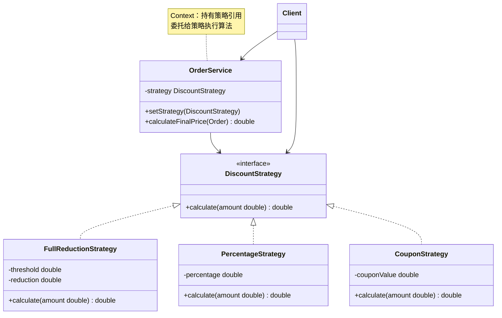
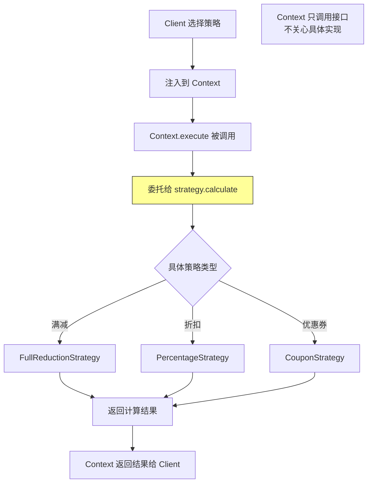

<!-- nav-start -->

---

[⬅️ 上一篇：适配器模式（Adapter Pattern）](06-适配器模式.md) | [🏠 返回目录](../README.md) | [下一篇：观察者模式（Observer Pattern） ➡️](08-观察者模式.md)

<!-- nav-end -->

# 策略模式（Strategy Pattern）

> **一句话记忆口诀**：策略封装算法族，运行期自由切换，消灭 if-else，`Comparator` 和 Spring `ResourceLoader` 是最熟悉的例子。

---

## 1. 引入：它解决了什么问题？

### 没有策略模式时的问题

当一个功能有多种实现算法，且需要根据条件动态切换时，if-else 会越来越长：

```java
// ❌ 反例：促销活动用 if-else 判断折扣策略
public class OrderService {
    public double calculateDiscount(Order order, String promotionType) {
        if ("FULL_REDUCTION".equals(promotionType)) {
            // 满减：满100减20
            return order.getAmount() >= 100 ? order.getAmount() - 20 : order.getAmount();
        } else if ("PERCENTAGE".equals(promotionType)) {
            // 折扣：打8折
            return order.getAmount() * 0.8;
        } else if ("COUPON".equals(promotionType)) {
            // 优惠券：减50
            return Math.max(0, order.getAmount() - 50);
        } else if ("VIP".equals(promotionType)) {
            // VIP：打7折
            return order.getAmount() * 0.7;
        }
        // 新增促销类型？必须修改这个方法！违反开闭原则
        return order.getAmount();
    }
}
```

**问题根因**：
1. 所有算法混在一个方法里，违反**单一职责原则**
2. 新增算法必须修改已有代码，违反**开闭原则**
3. 算法无法复用，无法单独测试

### 工作中的典型应用场景

| 场景 | Spring/JDK 中的例子 |
|------|-------------------|
| 排序算法 | `Collections.sort(list, comparator)` |
| 线程池拒绝策略 | `ThreadPoolExecutor` 的 `RejectedExecutionHandler` |
| Spring 资源加载 | `ResourceLoader` 策略 |
| 支付方式选择 | 支付宝/微信/银行卡策略 |
| 促销折扣计算 | 满减/折扣/优惠券策略 |

---

## 2. 类比：用生活模型建立直觉

### 生活类比：导航软件的路线规划

高德地图提供多种路线规划策略：最快路线、最短路线、避开高速、步行路线。你选择一种策略，导航软件就按该策略计算路线。切换策略不需要重新安装软件。

- **接口/抽象角色**：路线规划策略（`RouteStrategy` 接口），定义"计算路线"行为
- **具体实现角色**：最快路线策略、最短路线策略（`FastestRoute`、`ShortestRoute`）
- **调用方（Context）**：导航软件（`Navigator`），持有策略引用，委托给策略执行

关键点：导航软件（Context）不关心具体算法，只调用策略接口；用户（Client）选择策略并注入。

### 抽象定义

> 策略模式定义一系列算法，把它们一个个封装起来，并且使它们可以相互替换。策略模式让算法的变化独立于使用算法的客户。

---

## 3. 原理：逐步拆解核心机制

### UML 类图



### Java 代码示例

```java
// ===== 策略接口 =====
@FunctionalInterface // 策略接口通常只有一个方法，可以用 Lambda 实现
public interface DiscountStrategy {
    double calculate(double originalAmount);
}

// ===== 具体策略（每种算法独立封装）=====
// 满减策略
public class FullReductionStrategy implements DiscountStrategy {
    private final double threshold; // 满减门槛
    private final double reduction; // 减免金额

    public FullReductionStrategy(double threshold, double reduction) {
        this.threshold = threshold;
        this.reduction = reduction;
    }

    @Override
    public double calculate(double originalAmount) {
        return originalAmount >= threshold ? originalAmount - reduction : originalAmount;
    }
}

// 折扣策略
public class PercentageStrategy implements DiscountStrategy {
    private final double percentage; // 折扣比例，如 0.8 表示 8 折

    public PercentageStrategy(double percentage) {
        this.percentage = percentage;
    }

    @Override
    public double calculate(double originalAmount) {
        return originalAmount * percentage;
    }
}

// 优惠券策略
public class CouponStrategy implements DiscountStrategy {
    private final double couponValue;

    public CouponStrategy(double couponValue) {
        this.couponValue = couponValue;
    }

    @Override
    public double calculate(double originalAmount) {
        return Math.max(0, originalAmount - couponValue);
    }
}

// ===== Context（持有策略，委托执行）=====
public class OrderService {
    private DiscountStrategy strategy;

    // 通过构造方法或 setter 注入策略
    public OrderService(DiscountStrategy strategy) {
        this.strategy = strategy;
    }

    // 运行期切换策略
    public void setStrategy(DiscountStrategy strategy) {
        this.strategy = strategy;
    }

    public double calculateFinalPrice(double originalAmount) {
        // Context 不关心具体算法，委托给策略执行
        return strategy.calculate(originalAmount);
    }
}

// ===== 使用示例 =====
public class Main {
    public static void main(String[] args) {
        // 方式一：传统策略对象
        OrderService service = new OrderService(new FullReductionStrategy(100, 20));
        System.out.println("满减后价格: " + service.calculateFinalPrice(150)); // 130.0

        // 方式二：Lambda 表达式（策略接口是函数式接口时）
        // 设计原因：Java 8 Lambda 让策略模式更简洁，无需创建具体策略类
        service.setStrategy(amount -> amount * 0.8); // 8折
        System.out.println("折扣后价格: " + service.calculateFinalPrice(150)); // 120.0

        // 方式三：用 Map 存储策略，根据 key 选择（消灭 if-else 的最佳实践）
        Map<String, DiscountStrategy> strategies = new HashMap<>();
        strategies.put("FULL_REDUCTION", new FullReductionStrategy(100, 20));
        strategies.put("PERCENTAGE", new PercentageStrategy(0.8));
        strategies.put("COUPON", new CouponStrategy(50));
        strategies.put("VIP", amount -> amount * 0.7);

        String promotionType = "VIP";
        DiscountStrategy selectedStrategy = strategies.getOrDefault(
                promotionType, amount -> amount); // 默认不打折
        System.out.println("VIP价格: " + selectedStrategy.calculate(150)); // 105.0
    }
}
```

### 核心流程图



---

## 4. 特性：关键对比

### 策略模式 vs 工厂模式（常见混淆）

| 对比维度 | 策略模式 | 工厂模式 |
|---------|---------|---------|
| **目的** | 封装**算法**，运行期切换 | 封装**创建逻辑**，创建对象 |
| **关注点** | 行为（怎么做） | 创建（创建什么） |
| **Context** | 持有策略，委托执行 | 不持有，只负责创建 |
| **典型例子** | `Comparator`、拒绝策略 | `BeanFactory`、`LoggerFactory` |

### 策略模式 vs 模板方法模式

| 对比维度 | 策略模式 | 模板方法模式 |
|---------|---------|------------|
| **实现机制** | 组合（持有策略接口） | 继承（子类覆盖方法） |
| **算法骨架** | 无固定骨架，算法完全可替换 | 有固定骨架，子类只实现差异部分 |
| **灵活性** | 运行期切换 | 编译期确定 |
| **典型例子** | `Comparator`、支付策略 | `AbstractList`、`HttpServlet` |

### 在 Spring / JDK 中的应用

| 框架/类 | 说明 |
|--------|------|
| `Comparator` | 排序策略，`Collections.sort(list, comparator)` |
| `ThreadPoolExecutor.RejectedExecutionHandler` | 线程池拒绝策略（4种） |
| Spring `ResourceLoader` | 资源加载策略（classpath/file/url） |
| Spring `TransactionManager` | 事务管理策略（JDBC/JPA/Hibernate） |
| Spring `HandlerMapping` | URL 映射策略 |

---

## 5. 边界：异常情况与常见误区

### 误区一：策略类过多，没有用 Map 管理（设计问题）

```java
// ❌ 问题：策略类很多时，选择逻辑仍然是 if-else
public DiscountStrategy getStrategy(String type) {
    if ("FULL_REDUCTION".equals(type)) return new FullReductionStrategy(100, 20);
    else if ("PERCENTAGE".equals(type)) return new PercentageStrategy(0.8);
    // 还是 if-else！只是把 if-else 从业务代码移到了工厂方法
}

// ✅ 正确：用 Map + Spring @Component 自动注册策略
// 每个策略实现一个 getType() 方法，启动时自动注册到 Map
@Component
public class DiscountStrategyFactory {
    private final Map<String, DiscountStrategy> strategyMap;

    // Spring 自动注入所有 DiscountStrategy 实现类
    public DiscountStrategyFactory(List<DiscountStrategy> strategies) {
        this.strategyMap = strategies.stream()
                .collect(Collectors.toMap(DiscountStrategy::getType, s -> s));
    }

    public DiscountStrategy getStrategy(String type) {
        return strategyMap.getOrDefault(type, DEFAULT_STRATEGY);
    }
}
```

### 误区二：策略接口设计过于宽泛，导致策略实现复杂（设计问题）

```java
// ❌ 错误：策略接口包含太多方法，实现类被迫实现不需要的方法
public interface PaymentStrategy {
    void pay(double amount);
    void refund(double amount);
    void queryStatus(String transactionId);
    void generateReport(); // 并非所有支付方式都需要报表
}

// ✅ 正确：策略接口保持单一职责，只包含核心算法
public interface PaymentStrategy {
    PaymentResult pay(PaymentRequest request);
}
// 退款、查询等用独立接口或抽象类提供默认实现
```

### 误区三：在 Spring 中策略 Bean 有状态，导致并发问题（运行期问题）

```java
// ❌ 错误：策略 Bean 是 Spring 单例，但有可变状态
@Component
public class PercentageStrategy implements DiscountStrategy {
    private double percentage; // 可变状态！多线程共享会有并发问题

    public void setPercentage(double percentage) {
        this.percentage = percentage; // 线程不安全！
    }

    @Override
    public double calculate(double amount) {
        return amount * percentage;
    }
}

// ✅ 正确：策略 Bean 应该是无状态的，参数通过方法传入
@Component
public class PercentageStrategy implements DiscountStrategy {
    @Override
    public double calculate(double amount, DiscountConfig config) {
        return amount * config.getPercentage(); // 参数从外部传入，无状态
    }
}
```

---

## 6. 总结：面试标准化表达

### 高频面试题

**Q1：策略模式解决了什么问题？如何消灭 if-else？**

> 策略模式解决了算法选择逻辑与业务逻辑混在一起的问题。当有多种算法需要根据条件切换时，if-else 会越来越长，新增算法必须修改已有代码，违反开闭原则。策略模式将每种算法封装为独立的策略类，通过接口统一调用。消灭 if-else 的最佳实践是：用 `Map<String, Strategy>` 存储所有策略，根据 key 直接获取，新增策略只需新增类并注册到 Map，不修改已有代码。

**Q2：Java 8 的 Lambda 如何简化策略模式？**

> 当策略接口只有一个方法（函数式接口）时，可以用 Lambda 表达式直接作为策略，无需创建具体策略类。例如 `Collections.sort(list, (a, b) -> a.compareTo(b))` 中的 Lambda 就是一个 `Comparator` 策略。这大大减少了样板代码，使策略模式更轻量。但对于复杂策略（有多个方法、需要注入依赖），仍然需要创建具体策略类。

**Q3：策略模式和模板方法模式有什么区别？**

> 两者都是封装算法变化，但机制不同：策略模式通过**组合**，Context 持有策略接口，运行期可以切换策略，算法完全可替换；模板方法模式通过**继承**，父类定义算法骨架（固定步骤），子类覆盖可变步骤，编译期确定。选择标准：如果算法骨架固定，只有部分步骤不同，用模板方法；如果整个算法都可能替换，用策略模式。

---

> **一句话记忆口诀**：策略封装算法族，运行期自由切换，`Map<String, Strategy>` 消灭 if-else，`Comparator` 和线程池拒绝策略是最熟悉的例子。

<!-- nav-start -->

---

[⬅️ 上一篇：适配器模式（Adapter Pattern）](06-适配器模式.md) | [🏠 返回目录](../README.md) | [下一篇：观察者模式（Observer Pattern） ➡️](08-观察者模式.md)

<!-- nav-end -->
