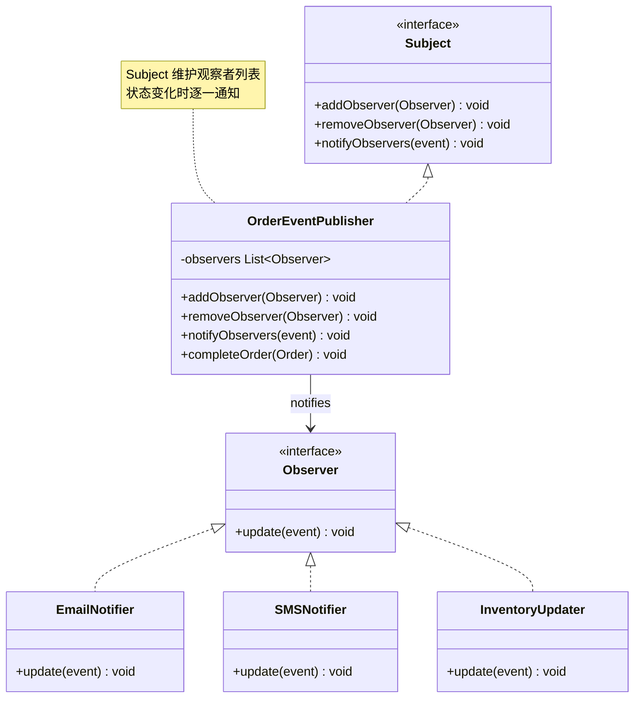
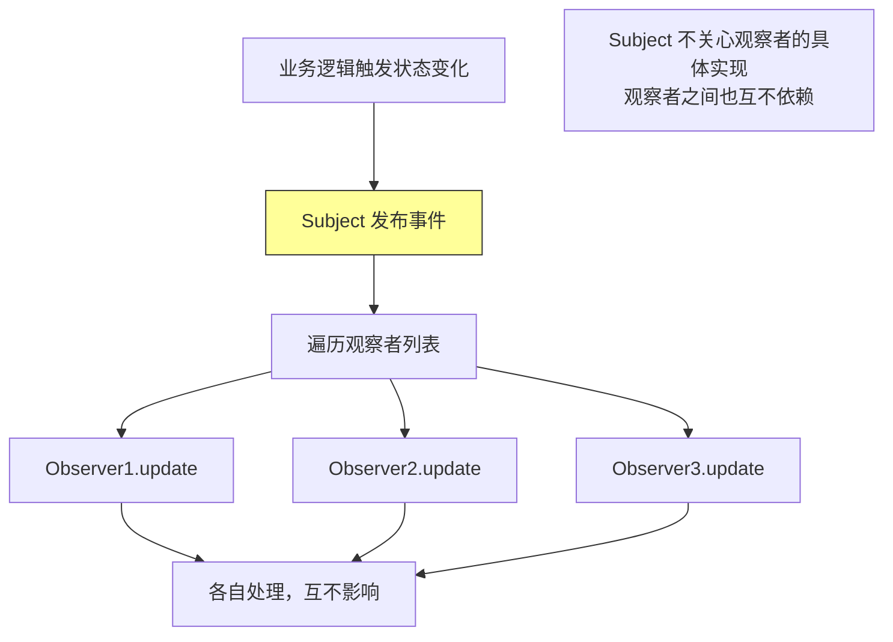

<!-- nav-start -->

---

[⬅️ 上一篇：策略模式（Strategy Pattern）](07-策略模式.md) | [🏠 返回目录](../README.md) | [下一篇：模板方法模式（Template Method Pattern） ➡️](09-模板方法模式.md)

<!-- nav-end -->

# 观察者模式（Observer Pattern）

> **一句话记忆口诀**：观察者一对多通知，发布-订阅解耦，Spring `ApplicationEvent` 和 JDK `Observable` 是最熟悉的例子。

---

## 1. 引入：它解决了什么问题？

### 没有观察者模式时的问题

当一个对象状态变化需要通知多个其他对象时，直接调用会导致强耦合：

```java
// ❌ 反例：订单状态变化时，直接调用所有依赖方
public class OrderService {
    private EmailService emailService;
    private SMSService smsService;
    private InventoryService inventoryService;
    private PointsService pointsService;
    private LogService logService;

    public void completeOrder(Order order) {
        order.setStatus(OrderStatus.COMPLETED);
        orderRepository.save(order);

        // 直接调用所有依赖方——强耦合！
        emailService.sendConfirmationEmail(order);    // 发邮件
        smsService.sendSMS(order.getUserPhone(), "订单完成"); // 发短信
        inventoryService.deductStock(order);          // 扣库存
        pointsService.addPoints(order.getUserId(), order.getAmount()); // 加积分
        logService.logOrderComplete(order);           // 记录日志

        // 新增一个通知方式？必须修改 OrderService！
        // 如果某个服务抛异常，后续通知都不会执行！
    }
}
```

**问题根因**：
1. `OrderService` 与所有通知方强耦合，新增通知方必须修改核心业务代码
2. 通知逻辑与业务逻辑混在一起，违反单一职责原则
3. 某个通知失败会影响其他通知的执行

### 工作中的典型应用场景

| 场景 | Spring/JDK 中的例子 |
|------|-------------------|
| Spring 事件机制 | `ApplicationEvent` + `@EventListener` |
| GUI 事件处理 | `ActionListener`、`MouseListener` |
| 消息队列 | Kafka/RabbitMQ 的发布-订阅 |
| 数据库变更通知 | MySQL Binlog 监听 |
| 配置中心 | Nacos/Apollo 配置变更推送 |

---

## 2. 类比：用生活模型建立直觉

### 生活类比：微信公众号订阅

一个公众号（被观察者/Subject）发布文章时，所有订阅了该公众号的用户（观察者/Observer）都会收到推送通知。用户可以随时订阅或取消订阅，公众号不需要知道具体有哪些用户。

- **接口/抽象角色**：
  - 公众号接口（`Subject`）：定义订阅、取消订阅、通知方法
  - 用户接口（`Observer`）：定义接收通知的方法
- **具体实现角色**：
  - 具体公众号（`TechBlog`）：维护订阅者列表，发布文章时通知所有人
  - 具体用户（`UserA`、`UserB`）：实现接收通知的逻辑
- **调用方**：公众号运营者（`Client`），触发文章发布

### 抽象定义

> 观察者模式定义对象间的一种一对多的依赖关系，当一个对象的状态发生改变时，所有依赖于它的对象都得到通知并被自动更新。

---

## 3. 原理：逐步拆解核心机制

### UML 类图



### Java 代码示例（手动实现）

```java
// ===== 事件对象（携带通知数据）=====
public class OrderCompletedEvent {
    private final Order order;
    private final LocalDateTime occurredAt;

    public OrderCompletedEvent(Order order) {
        this.order = order;
        this.occurredAt = LocalDateTime.now();
    }
    // getters...
}

// ===== 观察者接口 =====
public interface OrderObserver {
    void onOrderCompleted(OrderCompletedEvent event);
}

// ===== 被观察者接口 =====
public interface OrderSubject {
    void addObserver(OrderObserver observer);
    void removeObserver(OrderObserver observer);
    void notifyObservers(OrderCompletedEvent event);
}

// ===== 具体被观察者（Subject）=====
public class OrderService implements OrderSubject {
    // 使用 CopyOnWriteArrayList 保证线程安全（观察者列表可能被并发修改）
    private final List<OrderObserver> observers = new CopyOnWriteArrayList<>();

    @Override
    public void addObserver(OrderObserver observer) {
        observers.add(observer);
    }

    @Override
    public void removeObserver(OrderObserver observer) {
        observers.remove(observer);
    }

    @Override
    public void notifyObservers(OrderCompletedEvent event) {
        // 逐一通知所有观察者
        for (OrderObserver observer : observers) {
            try {
                observer.onOrderCompleted(event);
            } catch (Exception e) {
                // 某个观察者失败不影响其他观察者
                log.error("观察者通知失败: {}", observer.getClass().getSimpleName(), e);
            }
        }
    }

    public void completeOrder(Order order) {
        order.setStatus(OrderStatus.COMPLETED);
        orderRepository.save(order);
        // 只发布事件，不关心谁来处理
        notifyObservers(new OrderCompletedEvent(order));
    }
}

// ===== 具体观察者 =====
public class EmailNotifier implements OrderObserver {
    @Override
    public void onOrderCompleted(OrderCompletedEvent event) {
        System.out.println("发送确认邮件给: " + event.getOrder().getUserEmail());
    }
}

public class InventoryUpdater implements OrderObserver {
    @Override
    public void onOrderCompleted(OrderCompletedEvent event) {
        System.out.println("扣减库存: " + event.getOrder().getItems());
    }
}

// ===== 使用示例 =====
public class Main {
    public static void main(String[] args) {
        OrderService orderService = new OrderService();

        // 注册观察者（新增通知方式只需注册，不修改 OrderService）
        orderService.addObserver(new EmailNotifier());
        orderService.addObserver(new InventoryUpdater());
        orderService.addObserver(event ->
                System.out.println("积分服务: 添加积分 " + event.getOrder().getAmount()));

        orderService.completeOrder(new Order(1L));
    }
}
```

### Spring 事件机制（工作中最常用）

```java
// ===== Spring 事件对象 =====
public class OrderCompletedEvent extends ApplicationEvent {
    private final Order order;

    public OrderCompletedEvent(Object source, Order order) {
        super(source);
        this.order = order;
    }
    public Order getOrder() { return order; }
}

// ===== 事件发布者（被观察者）=====
@Service
public class OrderService {
    @Autowired
    private ApplicationEventPublisher eventPublisher; // Spring 内置发布者

    @Transactional
    public void completeOrder(Order order) {
        order.setStatus(OrderStatus.COMPLETED);
        orderRepository.save(order);
        // 发布事件，不关心谁来处理
        eventPublisher.publishEvent(new OrderCompletedEvent(this, order));
    }
}

// ===== 事件监听者（观察者）=====
@Component
public class EmailNotifier {
    // @EventListener 自动注册为观察者
    @EventListener
    public void onOrderCompleted(OrderCompletedEvent event) {
        emailService.sendConfirmation(event.getOrder());
    }
}

@Component
public class InventoryUpdater {
    @EventListener
    @Async // 异步处理，不阻塞主流程
    public void onOrderCompleted(OrderCompletedEvent event) {
        inventoryService.deduct(event.getOrder());
    }
}
```

### 核心流程图



---

## 4. 特性：关键对比

### 观察者模式 vs 发布-订阅模式

| 对比维度 | 观察者模式 | 发布-订阅模式 |
|---------|----------|------------|
| **耦合度** | Subject 直接持有 Observer 引用，有一定耦合 | 通过消息中间件完全解耦 |
| **通信方式** | 同步（直接调用） | 可以异步（消息队列） |
| **中间层** | 无 | 有（消息中间件/事件总线） |
| **典型例子** | JDK `Observable`、Spring `ApplicationEvent` | Kafka、RabbitMQ |

### 在 Spring / JDK 中的应用

| 框架/类 | 说明 |
|--------|------|
| Spring `ApplicationEvent` | Spring 内置事件机制，`@EventListener` 注册观察者 |
| JDK `java.util.Observable` | JDK 内置观察者（已废弃，JDK 9+） |
| Guava `EventBus` | 基于注解的事件总线 |
| RxJava `Observable` | 响应式编程的观察者 |
| Kafka Consumer | 消息消费者是观察者 |

---

## 5. 边界：异常情况与常见误区

### 误区一：观察者抛异常导致后续观察者不执行（运行期问题）

```java
// ❌ 错误：没有异常处理，一个观察者失败导致后续都不执行
public void notifyObservers(OrderCompletedEvent event) {
    for (OrderObserver observer : observers) {
        observer.onOrderCompleted(event); // 如果这里抛异常，后续观察者不执行！
    }
}

// ✅ 正确：捕获每个观察者的异常，保证其他观察者正常执行
public void notifyObservers(OrderCompletedEvent event) {
    for (OrderObserver observer : observers) {
        try {
            observer.onOrderCompleted(event);
        } catch (Exception e) {
            log.error("观察者 {} 处理失败", observer.getClass().getSimpleName(), e);
            // 继续通知下一个观察者
        }
    }
}
```

### 误区二：Spring @EventListener 默认同步执行，影响主流程性能（运行期问题）

```java
// ❌ 问题：@EventListener 默认同步执行，耗时操作会阻塞主流程
@EventListener
public void onOrderCompleted(OrderCompletedEvent event) {
    // 发送邮件可能需要 2 秒，会阻塞订单完成的主流程！
    emailService.sendEmail(event.getOrder().getUserEmail());
}

// ✅ 正确：对耗时操作使用 @Async 异步处理
@EventListener
@Async("emailExecutor") // 指定线程池，避免使用默认线程池
public void onOrderCompleted(OrderCompletedEvent event) {
    emailService.sendEmail(event.getOrder().getUserEmail());
}

// 注意：@Async 需要在配置类上加 @EnableAsync
```

### 误区三：观察者持有 Subject 引用，形成循环依赖（设计问题）

```java
// ❌ 错误：观察者持有 Subject 引用，在 update 中修改 Subject 状态
public class InventoryObserver implements OrderObserver {
    private final OrderService orderService; // 持有 Subject 引用！

    @Override
    public void onOrderCompleted(OrderCompletedEvent event) {
        // 在观察者中修改 Subject 状态，可能触发再次通知，形成无限循环！
        orderService.updateOrderStatus(event.getOrder(), OrderStatus.SHIPPED);
    }
}

// ✅ 正确：观察者只处理自己的业务，不修改 Subject 状态
public class InventoryObserver implements OrderObserver {
    @Override
    public void onOrderCompleted(OrderCompletedEvent event) {
        inventoryService.deduct(event.getOrder()); // 只处理库存，不触碰订单
    }
}
```

---

## 6. 总结：面试标准化表达

### 高频面试题

**Q1：观察者模式解决了什么问题？Spring 如何实现？**

> 观察者模式解决了对象间一对多依赖的耦合问题。当一个对象状态变化需要通知多个对象时，直接调用会导致强耦合，新增通知方必须修改核心业务代码。观察者模式通过接口解耦：Subject 只知道 Observer 接口，不知道具体实现；新增观察者只需注册，不修改 Subject。Spring 通过 `ApplicationEvent` + `@EventListener` 实现，`ApplicationEventPublisher.publishEvent()` 发布事件，`@EventListener` 注解的方法自动成为观察者，加 `@Async` 可实现异步通知。

**Q2：观察者模式和发布-订阅模式有什么区别？**

> 观察者模式中，Subject 直接持有 Observer 的引用列表，通知时直接调用，两者有直接依赖关系，通常是同步的；发布-订阅模式引入了消息中间件（如 Kafka、RabbitMQ），发布者和订阅者完全解耦，互不知道对方的存在，支持异步、跨进程通信。Spring 的 `ApplicationEvent` 是观察者模式（同进程内）；Kafka 是发布-订阅模式（跨进程）。

**Q3：使用观察者模式有哪些注意事项？**

> 三个主要注意点：①异常隔离——每个观察者的异常应该被捕获，避免一个观察者失败影响其他观察者；②异步处理——耗时的观察者逻辑应该异步执行（Spring `@Async`），避免阻塞主流程；③避免循环依赖——观察者不应该修改 Subject 的状态，否则可能触发再次通知形成无限循环。另外，观察者列表应使用线程安全的集合（如 `CopyOnWriteArrayList`），避免并发修改异常。

---

> **一句话记忆口诀**：观察者一对多通知，Subject 维护列表，状态变化逐一通知，Spring `@EventListener` 是最优雅的实现，注意异常隔离和异步处理。

<!-- nav-start -->

---

[⬅️ 上一篇：策略模式（Strategy Pattern）](07-策略模式.md) | [🏠 返回目录](../README.md) | [下一篇：模板方法模式（Template Method Pattern） ➡️](09-模板方法模式.md)

<!-- nav-end -->
