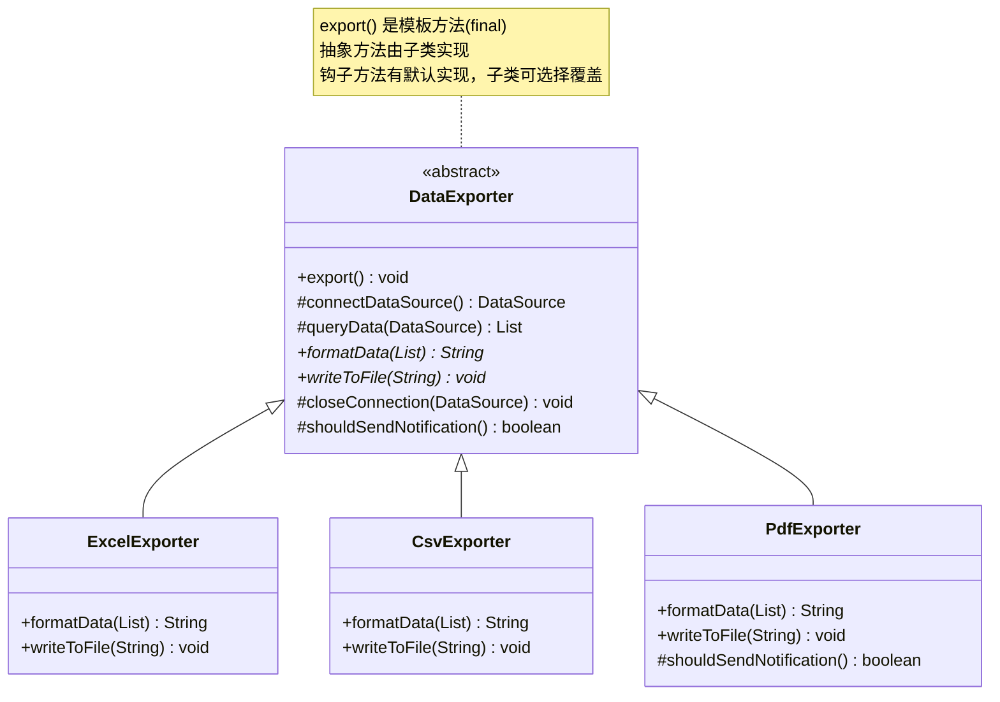
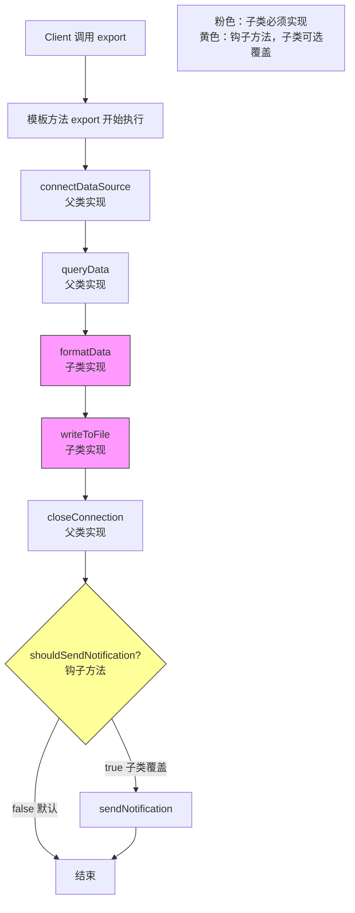

# 模板方法模式（Template Method Pattern）

> **一句话记忆口诀**：模板方法定骨架，子类填细节，`AbstractList` 和 `HttpServlet` 是最经典的例子，钩子方法让子类控制流程。

---

## 1. 引入：它解决了什么问题？

### 没有模板方法模式时的问题

当多个类有相同的处理流程，但某些步骤的实现不同时，会出现大量重复代码：

```java
// ❌ 反例：不同数据导出格式有相同的流程，但实现重复
public class ExcelExporter {
    public void export(List<Data> data) {
        // 步骤1：连接数据源（相同）
        DataSource ds = connectDataSource();
        // 步骤2：查询数据（相同）
        List<Data> result = queryData(ds);
        // 步骤3：格式化数据（不同！Excel 特有）
        String formatted = formatAsExcel(result);
        // 步骤4：写入文件（不同！Excel 特有）
        writeToExcelFile(formatted);
        // 步骤5：关闭连接（相同）
        closeConnection(ds);
    }
}

public class CsvExporter {
    public void export(List<Data> data) {
        // 步骤1：连接数据源（与 ExcelExporter 完全相同，复制粘贴！）
        DataSource ds = connectDataSource();
        // 步骤2：查询数据（与 ExcelExporter 完全相同，复制粘贴！）
        List<Data> result = queryData(ds);
        // 步骤3：格式化数据（不同）
        String formatted = formatAsCsv(result);
        // 步骤4：写入文件（不同）
        writeToCsvFile(formatted);
        // 步骤5：关闭连接（与 ExcelExporter 完全相同，复制粘贴！）
        closeConnection(ds);
    }
}
// 步骤1、2、5 在所有导出类中完全相同，却被复制了 N 次！
```

**问题根因**：相同的流程骨架被重复实现，违反 DRY（Don't Repeat Yourself）原则，且修改公共步骤时需要修改所有子类。

### 工作中的典型应用场景

| 场景 | Spring/JDK 中的例子 |
|------|-------------------|
| HTTP 请求处理 | `HttpServlet.service()` 调用 `doGet()`/`doPost()` |
| 集合框架 | `AbstractList` 定义骨架，子类实现 `get()`/`size()` |
| Spring 数据访问 | `JdbcTemplate` 封装连接/关闭，子类实现 SQL |
| Spring Bean 生命周期 | `AbstractBeanFactory` 定义 `getBean()` 骨架 |
| MyBatis Executor | `BaseExecutor` 定义执行骨架 |

---

## 2. 类比：用生活模型建立直觉

### 生活类比：咖啡和茶的冲泡流程

冲泡咖啡和茶的流程相似：①烧水 → ②冲泡 → ③倒入杯中 → ④加配料。其中步骤①③是相同的，步骤②④不同（咖啡用咖啡粉，茶用茶叶；咖啡加糖奶，茶加柠檬）。

- **接口/抽象角色**：饮品冲泡模板（`CaffeineBeverage` 抽象类），定义冲泡流程骨架
- **具体实现角色**：咖啡（`Coffee`）、茶（`Tea`），实现各自的差异步骤
- **调用方**：顾客（`Client`），调用 `prepareRecipe()` 获得饮品

关键点：流程骨架（`prepareRecipe()`）在父类中定义且不可修改（`final`），子类只能实现差异步骤。

### 抽象定义

> 模板方法模式在一个方法中定义一个算法的骨架，而将一些步骤延迟到子类中。模板方法使得子类可以在不改变算法结构的情况下，重新定义算法中的某些步骤。

---

## 3. 原理：逐步拆解核心机制

### UML 类图



### Java 代码示例

```java
// ===== 抽象类（定义算法骨架）=====
public abstract class DataExporter {

    /**
     * 模板方法：定义导出流程的骨架
     * 设计原因：加 final 防止子类覆盖骨架，破坏流程顺序
     */
    public final void export() {
        DataSource ds = connectDataSource();    // 步骤1：连接（公共实现）
        List<Data> data = queryData(ds);        // 步骤2：查询（公共实现）
        String formatted = formatData(data);    // 步骤3：格式化（子类实现）
        writeToFile(formatted);                 // 步骤4：写文件（子类实现）
        closeConnection(ds);                    // 步骤5：关闭（公共实现）

        // 钩子方法：子类可以选择是否发送通知
        if (shouldSendNotification()) {
            sendNotification();
        }
    }

    // ===== 公共步骤（父类实现，子类继承）=====
    protected DataSource connectDataSource() {
        System.out.println("连接数据源...");
        return new DataSource();
    }

    protected List<Data> queryData(DataSource ds) {
        System.out.println("查询数据...");
        return new ArrayList<>();
    }

    protected void closeConnection(DataSource ds) {
        System.out.println("关闭连接...");
    }

    // ===== 抽象步骤（子类必须实现）=====
    // 设计原因：这些步骤在不同子类中实现不同，强制子类提供实现
    protected abstract String formatData(List<Data> data);
    protected abstract void writeToFile(String formatted);

    // ===== 钩子方法（子类可选择性覆盖）=====
    // 设计原因：提供默认行为，子类可以通过覆盖来影响模板方法的流程
    // 代价：钩子方法过多会使父类变得复杂
    protected boolean shouldSendNotification() {
        return false; // 默认不发送通知
    }

    private void sendNotification() {
        System.out.println("发送导出完成通知...");
    }
}

// ===== 具体子类（只实现差异步骤）=====
public class ExcelExporter extends DataExporter {
    @Override
    protected String formatData(List<Data> data) {
        System.out.println("格式化为 Excel 格式");
        return "excel_content";
    }

    @Override
    protected void writeToFile(String formatted) {
        System.out.println("写入 .xlsx 文件");
    }
    // shouldSendNotification() 使用默认值 false，不发通知
}

public class PdfExporter extends DataExporter {
    @Override
    protected String formatData(List<Data> data) {
        System.out.println("格式化为 PDF 格式");
        return "pdf_content";
    }

    @Override
    protected void writeToFile(String formatted) {
        System.out.println("写入 .pdf 文件");
    }

    // 覆盖钩子方法：PDF 导出完成后需要发送通知
    @Override
    protected boolean shouldSendNotification() {
        return true; // 覆盖默认行为
    }
}

// ===== HttpServlet 模板方法示例（JDK 经典实现）=====
// HttpServlet.service() 是模板方法，根据请求类型调用 doGet/doPost
public class MyServlet extends HttpServlet {
    // 只需实现差异步骤，不需要关心请求分发逻辑
    @Override
    protected void doGet(HttpServletRequest req, HttpServletResponse resp) {
        resp.getWriter().write("处理 GET 请求");
    }

    @Override
    protected void doPost(HttpServletRequest req, HttpServletResponse resp) {
        resp.getWriter().write("处理 POST 请求");
    }
    // service() 方法（模板方法）在 HttpServlet 父类中定义，不需要覆盖
}
```

### 核心流程图



---

## 4. 特性：关键对比

### 模板方法模式 vs 策略模式（最容易混淆）

| 对比维度 | 模板方法模式 | 策略模式 |
|---------|------------|---------|
| **实现机制** | **继承**，子类覆盖抽象方法 | **组合**，Context 持有策略接口 |
| **算法骨架** | 父类定义**固定骨架**，子类填充步骤 | 无固定骨架，整个算法可替换 |
| **扩展方式** | 创建新子类 | 创建新策略类，注入 Context |
| **运行期切换** | ❌ 编译期确定 | ✅ 运行期切换 |
| **典型例子** | `HttpServlet`、`AbstractList` | `Comparator`、线程池拒绝策略 |

### 钩子方法 vs 抽象方法

| 对比维度 | 抽象方法 | 钩子方法 |
|---------|---------|---------|
| **是否必须实现** | ✅ 子类必须实现 | ❌ 子类可选择性覆盖 |
| **默认行为** | 无 | 有（通常是空实现或默认值） |
| **目的** | 强制子类提供差异实现 | 让子类影响模板方法的流程 |

### 在 Spring / JDK 中的应用

| 框架/类 | 模板方法 | 说明 |
|--------|---------|------|
| `HttpServlet` | `service()` | 调用 `doGet()`/`doPost()` 等 |
| `AbstractList` | `iterator()`、`listIterator()` | 子类实现 `get()`/`size()` |
| `JdbcTemplate` | `execute()` | 封装连接/关闭，回调处理 SQL |
| `AbstractBeanFactory` | `getBean()` | Spring Bean 获取骨架 |
| `AbstractApplicationContext` | `refresh()` | Spring 容器启动骨架（12步） |

---

## 5. 边界：异常情况与常见误区

### 误区一：模板方法没有加 final，子类覆盖了骨架（设计问题）

```java
// ❌ 错误：模板方法没有 final，子类可以覆盖整个流程
public abstract class DataExporter {
    public void export() { // 没有 final！
        // 流程骨架
    }
}

public class BadExporter extends DataExporter {
    @Override
    public void export() {
        // 子类完全覆盖了骨架，模板方法失去意义！
        // 而且跳过了连接/关闭等公共步骤，可能导致资源泄漏
        writeToFile("data");
    }
}

// ✅ 正确：模板方法加 final，防止子类破坏流程
public abstract class DataExporter {
    public final void export() { // final 保护骨架
        // ...
    }
}
```

### 误区二：抽象类中抽象方法过多，子类实现负担重（设计问题）

```java
// ❌ 问题：抽象方法太多，子类必须实现大量方法，即使不需要
public abstract class ReportGenerator {
    public final void generate() {
        fetchData();
        validateData();
        transformData();
        formatHeader();
        formatBody();
        formatFooter();
        addWatermark();
        encrypt();
        compress();
        upload();
    }
    // 10 个抽象方法，子类必须全部实现！
    protected abstract void fetchData();
    protected abstract void validateData();
    // ... 8 个更多抽象方法
}

// ✅ 正确：只有真正差异化的步骤才设为抽象方法，其他提供默认实现
public abstract class ReportGenerator {
    public final void generate() { ... }
    protected abstract void formatBody(); // 只有这个是真正差异化的
    protected void addWatermark() {} // 默认空实现，子类可选覆盖
    protected void encrypt() {}     // 默认空实现
}
```

### 误区三：在模板方法中调用子类方法，导致父类依赖子类（设计问题）

```java
// ❌ 错误：父类构造方法中调用可被子类覆盖的方法
public abstract class Base {
    public Base() {
        init(); // 在构造方法中调用可覆盖方法！
    }
    protected void init() {
        System.out.println("Base init");
    }
}

public class Child extends Base {
    private String name = "child"; // 此时 name 还未初始化！

    @Override
    protected void init() {
        System.out.println("Child init: " + name); // 输出 null！
    }
}
// 原因：Java 对象初始化顺序：父类构造方法 → 子类字段初始化 → 子类构造方法
// 父类构造方法调用 init() 时，子类字段 name 还未赋值

// ✅ 正确：不在构造方法中调用可覆盖方法，改用工厂方法或延迟初始化
```

---

## 6. 总结：面试标准化表达

### 高频面试题

**Q1：模板方法模式解决了什么问题？为什么模板方法要加 final？**

> 模板方法模式解决了多个类有相同流程骨架但部分步骤实现不同的代码重复问题。父类定义算法骨架（模板方法），将差异步骤声明为抽象方法由子类实现，公共步骤在父类中实现，避免重复。模板方法加 `final` 是为了防止子类覆盖整个流程骨架，破坏算法结构。如果子类可以覆盖模板方法，就失去了"固定骨架"的意义，子类可能跳过关键步骤（如资源关闭），导致 bug。

**Q2：Spring 的 refresh() 方法是什么设计模式？**

> `AbstractApplicationContext.refresh()` 是模板方法模式的经典应用。`refresh()` 定义了 Spring 容器启动的 12 个步骤（如 `prepareRefresh()`、`obtainFreshBeanFactory()`、`finishBeanFactoryInitialization()` 等），其中 `obtainFreshBeanFactory()` 是抽象方法，由 `ClassPathXmlApplicationContext` 和 `AnnotationConfigApplicationContext` 等子类分别实现（XML 解析 vs 注解扫描）。这样不同类型的 ApplicationContext 共享相同的启动流程，只有 BeanFactory 的创建方式不同。

**Q3：模板方法模式和策略模式如何选择？**

> 选择标准：如果算法有**固定的流程骨架**，只有部分步骤不同，用模板方法（继承）；如果整个算法都可能被替换，或者需要**运行期动态切换**算法，用策略模式（组合）。模板方法的优点是代码复用好，缺点是继承关系固定，不够灵活；策略模式的优点是运行期可切换，缺点是没有代码复用。实际工作中，策略模式更常用，因为组合优于继承，且更容易测试。

---

> **一句话记忆口诀**：模板方法定骨架（final 保护），抽象方法强制子类实现，钩子方法让子类影响流程，`HttpServlet.service()` 和 Spring `refresh()` 是最经典的例子。
