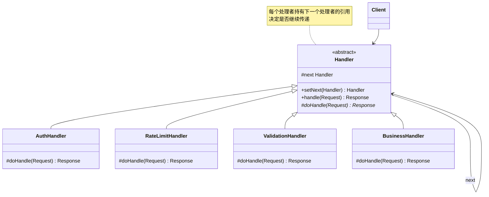
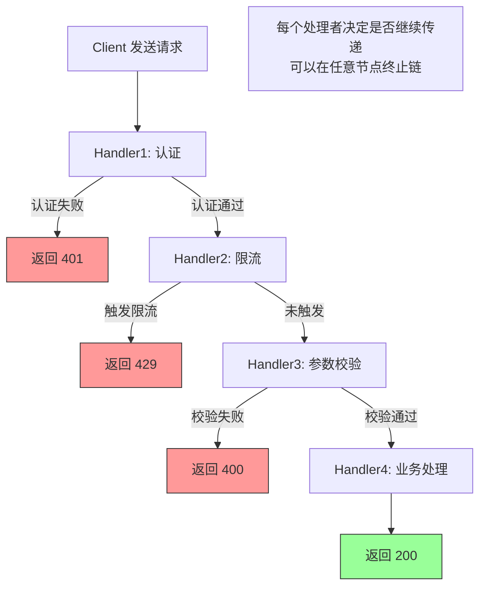

<!-- nav-start -->
---

[⬅️ 上一篇：模板方法模式](09-模板方法模式.md) | [🏠 返回目录](../README.md) | [下一篇：软件工程概览 ➡️](../09-software-engineering/00-软件工程概览.md)

<!-- nav-end -->

# 责任链模式（Chain of Responsibility Pattern）

> **一句话记忆口诀**：责任链串联处理者，请求沿链传递直到被处理，Spring Security 过滤器链和 Servlet Filter 是最经典的例子。

---

## 1. 引入：它解决了什么问题？

### 没有责任链模式时的问题

当一个请求需要经过多个处理步骤，且每个步骤可以决定是否继续传递时：

```java
// ❌ 反例：所有处理逻辑堆在一个方法里
public class RequestProcessor {
    public Response process(Request request) {
        // 步骤1：身份认证
        if (!authService.authenticate(request.getToken())) {
            return Response.unauthorized();
        }

        // 步骤2：权限校验
        if (!authService.hasPermission(request.getUserId(), request.getResource())) {
            return Response.forbidden();
        }

        // 步骤3：限流检查
        if (!rateLimiter.tryAcquire(request.getUserId())) {
            return Response.tooManyRequests();
        }

        // 步骤4：参数校验
        if (!validator.validate(request.getParams())) {
            return Response.badRequest("参数错误");
        }

        // 步骤5：业务处理
        return businessService.handle(request);

        // 新增一个处理步骤？必须修改这个方法！
        // 步骤顺序调整？必须修改这个方法！
        // 某个步骤需要复用？无法单独提取！
    }
}
```

**问题根因**：
1. 所有处理逻辑耦合在一起，新增/删除/调整步骤都需要修改核心代码
2. 处理步骤无法复用（如认证逻辑在多处重复）
3. 无法动态配置处理链

### 工作中的典型应用场景

| 场景 | Spring/JDK 中的例子 |
|------|-------------------|
| HTTP 请求过滤 | Servlet `FilterChain` |
| Spring 安全 | Spring Security `SecurityFilterChain` |
| 日志框架 | Logback `Appender` 链 |
| MyBatis 插件 | `InterceptorChain` |
| 审批流程 | 员工→主管→经理→总监逐级审批 |

---

## 2. 类比：用生活模型建立直觉

### 生活类比：公司报销审批流程

员工提交报销申请后，需要经过多级审批：组长（≤500元）→ 经理（≤5000元）→ 总监（≤50000元）→ CEO（更高金额）。每个审批人根据金额决定是自己审批还是转交给上级。

- **接口/抽象角色**：审批人（`Approver` 抽象类），定义"审批"行为和"设置下一个审批人"方法
- **具体实现角色**：组长、经理、总监（`TeamLeader`、`Manager`、`Director`），各自有审批权限
- **调用方**：员工（`Client`），提交报销申请，不关心由谁审批

关键点：每个审批人只关心自己能处理的范围，超出范围则传递给下一个处理者。

### 抽象定义

> 责任链模式使多个对象都有机会处理请求，从而避免请求的发送者和接收者之间的耦合关系。将这些对象连成一条链，并沿着这条链传递请求，直到有一个对象处理它为止。

---

## 3. 原理：逐步拆解核心机制

### UML 类图



### Java 代码示例

```java
// ===== 请求和响应对象 =====
public class Request {
    private String token;
    private String userId;
    private String resource;
    private Map<String, String> params;
    // getters...
}

// ===== 抽象处理者 =====
public abstract class Handler {
    protected Handler next; // 下一个处理者

    /**
     * 设置下一个处理者，返回 next 支持链式调用
     * 设计原因：链式调用让责任链的构建更直观
     */
    public Handler setNext(Handler next) {
        this.next = next;
        return next; // 返回 next，支持 h1.setNext(h2).setNext(h3) 链式调用
    }

    /**
     * 模板方法：定义处理流程
     * 子类实现 doHandle()，父类负责传递逻辑
     */
    public final Response handle(Request request) {
        Response response = doHandle(request);
        // 如果当前处理者返回 null，表示不处理，传递给下一个
        if (response == null && next != null) {
            return next.handle(request);
        }
        return response;
    }

    // 子类实现具体处理逻辑
    // 返回 null 表示不处理，传递给下一个处理者
    protected abstract Response doHandle(Request request);
}

// ===== 具体处理者 =====
// 认证处理者
public class AuthHandler extends Handler {
    @Override
    protected Response doHandle(Request request) {
        System.out.println("[AuthHandler] 验证 Token");
        if (request.getToken() == null || request.getToken().isEmpty()) {
            return Response.unauthorized("Token 无效");
        }
        return null; // 认证通过，传递给下一个处理者
    }
}

// 限流处理者
public class RateLimitHandler extends Handler {
    private final RateLimiter rateLimiter = RateLimiter.create(100); // 每秒100次

    @Override
    protected Response doHandle(Request request) {
        System.out.println("[RateLimitHandler] 限流检查");
        if (!rateLimiter.tryAcquire()) {
            return Response.tooManyRequests("请求过于频繁");
        }
        return null; // 未触发限流，传递给下一个
    }
}

// 参数校验处理者
public class ValidationHandler extends Handler {
    @Override
    protected Response doHandle(Request request) {
        System.out.println("[ValidationHandler] 参数校验");
        if (request.getParams() == null || request.getParams().isEmpty()) {
            return Response.badRequest("参数不能为空");
        }
        return null; // 校验通过，传递给下一个
    }
}

// 业务处理者（链的末端，必须处理）
public class BusinessHandler extends Handler {
    @Override
    protected Response doHandle(Request request) {
        System.out.println("[BusinessHandler] 执行业务逻辑");
        return Response.ok("处理成功");
    }
}

// ===== 构建责任链并使用 =====
public class Main {
    public static void main(String[] args) {
        // 构建责任链：认证 → 限流 → 校验 → 业务
        Handler chain = new AuthHandler();
        chain.setNext(new RateLimitHandler())
             .setNext(new ValidationHandler())
             .setNext(new BusinessHandler());

        // 发送请求
        Request request = new Request("valid_token", "user_001", "/api/order", Map.of("id", "1"));
        Response response = chain.handle(request);
        System.out.println("响应: " + response);
    }
}
```

### Servlet Filter 责任链示例（JDK 经典实现）

```java
// Servlet Filter 是责任链模式的标准实现
// FilterChain 就是责任链，每个 Filter 决定是否调用 chain.doFilter() 继续传递
public class LoggingFilter implements Filter {
    @Override
    public void doFilter(ServletRequest request, ServletResponse response,
                         FilterChain chain) throws IOException, ServletException {
        System.out.println("[LoggingFilter] 请求开始");
        long start = System.currentTimeMillis();

        chain.doFilter(request, response); // 传递给下一个 Filter

        System.out.println("[LoggingFilter] 请求结束，耗时: "
                + (System.currentTimeMillis() - start) + "ms");
    }
}

public class AuthFilter implements Filter {
    @Override
    public void doFilter(ServletRequest request, ServletResponse response,
                         FilterChain chain) throws IOException, ServletException {
        String token = ((HttpServletRequest) request).getHeader("Authorization");
        if (token == null) {
            ((HttpServletResponse) response).sendError(401, "未授权");
            return; // 不调用 chain.doFilter()，请求在此终止！
        }
        chain.doFilter(request, response); // 认证通过，继续传递
    }
}
```

### 核心流程图



---

## 4. 特性：关键对比

### 责任链模式 vs 装饰器模式（结构相似）

| 对比维度 | 责任链模式 | 装饰器模式 |
|---------|----------|----------|
| **目的** | 请求沿链传递，某个处理者**处理后终止** | 每层都处理，**全部执行** |
| **终止条件** | 某个处理者处理后可以终止传递 | 所有装饰器都会执行 |
| **处理结果** | 通常只有一个处理者真正处理 | 每层都对结果进行增强 |
| **典型例子** | Servlet Filter、Spring Security | `BufferedInputStream`、IO 流 |

### 责任链的两种变体

| 变体 | 特点 | 适用场景 |
|------|------|---------|
| **纯责任链** | 只有一个处理者处理请求，处理后不再传递 | 审批流程、路由 |
| **非纯责任链** | 每个处理者都处理，然后继续传递 | Servlet Filter、日志 |

### 在 Spring / JDK 中的应用

| 框架/类 | 说明 |
|--------|------|
| Servlet `FilterChain` | HTTP 请求过滤链 |
| Spring Security `SecurityFilterChain` | 安全过滤链（约 15 个 Filter） |
| MyBatis `InterceptorChain` | SQL 执行拦截链 |
| Netty `ChannelPipeline` | 网络请求处理链 |
| Spring MVC `HandlerInterceptor` | 请求拦截器链 |

---

## 5. 边界：异常情况与常见误区

### 误区一：责任链过长导致性能问题（运行期问题）

```java
// ❌ 问题：责任链节点过多，每个请求都要经过所有节点
// 如果有 50 个 Filter，每个请求都要经过 50 次判断
// Spring Security 默认有约 15 个 Filter，每个请求都要经过

// ✅ 建议：
// 1. 将高频拦截的 Handler 放在链的前端（如认证失败率高，认证放第一位）
// 2. 对不需要处理的请求快速跳过（如静态资源跳过认证）
// 3. 控制责任链长度，避免过度拆分
public class AuthFilter implements Filter {
    private static final List<String> SKIP_PATHS = List.of("/static/", "/health");

    @Override
    public void doFilter(ServletRequest req, ServletResponse resp, FilterChain chain) {
        String path = ((HttpServletRequest) req).getRequestURI();
        if (SKIP_PATHS.stream().anyMatch(path::startsWith)) {
            chain.doFilter(req, resp); // 快速跳过，不做认证
            return;
        }
        // 正常认证逻辑...
    }
}
```

### 误区二：责任链中的处理者没有处理异常，导致链断裂（运行期问题）

```java
// ❌ 错误：处理者抛出异常，后续处理者不执行
public class LoggingHandler extends Handler {
    @Override
    protected Response doHandle(Request request) {
        logService.log(request); // 如果日志服务挂了，整个链断裂！
        return null;
    }
}

// ✅ 正确：非关键处理者应该捕获异常，保证链的继续执行
public class LoggingHandler extends Handler {
    @Override
    protected Response doHandle(Request request) {
        try {
            logService.log(request);
        } catch (Exception e) {
            log.warn("日志记录失败，继续处理请求", e);
            // 日志失败不影响主流程
        }
        return null; // 继续传递
    }
}
```

### 误区三：责任链末端没有默认处理者，请求"消失"（运行期问题）

```java
// ❌ 错误：责任链末端没有处理者，请求没有响应
Handler chain = new AuthHandler();
chain.setNext(new ValidationHandler());
// 没有业务处理者！如果认证和校验都通过，返回 null

// ✅ 正确：责任链末端必须有一个默认处理者
Handler chain = new AuthHandler();
chain.setNext(new ValidationHandler())
     .setNext(new BusinessHandler()); // 末端处理者，必须返回非 null

// 或者在抽象类中处理 null 的情况
public final Response handle(Request request) {
    Response response = doHandle(request);
    if (response == null && next != null) {
        return next.handle(request);
    }
    // 链末端没有处理者时，返回默认响应
    return response != null ? response : Response.notFound("没有处理者");
}
```

---

## 6. 总结：面试标准化表达

### 高频面试题

**Q1：责任链模式解决了什么问题？Servlet Filter 如何体现责任链？**

> 责任链模式解决了请求需要经过多个处理步骤，且每个步骤可以决定是否继续传递的问题。将处理者串联成链，请求沿链传递，每个处理者决定是否处理并是否继续传递，避免了将所有处理逻辑堆在一个方法里的强耦合问题。Servlet Filter 是责任链的经典实现：每个 Filter 实现 `doFilter()` 方法，调用 `chain.doFilter()` 将请求传递给下一个 Filter，不调用则终止链。Spring Security 就是通过约 15 个 Filter 组成的责任链实现认证、授权、CSRF 防护等功能。

**Q2：责任链模式和装饰器模式有什么区别？**

> 两者结构相似（都是链式调用），但目的不同：责任链模式中，某个处理者处理请求后可以**终止传递**，通常只有一个处理者真正处理请求（如认证失败直接返回 401，不再继续）；装饰器模式中，每层装饰器都会执行，**全部执行**后返回增强的结果（如 `BufferedInputStream` 和 `GZIPInputStream` 都会处理数据）。判断标准：如果某个节点可以终止流程，用责任链；如果每层都要处理，用装饰器。

**Q3：Spring Security 的过滤器链是如何工作的？**

> Spring Security 通过 `SecurityFilterChain` 实现责任链模式，包含约 15 个 Filter（如 `UsernamePasswordAuthenticationFilter`、`BasicAuthenticationFilter`、`ExceptionTranslationFilter` 等）。每个请求进入时，按顺序经过所有 Filter，每个 Filter 可以处理请求（如认证）或直接传递。关键 Filter 如 `FilterSecurityInterceptor` 在链末端做权限校验，`ExceptionTranslationFilter` 捕获认证/授权异常并转换为 HTTP 响应。可以通过 `HttpSecurity` 配置添加自定义 Filter 到链中的指定位置。

---

> **一句话记忆口诀**：责任链串联处理者，请求沿链传递，某节点可终止，Servlet `FilterChain` 和 Spring Security 过滤器链是最经典的例子，注意链末端要有默认处理者。

<!-- nav-start -->
---

[⬅️ 上一篇：模板方法模式](09-模板方法模式.md) | [🏠 返回目录](../README.md) | [下一篇：软件工程概览 ➡️](../09-software-engineering/00-软件工程概览.md)

<!-- nav-end -->
