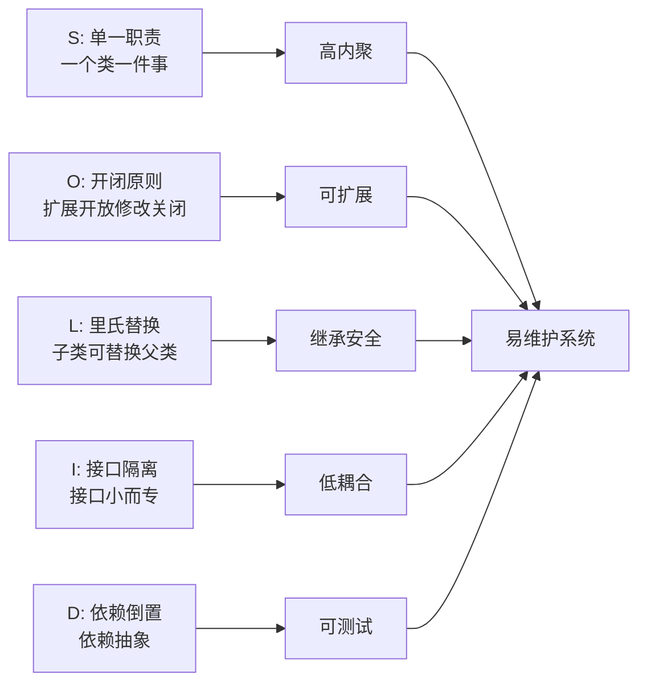

<!-- nav-start -->
---

[⬅️ 上一篇：软件工程概览](00-软件工程概览.md) | [🏠 返回目录](../README.md) | [下一篇：软件架构演进 ➡️](02-软件架构演进.md)

<!-- nav-end -->

# SOLID 原则

> **为什么重要**：SOLID 是面向对象设计的五条黄金法则，Spring 框架的设计本身就是 SOLID 的最佳实践。违反这些原则会导致代码高耦合、难以扩展。

---

## 类比：建筑设计规范

| SOLID 原则 | 建筑类比 | 映射关系 |
|-----------|---------|---------|
| **单一职责** | 厨房只做饭，卧室只睡觉 | 一个类只做一件事 |
| **开闭原则** | 房子可以加建新房间，但不拆原有结构 | 扩展开放，修改关闭 |
| **里氏替换** | 任何椅子都能坐，不管是木椅还是沙发 | 子类可以替换父类 |
| **接口隔离** | 遥控器只有你需要的按钮，不是所有功能都在一个遥控器上 | 接口小而专 |
| **依赖倒置** | 插座（接口）统一规格，不管接什么电器（实现） | 依赖抽象，不依赖实现 |

---

## S — 单一职责原则（SRP）

**核心思想**：一个类只做一件事，只有一个引起它变化的原因。

```java
// ❌ 违反 SRP：UserService 承担了用户管理 + 邮件发送 + 日志记录
public class UserService {
    public void register(User user) {
        userRepository.save(user);
        emailService.sendWelcomeEmail(user.getEmail()); // 不该在这里
        logger.info("用户注册成功: " + user.getId());   // 不该在这里
    }
}

// ✅ 遵循 SRP：职责拆分，通过事件解耦
public class UserService {
    public void register(User user) {
        userRepository.save(user);
        eventPublisher.publish(new UserRegisteredEvent(user)); // 通过事件解耦
    }
}

public class UserRegisteredEventListener {
    @EventListener
    public void onUserRegistered(UserRegisteredEvent event) {
        emailService.sendWelcomeEmail(event.getUser().getEmail());
    }
}
```

> **为什么这样设计**：职责分离后，修改邮件逻辑不影响用户注册逻辑，修改日志格式不影响业务代码。每个类只有一个变化原因，变化影响范围最小。

**工作中常见错误**：一个 Service 类几千行，承担所有业务逻辑（"上帝类"）。

---

## O — 开闭原则（OCP）

**核心思想**：对扩展开放，对修改关闭。新增功能通过扩展实现，而非修改已有代码。

```java
// ❌ 违反 OCP：每新增一种支付方式，都要修改 pay() 方法
public class PaymentService {
    public void pay(String type, double amount) {
        if ("alipay".equals(type)) { /* 支付宝逻辑 */ }
        else if ("wechat".equals(type)) { /* 微信支付逻辑 */ }
        // 新增银行卡支付？继续加 else if...
    }
}

// ✅ 遵循 OCP：通过策略模式扩展
public interface PaymentStrategy {
    void pay(double amount);
}

public class AlipayStrategy implements PaymentStrategy {
    public void pay(double amount) { /* 支付宝逻辑 */ }
}

// 新增银行卡支付：只需新增类，不修改已有代码
public class BankCardStrategy implements PaymentStrategy {
    public void pay(double amount) { /* 银行卡逻辑 */ }
}
```

> **为什么这样设计**：修改已有代码有引入 Bug 的风险（已测试的代码被改动）；通过扩展新增功能，已有代码不变，风险最小。这也是为什么 Spring 大量使用接口和扩展点（`BeanPostProcessor`、`HandlerInterceptor` 等）。

---

## L — 里氏替换原则（LSP）

**核心思想**：子类必须能够替换父类，且不破坏程序的正确性。

```java
// ❌ 违反 LSP：正方形继承长方形，但重写了 setWidth/setHeight 破坏了父类语义
public class Rectangle {
    protected int width, height;
    public void setWidth(int w) { this.width = w; }
    public void setHeight(int h) { this.height = h; }
    public int area() { return width * height; }
}

public class Square extends Rectangle {
    @Override
    public void setWidth(int w) { this.width = this.height = w; } // 破坏了父类行为
    // 调用方期望 setWidth 只改宽度，但 Square 同时改了高度，违反了父类契约
}

// ✅ 遵循 LSP：通过接口而非继承来表达关系
public interface Shape { int area(); }
public class Rectangle implements Shape { ... }
public class Square implements Shape { ... }
```

> **为什么这样设计**：继承表达的是"is-a"关系，正方形在数学上是长方形，但在行为上不是（设置宽度会同时改变高度）。当行为不满足父类契约时，应该用接口而非继承。

**记忆口诀**：子类不应该比父类"更严格"（收窄前置条件）或"更宽松"（放宽后置条件）。

---

## I — 接口隔离原则（ISP）

**核心思想**：接口要小而专，不要强迫客户端依赖它不需要的方法。

```java
// ❌ 违反 ISP：胖接口，打印机不需要扫描功能
public interface MultiFunctionDevice {
    void print(Document doc);
    void scan(Document doc);
    void fax(Document doc);
}

// ✅ 遵循 ISP：接口拆分
public interface Printer { void print(Document doc); }
public interface Scanner { void scan(Document doc); }
public interface FaxMachine { void fax(Document doc); }

// 简单打印机只实现 Printer
public class SimplePrinter implements Printer { ... }
// 多功能设备实现多个接口
public class AllInOnePrinter implements Printer, Scanner, FaxMachine { ... }
```

> **为什么这样设计**：胖接口迫使实现类实现它不需要的方法（通常是空实现或抛异常），这是一种"接口污染"。拆分后，每个实现类只依赖它真正需要的接口，修改一个接口不影响其他实现类。

---

## D — 依赖倒置原则（DIP）

**核心思想**：高层模块不依赖低层模块，二者都依赖抽象。这是 Spring IoC 的理论基础。

```java
// ❌ 违反 DIP：高层直接依赖低层实现
public class OrderService {
    private MySQLOrderRepository repository = new MySQLOrderRepository(); // 直接依赖实现
    // 想换成 MongoDB？要改这里
}

// ✅ 遵循 DIP：依赖抽象（接口）
public class OrderService {
    private final OrderRepository repository; // 依赖接口

    @Autowired // Spring 注入具体实现
    public OrderService(OrderRepository repository) {
        this.repository = repository;
    }
}
```

> **Spring IoC 就是 DIP 的工程实践**：Spring 容器负责创建和注入具体实现，业务代码只依赖接口。这样切换实现（如从 MySQL 换到 MongoDB）只需修改配置，不需要修改业务代码。

---

## SOLID 原则总结



---

## 面试高频问题

**Q：SOLID 原则中，哪条最重要？**
> 没有绝对最重要，但**开闭原则（OCP）**是核心目标，其他四条原则都是实现 OCP 的手段。SRP 让类职责单一（更容易扩展），DIP 让依赖抽象（更容易替换实现），ISP 让接口精简（更容易扩展接口）。

<!-- nav-start -->
---

[⬅️ 上一篇：软件工程概览](00-软件工程概览.md) | [🏠 返回目录](../README.md) | [下一篇：软件架构演进 ➡️](02-软件架构演进.md)

<!-- nav-end -->
