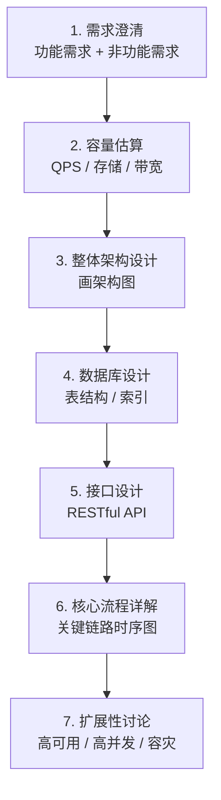

<!-- nav-start -->

---

[⬅️ 上一篇：CI/CD 持续集成与持续交付](06-CICD持续集成与交付.md) | [🏠 返回目录](../README.md) | [下一篇：企业内部问答系统 — 项目概览 ➡️](../10-project-experience/00-项目概览.md)

<!-- nav-end -->

# 系统设计方法论

---

## 系统设计答题框架

面试中遇到"设计一个 XXX 系统"，按以下步骤回答：

---

## 示例：设计一个短链接系统

1. **需求澄清**：长链转短链、短链跳转、统计点击量
2. **容量估算**：每天 1 亿次跳转，QPS ≈ 1160，存储 ≈ 每年 36GB
3. **架构**：Nginx → 短链服务 → Redis（缓存热点） → MySQL（持久化）
4. **核心算法**：Base62 编码（62^6 ≈ 560 亿，6 位短码足够）
5. **高可用**：Redis 集群缓存热点短链，减少 DB 压力

---

## 工作中常见错误与避坑指南

| 场景 | 常见错误 | 正确做法 | 根本原因 |
|------|---------|---------|---------|
| **服务拆分** | 拆分过细，每个接口都跨服务调用 | 按业务域拆分，高内聚低耦合 | 过度拆分导致网络开销和分布式事务问题 |
| **分布式事务** | 用本地事务处理跨服务数据一致性 | 使用 Saga 模式或最终一致性 | 跨服务无法使用数据库事务 |
| **CAP 选型** | 强一致性场景选了 AP 系统 | 根据业务需求选择 CP 或 AP | 不了解 CAP 理论，选型错误 |
| **代码设计** | Service 类几千行，违反 SRP | 按职责拆分，使用领域事件解耦 | 缺乏 SOLID 意识，代码越来越难维护 |
| **测试** | 只写 E2E 测试，不写单元测试 | 遵循测试金字塔，单元测试为主 | E2E 测试慢且脆弱，无法快速反馈 |
| **发布** | 手动部署，无回滚方案 | 建立 CI/CD 流水线，蓝绿/金丝雀发布 | 手动操作不可靠，出错无法快速回滚 |

<!-- nav-start -->

---

[⬅️ 上一篇：CI/CD 持续集成与持续交付](06-CICD持续集成与交付.md) | [🏠 返回目录](../README.md) | [下一篇：企业内部问答系统 — 项目概览 ➡️](../10-project-experience/00-项目概览.md)

<!-- nav-end -->
