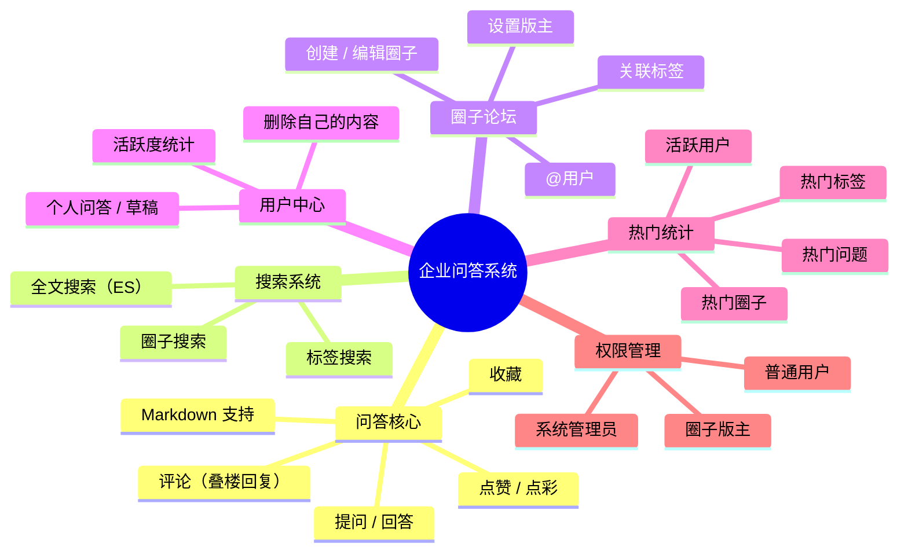
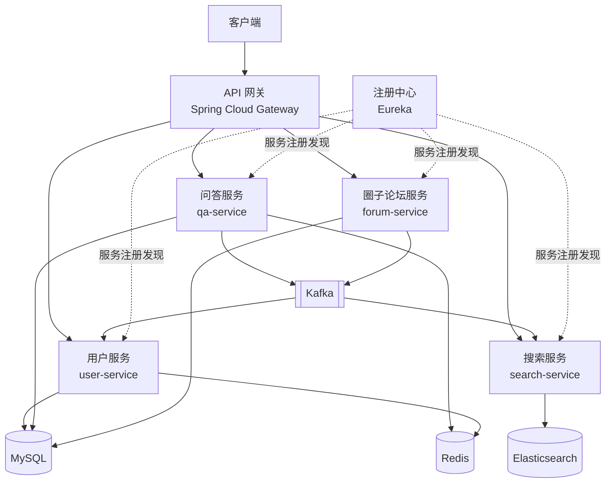

<!-- nav-start -->

---

[⬅️ 上一篇：系统设计方法论](../09-software-engineering/07-系统设计方法论.md) | [🏠 返回目录](../README.md) | [下一篇：功能设计与数据模型 ➡️](01-功能设计与数据模型.md)

<!-- nav-end -->

# 企业内部问答系统 — 项目概览

---

## 项目简介

本项目是一个**公司内部知识问答平台**，类似于企业版 Stack Overflow，旨在沉淀团队知识、促进内部技术交流。用户可以在平台上提问、回答、搜索问题，并通过圈子（论坛）进行分类管理。

---

## 核心功能模块

---

## 技术栈

| 技术 | 用途 |
|------|------|
| **Spring Cloud（Eureka）** | 微服务注册中心，服务发现 |
| **Spring Cloud Gateway** | API 网关，统一路由与鉴权 |
| **MySQL** | 主要业务数据存储 |
| **Redis** | 缓存、计数器、分布式锁 |
| **Elasticsearch** | 全文搜索 |
| **Kafka** | 异步消息处理用户交互事件 |
| **Docker** | 四个后端服务容器化部署 |

---

## 微服务划分

---

## 文章目录

| 序号 | 主题 | 说明 |
|------|------|------|
| 01 | [功能设计与数据模型](01-功能设计与数据模型.md) | 核心表结构、关系设计 |
| 02 | [搜索系统设计](02-搜索系统设计.md) | ES 全文搜索方案与数据同步 |
| 03 | [热门统计系统](03-热门统计系统.md) | 浏览量、点赞数、热门排行实现 |
| 04 | [权限与角色设计](04-权限与角色设计.md) | 用户/版主/管理员权限体系 |
| 05 | [Kafka 异步消息处理](05-Kafka异步消息处理.md) | 用户交互事件的异步解耦 |
| 06 | [踩坑与解决方案](06-踩坑与解决方案.md) | 项目中遇到的问题与解决思路 |

<!-- nav-start -->

---

[⬅️ 上一篇：系统设计方法论](../09-software-engineering/07-系统设计方法论.md) | [🏠 返回目录](../README.md) | [下一篇：功能设计与数据模型 ➡️](01-功能设计与数据模型.md)

<!-- nav-end -->
