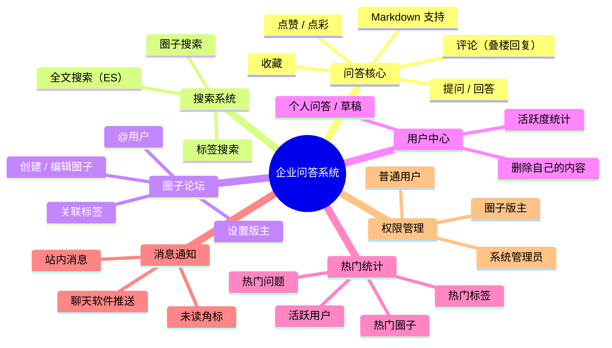
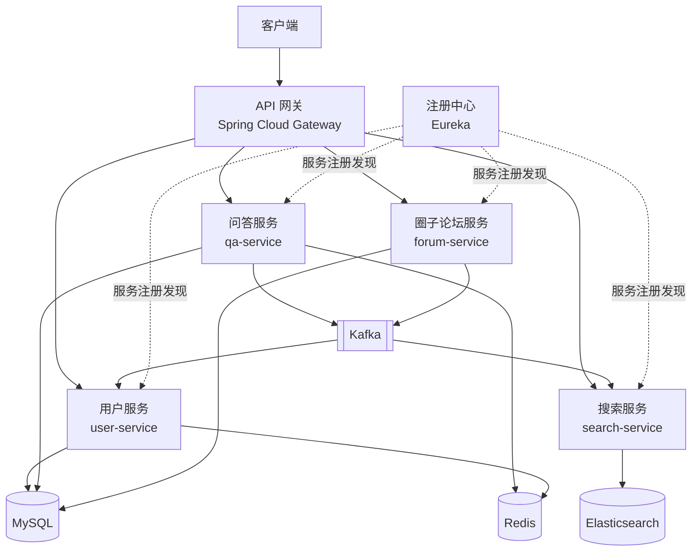

<!-- nav-start -->

---

[⬅️ 上一篇：系统设计方法论](../09-software-engineering/07-系统设计方法论.md) | [🏠 返回目录](../README.md) | [下一篇：问答核心功能设计 ➡️](01-问答核心功能设计.md)

<!-- nav-end -->

# 企业内部问答系统 — 项目概览

---

## 项目简介

本项目是一个**公司内部知识问答平台**，类似于企业版 Stack Overflow，旨在沉淀团队知识、促进内部技术交流。用户可以在平台上提问、回答、搜索问题，并通过圈子（论坛）进行分类管理。

---

## 核心功能模块

---

## 技术栈

| 技术 | 用途 |
|------|------|
| **Spring Cloud（Eureka）** | 微服务注册中心，服务发现 |
| **Spring Cloud Gateway** | API 网关，统一路由与鉴权 |
| **MySQL** | 主要业务数据存储 |
| **Redis** | 缓存、计数器、分布式锁、排行榜 |
| **Elasticsearch** | 全文搜索 |
| **Kafka** | 异步消息处理用户交互事件 |
| **Docker** | 四个后端服务容器化部署 |

---

## 微服务划分

---

## 系统规模与核心指标

> 系统已稳定运行 **5 年**，以下数据基于 50 万注册用户、月活 40 万的实际规模估算。

### 用户规模

| 指标 | 数值 | 说明 |
|------|------|------|
| 注册用户数 | 50 万 | 累计 5 年 |
| 月活跃用户（MAU） | 40 万 | 月活率 80%，企业内部平台粘性高 |
| 日活跃用户（DAU） | 约 12 万 | 按月活 × 30%，工作日约 16 万，周末约 4 万 |
| 峰值在线用户 | 约 3 万 | 工作日上午 10:00 - 11:00 为流量高峰 |

### 内容规模（5年累计）

| 指标 | 数值 | 说明 |
|------|------|------|
| 问题总数 | 约 200 万 | 日均新增约 1,100 条（工作日） |
| 回答总数 | 约 600 万 | 平均每个问题 3 个回答 |
| 评论总数 | 约 1,500 万 | 平均每个问题 7-8 条评论 |
| 标签数 | 约 5,000 个 | 技术标签为主 |
| 圈子数 | 约 300 个 | 按部门/技术方向划分 |

### 流量指标

| 指标 | 数值 | 计算依据 |
|------|------|----------|
| 日均 PV | 约 480 万 | DAU 12万 × 人均 40 次页面访问 |
| 日均 API 请求 | 约 240 万次 | PV × 0.5（接口调用比） |
| 峰值 QPS | 约 300 | 日均请求 / 86400 × 峰值系数 3 |
| 读写比 | 约 9:1 | 典型内容平台读多写少 |

### 存储指标

| 存储 | 数据量 | 说明 |
|------|--------|------|
| MySQL 主库 | 约 500 GB | 问答内容 + 用户行为记录（含 5 年历史） |
| Elasticsearch | 约 200 GB | 问答内容全文索引（含分词） |
| Redis 内存 | 约 8 GB | 热点缓存 + 计数器 + 排行榜 |
| 附件/图片（OSS） | 约 1 TB | Markdown 内嵌图片 5 年累计 |

### 性能基线

| 接口 | P99 响应时间 | 说明 |
|------|-------------|------|
| 问题列表（首页） | < 50ms | Redis 缓存命中 |
| 问题详情 | < 80ms | 含回答列表，缓存 + DB |
| 全文搜索 | < 200ms | ES 查询 |
| 点赞/评论 | < 100ms | Redis 写 + Kafka 异步 |
| 热门排行榜 | < 20ms | 纯 Redis ZSet 读取 |

### Kafka 消息量

| Topic | 日均消息量 | 峰值 TPS | 说明 |
|-------|-----------|---------|------|
| `user-actions` | 约 50 万条 | 约 30 | 点赞/评论/收藏等行为 |
| `question-events` | 约 1.1 万条 | 约 5 | 问题发布/编辑/删除 |
| `mention-events` | 约 5 万条 | 约 10 | @用户事件 |

---

## 文章目录

| 序号 | 主题 | 说明 |
|------|------|------|
| 01 | [问答核心功能设计](01-问答核心功能设计.md) | 数据模型、发帖流程、互动行为、评论叠楼 |
| 02 | [全文搜索系统](02-全文搜索系统.md) | ES Mapping、数据同步、中文分词、搜索 DSL |
| 03 | [计数与热门排行](03-计数与热门排行.md) | 浏览量去重、点赞计数、热度算法、排行榜 |
| 04 | [消息通知系统](04-消息通知系统.md) | 站内消息、IM 推送、通知聚合 |
| 05 | [异步架构设计](05-异步架构设计.md) | Kafka Topic 设计、可靠性、幂等、本地消息表 |
| 06 | [权限与安全设计](06-权限与安全设计.md) | 角色体系、JWT 鉴权、AOP 注解、内容安全 |
| 07 | [性能优化与踩坑](07-性能优化与踩坑.md) | 缓存策略、DB 优化、6 个真实踩坑案例 |

<!-- nav-start -->

---

[⬅️ 上一篇：系统设计方法论](../09-software-engineering/07-系统设计方法论.md) | [🏠 返回目录](../README.md) | [下一篇：问答核心功能设计 ➡️](01-问答核心功能设计.md)

<!-- nav-end -->
