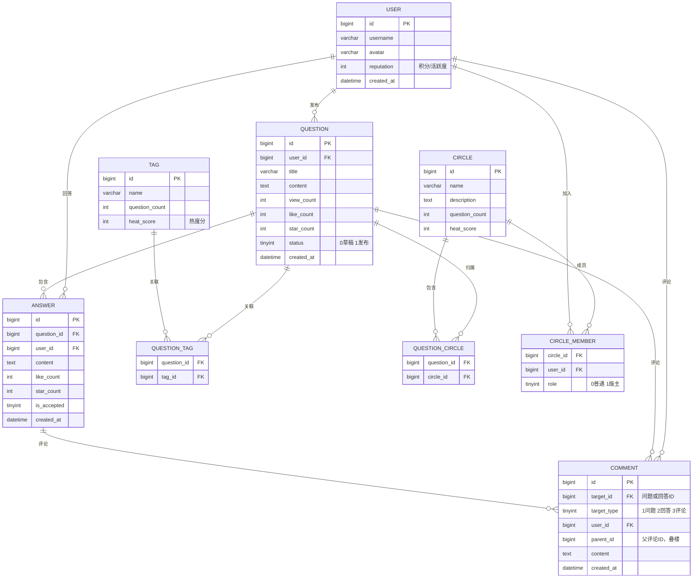

<!-- nav-start -->

---

[⬅️ 上一篇：企业内部问答系统 — 项目概览](00-项目概览.md) | [🏠 返回目录](../README.md) | [下一篇：搜索系统设计 ➡️](02-搜索系统设计.md)

<!-- nav-end -->

# 功能设计与数据模型

---

## 1. 核心实体关系



---

## 2. 互动行为表设计

点赞、点彩、收藏统一用行为表记录，避免为每种行为单独建表：

```sql
CREATE TABLE user_action (
    id          BIGINT PRIMARY KEY AUTO_INCREMENT,
    user_id     BIGINT NOT NULL COMMENT '操作用户',
    target_id   BIGINT NOT NULL COMMENT '目标ID',
    target_type TINYINT NOT NULL COMMENT '1问题 2回答 3评论',
    action_type TINYINT NOT NULL COMMENT '1点赞 2点彩 3收藏',
    created_at  DATETIME NOT NULL DEFAULT CURRENT_TIMESTAMP,
    UNIQUE KEY uk_user_target_action (user_id, target_id, target_type, action_type)
);
```

**设计要点**：
- `UNIQUE KEY` 防止重复点赞
- 查询某问题点赞数：`SELECT COUNT(*) FROM user_action WHERE target_id=? AND target_type=1 AND action_type=1`
- 实际计数缓存在 Redis，数据库作为持久化兜底

---

## 3. 评论叠楼设计

评论支持无限层级回复，采用**邻接表 + 根评论ID**方案：

```sql
CREATE TABLE comment (
    id          BIGINT PRIMARY KEY AUTO_INCREMENT,
    root_id     BIGINT NOT NULL DEFAULT 0 COMMENT '根评论ID，顶层评论时为0',
    parent_id   BIGINT NOT NULL DEFAULT 0 COMMENT '父评论ID，顶层评论时为0',
    target_id   BIGINT NOT NULL COMMENT '问题或回答ID',
    target_type TINYINT NOT NULL COMMENT '1问题 2回答',
    user_id     BIGINT NOT NULL,
    reply_user_id BIGINT DEFAULT NULL COMMENT '被回复的用户ID',
    content     TEXT NOT NULL,
    created_at  DATETIME NOT NULL DEFAULT CURRENT_TIMESTAMP
);
```

**查询策略**：
1. 先查顶层评论（`parent_id = 0`），分页
2. 再批量查每个顶层评论下的子评论（`root_id IN (...)`）
3. 前端按树形结构渲染

---

## 4. @用户功能实现

在内容中用 `@username` 标记，发布时解析内容提取被 @ 的用户列表，存入 `mention` 表，同时通过 Kafka 发送通知消息：

```sql
CREATE TABLE mention (
    id          BIGINT PRIMARY KEY AUTO_INCREMENT,
    source_id   BIGINT NOT NULL COMMENT '来源内容ID',
    source_type TINYINT NOT NULL COMMENT '1问题 2回答 3评论',
    from_user   BIGINT NOT NULL,
    to_user     BIGINT NOT NULL,
    is_read     TINYINT DEFAULT 0,
    created_at  DATETIME NOT NULL DEFAULT CURRENT_TIMESTAMP
);
```

---

## 5. 草稿功能

问题表中用 `status` 字段区分草稿和已发布：
- `status = 0`：草稿，仅本人可见
- `status = 1`：已发布，所有人可见

用户个人中心分 Tab 展示"我的问题"和"我的草稿"，查询时加 `status` 条件过滤。

<!-- nav-start -->

---

[⬅️ 上一篇：企业内部问答系统 — 项目概览](00-项目概览.md) | [🏠 返回目录](../README.md) | [下一篇：搜索系统设计 ➡️](02-搜索系统设计.md)

<!-- nav-end -->
