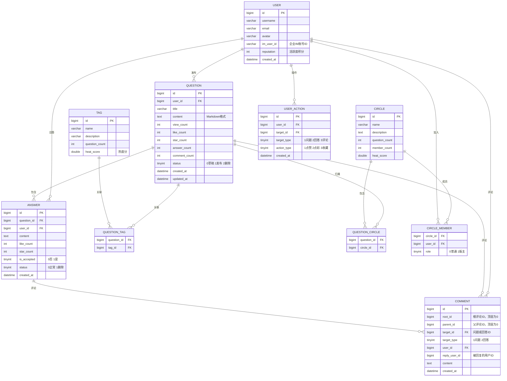
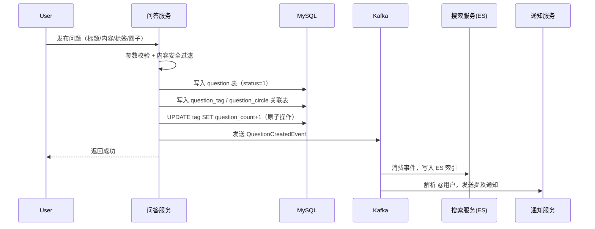

<!-- nav-start -->

---

[⬅️ 上一篇：企业内部问答系统 — 项目概览](00-项目概览.md) | [🏠 返回目录](../README.md) | [下一篇：全文搜索系统 ➡️](02-全文搜索系统.md)

<!-- nav-end -->

# 问答核心功能设计

---

## 1. 核心实体关系



---

## 2. 问题发布流程



### 2.1 草稿功能

`status` 字段区分草稿与已发布，草稿仅本人可见：

```sql
-- 查询我的草稿
SELECT * FROM question WHERE user_id = ? AND status = 0 ORDER BY updated_at DESC;

-- 发布草稿
UPDATE question SET status = 1, updated_at = NOW() WHERE id = ? AND user_id = ?;
```

### 2.2 @用户解析

发布/编辑内容时，解析 `@username` 标记，提取被 @ 的用户列表，通过 Kafka 发送提及通知。**编辑时只对新增的 @ 发通知**，避免重复：

```java
public void publishQuestion(QuestionDTO dto, Long userId) {
    // 解析 @ 用户
    Set<Long> mentionedUsers = mentionParser.parse(dto.getContent());

    // 写入数据库
    Question question = questionMapper.insert(buildQuestion(dto, userId));

    // 发送事件（含 @ 列表）
    kafkaTemplate.send("question-events",
        userId.toString(),
        QuestionCreatedEvent.of(question, mentionedUsers));
}

// 编辑时差量计算，只通知新增的 @
public void updateQuestion(Long id, QuestionDTO dto, Long userId) {
    Question old = questionMapper.selectById(id);
    Set<Long> oldMentions = mentionParser.parse(old.getContent());
    Set<Long> newMentions = mentionParser.parse(dto.getContent());

    Set<Long> addedMentions = new HashSet<>(newMentions);
    addedMentions.removeAll(oldMentions);  // 只取新增的 @

    questionMapper.updateById(buildQuestion(dto, id));

    if (!addedMentions.isEmpty()) {
        kafkaTemplate.send("mention-events",
            userId.toString(),
            new MentionEvent(id, TargetType.QUESTION, addedMentions));
    }
}
```

---

## 3. 互动行为设计（点赞 / 点彩 / 收藏）

### 3.1 统一行为表

三种互动行为统一用 `user_action` 表记录，避免为每种行为单独建表：

```sql
CREATE TABLE user_action (
    id          BIGINT   PRIMARY KEY AUTO_INCREMENT,
    user_id     BIGINT   NOT NULL COMMENT '操作用户',
    target_id   BIGINT   NOT NULL COMMENT '目标ID',
    target_type TINYINT  NOT NULL COMMENT '1问题 2回答 3评论',
    action_type TINYINT  NOT NULL COMMENT '1点赞 2点彩 3收藏',
    created_at  DATETIME NOT NULL DEFAULT CURRENT_TIMESTAMP,
    UNIQUE KEY uk_user_target_action (user_id, target_id, target_type, action_type)
);
```

`UNIQUE KEY` 在数据库层面防止重复操作，即使并发请求也不会产生重复记录。

### 3.2 点赞实现（Redis + Lua 原子操作）

点赞计数存储在 Redis，通过 Lua 脚本保证"判断是否已点赞"和"执行点赞"的原子性：

```java
@Service
public class LikeService {

    // Redis Key 设计
    // question:like:users:{id}  → Set，记录已点赞用户（防重复）
    // question:like:count:{id}  → String，点赞计数（快速读取）

    private static final String LUA_TOGGLE_LIKE =
        "local isMember = redis.call('SISMEMBER', KEYS[1], ARGV[1]); " +
        "if isMember == 0 then " +
        "  redis.call('SADD', KEYS[1], ARGV[1]); " +
        "  redis.call('INCR', KEYS[2]); " +
        "  return 1; " +
        "else " +
        "  redis.call('SREM', KEYS[1], ARGV[1]); " +
        "  redis.call('DECR', KEYS[2]); " +
        "  return 0; " +
        "end";

    public LikeResult toggleLike(Long questionId, Long userId) {
        String usersKey = "question:like:users:" + questionId;
        String countKey = "question:like:count:" + questionId;

        Long result = redisTemplate.execute(
            new DefaultRedisScript<>(LUA_TOGGLE_LIKE, Long.class),
            Arrays.asList(usersKey, countKey),
            userId.toString()
        );

        boolean liked = result != null && result == 1;

        // 异步持久化到 DB + 触发热度分重算
        kafkaTemplate.send("user-actions", userId.toString(),
            UserActionEvent.of(userId, questionId, liked ? ActionType.LIKE : ActionType.UNLIKE));

        return new LikeResult(liked);
    }
}
```

> **内存优化**：当问题点赞用户数超过 10 万时，Set 内存占用较大，可改用 HyperLogLog 做近似计数（误差约 0.81%），内存仅需 12KB。

---

## 4. 评论叠楼设计

### 4.1 数据结构选型

评论支持无限层级回复，采用**邻接表 + 根评论 ID** 方案，兼顾查询效率与实现简洁性：

| 方案 | 优点 | 缺点 |
|------|------|------|
| 邻接表（parent_id） | 实现简单 | 查询子树需递归，N+1 问题 |
| 邻接表 + root_id | 两次查询获取完整树 | 只支持两层展示（顶层 + 子评论） |
| 闭包表（Closure Table） | 任意层级查询高效 | 存储空间大，写入复杂 |

**选择方案**：邻接表 + root_id，符合主流产品（知乎/掘金）的两层评论展示模式。

```sql
CREATE TABLE comment (
    id            BIGINT   PRIMARY KEY AUTO_INCREMENT,
    root_id       BIGINT   NOT NULL DEFAULT 0 COMMENT '根评论ID，顶层评论时为0',
    parent_id     BIGINT   NOT NULL DEFAULT 0 COMMENT '父评论ID，顶层评论时为0',
    target_id     BIGINT   NOT NULL COMMENT '问题或回答ID',
    target_type   TINYINT  NOT NULL COMMENT '1问题 2回答',
    user_id       BIGINT   NOT NULL,
    reply_user_id BIGINT   DEFAULT NULL COMMENT '被回复的用户ID（用于展示"回复@xxx"）',
    content       TEXT     NOT NULL,
    created_at    DATETIME NOT NULL DEFAULT CURRENT_TIMESTAMP,
    INDEX idx_target (target_id, target_type, root_id)
);
```

### 4.2 查询策略

```java
// 第一步：查顶层评论（分页）
List<Comment> rootComments = commentMapper.selectRootComments(targetId, targetType, page);

// 第二步：批量查子评论（一次查询，避免 N+1）
List<Long> rootIds = rootComments.stream().map(Comment::getId).collect(toList());
List<Comment> childComments = commentMapper.selectByRootIds(rootIds);

// 第三步：在内存中组装树形结构
Map<Long, List<Comment>> childMap = childComments.stream()
    .collect(groupingBy(Comment::getRootId));
rootComments.forEach(root -> root.setChildren(childMap.getOrDefault(root.getId(), emptyList())));
```

---

## 5. 回答采纳

每个问题只能采纳一个回答，采纳后该回答置顶展示：

```java
@Transactional
public void acceptAnswer(Long questionId, Long answerId, Long userId) {
    Question question = questionMapper.selectById(questionId);

    // 只有问题作者才能采纳
    if (!question.getUserId().equals(userId)) {
        throw new ForbiddenException("只有问题作者才能采纳回答");
    }

    // 取消之前的采纳（如果有）
    answerMapper.cancelAccepted(questionId);

    // 设置新的采纳
    answerMapper.setAccepted(answerId);

    // 通知回答作者
    kafkaTemplate.send("answer-events", userId.toString(),
        AnswerAcceptedEvent.of(answerId, questionId));
}
```

---

## 6. 数据一致性策略

| 场景 | 策略 |
|------|------|
| 点赞计数 | Redis 实时计数，Kafka 异步持久化到 MySQL |
| 标签问题数 | 数据库原子 UPDATE，Kafka 串行消费保证顺序 |
| 评论数/回答数 | 数据库原子 UPDATE（`answer_count = answer_count + 1`） |
| Redis 与 MySQL 不一致 | 定时对账任务，每天凌晨校正 |
| Redis 宕机 | 从 MySQL 重建缓存（`@PostConstruct`） |

<!-- nav-start -->

---

[⬅️ 上一篇：企业内部问答系统 — 项目概览](00-项目概览.md) | [🏠 返回目录](../README.md) | [下一篇：全文搜索系统 ➡️](02-全文搜索系统.md)

<!-- nav-end -->
