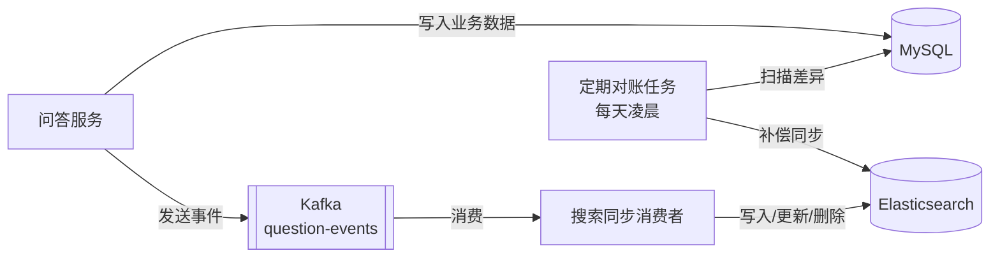
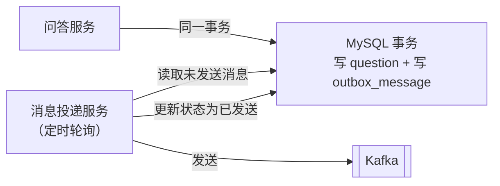

<!-- nav-start -->

---

[⬅️ 上一篇：问答核心功能设计](01-问答核心功能设计.md) | [🏠 返回目录](../README.md) | [下一篇：计数与热门排行 ➡️](03-计数与热门排行.md)

<!-- nav-end -->

# 全文搜索系统

---

## 1. 为什么选择 Elasticsearch？

问答系统的搜索需求：
- **全文搜索**：对问题标题、内容、回答内容进行分词检索
- **相关性排序**：按匹配度、热度、时间综合排序
- **高亮显示**：搜索结果中高亮关键词
- **多条件过滤**：按标签、圈子、时间范围过滤

MySQL 的 `LIKE '%keyword%'` 无法走索引，全表扫描性能差，且不支持相关性评分，因此引入 ES 作为专用搜索层。

| 方案 | 优点 | 缺点 |
|------|------|------|
| MySQL LIKE | 无额外组件 | 无法走索引，不支持相关性评分，中文分词差 |
| MySQL FULLTEXT | 内置，无需额外组件 | 中文支持弱，功能有限 |
| **Elasticsearch** | 分词强、评分准、高亮、聚合 | 需维护额外组件，数据同步复杂度高 |

---

## 2. 索引 Mapping 设计

```json
{
  "settings": {
    "number_of_shards": 3,
    "number_of_replicas": 1,
    "analysis": {
      "analyzer": {
        "ik_custom": {
          "type": "custom",
          "tokenizer": "ik_max_word",
          "filter": ["lowercase"]
        }
      }
    }
  },
  "mappings": {
    "properties": {
      "id":           { "type": "long" },
      "title":        { "type": "text", "analyzer": "ik_max_word", "search_analyzer": "ik_smart",
                        "fields": { "keyword": { "type": "keyword" } } },
      "content":      { "type": "text", "analyzer": "ik_max_word", "search_analyzer": "ik_smart" },
      "author_id":    { "type": "long" },
      "author_name":  { "type": "keyword" },
      "tag_ids":      { "type": "long" },
      "tag_names":    { "type": "keyword" },
      "circle_id":    { "type": "long" },
      "circle_name":  { "type": "keyword" },
      "view_count":   { "type": "integer" },
      "like_count":   { "type": "integer" },
      "answer_count": { "type": "integer" },
      "heat_score":   { "type": "double" },
      "status":       { "type": "byte" },
      "created_at":   { "type": "date" }
    }
  }
}
```

**关键设计点**：
- `title` 和 `content` 使用 IK 分词器：写入时用 `ik_max_word`（最细粒度，提升召回），搜索时用 `ik_smart`（最粗粒度，提升精度）
- `title` 同时设置 `keyword` 子字段，支持精确排序
- `tag_names`、`author_name` 用 `keyword` 类型，支持精确过滤和聚合统计
- 只索引已发布的问题（`status = 1`），草稿和已删除内容不进入索引

---

## 3. MySQL → ES 数据同步

### 3.1 同步架构



### 3.2 同步触发时机

| 操作 | Kafka 消息类型 | ES 操作 | 说明 |
|------|--------------|---------|------|
| 发布问题 | `QUESTION_CREATED` | Index | 新增文档 |
| 编辑问题 | `QUESTION_UPDATED` | Update | 更新标题/内容/标签 |
| 删除问题 | `QUESTION_DELETED` | Delete | 删除文档 |
| 问题被回答 | `ANSWER_COUNT_CHANGED` | Update | 更新 `answer_count` |
| 点赞/点彩 | `LIKE_COUNT_CHANGED` | Update | 更新 `like_count`、`heat_score` |
| **热度批量同步** | **定时任务（每 10 分钟）** | **Bulk Update** | **批量更新浏览量、点赞数、热度分等计数字段** |

### 3.3 同步消费者实现

```java
@Component
public class SearchSyncConsumer {

    @KafkaListener(topics = "question-events", groupId = "search-sync-group")
    public void handleQuestionEvent(QuestionEvent event, Acknowledgment ack) {
        try {
            switch (event.getType()) {
                case CREATED:
                case UPDATED:
                    QuestionDocument doc = buildDocument(event.getQuestionId());
                    esClient.index(i -> i.index("questions").id(doc.getId().toString()).document(doc));
                    break;
                case DELETED:
                    esClient.delete(d -> d.index("questions").id(event.getQuestionId().toString()));
                    break;
                case STATS_UPDATED:
                    // 只更新统计字段，不重建整个文档
                    Map<String, Object> updates = Map.of(
                        "like_count", event.getLikeCount(),
                        "answer_count", event.getAnswerCount(),
                        "heat_score", event.getHeatScore()
                    );
                    esClient.update(u -> u.index("questions")
                        .id(event.getQuestionId().toString())
                        .doc(updates));
                    break;
            }
            ack.acknowledge();
        } catch (Exception e) {
            log.error("ES 同步失败，event={}", event, e);
            throw e;  // 不提交 offset，触发重试
        }
    }
}
```

**为什么用 Kafka 而不是同步写 ES？**
- **解耦**：问答服务不依赖 ES 的可用性，ES 宕机不影响发帖
- **削峰**：批量操作时 ES 写入压力可控
- **重试**：消费失败可重新消费，保证最终一致性

### 3.4 热度数据批量同步到 ES

浏览量、点赞数、热度分等计数字段变更频繁，如果每次 Kafka 消费都写 ES，热门问题每秒可能触发几十次 update，导致 ES segment merge 压力过大。

**方案**：Kafka 消费时只将最新热度快照写入 Redis Hash `es:sync:pending`（同一问题多次更新自动覆盖，天然去重），定时任务每 10 分钟批量刷入 ES。详细实现见 [03-计数与热门排行.md](03-计数与热门排行.md) 第 5 节。

---

## 4. 搜索查询实现

### 4.1 综合搜索 DSL

```java
public Page<QuestionVO> search(SearchRequest req) {
    SearchResponse<QuestionDocument> response = esClient.search(s -> s
        .index("questions")
        .query(q -> q
            .bool(b -> {
                // 全文搜索：title 权重 3 倍，content 权重 1 倍
                b.must(m -> m.multiMatch(mm -> mm
                    .query(req.getKeyword())
                    .fields("title^3", "content")
                    .type(TextQueryType.BestFields)
                    .minimumShouldMatch("75%")
                ));
                // 过滤条件
                b.filter(f -> f.term(t -> t.field("status").value(1)));
                if (req.getTagId() != null) {
                    b.filter(f -> f.term(t -> t.field("tag_ids").value(req.getTagId())));
                }
                if (req.getCircleId() != null) {
                    b.filter(f -> f.term(t -> t.field("circle_id").value(req.getCircleId())));
                }
                return b;
            })
        )
        // 综合排序：相关性 + 热度 + 时间
        .sort(so -> so.score(sc -> sc.order(SortOrder.Desc)))
        .sort(so -> so.field(f -> f.field("heat_score").order(SortOrder.Desc)))
        .sort(so -> so.field(f -> f.field("created_at").order(SortOrder.Desc)))
        // 高亮
        .highlight(h -> h
            .fields("title", hf -> hf)
            .fields("content", hf -> hf.fragmentSize(150).numberOfFragments(2))
            .preTags("<em>").postTags("</em>")
        )
        .from((req.getPage() - 1) * req.getSize())
        .size(req.getSize()),
        QuestionDocument.class
    );

    return buildPage(response, req);
}
```

### 4.2 搜索建议（Suggest）

输入框实时提示，基于问题标题做前缀匹配：

```java
// Mapping 中为 title 添加 completion 类型字段
"title_suggest": {
    "type": "completion",
    "analyzer": "ik_smart"
}

// 查询
public List<String> suggest(String prefix) {
    SuggestResponse<QuestionDocument> response = esClient.search(s -> s
        .index("questions")
        .suggest(sg -> sg
            .suggesters("title_suggest", su -> su
                .prefix(prefix)
                .completion(c -> c.field("title_suggest").size(10).skipDuplicates(true))
            )
        ),
        QuestionDocument.class
    );
    return response.suggest().get("title_suggest").stream()
        .flatMap(s -> s.completion().options().stream())
        .map(o -> o.text())
        .collect(toList());
}
```

---

## 5. 中文分词优化

### 5.1 IK 分词器配置

```
写入时：ik_max_word（最细粒度分词）
  "分布式锁" → ["分布式", "分布", "布式", "锁"]

搜索时：ik_smart（最粗粒度分词）
  "分布式锁" → ["分布式", "锁"]
```

这种组合的效果：搜索"分布式锁"时，`ik_smart` 将其分为 `["分布式", "锁"]`，能匹配到文档中包含"分布式 Redis 锁"的内容（因为写入时已经分出了"分布式"和"锁"两个词）。

### 5.2 自定义词典

在 IK 配置目录下添加业务词典文件 `custom_dict.dic`，加入领域专有词汇：

```
# custom_dict.dic
分布式锁
消息队列
微服务
Spring Boot
Elasticsearch
```

---

## 6. 数据一致性保障

### 6.1 本地消息表（防消息丢失）



```sql
CREATE TABLE outbox_message (
    id          BIGINT   PRIMARY KEY AUTO_INCREMENT,
    topic       VARCHAR(64)  NOT NULL,
    message_key VARCHAR(64),
    payload     TEXT         NOT NULL,
    status      TINYINT      NOT NULL DEFAULT 0 COMMENT '0待发送 1已发送 2失败',
    created_at  DATETIME     NOT NULL DEFAULT CURRENT_TIMESTAMP,
    sent_at     DATETIME,
    INDEX idx_status_created (status, created_at)
);
```

### 6.2 定期对账

```java
@Scheduled(cron = "0 0 2 * * ?")  // 每天凌晨 2 点
public void reconcile() {
    // 查询 MySQL 中最近 7 天删除的问题 ID
    List<Long> deletedIds = questionMapper.selectRecentDeletedIds(7);
    for (Long id : deletedIds) {
        if (esClient.exists("questions", id.toString())) {
            esClient.delete("questions", id.toString());
            log.warn("对账：删除 ES 中的孤立文档，questionId={}", id);
        }
    }

    // 查询 MySQL 中最近 7 天新增但 ES 中不存在的问题
    List<Long> recentIds = questionMapper.selectRecentPublishedIds(7);
    for (Long id : recentIds) {
        if (!esClient.exists("questions", id.toString())) {
            QuestionDocument doc = buildDocument(id);
            esClient.index("questions", doc);
            log.warn("对账：补偿写入 ES 文档，questionId={}", id);
        }
    }
}
```

<!-- nav-start -->

---

[⬅️ 上一篇：问答核心功能设计](01-问答核心功能设计.md) | [🏠 返回目录](../README.md) | [下一篇：计数与热门排行 ➡️](03-计数与热门排行.md)

<!-- nav-end -->
