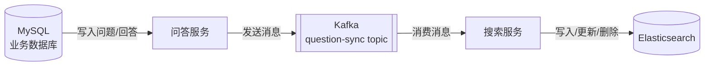

<!-- nav-start -->

---

[⬅️ 上一篇：功能设计与数据模型](01-功能设计与数据模型.md) | [🏠 返回目录](../README.md) | [下一篇：热门统计系统 ➡️](03-热门统计系统.md)

<!-- nav-end -->

# 搜索系统设计

---

## 1. 为什么选择 Elasticsearch？

问答系统的搜索需求：
- **全文搜索**：对问题标题、内容、回答内容进行分词检索
- **相关性排序**：按匹配度、热度、时间综合排序
- **高亮显示**：搜索结果中高亮关键词
- **多条件过滤**：按标签、圈子、时间范围过滤

MySQL 的 `LIKE '%keyword%'` 无法走索引，全表扫描性能差，且不支持相关性评分，因此引入 ES 做专门的搜索层。

---

## 2. 索引 Mapping 设计

```json
{
  "mappings": {
    "properties": {
      "id":           { "type": "long" },
      "title":        { "type": "text", "analyzer": "ik_max_word", "search_analyzer": "ik_smart" },
      "content":      { "type": "text", "analyzer": "ik_max_word", "search_analyzer": "ik_smart" },
      "author_id":    { "type": "long" },
      "author_name":  { "type": "keyword" },
      "tag_ids":      { "type": "long" },
      "tag_names":    { "type": "keyword" },
      "circle_id":    { "type": "long" },
      "view_count":   { "type": "integer" },
      "like_count":   { "type": "integer" },
      "answer_count": { "type": "integer" },
      "status":       { "type": "byte" },
      "created_at":   { "type": "date" }
    }
  }
}
```

**关键点**：
- `title` 和 `content` 使用 IK 分词器，写入时用 `ik_max_word`（最细粒度），搜索时用 `ik_smart`（最粗粒度），提升召回率
- `tag_names`、`author_name` 用 `keyword` 类型，支持精确过滤和聚合
- 只索引已发布的问题（`status = 1`）

---

## 3. 数据同步方案



**同步触发时机**：
| 操作 | Kafka 消息类型 | ES 操作 |
|------|--------------|---------|
| 发布问题 | `QUESTION_CREATED` | Index |
| 编辑问题 | `QUESTION_UPDATED` | Update |
| 删除问题 | `QUESTION_DELETED` | Delete |
| 问题被回答 | `ANSWER_COUNT_CHANGED` | Update `answer_count` |
| 点赞/点彩 | `LIKE_COUNT_CHANGED` | Update `like_count` |

**为什么用 Kafka 而不是同步写 ES？**
- 解耦：问答服务不依赖 ES 的可用性
- 削峰：批量操作时 ES 写入压力可控
- 重试：消费失败可重新消费，保证最终一致性

---

## 4. 搜索查询实现

```java
// 综合搜索 DSL 示例
{
  "query": {
    "bool": {
      "must": [
        {
          "multi_match": {
            "query": "用户输入的关键词",
            "fields": ["title^3", "content"],  // title 权重更高
            "type": "best_fields"
          }
        }
      ],
      "filter": [
        { "term": { "status": 1 } },
        { "terms": { "tag_ids": [1, 2, 3] } }  // 可选标签过滤
      ]
    }
  },
  "sort": [
    { "_score": { "order": "desc" } },
    { "like_count": { "order": "desc" } },
    { "created_at": { "order": "desc" } }
  ],
  "highlight": {
    "fields": {
      "title": {},
      "content": { "fragment_size": 150 }
    }
  }
}
```

---

## 5. 遇到的问题

### 问题1：ES 数据与 MySQL 不一致

**现象**：问题被删除后，ES 中仍能搜索到。

**原因**：Kafka 消费失败后没有重试机制，消息丢失。

**解决**：
1. 配置 Kafka 消费者手动提交 offset，处理成功后再提交
2. 增加死信队列（DLQ），消费失败的消息进入 DLQ 人工处理
3. 定期对账任务：每天凌晨扫描 MySQL 与 ES 数据差异，补偿同步

### 问题2：中文分词效果差

**现象**：搜索"分布式锁"，搜不到包含"分布式 Redis 锁"的文章。

**原因**：默认分词器不支持中文，IK 词库未更新导致新词无法识别。

**解决**：
1. 安装 IK 分词器插件
2. 配置自定义词典，加入业务领域词汇
3. 写入时用 `ik_max_word`，搜索时用 `ik_smart`，平衡精度与召回

<!-- nav-start -->

---

[⬅️ 上一篇：功能设计与数据模型](01-功能设计与数据模型.md) | [🏠 返回目录](../README.md) | [下一篇：热门统计系统 ➡️](03-热门统计系统.md)

<!-- nav-end -->
