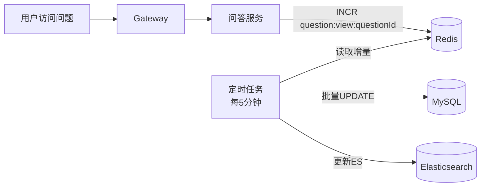

<!-- nav-start -->

---

[⬅️ 上一篇：搜索系统设计](02-搜索系统设计.md) | [🏠 返回目录](../README.md) | [下一篇：权限与角色设计 ➡️](04-权限与角色设计.md)

<!-- nav-end -->

# 热门统计系统

---

## 1. 需要统计的热门维度

| 维度 | 说明 |
|------|------|
| 热门问题 | 首页展示全站热门问题 |
| 圈子热门问题 | 每个圈子内的热门问题 |
| 标签热门问题 | 当前标签下的热门问题 |
| 热门标签 | 当前最热的标签 |
| 热门圈子 | 当前最热的圈子 |
| 活跃用户 | 最活跃的用户排行 |

---

## 2. 热度分计算模型

热度分综合多个维度，参考 Hacker News 算法：

```
热度分 = (点赞数 × 3 + 点彩数 × 5 + 评论数 × 2 + 浏览量 × 0.1) / (发布时间衰减系数)

时间衰减系数 = (当前时间 - 发布时间(小时) + 2) ^ 1.5
```

**权重说明**：
- 点彩（精华）权重最高，代表高质量内容
- 点赞次之，代表认可度
- 评论代表讨论热度
- 浏览量权重最低，防止刷量

---

## 3. 浏览量统计

### 方案：Redis + 定时持久化



**实现细节**：
```java
// 用户访问时，Redis 计数 +1
redisTemplate.opsForValue().increment("question:view:" + questionId);

// 定时任务批量持久化（每5分钟）
Set<String> keys = redisTemplate.keys("question:view:*");
for (String key : keys) {
    Long count = redisTemplate.opsForValue().getAndDelete(key);
    Long questionId = Long.parseLong(key.split(":")[2]);
    // 批量更新 MySQL
    questionMapper.incrementViewCount(questionId, count);
}
```

**为什么不直接写 MySQL？**
- 热门问题并发访问量大，每次访问都写 DB 会造成大量写压力
- Redis INCR 是原子操作，天然防并发
- 定时批量写 DB，减少 IO 次数

---

## 4. 点赞/点彩计数

### 防重复：Redis Set 记录用户行为

```java
// 点赞
String key = "question:like:users:" + questionId;
Boolean added = redisTemplate.opsForSet().add(key, userId.toString()) == 1;
if (added) {
    // 新增点赞，计数 +1
    redisTemplate.opsForValue().increment("question:like:count:" + questionId);
    // 异步写 DB
    kafkaTemplate.send("user-action", new LikeEvent(userId, questionId, ActionType.LIKE));
}
```

**Redis 数据结构选择**：
- `Set` 存储点赞用户列表：`SADD question:like:users:{id} {userId}`
- `String` 存储计数：`INCR question:like:count:{id}`
- 用 `SISMEMBER` 判断是否已点赞，O(1) 复杂度

---

## 5. 热门排行榜

### 方案：Redis ZSet（有序集合）

```java
// 更新热度分
redisTemplate.opsForZSet().add("hot:questions:global", questionId, heatScore);
redisTemplate.opsForZSet().add("hot:questions:circle:" + circleId, questionId, heatScore);
redisTemplate.opsForZSet().add("hot:questions:tag:" + tagId, questionId, heatScore);

// 查询 Top10 热门问题
Set<Long> topIds = redisTemplate.opsForZSet()
    .reverseRange("hot:questions:global", 0, 9);
```

**热度分更新时机**：
- 用户点赞/点彩/评论时，通过 Kafka 消息触发热度分重新计算
- 定时任务每小时全量重算一次（防止数据漂移）

---

## 6. 标签问题数统计

标签下的问题数在 `tag` 表中有 `question_count` 字段，通过以下方式维护：

```sql
-- 问题关联标签时 +1
UPDATE tag SET question_count = question_count + 1 WHERE id = ?;

-- 问题删除时 -1（批量）
UPDATE tag SET question_count = question_count - 1 WHERE id IN (?);
```

**注意**：直接 UPDATE 在高并发下可能有问题，实际通过 Kafka 消息串行处理，避免并发更新冲突。

---

## 7. 用户活跃度统计

用户活跃度分 = 发布问题数 × 5 + 回答数 × 3 + 评论数 × 1 + 被采纳回答数 × 10

```java
// 用户每次操作后，更新活跃度分
redisTemplate.opsForZSet().incrementScore(
    "active:users:weekly",   // 本周活跃榜
    userId,
    actionScore
);
```

每周一凌晨重置周榜，同时将上周数据归档到 MySQL。

<!-- nav-start -->

---

[⬅️ 上一篇：搜索系统设计](02-搜索系统设计.md) | [🏠 返回目录](../README.md) | [下一篇：权限与角色设计 ➡️](04-权限与角色设计.md)

<!-- nav-end -->
