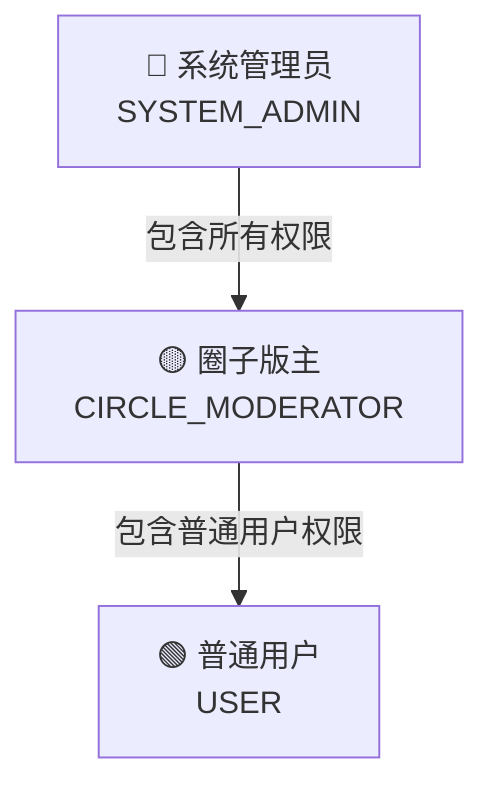
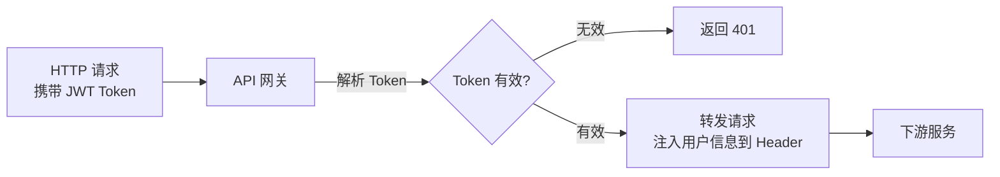

<!-- nav-start -->

---

[⬅️ 上一篇：热门统计系统](03-热门统计系统.md) | [🏠 返回目录](../README.md) | [下一篇：Kafka 异步消息处理 ➡️](05-Kafka异步消息处理.md)

<!-- nav-end -->

# 权限与角色设计

---

## 1. 角色体系

系统共三种角色，权限逐级递增：



---

## 2. 权限矩阵

| 操作 | 普通用户 | 圈子版主 | 系统管理员 |
|------|---------|---------|-----------|
| 提问 / 回答 / 评论 | ✅ | ✅ | ✅ |
| 点赞 / 点彩 / 收藏 | ✅ | ✅ | ✅ |
| 删除**自己的**问题/回答 | ✅ | ✅ | ✅ |
| 删除**圈子内**违规问题/回答 | ❌ | ✅（仅本圈子） | ✅ |
| 新建 / 编辑圈子 | ❌ | ❌ | ✅ |
| 设置圈子版主 | ❌ | ❌ | ✅ |
| 删除任意问题/回答 | ❌ | ❌ | ✅ |
| 查看用户管理后台 | ❌ | ❌ | ✅ |

---

## 3. 数据库设计

```sql
-- 用户角色表（全局角色）
CREATE TABLE user_role (
    user_id   BIGINT NOT NULL,
    role      VARCHAR(32) NOT NULL COMMENT 'USER / SYSTEM_ADMIN',
    PRIMARY KEY (user_id, role)
);

-- 圈子成员表（圈子级别角色）
CREATE TABLE circle_member (
    circle_id BIGINT NOT NULL,
    user_id   BIGINT NOT NULL,
    role      TINYINT NOT NULL DEFAULT 0 COMMENT '0普通成员 1版主',
    joined_at DATETIME NOT NULL DEFAULT CURRENT_TIMESTAMP,
    PRIMARY KEY (circle_id, user_id)
);
```

---

## 4. 权限校验实现

### 网关层：JWT Token 解析



网关解析 JWT，将 `userId`、`roles` 注入请求 Header，下游服务直接读取，无需再查数据库。

### 服务层：注解 + AOP 鉴权

```java
// 自定义权限注解
@Target(ElementType.METHOD)
@Retention(RetentionPolicy.RUNTIME)
public @interface RequireRole {
    String[] value();  // 允许的角色列表
}

// AOP 切面
@Aspect
@Component
public class AuthAspect {
    @Around("@annotation(requireRole)")
    public Object checkRole(ProceedingJoinPoint pjp, RequireRole requireRole) throws Throwable {
        UserContext user = UserContextHolder.get();
        String[] allowedRoles = requireRole.value();
        if (!hasAnyRole(user, allowedRoles)) {
            throw new ForbiddenException("权限不足");
        }
        return pjp.proceed();
    }
}

// 使用示例
@DeleteMapping("/questions/{id}")
@RequireRole({"SYSTEM_ADMIN"})
public Result deleteQuestion(@PathVariable Long id) {
    // ...
}
```

### 圈子版主的特殊校验

版主权限是圈子级别的，需要额外校验：

```java
public void deleteQuestionByModerator(Long questionId, Long operatorId) {
    Question question = questionMapper.selectById(questionId);
    // 检查问题是否属于该圈子
    Long circleId = question.getCircleId();
    // 检查操作者是否是该圈子的版主
    CircleMember member = circleMemberMapper.selectByCircleAndUser(circleId, operatorId);
    if (member == null || member.getRole() != 1) {
        throw new ForbiddenException("您不是该圈子的版主");
    }
    questionMapper.deleteById(questionId);
}
```

---

## 5. 遇到的问题

### 问题：版主越权删除其他圈子的内容

**现象**：A 圈子的版主可以删除 B 圈子的问题。

**原因**：只校验了用户是否是"某个圈子的版主"，没有校验问题是否属于该版主管理的圈子。

**解决**：删除操作时，先查问题所属圈子，再校验操作者是否是**该圈子**的版主，两个条件都满足才允许删除。

<!-- nav-start -->

---

[⬅️ 上一篇：热门统计系统](03-热门统计系统.md) | [🏠 返回目录](../README.md) | [下一篇：Kafka 异步消息处理 ➡️](05-Kafka异步消息处理.md)

<!-- nav-end -->
