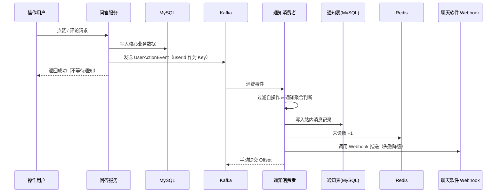
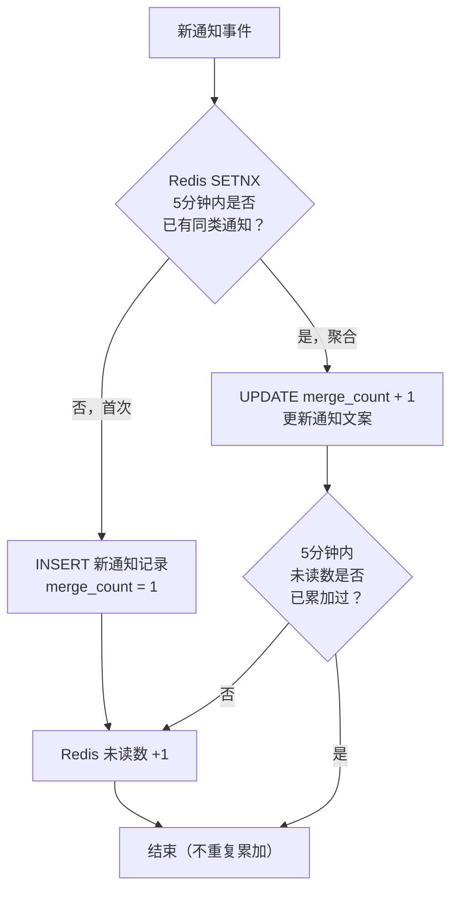

# 消息通知系统

---

## 1. 系统概述

当用户发生点赞、评论、@提及、回答被采纳、内容被点彩等行为时，系统需要向相关用户发送通知。通知分为两类：

- **站内消息**：持久化存储，用户登录后可在通知中心查看历史通知，支持未读角标提示
- **聊天软件消息**：通过企业内部 IM（飞书/钉钉）的 Webhook 接口推送实时消息卡片

### 1.1 触发场景

| 触发行为 | 通知接收方 | 站内消息 | IM 推送 |
|----------|-----------|----------|---------|
| 点赞问题/回答 | 内容作者 | ✅ | ✅ |
| 评论问题/回答 | 内容作者 | ✅ | ✅ |
| @提及用户 | 被@的用户 | ✅ | ✅ |
| 回答被采纳 | 回答作者 | ✅ | ✅ |
| 内容被点彩（精华） | 内容作者 | ✅ | ✅ |
| 自己操作自己的内容 | — | ❌ 不通知 | ❌ 不通知 |

---

## 2. 架构设计：全异步

通知发送**全部走异步**，主接口只负责核心业务（写 MySQL + Redis），通知由 Kafka 消费者异步处理。



> 复用 `user-actions` topic，通知服务作为独立消费者组（`notification-group`）订阅，与统计服务互不影响。

---

## 3. 站内消息设计

### 3.1 数据表结构

```sql
CREATE TABLE notification (
    id           BIGINT       PRIMARY KEY AUTO_INCREMENT,
    user_id      BIGINT       NOT NULL COMMENT '接收通知的用户',
    sender_id    BIGINT       NOT NULL COMMENT '触发通知的用户',
    type         TINYINT      NOT NULL COMMENT '1点赞 2评论 3@提及 4回答被采纳 5内容被点彩',
    target_id    BIGINT       NOT NULL COMMENT '关联内容ID（问题/回答/评论）',
    target_type  TINYINT      NOT NULL COMMENT '1问题 2回答 3评论',
    content      VARCHAR(200)          COMMENT '通知摘要文本',
    merge_count  INT          NOT NULL DEFAULT 1 COMMENT '聚合计数（如"张三等3人赞了你"）',
    is_read      TINYINT      NOT NULL DEFAULT 0 COMMENT '0未读 1已读',
    create_time  DATETIME     NOT NULL DEFAULT CURRENT_TIMESTAMP,
    update_time  DATETIME     NOT NULL DEFAULT CURRENT_TIMESTAMP ON UPDATE CURRENT_TIMESTAMP,
    INDEX idx_user_read (user_id, is_read),
    INDEX idx_user_time (user_id, create_time DESC)
) COMMENT '站内通知表';
```

### 3.2 未读数缓存

未读数维护在 Redis 计数器中，避免每次查询都走 DB 执行 `COUNT(*)`：

```java
// 写入通知后，Redis 未读数 +1
redisTemplate.opsForValue().increment("notification:unread:" + targetUserId);

// 用户打开通知列表后，清零未读数，并批量标记已读
redisTemplate.delete("notification:unread:" + userId);
notificationMapper.markAllRead(userId);
```

前端通过轮询（或 WebSocket）获取未读数角标，直接读 Redis，响应极快。

---

## 4. 通知聚合（防消息轰炸）

热门问题短时间内收到大量点赞时，若每次都推送通知会骚扰用户。参考微信、知乎等主流平台，引入**通知聚合**机制。

**规则**：同一类型、同一目标内容，**5 分钟**内的多次操作合并为一条通知，文案更新为"张三等 N 人赞了你的问题"。



```java
public void saveOrMergeNotification(Notification notification) {
    String mergeKey = "notify:merge:"
            + notification.getUserId() + ":"
            + notification.getType() + ":"
            + notification.getTargetId();

    Boolean isFirst = redisTemplate.opsForValue()
            .setIfAbsent(mergeKey, "1", Duration.ofMinutes(5));

    if (Boolean.TRUE.equals(isFirst)) {
        notificationMapper.insert(notification);
    } else {
        notificationMapper.incrementMergeCount(
            notification.getUserId(), notification.getType(), notification.getTargetId());
    }

    // 未读数去重：5分钟内同一目标只累加一次
    String unreadFlagKey = "notify:unread:flag:"
            + notification.getUserId() + ":" + notification.getTargetId();
    Boolean isNewUnread = redisTemplate.opsForValue()
            .setIfAbsent(unreadFlagKey, "1", Duration.ofMinutes(5));
    if (Boolean.TRUE.equals(isNewUnread)) {
        redisTemplate.opsForValue().increment("notification:unread:" + notification.getUserId());
    }
}
```

---

## 5. 通知消费者实现

```java
@Component
public class NotificationConsumer {

    @KafkaListener(topics = "user-actions", groupId = "notification-group")
    public void handleUserAction(UserActionEvent event, Acknowledgment ack) {
        try {
            // 1. 查询被通知用户，过滤自操作
            Long targetUserId = resolveTargetUser(event);
            if (targetUserId == null || targetUserId.equals(event.getUserId())) {
                ack.acknowledge();
                return;
            }

            // 2. 渲染通知文案
            String content = templateEngine.render(event.getActionType(), buildParams(event));

            // 3. 写入站内消息（含聚合逻辑）
            Notification notification = Notification.builder()
                    .userId(targetUserId).senderId(event.getUserId())
                    .type(event.getActionType())
                    .targetId(event.getTargetId()).targetType(event.getTargetType())
                    .content(content).build();
            saveOrMergeNotification(notification);

            // 4. 推送 IM 消息（失败降级，不影响站内消息）
            User targetUser = userService.getById(targetUserId);
            if (StringUtils.hasText(targetUser.getImUserId())) {
                imNotificationService.pushToIM(content, targetUser.getImUserId());
            }

            ack.acknowledge();
        } catch (Exception e) {
            log.error("通知消费失败，event={}", event, e);
            throw e;  // 不提交 offset，触发重试，超限后进入死信队列
        }
    }
}
```

---

## 6. 聊天软件消息推送

### 6.1 消息模板

```java
@Component
public class NotificationTemplateEngine {

    private static final Map<Integer, String> TEMPLATES = Map.of(
        1, "{senderName} 赞了你的问题「{questionTitle}」",
        2, "{senderName} 评论了你的问题「{questionTitle}」：{commentContent}",
        3, "{senderName} 在「{questionTitle}」中 @了你",
        4, "你在「{questionTitle}」中的回答被采纳了 🎉",
        5, "{senderName} 将你的内容「{questionTitle}」设为了精华 ⭐"
    );

    public String render(int type, Map<String, String> params) {
        String template = TEMPLATES.get(type);
        for (Map.Entry<String, String> entry : params.entrySet()) {
            template = template.replace("{" + entry.getKey() + "}", entry.getValue());
        }
        return template;
    }
}
```

### 6.2 Webhook 推送（失败降级）

```java
@Service
public class IMNotificationService {

    @Value("${im.webhook.url}")
    private String webhookUrl;

    public void pushToIM(String content, String targetUserIMId) {
        try {
            Map<String, Object> payload = Map.of(
                "msg_type", "text",
                "content", Map.of("text", content),
                "receive_id", targetUserIMId
            );
            restTemplate.postForObject(webhookUrl, payload, String.class);
        } catch (Exception e) {
            // IM 推送失败不影响主流程，降级为仅站内消息
            log.warn("IM 消息推送失败，imUserId={}", targetUserIMId, e);
        }
    }
}
```

---

## 7. 关键设计决策

| 问题 | 方案 | 原因 |
|------|------|------|
| 通知是否同步发送 | **全异步（Kafka）** | 外部调用不可控，不能阻塞主接口；失败可重试 |
| 站内消息未读数 | Redis 计数器 | 避免每次查询都 `COUNT(*)`，响应极快 |
| IM 推送失败处理 | 降级，仅记录日志 | IM 是辅助通知，失败不应影响站内消息 |
| 防消息轰炸 | 5 分钟内同类通知聚合 | 参考微信/知乎等主流平台的通知合并策略 |
| 不通知自己 | 消费者过滤 `userId == targetUserId` | 自己操作自己的内容无需通知 |
| 消息顺序 | Kafka 消息以 `userId` 为 Key | 同一用户的行为事件路由到同一分区，保证顺序 |
| 消费幂等 | Redis SETNX 幂等键（60秒窗口） | Kafka at-least-once 语义，防止重复消费产生重复通知 |