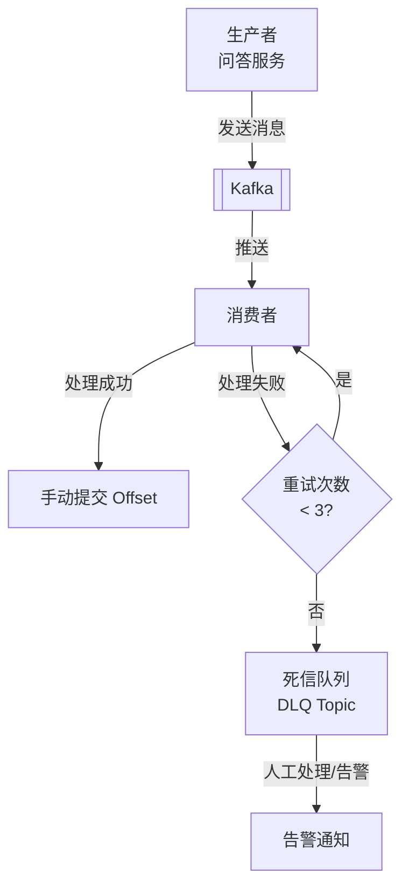

<!-- nav-start -->

---

[⬅️ 上一篇：权限与角色设计](04-权限与角色设计.md) | [🏠 返回目录](../README.md) | [下一篇：踩坑与解决方案 ➡️](06-踩坑与解决方案.md)

<!-- nav-end -->

# Kafka 异步消息处理

---

## 1. 为什么引入 Kafka？

用户在问答系统中的每次交互（点赞、评论、@用户、发布问题）都会触发一系列后续操作：

- 更新计数器（点赞数、评论数）
- 更新 ES 索引
- 更新热度分
- 发送通知给相关用户
- 更新用户活跃度

如果这些操作全部**同步执行**，接口响应时间会很长，且任何一个环节失败都会导致整个请求失败。

**引入 Kafka 的收益**：
- 接口只需完成核心操作（写 MySQL），其余异步处理
- 各消费者独立，互不影响
- 天然削峰，应对突发流量

---

## 2. Topic 设计

| Topic | 生产者 | 消费者 | 说明 |
|-------|--------|--------|------|
| `question-events` | 问答服务 | 搜索服务、统计服务 | 问题发布/编辑/删除 |
| `user-actions` | 问答服务 | 统计服务、通知服务 | 点赞/点彩/收藏/评论 |
| `mention-events` | 问答服务 | 通知服务 | @用户事件 |
| `answer-events` | 问答服务 | 通知服务、统计服务 | 回答发布/被采纳 |

---

## 3. 消息结构设计

```java
// 统一消息基类
@Data
public class BaseEvent {
    private String eventType;   // 事件类型
    private Long userId;        // 操作用户
    private Long timestamp;     // 事件时间戳
    private String traceId;     // 链路追踪ID
}

// 用户行为事件
@Data
@EqualsAndHashCode(callSuper = true)
public class UserActionEvent extends BaseEvent {
    private Long targetId;      // 目标ID（问题/回答/评论）
    private Integer targetType; // 1问题 2回答 3评论
    private Integer actionType; // 1点赞 2点彩 3收藏 4评论
    private Integer delta;      // +1 或 -1（取消操作）
}
```

---

## 4. 消息可靠性保障



**生产者配置**：
```yaml
spring:
  kafka:
    producer:
      acks: all              # 所有副本确认才算成功
      retries: 3             # 失败重试3次
      enable-idempotence: true  # 开启幂等，防止重复发送
```

**消费者配置**：
```yaml
spring:
  kafka:
    consumer:
      enable-auto-commit: false  # 关闭自动提交
      auto-offset-reset: earliest
```

---

## 5. 消费者幂等处理

由于 Kafka 至少一次（at-least-once）语义，消息可能被重复消费，消费者必须做幂等处理：

```java
@KafkaListener(topics = "user-actions", groupId = "statistics-group")
public void handleUserAction(UserActionEvent event) {
    // 幂等键：用户ID + 目标ID + 行为类型 + 时间窗口（分钟级）
    String idempotentKey = "action:" + event.getUserId() + ":" 
        + event.getTargetId() + ":" + event.getActionType() 
        + ":" + (event.getTimestamp() / 60000);
    
    // Redis SETNX，60秒内相同操作只处理一次
    Boolean isNew = redisTemplate.opsForValue()
        .setIfAbsent(idempotentKey, "1", Duration.ofSeconds(60));
    
    if (Boolean.TRUE.equals(isNew)) {
        // 执行实际业务逻辑
        statisticsService.updateCount(event);
    }
    // 手动提交 offset
    acknowledgment.acknowledge();
}
```

---

## 6. 遇到的问题

### 问题1：消息积压

**现象**：某次大促活动，用户活跃度暴增，`user-actions` topic 消息积压超过 50 万条，通知延迟严重。

**原因**：消费者只有 1 个实例，处理速度跟不上生产速度。

**解决**：
1. 将 topic 分区数从 1 增加到 6
2. 消费者实例扩容到 6 个（与分区数对应）
3. 通知服务与统计服务拆分为独立消费者组，互不影响

### 问题2：消息顺序问题

**现象**：用户先点赞后取消点赞，但消费者先处理了"取消点赞"消息，导致计数出现负数。

**原因**：多分区情况下，同一用户的消息可能分配到不同分区，无法保证顺序。

**解决**：发送消息时，以 `userId` 作为 Kafka 消息的 Key，同一用户的消息会路由到同一分区，保证顺序消费：

```java
kafkaTemplate.send("user-actions", 
    event.getUserId().toString(),  // Key：保证同一用户消息有序
    event
);
```

### 问题3：事务消息问题

**现象**：MySQL 写入成功，但 Kafka 消息发送失败，导致 ES 数据未同步。

**解决**：采用**本地消息表**方案：
1. 业务操作和消息记录在同一个 MySQL 事务中提交
2. 独立的消息投递服务轮询消息表，将未发送的消息投递到 Kafka
3. 投递成功后更新消息状态为已发送

<!-- nav-start -->

---

[⬅️ 上一篇：权限与角色设计](04-权限与角色设计.md) | [🏠 返回目录](../README.md) | [下一篇：踩坑与解决方案 ➡️](06-踩坑与解决方案.md)

<!-- nav-end -->
